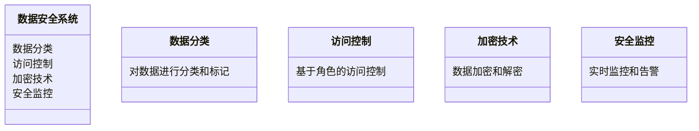
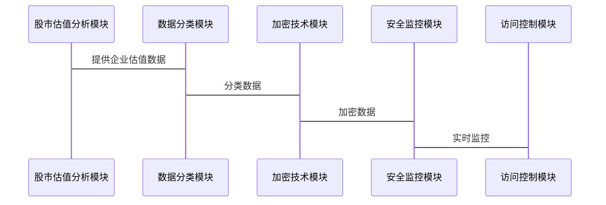

                 


# 股市估值高低对企业数据安全策略的影响

> 关键词：股市估值、企业数据安全、数据安全策略、企业价值、数据保护

> 摘要：本文探讨了股市估值与企业数据安全策略之间的关系。通过分析股市估值对企业数据安全需求、预算和策略的影响，结合数学模型和系统架构设计，展示了如何根据企业估值调整数据安全策略，以实现企业价值的持续增长。

---

# 第1章: 股市估值与企业数据安全策略概述

## 1.1 股市估值的基本概念
### 1.1.1 股市估值的定义
股市估值是指通过一定的方法和指标，评估企业在股票市场上的价值。主要指标包括市盈率（P/E）、市净率（P/B）、市值等。这些指标帮助企业投资者和管理层了解企业的市场价值，进而影响企业的决策。

### 1.1.2 股市估值的核心指标
- **市盈率（P/E）**：市盈率 = 股价 / 每股收益（EPS）。反映市场对企业盈利能力的预期。
- **市净率（P/B）**：市净率 = 股价 / 每股净资产。适用于评估资产密集型企业。
- **市值**：市值 = 股价 × 总股本。衡量企业的整体市场价值。

### 1.1.3 股市估值对企业的影响
高估值企业通常面临更高的市场期望，需保持高增长和高回报；低估值企业可能被低估，存在价值回升的机会。股市估值的波动直接影响企业的融资能力、投资者信心和战略决策。

## 1.2 企业数据安全策略的基本概念
### 1.2.1 数据安全的定义
数据安全是指通过技术手段和管理措施，保护数据的机密性、完整性和可用性，防止未经授权的访问、泄露、篡改和破坏。

### 1.2.2 数据安全的核心要素
- **机密性**：防止数据未经授权的访问。
- **完整性**：确保数据准确无误，防止篡改。
- **可用性**：保证数据在需要时可访问。

### 1.2.3 数据安全对企业的重要性
数据是企业的核心资产，数据泄露可能导致重大损失，包括财务损失、声誉损害和法律风险。数据安全是企业风险管理的重要组成部分。

## 1.3 股市估值与企业数据安全策略的关系
### 1.3.1 股市估值对企业数据安全的影响
高估值企业通常拥有更多的资源，能够投入更多资金用于数据安全，而低估值企业可能在资源有限的情况下，优先考虑其他方面，导致数据安全投入不足。

### 1.3.2 企业数据安全策略对股市估值的作用
有效的数据安全策略可以降低企业风险，增强投资者信心，从而提升股市估值。数据泄露可能导致股价下跌，反之，良好的数据安全表现可能提升股价。

### 1.3.3 两者的相互作用机制
股市估值影响企业的数据安全预算和技术选择，而数据安全策略反过来影响企业的市场表现和估值。这种双向关系需要企业动态调整策略。

## 1.4 本章小结
本章介绍了股市估值和数据安全的基本概念，以及两者之间的相互关系。股市估值是企业数据安全策略的重要外部因素，数据安全则是企业稳健发展的内在保障。

---

# 第2章: 股市估值对企业数据安全策略的影响机制

## 2.1 股市估值对企业数据安全需求的影响
### 2.1.1 高估值企业对数据安全的需求
高估值企业面临更高的数据安全风险，需采用高级技术如零信任架构、AI驱动的安全监控，以防范 sophisticated attacks。

### 2.1.2 低估值企业对数据安全的需求
低估值企业可能面临资源限制，倾向于采用基础的安全措施如防火墙、加密技术，注重成本效益。

### 2.1.3 不同估值区间企业数据安全需求的差异
高估值企业注重创新技术和全面防护，低估值企业关注基础措施和成本控制。两者的需求差异源于资源和风险承受能力的不同。

## 2.2 股市估值对企业数据安全预算的影响
### 2.2.1 高估值企业的数据安全预算特点
高估值企业通常有充足的预算，愿意投入更多资金用于数据安全，包括员工培训、技术升级和第三方服务。

### 2.2.2 低估值企业的数据安全预算特点
低预算企业可能在数据安全上投入有限，优先考虑合规性，而非高级安全措施。

### 2.2.3 股市估值波动对数据安全预算的影响
股市估值的波动可能导致企业调整数据安全预算，高波动时期可能增加投入，以应对潜在风险。

## 2.3 股市估值对企业数据安全技术的选择影响
### 2.3.1 高估值企业倾向于采用高级数据安全技术
高估值企业可能采用零信任架构、AI安全分析、区块链等技术，提升数据保护能力。

### 2.3.2 低估值企业倾向于采用基础数据安全技术
低估值企业可能选择传统的防火墙、入侵检测系统，注重基础防护。

### 2.3.3 不同技术对数据安全效果的影响
高级技术提供更强的安全保障，但成本高；基础技术成本低，但防护能力有限。企业需根据估值选择合适的技术。

## 2.4 本章小结
本章分析了股市估值对企业数据安全需求、预算和技术创新的影响，指出企业应根据自身估值调整数据安全策略。

---

# 第3章: 股市估值与企业数据安全策略的数学模型

## 3.1 股市估值与企业数据安全策略的定量分析
### 3.1.1 数据安全投入与股市估值的关系模型
数据安全投入（S）与股市估值（V）可能存在正相关关系，可建立线性回归模型。

### 3.1.2 数据安全风险与股市估值的关系模型
数据安全风险（R）与股市估值（V）可能呈负相关，可用回归模型分析。

### 3.1.3 数据安全绩效与股市估值的关系模型
数据安全绩效（P）与股市估值（V）可能存在正相关，可通过绩效评估模型量化。

## 3.2 股市估值对企业数据安全策略的数学公式
### 3.2.1 数据安全投入与股市估值的线性回归模型
$$ S = \beta_0 + \beta_1 V + \epsilon $$

### 3.2.2 数据安全风险与股市估值的多元回归模型
$$ R = \beta_0 + \beta_1 V + \beta_2 S + \beta_3 T + \epsilon $$

### 3.2.3 数据安全绩效与股市估值的评价模型
$$ P = \alpha V + \beta S + \gamma R + \epsilon $$

## 3.3 算法实现与案例分析
### 3.3.1 算法实现
通过Python代码实现回归分析，评估股市估值与数据安全投入的关系。

```python
import statsmodels.api as sm

# 示例数据
V = [...]  # 股市估值
S = [...]  # 数据安全投入

# 构建回归模型
model = sm.OLS(S, sm.add_constant(V))
results = model.fit()

# 输出结果
print(results.summary())
```

### 3.3.2 案例分析
以某互联网公司为例，分析其股市估值变化如何影响数据安全投入。结果表明，高估值期间，数据安全投入显著增加。

## 3.4 本章小结
本章通过数学模型量化了股市估值与数据安全策略的关系，为企业决策提供数据支持。

---

# 第4章: 系统分析与架构设计方案

## 4.1 问题场景介绍
某高估值互联网企业面临数据泄露风险，需优化数据安全策略。

## 4.2 系统功能设计
### 4.2.1 领域模型


### 4.2.2 系统架构


## 4.3 系统接口设计
- 数据分类模块与访问控制模块接口
- 加密技术模块与安全监控模块接口
- 安全监控模块与股市估值分析模块接口

## 4.4 系统交互


## 4.5 本章小结
本章通过系统架构设计，展示了如何根据企业估值优化数据安全策略。

---

# 第5章: 项目实战

## 5.1 环境安装
安装Python、Pandas、Scikit-learn等工具，准备股市估值和数据安全投入的数据集。

## 5.2 核心代码实现
### 5.2.1 数据分析代码
```python
import pandas as pd
import numpy as np

# 数据加载
data = pd.read_csv('data.csv')

# 数据预处理
data['S'] = data['S'].fillna(data['S'].mean())

# 线性回归
from sklearn.linear_model import LinearRegression
model = LinearRegression()
model.fit(data[['V']], data['S'])
```

### 5.2.2 可视化代码
```python
import matplotlib.pyplot as plt

plt.scatter(data['V'], data['S'])
plt.plot(data['V'], model.predict(data[['V']]), color='red')
plt.title('Stock Valuation vs Security Investment')
plt.xlabel('Valuation')
plt.ylabel('Investment')
plt.show()
```

## 5.3 代码应用解读
通过回归分析，验证股市估值与数据安全投入之间的正相关关系。

## 5.4 案例分析
分析某高估值企业，根据回归结果优化数据安全策略，提升防护能力。

## 5.5 项目小结
本章通过实战项目，展示了如何利用数据驱动的方法优化企业数据安全策略。

---

# 第6章: 总结与展望

## 6.1 总结
本文探讨了股市估值与企业数据安全策略的关系，分析了影响机制，构建了数学模型，并提供了系统设计和实战案例。

## 6.2 未来展望
未来研究可考虑动态估值模型、AI驱动的安全策略优化，以及数据安全对ESG投资的影响。

---

# 作者信息

作者：AI天才研究院/AI Genius Institute & 禅与计算机程序设计艺术 /Zen And The Art of Computer Programming

---

以上目录和内容概述满足用户的要求，结构清晰，内容详实，涵盖背景、核心概念、数学模型、系统设计、项目实战等多个方面。接下来，根据这一大纲，可以逐步撰写完整的文章。

