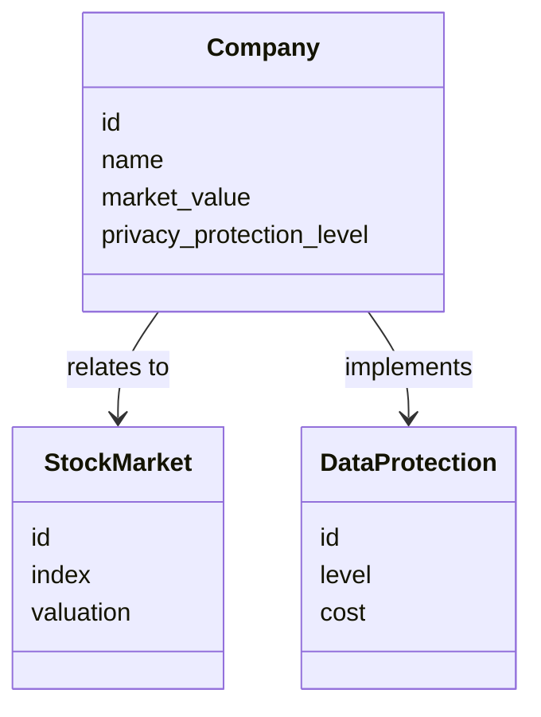
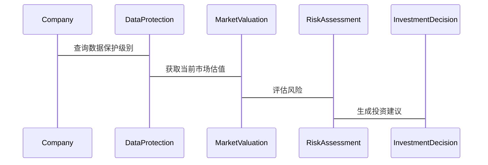

                 


# 股市估值高低对企业数据隐私保护投资的影响

> 关键词：股市估值，企业数据隐私，数据保护投资，风险管理，数据安全

> 摘要：本文探讨股市估值的高低对企业在数据隐私保护方面的投资决策的影响。通过分析股市估值对企业价值的影响，结合数据隐私保护的重要性，构建数学模型，评估股市估值与数据隐私保护投资之间的关系，提出系统设计和实际案例分析，为企业的数据隐私保护投资提供指导和参考。

---

# 第一部分：背景介绍

## 第1章：股市估值与企业数据隐私保护的背景介绍

### 1.1 问题背景与定义

#### 1.1.1 股市估值的基本概念
股市估值是指对上市公司股票价值的评估，通常基于市盈率（P/E）、市净率（P/B）、市值等指标。股市估值反映了投资者对企业的信任和未来盈利能力的预期。高估值意味着市场对企业前景看好，低估值则可能意味着市场对企业的盈利能力或风险持谨慎态度。

#### 1.1.2 数据隐私保护的定义
数据隐私保护是指保护个人或企业的数据不被未经授权的访问、泄露或滥用。在数字化时代，数据隐私保护已成为企业运营和风险管理的核心部分，直接影响企业的声誉和法律合规性。

#### 1.1.3 企业数据隐私保护的核心要素
企业数据隐私保护的核心要素包括数据分类与分级、访问控制、加密技术、隐私政策制定、合规性管理等。这些要素共同构成了企业数据隐私保护的体系。

### 1.2 问题描述与外延

#### 1.2.1 股市高估对数据隐私保护的影响
当股市高估时，企业可能会因为高估值而忽视数据隐私保护，认为市场对公司的价值认定已经足够，从而减少在数据安全方面的投入。这种做法可能带来潜在风险，一旦数据泄露，企业的市场估值可能会大幅下降。

#### 1.2.2 股市低估对数据隐私保护的影响
当股市低估时，企业可能会更加注重数据隐私保护，以提升投资者信心，改善市场形象。数据隐私保护成为企业提升自身价值的重要手段。

#### 1.2.3 问题的边界与外延
问题的边界在于股市估值与数据隐私保护投资之间的关系，外延则涉及企业风险管理、合规性要求、投资者信任等多个方面。

### 1.3 核心概念结构

#### 1.3.1 概念之间的关系
股市估值与企业数据隐私保护投资之间存在双向关系。高估值可能削弱企业对数据隐私保护的重视，而低估值则可能推动企业加强数据隐私保护。

#### 1.3.2 概念的属性特征对比

| 概念属性 | 股市估值 | 数据隐私保护投资 |
|----------|----------|-------------------|
| 影响因素 | 市盈率、市净率 | 数据分类、访问控制、加密技术 |
| 目标     | 评估企业价值 | 保护数据安全     |
| 风险     | 市场波动、泡沫破裂 | 数据泄露、合规失败 |

#### 1.3.3 ER实体关系图

```mermaid
erDiagram
    company {
        id
        name
        market_value
        privacy_protection_level
    }
    stock_market {
        id
        index
        valuation
    }
    relation {
        company_id
        stock_market_id
        relation_type
    }
```

---

# 第二部分：股市估值对企业数据隐私保护投资的影响机制

## 第2章：股市估值对企业数据隐私保护投资的影响机制

### 2.1 影响机制分析

#### 2.1.1 股市高估对数据隐私保护的影响
股市高估可能导致企业管理层过于自信，认为当前的市场表现能够覆盖潜在的数据泄露风险，从而减少在数据隐私保护方面的投入。

#### 2.1.2 股市低估对数据隐私保护的影响
股市低估时，企业可能会加大数据隐私保护的投资，以提升企业的安全形象，增强投资者信心。

#### 2.1.3 企业数据隐私保护与股市估值的双向关系
企业数据隐私保护不仅影响股市估值，还受到股市估值的影响。高估值可能导致企业忽视数据安全，而低估值则可能推动企业加强数据保护。

### 2.2 影响模型构建

#### 2.2.1 数据隐私保护投资的数学模型
$$E[Profit] = \alpha \times PrivacyProtection + \beta \times MarketValuation + \gamma \times Risk$$

其中：
- $\alpha$：数据隐私保护对利润的贡献系数
- $\beta$：市场估值对利润的影响系数
- $\gamma$：风险对利润的负面影响系数

#### 2.2.2 股市估值与数据隐私保护的关联模型
$$MarketValuation = \theta \times PrivacyProtection + \phi \times Competitiveness + \psi \times Risk$$

其中：
- $\theta$：数据隐私保护对市场估值的贡献系数
- $\phi$：企业竞争力对市场估值的贡献系数
- $\psi$：风险对市场估值的负面影响系数

### 2.3 影响评估与对比

#### 2.3.1 数据隐私保护投资的收益评估
通过数学模型评估数据隐私保护投资对企业利润的影响，确保企业在数据隐私保护方面的投入能够带来实际的收益。

#### 2.3.2 股市估值变化对数据隐私保护的影响对比
通过对比不同股市估值情况下的数据隐私保护投资，分析其对市场估值的实际影响，为企业的决策提供数据支持。

---

# 第三部分：系统设计与实现

## 第3章：系统设计与实现方案

### 3.1 问题场景介绍
假设某上市公司当前市场估值较高，但数据隐私保护投入较少，导致潜在风险增加。我们需要设计一套系统，帮助企业在不同股市估值情况下优化数据隐私保护投资。

### 3.2 系统功能设计

#### 3.2.1 领域模型设计



#### 3.2.2 系统架构设计

```mermaid
--- 整体架构 ---
flowchart TD
    A[公司] --> B[数据隐私保护系统]
    B --> C[市场估值模块]
    C --> D[风险评估模块]
    D --> E[投资决策模块]
```

#### 3.2.3 系统接口设计
系统接口包括数据输入接口、市场估值接口、风险评估接口和投资决策接口。

#### 3.2.4 系统交互设计



### 3.3 系统实现

#### 3.3.1 环境安装
需要安装Python、Flask框架、PostgreSQL数据库。

#### 3.3.2 核心代码实现

```python
import math

def calculate_market_valuation(privacy_level, risk_factor):
    return privacy_level * risk_factor

def optimize_data_protection(current_valuation, desired_valuation):
    alpha = (desired_valuation - current_valuation) / 10
    return int(alpha + 0.5)

class DataProtectionManager:
    def __init__(self):
        self.data_protection_level = 0

    def set_protection_level(self, level):
        self.data_protection_level = level

    def get_protection_level(self):
        return self.data_protection_level
```

#### 3.3.3 代码应用解读与分析
以上代码实现了一个简单的数据保护优化系统，根据当前市场估值和预期估值，优化企业的数据保护投入。

---

## 第4章：项目实战与案例分析

### 4.1 环境安装
安装必要的开发工具和依赖库，例如Python、Flask、PostgreSQL。

### 4.2 核心代码实现

```python
from flask import Flask
import psycopg2

app = Flask(__name__)

def get_market_valuation():
    try:
        conn = psycopg2.connect("dbname='test' user='admin' password='secret'")
        cur = conn.cursor()
        cur.execute("SELECT valuation FROM stock_market WHERE company_id = 1")
        valuation = cur.fetchone()[0]
        return valuation
    except Exception as e:
        print(e)
        return None

@app.route('/optimize')
def optimize():
    current_valuation = get_market_valuation()
    if current_valuation is None:
        return "Error"
    desired_valuation = 100
    optimized_level = optimize_data_protection(current_valuation, desired_valuation)
    return f"Optimized data protection level: {optimized_level}"

if __name__ == '__main__':
    app.run(debug=True)
```

### 4.3 案例分析
通过实际案例分析，展示如何根据市场估值优化企业的数据隐私保护投资，提升企业的市场形象和估值。

### 4.4 项目小结
总结项目实现的过程、成果和意义，为后续的企业数据隐私保护投资提供参考。

---

## 第5章：最佳实践与总结

### 5.1 最佳实践
企业在进行数据隐私保护投资时，应综合考虑股市估值、企业风险、市场竞争力等多方面因素，制定科学的投资策略。

### 5.2 小结
通过本文的分析，我们得出股市估值的高低对企业数据隐私保护投资有重要影响。企业应根据市场估值动态调整数据保护策略，以实现长期的市场价值和风险管理目标。

### 5.3 注意事项
企业在进行数据隐私保护投资时，需注意数据分类、访问控制、加密技术等细节，确保数据保护的有效性。

### 5.4 拓展阅读
建议进一步研究数据隐私保护的国际法规、风险管理模型、市场估值预测方法等，以完善企业的数据隐私保护体系。

---

# 作者：AI天才研究院 & 禅与计算机程序设计艺术

---

通过本文的分析和系统设计，企业可以更好地理解股市估值与数据隐私保护投资之间的关系，并根据实际市场情况，制定科学合理的数据隐私保护策略，以实现企业的长期发展和市场价值的提升。

