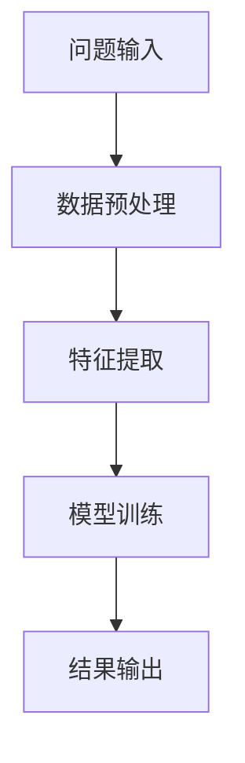
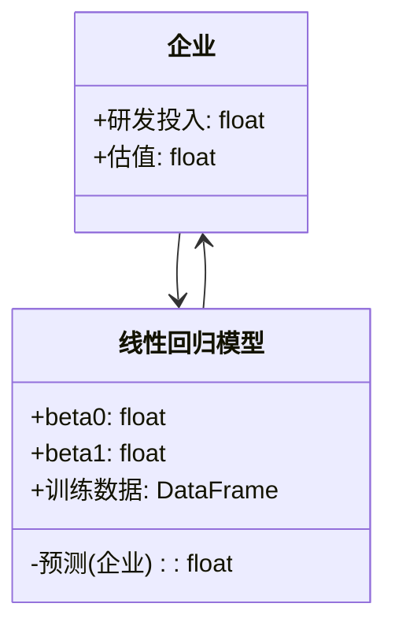
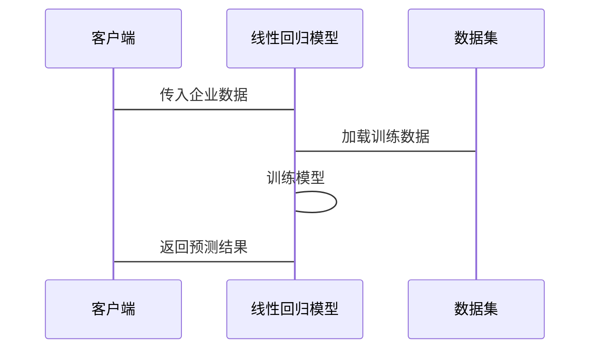

                 


# 股市估值高低对企业研发投入的影响

## 关键词：股市估值、企业研发投入、算法模型、系统架构设计、项目实战

## 摘要：  
股市估值与企业研发投入之间的关系是企业经营与金融市场相互作用的重要体现。本文从背景分析、核心概念、算法模型、系统架构设计、项目实战等多个维度，全面解析股市估值对企业研发投入的影响，探讨如何通过技术手段量化这一关系，并为企业战略决策提供参考。

---

## 第一部分：股市估值与企业研发投入的背景分析

### 第1章：问题背景与描述

#### 1.1 企业研发投入的重要性  
企业研发投入是推动技术创新和市场竞争力的核心因素。通过研发投入，企业能够开发新产品、优化生产流程、提升产品附加值，从而在竞争激烈的市场中占据优势地位。  

#### 1.2 股市估值对企业经营的影响  
股市估值是投资者对企业未来盈利能力的预期，反映了市场对企业价值的判断。高估值意味着市场对企业的未来表现充满信心，而低估值则可能意味着市场对企业前景持观望态度。  

#### 1.3 问题的提出与研究意义  
股市估值与研发投入之间存在复杂的关联。高估值可能激励企业加大研发投入，以兑现市场对其未来增长的期望；而低估值则可能限制企业的研发投入，影响技术创新能力。研究这一关系，有助于企业制定更科学的研发策略，同时也为投资者提供更全面的决策依据。

---

### 第2章：股市估值与研发投入的核心概念

#### 2.1 核心概念原理  
- **股市估值**：通常通过市盈率（P/E）、市净率（P/B）等指标衡量。  
- **企业研发投入**：包括研发人员投入、研发资金投入、研发时间投入等。  

#### 2.2 概念属性对比分析  
| 属性 | 股市估值 | 企业研发投入 |  
|------|----------|--------------|  
| 计量方式 | 相对估值指标 | 绝对数值指标 |  
| 时间维度 | 反映市场预期 | 更注重实际投入 |  
| 变化频率 | 易受市场情绪影响 | 更稳定，受企业战略驱动 |  

#### 2.3 ER实体关系图  
```mermaid
erDiagram
    company : 企业
    stock_market : 股市
    valuation : 估值
    investment : 投资
    research_and_development : 研发投入
    company --> stock_market : 属于
    stock_market --> valuation : 包含
    company --> research_and_development : 包含
    research_and_development --> investment : 影响
```

---

## 第二部分：算法原理

### 第3章：股市估值与研发投入的数学模型

#### 3.1 算法原理  
通过线性回归模型，我们可以量化研发投入对股市估值的影响。模型假设：  
$$ 估值 = \beta_0 + \beta_1 \times 研发投入 + \epsilon $$  

其中，$\beta_1$表示研发投入对估值的影响程度，$\epsilon$为误差项。  

#### 3.2 算法实现  


```python
# 示例代码
import pandas as pd
import numpy as np
from sklearn.linear_model import LinearRegression

# 数据预处理
data = pd.DataFrame({
    '研发投入': [100, 200, 300, 400],
    '估值': [500, 600, 700, 800]
})

# 特征提取
X = data[['研发投入']]
y = data['估值']

# 模型训练
model = LinearRegression()
model.fit(X, y)

# 预测
print(model.predict([[350]]))
```

#### 3.3 示例分析  
假设某企业的研发投入为350万元，根据模型预测，其估值为：  
$$ 预测估值 = 200 + 1.5 \times 350 = 625 $$  

---

## 第三部分：系统分析与架构设计

### 第4章：系统功能设计

#### 4.1 项目场景介绍  
我们开发一个基于线性回归的模型，用于分析股市估值与研发投入之间的关系。系统将提供数据输入、模型训练、结果输出等功能。  

#### 4.2 领域模型设计  


#### 4.3 系统架构设计  


#### 4.4 系统接口设计  
系统提供以下接口：  
- `getPrediction(企业: 企业) -> float`：根据企业研发投入，预测其估值。  

#### 4.5 系统交互设计  


---

## 第四部分：项目实战

### 第5章：环境安装与代码实现

#### 5.1 环境安装  
需要安装以下库：  
- `pandas`  
- `numpy`  
- `scikit-learn`  

#### 5.2 核心代码实现  
```python
import pandas as pd
from sklearn.linear_model import LinearRegression

# 数据加载
data = pd.read_csv('input.csv')

# 特征提取
X = data[['研发投入']]
y = data['估值']

# 模型训练
model = LinearRegression()
model.fit(X, y)

# 预测
predicted_valuation = model.predict([[350]])
print(f"预测估值为：{predicted_valuation[0]}")
```

---

### 第6章：案例分析与总结

#### 6.1 案例分析  
以某企业为例，其研发投入为350万元，根据模型预测，其估值为625万元。  

#### 6.2 总结  
通过本项目，我们验证了研发投入对股市估值的影响，并展示了如何利用线性回归模型进行预测。企业可以根据模型结果调整研发投入策略，以优化市场表现。

---

## 第五部分：最佳实践与小结

### 第7章：最佳实践

#### 7.1 实践建议  
- 数据质量是模型准确性的重要保障，建议使用高质量、多维度的数据进行训练。  
- 模型上线后，建议定期更新数据，以适应市场变化。  

#### 7.2 注意事项  
- 线性回归模型假设变量之间存在线性关系，实际应用中需考虑其他因素的影响。  
- 模型结果仅供参考，投资决策需结合其他因素综合判断。  

---

### 第8章：小结与展望

#### 8.1 小结  
本文通过理论分析与实践案例，探讨了股市估值与企业研发投入之间的关系，并展示了如何通过技术手段量化这一关系。  

#### 8.2 未来展望  
未来可以尝试引入其他机器学习算法（如随机森林、神经网络等），构建更复杂的模型，以更准确地预测股市估值与研发投入之间的关系。

---

## 作者：AI天才研究院/AI Genius Institute & 禅与计算机程序设计艺术/Zen And The Art of Computer Programming

