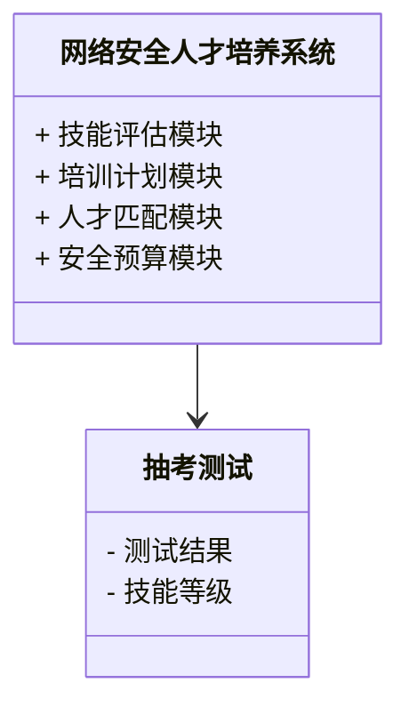
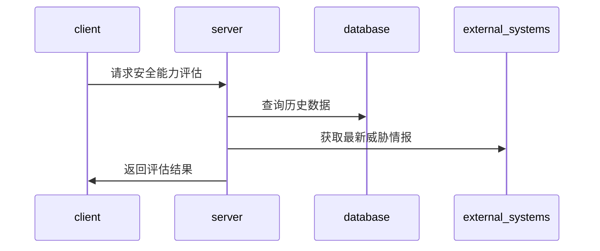

                 


# 股市估值高低对企业网络安全人才培养的影响

## 关键词：股市估值、网络安全人才、企业投资、人才供给、安全预算

## 摘要：
股市估值是衡量企业价值的重要指标，而网络安全人才是保障企业安全的核心资源。本文从股市估值与网络安全人才培养的关系入手，分析股市估值波动对企业安全投入的影响，探讨企业如何通过优化网络安全人才培养策略来提升股市估值。通过理论分析和案例研究，本文揭示了股市估值与网络安全人才培养的相互作用机制，并提出了企业提升网络安全人才储备的具体建议。

---

# 第一章：背景与核心概念

## 1.1 核心概念与问题背景

### 1.1.1 股市估值的基本概念
股市估值是通过市场对企业的定价来反映其价值的过程。常见的股市估值方法包括市盈率（P/E）、市净率（P/B）、市值等指标。股市估值不仅反映了企业的财务表现，还体现了市场对企业的信心和未来发展潜力的预期。

### 1.1.2 网络安全人才的核心要素
网络安全人才是指具备网络安全相关知识和技能的人员，包括但不限于网络安全工程师、渗透测试工程师、数据安全专家等。这类人才需要具备扎实的技术能力、快速的应急响应能力以及对企业业务的深刻理解。

### 1.1.3 股市估值与网络安全的关联性
股市估值与网络安全存在密切关联。一方面，高股市估值意味着企业有更多的资源用于网络安全建设；另一方面，网络安全能力的强弱直接影响企业的市场形象和投资者信心，从而影响股市估值。

## 1.2 问题描述与研究意义

### 1.2.1 股市估值对企业的影响
股市估值是企业市场地位的体现，直接影响企业的融资能力、投资者信心以及资本运作能力。高估值企业更容易吸引人才和资源，而低估值企业可能面临资金短缺和人才流失的风险。

### 1.2.2 网络安全人才对企业的重要性
网络安全人才是企业应对网络安全威胁的核心力量。随着 cyber threats 的不断增加，企业对高素质网络安全人才的需求日益迫切。然而，网络安全人才的供给与需求之间存在严重失衡，这成为制约企业网络安全能力提升的重要因素。

### 1.2.3 问题解决的必要性
通过分析股市估值与网络安全人才培养的关系，可以帮助企业更好地制定网络安全战略，优化人才资源配置，提升企业的整体安全能力，从而在竞争激烈的市场中获得更大的竞争优势。

## 1.3 边界与外延

### 1.3.1 股市估值的边界条件
股市估值受到多种因素的影响，包括企业的财务表现、行业竞争状况、宏观经济环境等。本文主要关注企业自身对网络安全人才培养的投入对股市估值的影响，而不涉及外部不可控因素。

### 1.3.2 网络安全人才的培养范围
网络安全人才培养不仅包括技术能力的培养，还包括安全意识的提升、应急响应能力的训练等。本文将重点关注企业内部的安全人才培养机制，以及与股市估值的相关性。

### 1.3.3 两者关系的外延分析
股市估值与网络安全人才培养的关系不仅体现在企业层面，还可能影响整个行业的安全水平和市场竞争力。通过优化企业内部的安全人才培养机制，可以提升整个行业的安全能力，从而间接影响股市整体表现。

---

# 第二章：股市估值对企业的影响分析

## 2.1 股市估值对企业价值的衡量

### 2.1.1 股市估值的基本方法
市盈率（P/E）= 股价 / 每股净利润  
市净率（P/B）= 股价 / 每股净资产  
市值 = 股价 × 总股本

### 2.1.2 股市估值与企业财务表现的关系
企业的财务表现（如净利润、营业收入增长率等）直接影响股市估值。高净利润和持续增长的营业收入通常会提升企业的股市估值。

### 2.1.3 股市估值与企业市场地位的关联
高股市估值通常意味着企业在行业中具有较强的市场地位和竞争优势。投资者对企业的信心和市场预期直接影响股市估值。

## 2.2 股市估值对企业投资行为的影响

### 2.2.1 投资者行为分析
投资者基于对企业未来发展的预期进行投资决策。高股市估值通常意味着投资者对企业未来表现有信心，愿意以更高的价格购买企业股票。

### 2.2.2 企业资本运作的影响
股市估值的高低直接影响企业的资本运作能力。高估值企业更容易通过股票发行、并购等方式获取资金和资源。

### 2.2.3 股市估值波动对企业战略的调整
股市估值的波动迫使企业不断调整战略。例如，当股市估值下降时，企业可能需要缩减开支或优化资源配置以应对市场变化。

---

# 第三章：网络安全人才培养的核心要素

## 3.1 网络安全人才的基本要求

### 3.1.1 技术能力要求
网络安全人才需要掌握操作系统安全、网络协议安全、加密技术、渗透测试等核心技能。

### 3.1.2 知识储备要求
网络安全人才需要具备扎实的计算机基础知识，熟悉网络安全法规和标准（如ISO 27001、GDPR等）。

### 3.1.3 实践能力要求
网络安全人才需要具备实际问题解决能力，能够应对复杂的网络安全威胁和攻击。

## 3.2 网络安全人才培养的模式

### 3.2.1 学科教育模式
通过高校设置网络安全相关专业，培养具备系统知识的网络安全人才。

### 3.2.2 企业培训模式
企业通过内部培训和认证课程提升员工的网络安全能力。

### 3.2.3 自主学习模式
鼓励员工通过在线课程、技术博客等方式进行自主学习和能力提升。

## 3.3 网络安全人才供给与需求的平衡

### 3.3.1 人才供给现状分析
目前网络安全人才供给不足，尤其是高素质人才短缺问题突出。

### 3.3.2 人才需求市场分析
随着 cyber threats 的增加，企业对网络安全人才的需求持续增长。

### 3.3.3 供给与需求的匹配问题
企业对高素质网络安全人才的需求远大于市场供给，导致人才竞争激烈，企业需要通过多种方式吸引和培养人才。

---

# 第四章：股市估值对网络安全人才培养的影响机制

## 4.1 股市估值对企业安全投入的推动

### 4.1.1 股市估值与企业安全预算的关系
高股市估值企业通常有更高的安全预算，能够投入更多资源用于网络安全建设。

### 4.1.2 股市估值对企业安全人才招聘的影响
高股市估值企业更具吸引力，能够吸引更多的高素质网络安全人才加入。

### 4.1.3 股市估值与企业安全培训的关联
高股市估值企业更注重员工安全培训，通过提升员工能力来增强企业的安全防护能力。

## 4.2 网络安全人才对企业价值的提升

### 4.2.1 高质量人才对股市估值的正向影响
高素质网络安全人才能够有效防范 cyber attacks，降低企业的安全风险，从而提升投资者信心和股市估值。

### 4.2.2 人才短缺对股市估值的负面影响
人才短缺可能导致企业安全能力不足，面临更多的安全威胁和法律风险，进而影响企业的市场形象和股市估值。

### 4.2.3 人才流动对股市估值的潜在影响
高素质人才的流动可能对企业安全能力造成短期冲击，进而影响股市估值。

---

# 第五章：股市估值与网络安全人才培养的互动关系

## 5.1 股市估值波动对人才培养的影响

### 5.1.1 股市牛市对人才供给的促进作用
股市牛市期间，企业市值增长，有更多的资源用于安全人才培养，吸引更多的高素质人才加入。

### 5.1.2 股市熊市对人才供给的抑制作用
股市熊市期间，企业可能缩减安全预算，影响人才的培养和引进。

## 5.2 网络安全人才对股市估值的反向影响

### 5.2.1 人才储备对企业安全能力的提升
高素质网络安全人才能够有效应对安全威胁，降低企业的运营风险，从而提升投资者对企业的信心。

### 5.2.2 人才流失对企业估值的负面影响
关键人才的流失可能导致企业安全能力下降，进而影响投资者对企业的估值。

---

# 第六章：系统分析与架构设计方案

## 6.1 问题场景介绍

### 6.1.1 问题背景
企业面临日益复杂的网络安全威胁，需要通过优化人才储备来提升安全能力，进而影响股市估值。

### 6.1.2 项目目标
通过分析股市估值与网络安全人才培养的关系，设计一个能够优化企业安全能力的人才培养系统。

## 6.2 系统功能设计

### 6.2.1 领域模型（Mermaid 类图）


### 6.2.2 系统架构设计（Mermaid 架构图）


### 6.2.3 系统接口设计
系统接口设计包括技能评估接口、培训计划接口、人才匹配接口和安全预算接口。

### 6.2.4 系统交互设计（Mermaid 序列图）


---

# 第七章：项目实战

## 7.1 环境安装

### 7.1.1 系统需求
- 操作系统：Windows 10 或更高版本，或 Linux 系统
- 开发工具：Python 3.8 或更高版本，Jupyter Notebook，Django 框架
- 数据库：MySQL 或 PostgreSQL

## 7.2 系统核心实现源代码

### 7.2.1 技能评估模块（Python 代码）
```python
def assess_skills(test_results):
    skill_level = {}
    for skill in test_results:
        if test_results[skill] >= 80:
            skill_level[skill] = "高级"
        elif test_results[skill] >= 60:
            skill_level[skill] = "中级"
        else:
            skill_level[skill] = "初级"
    return skill_level
```

### 7.2.2 培训计划模块（Python 代码）
```python
def generate_training_plan(skill_level):
    training_plan = {}
    for skill in skill_level:
        if skill_level[skill] == "初级":
            training_plan[skill] = "基础课程"
        elif skill_level[skill] == "中级":
            training_plan[skill] = "进阶课程"
        else:
            training_plan[skill] = "高级课程"
    return training_plan
```

---

# 第八章：结论与展望

## 8.1 结论
股市估值与网络安全人才培养密切相关。高股市估值企业能够投入更多资源用于安全人才培养，而高素质网络安全人才能够提升企业的安全能力，进一步提高股市估值。企业应通过优化人才培养机制，提升安全能力，从而在竞争中占据优势。

## 8.2 展望
未来，随着网络安全威胁的不断升级，企业需要更加重视网络安全人才培养。通过技术创新和模式优化，企业可以进一步提升安全能力，实现股市估值与安全能力的良性互动。

---

# 作者：AI天才研究院/AI Genius Institute & 禅与计算机程序设计艺术 /Zen And The Art of Computer Programming

