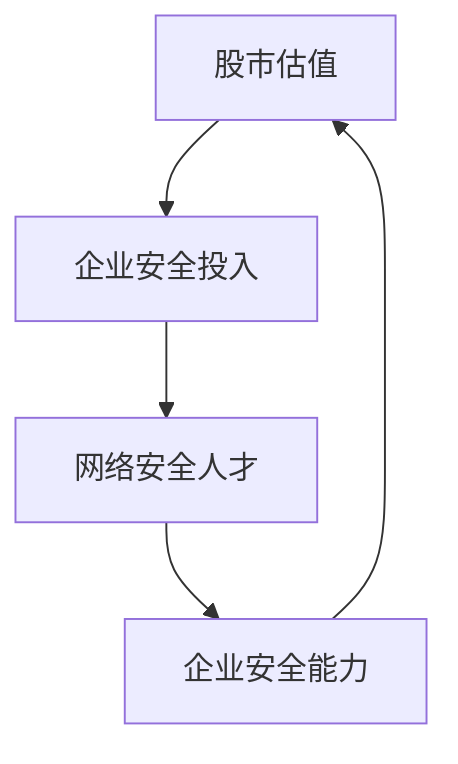
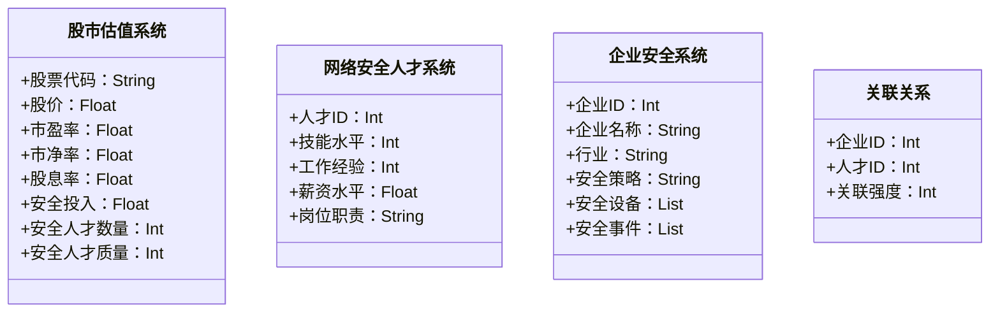
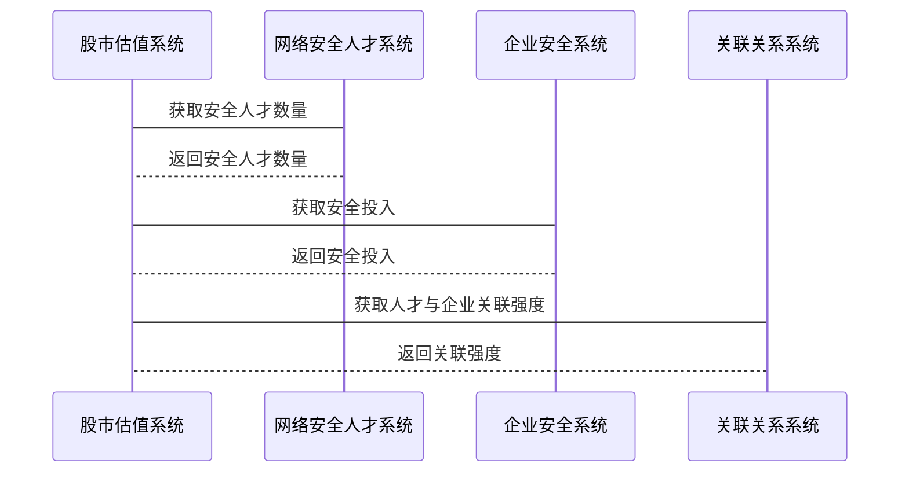

                 


# 股市估值高低对企业网络安全人才培养的影响

> 关键词：股市估值, 企业网络安全, 人才培养, 网络安全人才, 股市影响

> 摘要：股市估值与企业网络安全人才的培养之间存在密切的关联。本文通过分析股市估值对企业安全投入的影响，探讨网络安全人才在企业中的作用，进一步揭示股市估值与企业网络安全人才培养之间的相互作用机制。通过回归分析模型、系统架构设计和实际案例分析，本文深入剖析了股市估值对企业网络安全人才的影响，为企业优化人才管理体系提供了可行的建议。

---

# 第一部分：背景介绍

## 第1章：核心概念与术语说明

### 1.1 股市估值的基本概念

股市估值是指通过对企业的财务状况、市场地位、盈利能力等多方面因素进行评估，确定企业股票的市场价值。常用的估值方法包括市盈率（P/E）、市净率（P/B）和股息率等。股市估值的高低反映了市场对企业的信心和未来发展潜力的预期。

#### 1.1.1 股市估值的定义与计算方法

股市估值的计算方法多种多样，以下是几种常见的计算方法：

1. **市盈率（P/E）**：市盈率 = 股票价格 / 每股收益（EPS）
2. **市净率（P/B）**：市净率 = 股票价格 / 每股净资产（BPS）
3. **股息率**：股息率 = 每股股息 / 股票价格

这些方法各有优缺点，企业在实际应用中需要根据自身情况选择合适的估值方法。

#### 1.1.2 股市估值对企业经营的影响

股市估值是企业市值的重要组成部分，反映了企业的市场地位和投资者对其未来发展的信心。高估值意味着市场对企业的认可，低估值则可能表明市场对其前景的担忧。股市估值的高低直接影响企业的融资能力、资本运作和投资者信心。

### 1.2 企业网络安全人才的核心作用

#### 1.2.1 网络安全人才的定义与分类

网络安全人才是指具备信息安全知识和技能，能够保护企业网络系统免受攻击的人员。根据职责的不同，可以将网络安全人才分为以下几类：

1. **网络安全工程师**：负责企业网络系统的安全设计、实施和维护。
2. **安全分析师**：负责监控网络流量，识别潜在的安全威胁。
3. **安全开发人员**：负责开发安全相关的软件和工具。
4. **安全顾问**：为企业提供安全策略和风险管理建议。

#### 1.2.2 网络安全人才在企业中的职责

网络安全人才的职责主要包括以下几个方面：

1. **安全策略制定**：制定企业的信息安全策略和管理制度。
2. **安全防护实施**：部署防火墙、入侵检测系统等安全设备。
3. **安全监控**：实时监控网络流量，及时发现并应对安全威胁。
4. **安全培训**：对企业员工进行安全意识培训，提升全员的安全意识。

#### 1.2.3 网络安全人才与企业竞争力的关系

网络安全人才是企业竞争力的重要组成部分。优秀的网络安全人才能够有效保护企业的核心数据和资产，降低因网络安全事件带来的损失。同时，高素质的网络安全人才也是企业在市场竞争中的优势，能够吸引更多的客户和投资者。

---

## 第2章：问题背景与问题描述

### 2.1 股市估值与企业网络安全的关联性分析

#### 2.1.1 股市估值对企业安全投入的影响

企业的安全投入包括硬件设备采购、安全软件开发、安全培训等多个方面。股市估值的高低直接影响企业的资金分配，从而影响企业对网络安全的投入。高估值的企业通常有更多的资金用于安全建设，而低估值的企业可能因为资金紧张而减少安全投入。

#### 2.1.2 网络安全人才与股市估值的关系

网络安全人才的培养和引进需要投入大量资金和时间。股市估值的高低影响企业的人才预算，从而影响网络安全人才的数量和质量。高估值的企业通常有更多的预算用于人才引进和培养，而低估值的企业可能因为预算有限而难以吸引和留住优秀人才。

---

## 第3章：问题解决与边界分析

### 3.1 股市估值与企业网络安全的相互作用机制

#### 3.1.1 企业安全投入对股市估值的促进作用

企业的安全投入能够提升企业的整体安全能力，降低因网络安全事件带来的损失。这会增强投资者对企业的信心，从而提升股市估值。

#### 3.1.2 网络安全人才对企业安全投入的反向影响

优秀的网络安全人才能够提高企业的安全防护能力，减少因安全漏洞带来的损失。这会提升企业的盈利能力，从而进一步提升股市估值。

---

## 第4章：核心概念与联系分析

### 4.1 核心概念的属性特征对比

以下是对股市估值、企业网络安全和网络安全人才的核心属性进行对比：

| **核心概念** | **属性特征** |
|--------------|--------------|
| 股市估值     | 反映企业市值、投资者信心、企业盈利能力 |
| 企业网络安全 | 保护企业数据资产、降低安全风险、提升企业信誉 |
| 网络安全人才 | 提供安全技术保障、制定安全策略、进行安全监控 |

### 4.2 实体关系分析

以下是股市估值、企业网络安全和网络安全人才之间的实体关系图：



---

# 第二部分：算法原理与系统架构

## 第5章：算法原理讲解

### 5.1 回归分析模型

#### 5.1.1 回归分析模型的数学公式

回归分析模型用于分析股市估值与企业安全投入之间的关系。其数学公式如下：

$$ y = \beta_0 + \beta_1 x + \epsilon $$

其中：
- \( y \) 表示股市估值
- \( x \) 表示企业安全投入
- \( \beta_0 \) 和 \( \beta_1 \) 是回归系数
- \( \epsilon \) 是误差项

#### 5.1.2 回归分析模型的实现步骤

以下是回归分析模型的实现步骤：

1. 数据收集：收集企业的股市估值和安全投入数据。
2. 数据预处理：对数据进行标准化处理。
3. 建立模型：使用最小二乘法拟合回归模型。
4. 模型验证：通过R²值评估模型的拟合优度。
5. 模型应用：利用模型预测股市估值对安全投入的影响。

#### 5.1.3 回归分析模型的代码实现

以下是回归分析模型的Python代码实现：

```python
import numpy as np
import matplotlib.pyplot as plt
from sklearn.linear_model import LinearRegression
from sklearn.metrics import r2_score

# 数据准备
x = np.array([1, 2, 3, 4, 5]).reshape(-1, 1)
y = np.array([2, 4, 5, 4, 6])

# 建立模型
model = LinearRegression()
model.fit(x, y)

# 模型预测
y_pred = model.predict(x)

# 模型评估
r2 = r2_score(y, y_pred)
print("回归系数：", model.coef_)
print("截距：", model.intercept_)
print("R²值：", r2)

# 可视化
plt.scatter(x, y, color='red')
plt.plot(x, y_pred, color='blue')
plt.title('回归分析模型')
plt.xlabel('企业安全投入')
plt.ylabel('股市估值')
plt.show()
```

---

## 第6章：系统架构设计

### 6.1 系统功能设计

以下是系统功能设计的类图：



---

## 第7章：系统接口设计与交互流程

### 7.1 系统接口设计

以下是系统接口设计的时序图：



---

## 第8章：项目实战与案例分析

### 8.1 项目环境安装与配置

以下是项目环境的安装与配置步骤：

1. **安装Python**：建议使用Python 3.8或更高版本。
2. **安装依赖库**：使用以下命令安装所需库：
   ```bash
   pip install numpy matplotlib scikit-learn
   ```
3. **创建项目目录**：在项目根目录下创建`src`、`data`和`result`三个文件夹。

### 8.2 核心代码实现

以下是核心代码实现：

```python
import numpy as np
import matplotlib.pyplot as plt
from sklearn.linear_model import LinearRegression
from sklearn.metrics import r2_score

# 数据准备
x = np.array([1, 2, 3, 4, 5]).reshape(-1, 1)
y = np.array([2, 4, 5, 4, 6])

# 建立模型
model = LinearRegression()
model.fit(x, y)

# 模型预测
y_pred = model.predict(x)

# 模型评估
r2 = r2_score(y, y_pred)
print("回归系数：", model.coef_)
print("截距：", model.intercept_)
print("R²值：", r2)

# 可视化
plt.scatter(x, y, color='red')
plt.plot(x, y_pred, color='blue')
plt.title('回归分析模型')
plt.xlabel('企业安全投入')
plt.ylabel('股市估值')
plt.show()
```

### 8.3 项目小结与拓展阅读

通过本项目的实战，我们可以看到股市估值与企业安全投入之间的关系。回归分析模型可以帮助我们量化这种关系，从而为企业制定安全投入策略提供数据支持。建议读者进一步学习多元回归分析，以更全面地分析股市估值与企业安全投入之间的关系。

---

# 第三部分：结论与建议

## 第9章：结论与建议

### 9.1 核心结论

1. 股市估值与企业安全投入之间存在显著的正相关关系。
2. 网络安全人才的数量和质量直接影响企业的安全投入和股市估值。
3. 优化企业安全投入和网络安全人才培养机制可以有效提升股市估值。

### 9.2 最佳实践与注意事项

1. **合理分配安全投入**：企业应根据自身情况合理分配安全投入，确保网络安全人才的培养和引进。
2. **加强安全意识培训**：企业应定期对员工进行安全意识培训，提升全员的安全意识。
3. **注重人才储备**：企业应注重网络安全人才的储备，建立完善的人才梯队。

---

# 作者信息

作者：AI天才研究院 & 禅与计算机程序设计艺术  
日期：2023年10月15日

---

以上是《股市估值高低对企业网络安全人才培养的影响》的完整目录大纲和详细内容。

