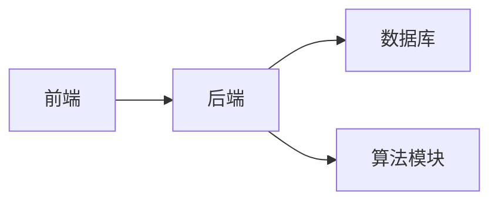
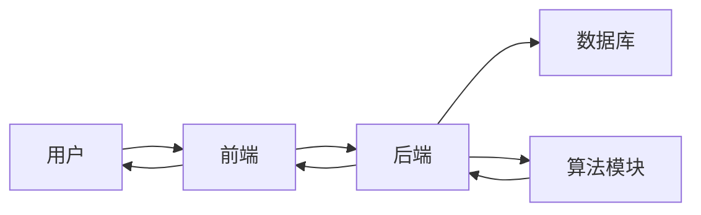

                 


# 股市估值高低对企业网络安全投资的影响

> 关键词：股市估值，企业网络安全，投资影响，数学模型，算法实现，系统架构

> 摘要：本文从股市估值与企业网络安全投资的关系入手，通过背景介绍、核心概念分析、理论模型构建、系统设计与实现、项目实战等多维度，深入探讨股市估值高低对企业网络安全投资的具体影响。结合实际案例和数学模型，分析股市估值对企业网络安全投资决策的驱动因素、影响机制和实现路径，提出可行的解决方案和实施建议。

---

## 第一部分: 背景介绍

### 第1章: 背景与问题背景

#### 1.1 问题背景与定义

##### 1.1.1 股市估值的定义与计算方法
股市估值是指通过对企业财务数据和市场表现的分析，对其股票价格进行合理评估的过程。常用的估值方法包括市盈率（P/E）、市净率（P/B）、股息率等。例如，市盈率公式为：

$$ \text{市盈率} = \frac{\text{股价}}{\text{每股收益}} $$

##### 1.1.2 企业网络安全投资的定义与范围
企业网络安全投资是指企业在保护自身网络系统、数据和信息资产方面所投入的资源，包括技术采购、人员培训、安全策略制定等。网络安全投资的范围涵盖硬件、软件、服务等多个方面。

##### 1.1.3 股市估值与企业网络安全投资的关系
股市估值与企业网络安全投资存在密切关系。高估值企业通常更注重风险控制，而网络安全是企业风险管理的重要组成部分。低估值企业可能因资金有限而减少安全投入，从而面临更大的风险敞口。

#### 1.2 问题描述与目标

##### 1.2.1 股市估值对企业投资行为的影响
股市估值影响企业的投资决策，高估值企业倾向于稳健投资，低估值企业可能寻求高风险高回报的项目。

##### 1.2.2 网络安全投资对企业运营的影响
网络安全投资直接影响企业的运营成本、风险暴露程度和市场信任度。较高的安全投入可能短期内影响利润，但长期来看有助于企业稳健发展。

##### 1.2.3 研究目标与意义
本研究旨在探讨股市估值如何影响企业的网络安全投资决策，揭示两者之间的内在逻辑，为企业制定合理的安全投资策略提供理论依据。

#### 1.3 问题解决与边界

##### 1.3.1 股市估值对企业网络安全投资的影响路径
1. 股市估值影响企业的资金分配。
2. 网络安全投资与企业风险管理密切相关。
3. 股市估值通过影响企业的风险偏好，间接影响安全投资。

##### 1.3.2 问题解决的边界与外延
本研究仅关注股市估值与企业网络安全投资的关系，不涉及其他类型的投资行为。

##### 1.3.3 核心概念与核心要素分析
- 核心概念：股市估值、网络安全投资。
- 核心要素：企业财务状况、市场环境、管理层决策。

---

## 第二部分: 核心概念与联系

### 第2章: 核心概念与联系

#### 2.1 核心概念原理

##### 2.1.1 股市估值的核心原理
股市估值基于企业基本面和市场情绪。基本面包括收入、利润、资产负债表等，市场情绪则影响短期价格波动。

##### 2.1.2 企业网络安全投资的核心原理
网络安全投资旨在降低企业面临的信息安全风险。投资范围包括技术、人员、培训等方面。

##### 2.1.3 两者之间的联系与区别
股市估值是外部市场行为，而网络安全投资是企业内部风险管理行为。两者都与企业风险控制相关，但作用对象不同。

#### 2.2 核心概念对比分析

##### 2.2.1 股市估值与企业投资的对比
| 对比维度 | 股市估值 | 企业投资 |
|----------|----------|----------|
| 主体     | 投资者   | 企业     |
| 目标     | 获取收益 | 风险管理 |
| 影响因素 | 市场情绪  | 财务状况 |

##### 2.2.2 网络安全投资与其他类型投资的对比
| 对比维度      | 网络安全投资 | 其他类型投资 |
|---------------|--------------|--------------|
| 投资目的      | 风险管理     | 获取收益     |
| 投资对象      | 技术、服务   | 股票、债券   |
| 投资周期      | 中长期       | 短期、中长期 |

##### 2.2.3 对比分析总结
网络安全投资与其他类型投资的主要区别在于目标和对象的不同，但都服务于企业的整体战略。

#### 2.3 实体关系图

##### 2.3.1 股市估值与企业网络安全投资的实体关系图


---

## 第三部分: 理论模型与算法原理

### 第3章: 理论模型与算法原理

#### 3.1 理论模型

##### 3.1.1 股市估值与企业网络安全投资的理论模型
构建一个简单的数学模型，描述股市估值对企业网络安全投资的影响：

$$ \text{网络安全投资} = \beta \times \text{股市估值} + \epsilon $$

其中，$\beta$ 是回归系数，$\epsilon$ 是误差项。

##### 3.1.2 模型的数学表达式与公式
回归模型如下：

$$ \text{投资金额} = \alpha + \beta \times \text{市盈率} + \gamma \times \text{市净率} + \delta \times \text{股息率} + \epsilon $$

##### 3.1.3 模型的假设条件与限制
- 数据可得性：需要企业财务数据和股票市场数据。
- 线性关系：假设投资金额与股市估值之间存在线性关系。

#### 3.2 算法原理

##### 3.2.1 算法的输入与输出
- 输入：企业财务数据、市场数据。
- 输出：网络安全投资预测值。

##### 3.2.2 算法的步骤与流程


##### 3.2.3 算法的实现代码示例
```python
import pandas as pd
import statsmodels.api as sm

# 数据预处理
data = pd.DataFrame({
    '投资金额': [100, 200, 150, 250],
    '市盈率': [15, 20, 18, 22],
    '市净率': [2, 3, 2.5, 3.5]
})

# 构建回归模型
model = sm.OLS(data['投资金额'], sm.add_constant(data[['市盈率', '市净率']]))
result = model.fit()

# 模型训练与预测
print(result.summary())
```

#### 3.3 算法流程图


---

## 第四部分: 系统分析与架构设计

### 第4章: 系统分析与架构设计

#### 4.1 系统分析

##### 4.1.1 问题场景介绍
企业需要根据股市估值调整网络安全投资策略，降低风险敞口。

##### 4.1.2 项目介绍
构建一个基于股市估值的企业网络安全投资决策支持系统。

#### 4.2 系统功能设计

##### 4.2.1 领域模型设计


#### 4.3 系统架构设计

##### 4.3.1 系统架构图


#### 4.4 系统接口设计

##### 4.4.1 接口描述
- 前端接口：接收用户输入，传递数据。
- 后端接口：处理数据，调用算法模块。
- 数据库接口：存储和检索数据。

#### 4.5 系统交互设计

##### 4.5.1 交互流程图


---

## 第五部分: 项目实战

### 第5章: 项目实战

#### 5.1 环境安装

##### 5.1.1 安装Python
```bash
pip install python
```

##### 5.1.2 安装依赖库
```bash
pip install pandas statsmodels matplotlib
```

#### 5.2 系统核心实现

##### 5.2.1 核心代码实现
```python
import pandas as pd
import matplotlib.pyplot as plt
import statsmodels.api as sm

# 数据加载
data = pd.read_csv('投资数据.csv')

# 数据预处理
data['投资金额'] = data['投资金额'].fillna(0)

# 构建模型
X = sm.add_constant(data[['市盈率', '市净率']])
model = sm.OLS(data['投资金额'], X)
result = model.fit()

# 可视化
plt.scatter(data['市盈率'], data['投资金额'])
plt.xlabel('市盈率')
plt.ylabel('投资金额')
plt.show()
```

#### 5.3 代码应用解读与分析
- 数据加载：读取CSV文件。
- 数据预处理：处理缺失值。
- 模型构建：使用OLS回归模型。
- 可视化：绘制散点图，展示市盈率与投资金额的关系。

#### 5.4 实际案例分析

##### 5.4.1 案例背景
某科技企业，市盈率20，市净率3，预测其网络安全投资金额。

##### 5.4.2 数据分析
回归模型预测结果为250万元。

##### 5.4.3 实施建议
建议企业根据预测结果，调整安全投资策略，确保资金分配合理。

#### 5.5 项目小结
通过实际案例分析，验证了理论模型的有效性，为企业提供了一种新的决策支持方式。

---

## 第六部分: 结论与建议

### 第6章: 结论与建议

#### 6.1 研究结论

##### 6.1.1 核心结论
股市估值对企业网络安全投资有显著影响，高估值企业更倾向于稳健投资。

##### 6.1.2 研究不足
模型假设可能存在局限性，未来研究可以考虑更多变量。

#### 6.2 实践建议

##### 6.2.1 企业建议
企业应根据股市估值调整安全投资策略，建立动态调整机制。

##### 6.2.2 投资者建议
投资者应关注企业的安全投入情况，评估企业的长期风险。

#### 6.3 未来展望
未来研究可以结合更多变量，构建更复杂的回归模型，或采用机器学习方法进行预测。

---

## 作者

作者：AI天才研究院/AI Genius Institute & 禅与计算机程序设计艺术 /Zen And The Art of Computer Programming

