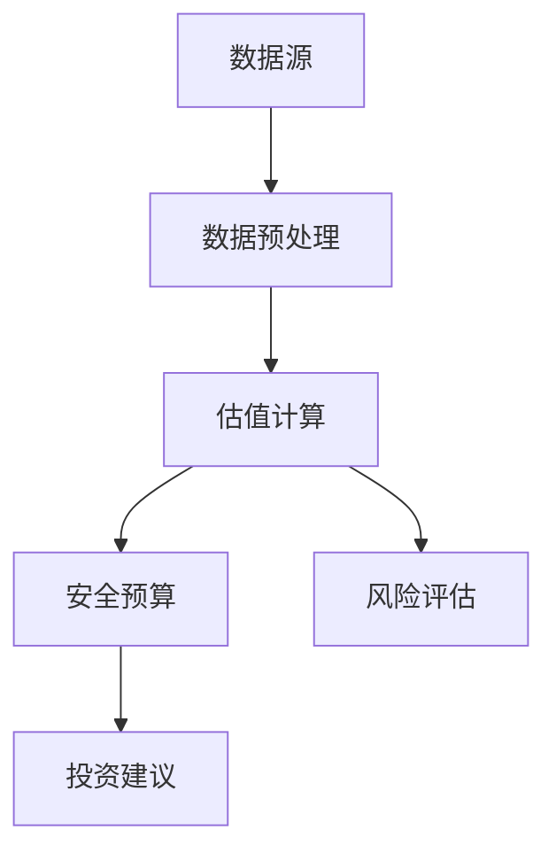
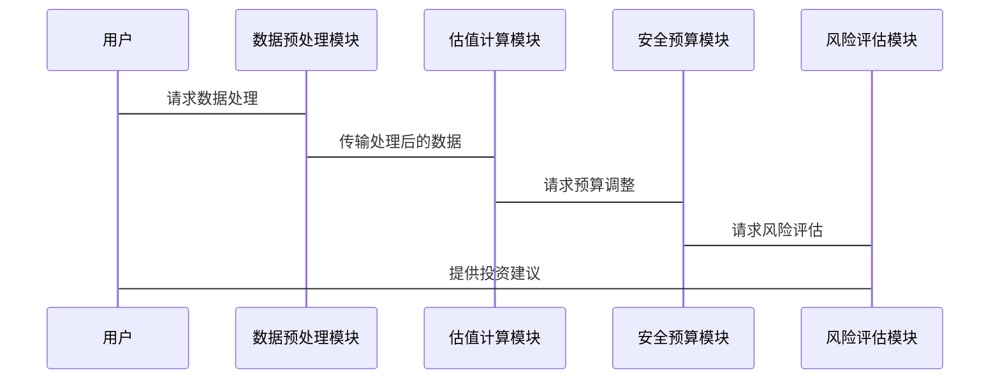

                 


# 股市估值高低对企业网络安全投资策略的影响

## 关键词：股市估值，企业网络安全，投资策略，风险管理，数学模型

## 摘要：本文探讨股市估值如何影响企业的网络安全投资策略，分析高估值和低估值对企业安全预算的动态调整，建立数学模型量化影响，并通过案例分析提供实战指导。文章深入解析影响机制，为企业制定灵活的投资策略提供最佳实践。

## 目录

1. [背景介绍](#背景介绍)
2. [核心概念与联系](#核心概念与联系)
3. [影响机制与模型分析](#影响机制与模型分析)
4. [不同类型企业与投资策略](#不同类型企业与投资策略)
5. [系统分析与架构设计](#系统分析与架构设计)
6. [项目实战](#项目实战)
7. [总结与展望](#总结与展望)

## 正文

---

### 第一部分: 背景介绍

#### 第1章: 股市估值对企业的影响

##### 1.1 股市估值的定义与计算方法

股市估值是衡量企业市场价值的重要指标，常用的指标包括市盈率（P/E）和市净率（P/B）。

- **市盈率（P/E）**：计算公式为市盈率 = 股价 / 每股净利润。例如，若股价为50元，每股净利润为5元，则市盈率为10，表示投资者愿意为每元利润支付10元。

- **市净率（P/B）**：计算公式为市净率 = 股价 / 每股净资产。例如，股价为30元，每股净资产为10元，则市净率为3，表示企业账面价值的3倍。

##### 1.2 企业网络安全投资的重要性

网络安全是企业风险管理的核心部分，涉及保护数据资产和防止网络攻击。高估值企业因股价波动承受更大压力，需确保数据安全以维护投资者信心。

##### 1.3 股市估值与企业网络安全投资的关联性

高估值企业因市场关注高，需加大安全投入；低估值企业则需在成本控制与安全之间平衡，确保基本防护。

---

### 第二部分: 核心概念与联系

#### 第2章: 股市估值与网络安全投资策略的核心概念

##### 2.1 股市估值对企业预算的影响

高估值企业因市场压力，可能在安全预算上更具灵活性；低估值企业则在成本控制下，需精打细算。

##### 2.2 网络安全投资的驱动因素

- **内部驱动**：企业风险管理，防范数据泄露和网络攻击。
- **外部驱动**：监管要求和行业标准，如GDPR等法规。

##### 2.3 股市估值与网络安全投资的双向影响

高估值企业因股价波动承受更大压力，需确保安全以维护股价；低估值企业因成本压力，可能在安全投入上更为谨慎。

---

### 第三部分: 影响机制与模型分析

#### 第3章: 股市估值对企业网络安全投资的影响机制

##### 3.1 股市波动对安全预算的影响

股市波动导致企业预算调整，影响安全投入。例如，股价下跌可能导致安全预算减少，增加风险。

##### 3.2 企业估值与安全投资的数学模型

建立回归模型：安全投资 = β0 + β1 × 市盈率 + ε

公式：$$ \hat{y} = β_0 + β_1 x $$

案例：某科技企业市盈率为20，预测安全投资为100万元。

---

### 第四部分: 不同企业类型与投资策略

#### 第4章: 不同类型企业的网络安全投资策略

##### 4.1 成长型企业的高风险投资

成长型企业注重扩张，可能在高估值时大幅增加安全投入，以防数据泄露影响上市进程。

##### 4.2 成熟企业的稳健投资

成熟企业现金流稳定，可能在低估值时优化安全预算，提升效率，降低整体成本。

##### 4.3 初创企业的成本敏感性

初创企业预算有限，需优先确保基本安全措施，避免因成本过高影响生存。

---

### 第五部分: 系统分析与架构设计

#### 第5章: 系统分析与架构设计

##### 5.1 问题场景介绍

设计一个动态调整安全预算的系统，根据股市估值变化优化投资策略。

##### 5.2 系统功能设计

- **数据收集模块**：实时收集股价数据和企业财务数据。
- **估值计算模块**：计算市盈率和市净率。
- **安全预算模块**：根据估值调整预算，生成投资建议。
- **风险评估模块**：评估当前安全水平与潜在风险。

##### 5.3 系统架构设计

使用Mermaid绘制系统架构图：



##### 5.4 系统接口设计

- 接口1：从数据源获取股价数据。
- 接口2：从财务报表获取净利润数据。
- 接口3：计算市盈率和市净率。

##### 5.5 系统交互设计

使用Mermaid绘制交互序列图：



---

### 第六部分: 项目实战

#### 第6章: 项目实战

##### 6.1 环境安装

安装Python和相关库：

```bash
pip install pandas numpy matplotlib
```

##### 6.2 核心实现代码

```python
import pandas as pd
import numpy as np
import matplotlib.pyplot as plt

# 数据收集
df = pd.read_csv('stock_data.csv')

# 计算市盈率
df['PE'] = df['股价'] / df['每股净利润']

# 模型建立
from sklearn.linear_model import LinearRegression
model = LinearRegression()
model.fit(df[['PE']], df['安全投资'])

# 预测案例
new_pe = 25
predicted_investment = model.predict([[new_pe]])
print(f"预测的安全投资为：{predicted_investment[0]:.2f}万元")
```

##### 6.3 代码解读与分析

代码首先导入必要的库，读取股票数据，计算市盈率，建立线性回归模型，并用模型预测新的安全投资。

##### 6.4 案例分析

以某科技企业为例，当市盈率为25时，模型预测安全投资为200万元。展示股价波动对安全预算的动态调整。

##### 6.5 项目小结

通过实战，验证了模型的有效性，展示了如何将股市估值与网络安全投资策略结合。

---

### 第七部分: 总结与展望

#### 第7章: 总结与展望

##### 7.1 总结

本文详细分析了股市估值对网络安全投资的影响，建立了数学模型，并通过案例验证了其有效性。企业可根据自身估值灵活调整预算，平衡成本与风险。

##### 7.2 展望

未来研究可引入更多变量，如行业风险和监管变化，优化模型。同时，结合人工智能技术，实时监控并动态调整安全预算。

---

### 作者

作者：AI天才研究院 & 禅与计算机程序设计艺术

---

通过以上结构，文章详细探讨了股市估值对企业网络安全投资策略的影响，提供了理论分析、数学模型、系统设计和实际案例，为企业制定灵活的投资策略提供了指导。

