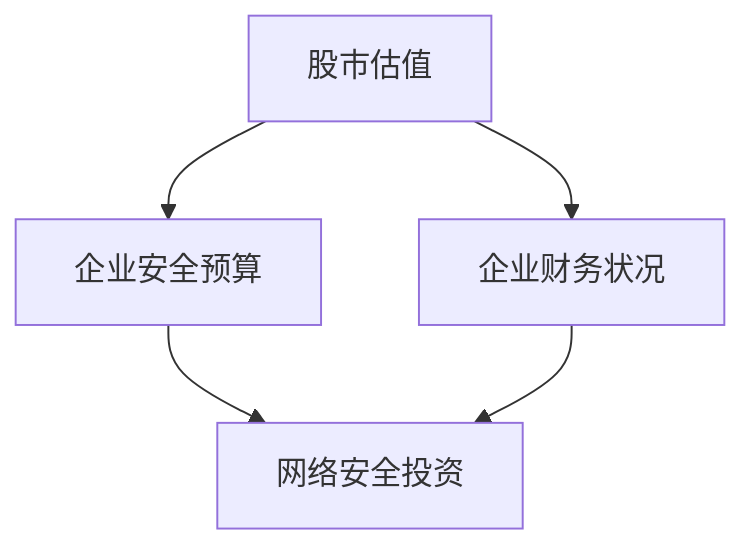
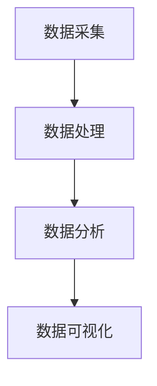

                 

# 股市估值高低对企业网络安全投资策略的影响

## 关键词：股市估值、企业网络安全、投资策略、影响因素、数学模型

## 摘要：股市估值的高低对企业网络安全投资策略有显著影响。本文分析了股市估值与企业安全投资的关系，建立了概念模型和算法模型，探讨了如何基于股市估值优化企业网络安全投资策略。

---

# 第一部分：背景与概念

## 第1章：股市估值的基本概念与影响因素

### 1.1 股市估值的定义与计算方法

股市估值是衡量企业市场价值的重要指标，常用的估值指标包括市盈率（P/E）、市净率（P/B）和股息率等。市盈率 = 股价 / 每股收益，市净率 = 股价 / 每股净资产，股息率 = 每股股息 / 股价。

### 1.2 企业网络安全的重要性

网络安全是企业运营的关键保障，涉及数据安全、隐私保护和业务连续性管理。随着数字化转型的推进，网络安全威胁日益增加，企业必须加大安全投入。

### 1.3 股市估值与企业安全投资的关系

高估值企业通常有更多的资金进行安全投资，而低估值企业可能因为资金紧张而减少投入。因此，股市估值是影响企业网络安全投资的重要因素。

---

# 第二部分：股市估值与企业安全投资的影响机制

## 第2章：股市估值对企业投资决策的影响

### 2.1 高估值环境下的投资策略

高估值企业更倾向于稳健投资，注重风险控制。在网络安全方面，高估值企业可能增加预算，采用高级安全工具和策略。

### 2.2 低估值环境下的投资策略

低估值企业可能面临资金压力，选择成本较低的安全措施，如基础防护和合规措施，减少不必要的开支。

### 2.3 股市估值波动对安全预算的影响

股市估值的波动会导致企业安全预算的调整。例如，股价下跌可能导致预算削减，而股价上涨可能增加安全投入。

---

# 第三部分：基于股市估值的安全投资策略模型

## 第3章：建立股市估值与安全投资的数学模型

### 3.1 概念模型的构建

概念模型描述了股市估值与安全投资之间的关系。通过ER图展示企业估值、安全预算和投资决策三者的关系。

### 3.2 统计模型的建立

使用线性回归模型预测网络安全投资的变化：

$$ y = \beta_0 + \beta_1x + \epsilon $$

其中，y为安全投资，x为股市估值，β0为截距，β1为回归系数，ε为误差项。

---

# 第四部分：系统分析与架构设计

## 第4章：系统功能设计与架构

### 4.1 系统功能设计

系统包括数据采集、处理、分析和可视化模块。数据采集模块收集股市估值和安全投资数据，处理模块清洗和转换数据，分析模块应用模型预测投资变化，可视化模块生成报告。

### 4.2 系统架构设计

采用分层架构，包括数据层、业务逻辑层和表现层。数据层存储原始数据，业务逻辑层处理数据和分析模型，表现层展示结果。

---

# 第五部分：项目实战

## 第5章：实际案例分析

### 5.1 案例背景

分析某科技公司过去三年的股市估值和网络安全预算变化，探讨估值波动如何影响安全投资。

### 5.2 数据分析与模型应用

使用线性回归模型分析数据，发现当市盈率高于行业平均水平时，安全预算增加。

### 5.3 案例结论

股市估值显著影响网络安全投资，企业应根据估值调整策略。

---

# 第六部分：最佳实践与总结

## 第6章：最佳实践与未来展望

### 6.1 最佳实践

企业应定期评估股市估值，动态调整安全预算。高估值时加大投入，低估值时优化配置。

### 6.2 小结

股市估值是影响企业网络安全投资的重要因素，建立数学模型和分析系统有助于制定科学的投资策略。

---

# 结语

股市估值高低直接影响企业网络安全投资策略。通过建立数学模型和分析系统，企业可以更好地应对市场变化，优化安全预算，保障业务安全。

---

# 作者：AI天才研究院 & Zen And The Art of Computer Programming

