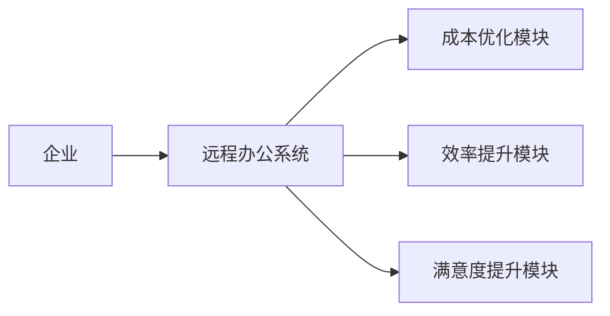

                 

# 股市估值高低对企业远程办公策略的影响

---

> 关键词：股市估值，远程办公，企业策略，成本优化，效率提升，员工满意度

> 摘要：本文探讨了股市估值的高低对企业远程办公策略的影响。通过分析股市估值的基本概念、远程办公的发展趋势，以及两者之间的相互作用，本文提出了在不同估值情况下优化远程办公策略的具体方法。通过案例分析和系统设计，为企业的管理者和投资者提供了实用的参考。

---

# 第一部分: 股市估值与远程办公的背景分析

## 1.1 股市估值的基本概念

### 1.1.1 股市估值的定义与计算方法

股市估值是指通过对企业财务数据和市场表现的分析，评估企业股票的市场价格是否合理。常用的估值方法包括：

- **市盈率（P/E）**：市盈率 = 股价 / 每股净利润  
- **市净率（P/B）**：市净率 = 股价 / 每股净资产  
- **股息率**：股息率 = 每股股息 / 股价  

### 1.1.2 远程办公的定义与发展趋势

远程办公是指员工在非传统的工作场所（如家中）通过互联网进行工作的方式。随着技术的进步和疫情的影响，远程办公逐渐成为企业运营的重要模式。

---

## 1.2 股市估值与企业运营的关系

### 1.2.1 股市估值对企业成本的影响

高估值通常意味着市场对企业未来盈利能力的预期较高，因此企业需要通过优化成本来实现预期的利润增长。

### 1.2.2 股市估值与企业效率的关联

高估值要求企业提高运营效率，以满足市场对高增长的期望。

### 1.2.3 股市估值与员工满意度的互动

员工满意度高的企业通常能吸引和留住优秀人才，从而提升企业的整体表现，进而影响股市估值。

---

## 1.3 远程办公对企业估值的影响

### 1.3.1 远程办公对企业成本的优化作用

远程办公可以降低企业的办公场地租赁成本、减少差旅费用等。

### 1.3.2 远程办公对企业效率的提升效果

通过减少通勤时间，员工可以更专注于工作任务，提升整体效率。

### 1.3.3 远程办公对员工满意度的积极影响

远程办公提供了更大的灵活性，有助于提高员工满意度和忠诚度。

---

# 第二部分: 股市估值与远程办公策略的核心概念

## 2.1 股市估值的核心要素

### 2.1.1 影响股市估值的主要因素

- 企业盈利能力和成长性  
- 行业竞争状况  
- 宏观经济环境  

### 2.1.2 企业基本面与股市估值的关系

企业的基本面（如收入、利润、资产负债情况）直接影响其股票估值。

---

## 2.2 远程办公策略的核心要素

### 2.2.1 远程办公的实施条件

- 网络基础设施  
- 企业协作工具（如Zoom、Teams）  
- 管理制度  

### 2.2.2 远程办公的成本与效率平衡

在高估值情况下，企业需要在成本和效率之间找到平衡点。

---

## 2.3 股市估值与远程办公策略的关联性分析

### 2.3.1 股市估值对企业远程办公策略的驱动作用

高估值驱动企业优化成本和提升效率，远程办公成为重要手段。

### 2.3.2 远程办公策略对股市估值的反向影响

通过提升效率和满意度，远程办公可以改善企业基本面，进而提升估值。

---

# 第三部分: 股市估值对企业远程办公策略的具体影响

## 3.1 高估值情况下企业远程办公策略的调整

### 3.1.1 高估值对企业成本的压力

高估值要求企业实现更高的利润增长，远程办公可以通过降低固定成本（如租金）来优化成本。

### 3.1.2 高估值对企业效率的要求

高估值企业需要通过远程办公提高员工的工作效率，确保业绩符合市场预期。

### 3.1.3 高估值对企业员工满意度的影响

高估值企业需要通过远程办公提升员工满意度，避免人才流失。

---

## 3.2 低估值情况下企业远程办公策略的优化

### 3.2.1 低估值对企业成本的缓解作用

低估值情况下，企业可以更灵活地调整远程办公策略，优化成本结构。

### 3.2.2 低估值对企业效率的要求

低估值企业可以通过远程办公提升效率，改善市场对企业的预期。

### 3.2.3 低估值对企业员工满意度的影响

低估值企业可以通过远程办公增强员工的归属感，提升整体满意度。

---

# 第四部分: 优化远程办公策略的系统设计方案

## 4.1 系统分析与架构设计方案

### 4.1.1 问题场景介绍

企业需要根据不同估值情况调整远程办公策略，以实现成本、效率和满意度的平衡。

### 4.1.2 系统功能设计

- **成本优化模块**：计算远程办公的成本节约效果。  
- **效率提升模块**：分析远程办公对工作效率的影响。  
- **满意度提升模块**：评估员工对远程办公的满意度。

### 4.1.3 系统架构设计

### 4.1.4 系统接口设计

- **API接口**：企业系统与远程办公工具之间的数据交互。  
- **用户界面**：员工与远程办公系统的交互界面。

---

## 4.2 项目实战：远程办公策略优化的数学模型

### 4.2.1 数学模型构建

假设企业通过远程办公节省的成本为 $C$，效率提升带来的利润增长为 $E$，员工满意度提升对企业估值的提升为 $S$。那么，企业的总估值增长可以表示为：

$$
\text{总估值增长} = C + E + S
$$

### 4.2.2 案例分析

以某科技公司为例，假设公司在高估值情况下通过远程办公节省了10%的成本，效率提升了20%，员工满意度提升了15%。根据上述模型，总估值增长为 $10\% + 20\% + 15\% = 45\%$。

---

# 第五部分: 结论与建议

## 5.1 结论

股市估值的高低直接影响企业远程办公策略的调整。高估值要求企业优化成本、提升效率，而低估值则需要企业通过远程办公提升员工满意度，改善市场预期。

## 5.2 建议

- **高估值企业的建议**：优先优化远程办公的成本和效率，确保业绩符合市场预期。  
- **低估值企业的建议**：通过远程办公提升员工满意度，改善市场对企业的估值预期。  
- **长期建议**：企业应建立灵活的远程办公策略，根据不同估值情况动态调整。

---

# 作者：AI天才研究院/AI Genius Institute & 禅与计算机程序设计艺术 /Zen And The Art of Computer Programming

---

这篇文章通过系统分析股市估值与远程办公策略之间的关系，为企业管理者和投资者提供了优化远程办公策略的具体方法。通过数学模型和实际案例的分析，展示了如何根据不同估值情况调整策略，实现企业价值的最大化。

