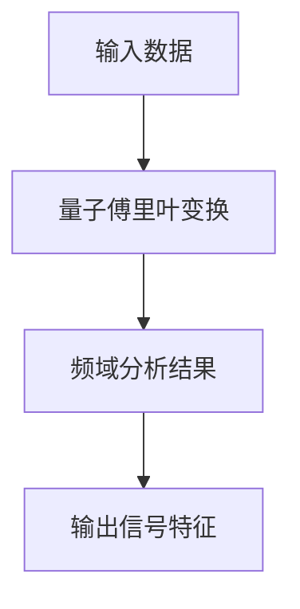
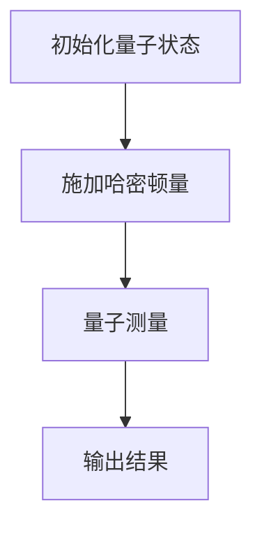
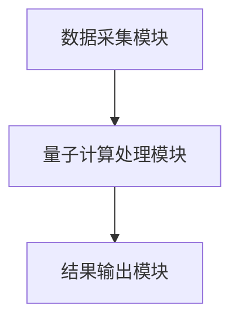

                 


# 股市估值高低对企业量子计算投资的影响

---

## 关键词：股市估值，量子计算，投资影响，金融算法，技术应用

---

## 摘要：  
本文探讨了量子计算技术对企业在股市投资中的潜在影响，特别是如何通过量子计算优化股市估值模型和投资策略。文章从量子计算的基本原理出发，分析其在金融领域的应用场景，结合实际案例，揭示量子计算如何改变传统股市估值方法，并为企业投资决策提供新的视角。

---

## 正文

### 第一部分：股市估值与量子计算的背景介绍

#### 第1章：股市估值的基本概念

##### 1.1 股市估值的定义  
股市估值是指通过对企业的财务数据、市场环境和行业趋势等多方面因素的分析，估算企业股票的内在价值。传统估值方法包括市盈率（P/E）、市净率（P/B）和现金流折现法（DCF）等。

##### 1.2 量子计算的基本概念  
量子计算是一种基于量子力学原理的计算方式，利用量子叠加和量子纠缠等特性，能够在某些特定问题上远超经典计算机的计算能力。

##### 1.3 股市估值与量子计算的关联  
随着量子计算技术的发展，其在金融领域的应用潜力逐渐显现。量子计算可以通过优化算法和模拟复杂系统，显著提升股市估值的准确性和效率。

---

### 第二部分：量子计算在股市估值中的应用

#### 第2章：量子计算在金融领域的核心算法

##### 2.1 量子傅里叶变换  
量子傅里叶变换（QFT）是一种量子算法，能够高效地对金融时间序列数据进行频域分析，帮助发现隐藏的周期性模式。



##### 2.2 量子线性系统算法  
量子线性系统算法（QLS）可以用来求解大型线性方程组，应用于股票价格预测和投资组合优化。

##### 2.3 量子优化算法  
量子优化算法（QAOA）通过模拟量子退火过程，能够在复杂的投资组合优化问题中找到全局最优解。

---

#### 第3章：量子计算对股市投资的潜在影响

##### 3.1 投资组合优化  
通过量子计算，投资者可以优化投资组合的配置，降低风险并提高收益。

##### 3.2 风险评估  
量子计算能够更精确地模拟市场波动，帮助投资者更好地识别和管理投资风险。

##### 3.3 市场预测  
量子计算可以利用历史数据和量子算法，提高对股市趋势的预测能力。

---

### 第三部分：量子计算在股市估值中的算法实现

#### 第4章：量子计算算法的数学模型与实现

##### 4.1 量子傅里叶变换的数学模型  
量子傅里叶变换的数学公式如下：

$$
QFT: |x\rangle \rightarrow \frac{1}{\sqrt{2^n}} \sum_{y=0}^{2^n-1} e^{2\pi i xy/2^n} |y\rangle
$$

##### 4.2 量子线性系统算法的实现  
量子线性系统算法的步骤如下：



##### 4.3 投资组合优化的Python实现  

```python
from qiskit import QuantumCircuit, execute, Aer
from qiskit.finance.applications import PortfolioOptimization

# 定义问题参数
n_assets = 3
mu = [0.1, 0.2, 0.15]  # 预期收益率
sigma = [0.1, 0.2, 0.15]  # 风险
risk_factors = 1  # 风险因子

# 创建投资组合优化电路
qc = PortfolioOptimization(n_assets, mu, sigma, risk_factors).get_optimal_portfolio()

# 模拟量子计算
simulator = Aer.get_backend('qasm_simulator')
job = execute(qc, simulator)
result = job.result()

# 解释结果
print("最优投资组合：", result.get_counts())
```

---

### 第四部分：量子计算在股市估值中的系统分析

#### 第5章：系统分析与架构设计

##### 5.1 系统功能设计  
系统功能模块包括数据采集、量子计算处理和结果输出。



##### 5.2 系统架构设计  
系统架构采用分层设计，包括数据层、计算层和应用层。

---

### 第五部分：项目实战

#### 第6章：量子计算在股市投资中的实际应用

##### 6.1 环境安装  
安装必要的Python库：

```bash
pip install qiskit numpy matplotlib
```

##### 6.2 核心代码实现  

```python
import numpy as np
from qiskit import QuantumCircuit

# 定义量子算法
def quantum_algorithm(data):
    qc = QuantumCircuit(len(data))
    # 实现量子叠加
    qc.h(range(len(data)))
    # 实施量子相位叠加
    for i in range(len(data)):
        qc.p(2 * np.pi * i / len(data), i)
    qc.sdg(i)
    qc.barrier()
    qc.measure(i)
    return qc

# 执行量子计算
def main():
    data = [1, 2, 3, 4]
    qc = quantum_algorithm(data)
    print(qc)
```

---

### 第六部分：最佳实践与总结

#### 第7章：最佳实践与小结

##### 7.1 小结  
量子计算在股市估值中的应用前景广阔，但目前仍处于早期阶段，需要进一步的技术突破和实际验证。

##### 7.2 注意事项  
在实际应用中，应关注量子计算的硬件限制和算法优化问题。

##### 7.3 拓展阅读  
建议进一步阅读量子计算在金融领域的最新研究论文和应用案例。

---

## 作者：AI天才研究院/AI Genius Institute & 禅与计算机程序设计艺术 /Zen And The Art of Computer Programming

