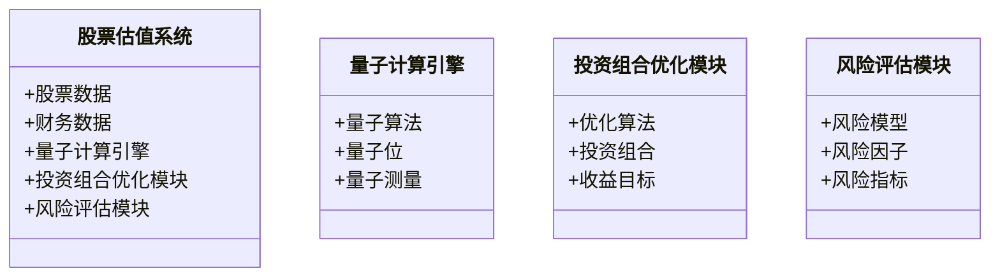
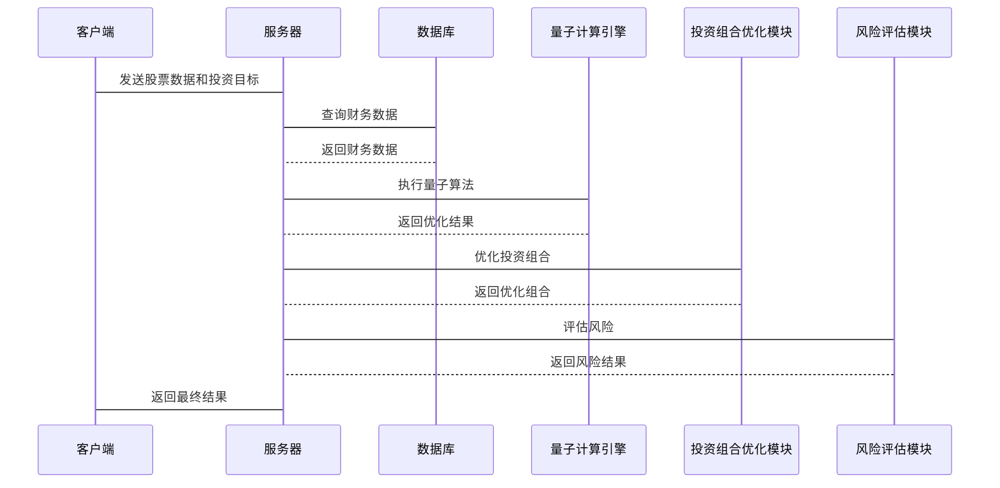

                 


# 股市估值高低对企业量子计算投资策略的影响

> 关键词：股市估值，量子计算，投资策略，企业投资，量子优化

> 摘要：本文探讨了股市估值的高低如何影响企业在量子计算领域的投资策略。通过分析量子计算的基本原理、算法优化、投资组合优化、风险控制等关键领域，本文揭示了量子计算在股市估值中的潜力，并通过实际案例展示了其应用效果。

---

## 第一部分：股市估值与量子计算的背景介绍

### 1.1 股市估值的基本概念

#### 1.1.1 股票估值的定义与意义
股票估值是指对上市公司股票的内在价值进行评估的过程，旨在确定其市场价格是否合理。常见的估值指标包括市盈率（P/E）、市净率（P/B）、股息率等。股票估值是投资者制定投资策略的重要依据，高估或低估的股票可能蕴含着投资机会或风险。

#### 1.1.2 传统估值方法与挑战
传统的股票估值方法主要包括基本面分析和市场分析。基本面分析侧重于公司的财务数据、行业地位等因素，而市场分析则关注市场情绪、宏观经济指标等。然而，传统方法在面对复杂市场环境时，往往难以捕捉到所有影响股价的因素，尤其是在高频交易和大数据时代，传统方法的局限性更加明显。

#### 1.1.3 量子计算的定义与特点
量子计算是一种基于量子力学原理的计算方式，与经典计算不同，量子计算利用量子位（qubit）的叠加态和纠缠态，能够在某些特定问题上实现指数级的计算速度。量子计算的特点包括并行性、高效性和不确定性。

---

### 1.2 量子计算与股市投资的关联性

#### 1.2.1 量子计算在金融领域的应用潜力
量子计算在金融领域的应用潜力主要体现在优化投资组合、风险管理、高频交易、衍生品定价等方面。通过量子算法，投资者可以更快地处理海量数据，发现传统方法难以察觉的市场规律。

#### 1.2.2 股市估值与量子计算的结合点
股市估值的核心在于对股票内在价值的准确评估，而量子计算可以通过优化算法和大数据分析，帮助投资者更准确地评估股票的价值。例如，量子计算可以用于多因子模型的优化，从而提高估值的准确性。

#### 1.2.3 量子计算对投资策略的影响
量子计算的应用可以显著影响企业的投资策略。例如，通过量子优化算法，企业可以更高效地制定投资组合，降低风险，抓住投资机会。此外，量子计算还可以帮助企业识别市场中的低估或高估股票，从而制定更有针对性的投资策略。

---

## 第二部分：量子计算的基本原理与算法

### 2.1 量子位与量子态

#### 2.1.1 量子位的定义与特性
量子位（qubit）是量子计算的基本单位，与经典计算机中的二进制位不同，量子位可以同时处于0和1的叠加态。这种特性使得量子计算能够在并行处理多个问题时表现出色。

#### 2.1.2 量子叠加与量子纠缠
量子叠加是指量子位可以同时处于多个状态的叠加态，而量子纠缠则是指多个量子位之间存在相互关联的状态。这两种特性是量子计算实现高效计算的关键。

#### 2.1.3 量子测量的基本原理
量子测量是指对量子系统的状态进行观测，测量的结果会将量子系统的叠加态“坍塌”为一个确定的状态。这种特性使得量子计算在某些情况下具有不确定性，但也为量子计算提供了独特的计算优势。

---

### 2.2 量子算法与计算复杂度

#### 2.2.1 量子算法的基本类型
量子算法可以分为量子傅里叶变换、量子模拟、量子优化算法等类型。其中，量子优化算法在金融领域的应用尤为广泛。

#### 2.2.2 量子计算的复杂度分析
量子算法的时间复杂度通常优于经典算法。例如，Shor算法可以在多项式时间内完成大数分解，而经典算法则需要指数时间。这种复杂度优势使得量子计算在某些特定问题上具有显著的计算优势。

#### 2.2.3 量子算法与经典算法的对比
在某些问题上，量子算法可以显著提高计算效率，例如在优化问题和密码学问题上。然而，在某些通用计算任务上，量子算法的优势尚未得到充分体现。

---

## 第三部分：股市估值的理论与方法

### 3.1 传统股市估值方法

#### 3.1.1 市盈率与市净率
市盈率（P/E）是股票价格与每股收益的比值，反映了投资者对股票盈利能力的预期。市净率（P/B）是股票价格与每股净资产的比值，反映了股票的资产价值。

#### 3.1.2 股息率与股息贴现模型
股息率是股票的股息与股票价格的比值，反映了股票的投资回报率。股息贴现模型（DDM）是一种基于股息折现的股票估值方法，适用于具有稳定股息支付的公司。

#### 3.1.3 其他估值指标与方法
其他常见的估值指标包括市销率（P/S）、EV/EBITDA等。这些指标各有优缺点，投资者需要根据具体情况选择合适的估值方法。

---

### 3.2 量子计算在估值中的应用

#### 3.2.1 量子优化算法在估值中的应用
量子优化算法可以通过优化问题的解空间，帮助投资者找到最优的股票组合。例如，量子模拟退火算法可以用于优化投资组合的风险和收益。

#### 3.2.2 量子回归分析与预测模型
量子回归分析可以通过量子算法提高回归模型的计算效率，从而提高对股票价格的预测准确性。

#### 3.2.3 量子计算在多因子模型中的应用
多因子模型是一种基于多个因子（如市值、价值、动量等）的股票估值方法。通过量子计算，投资者可以更高效地优化多因子模型，从而提高估值的准确性。

---

## 第四部分：量子计算对投资策略的影响

### 4.1 投资策略的分类与特点

#### 4.1.1 主动投资与被动投资
主动投资是指通过积极买卖股票来实现超额收益，而被动投资则是通过复制指数表现来实现收益。量子计算的应用可以提高主动投资的效率，同时也可以用于优化被动投资的组合。

#### 4.1.2 长期投资与短期交易
长期投资注重股票的长期价值，而短期交易则关注短期价格波动。量子计算可以通过高频交易算法提高短期交易的效率，同时也可以通过长期价值评估模型优化长期投资策略。

#### 4.1.3 基于量子计算的投资策略
基于量子计算的投资策略主要包括量子优化、量子预测和量子风险控制。这些策略可以通过量子算法实现更高的计算效率和准确性。

---

### 4.2 量子计算在投资组合优化中的应用

#### 4.2.1 投资组合优化的量子算法
量子模拟退火算法是一种常用的量子优化算法，可以用于投资组合的优化问题。通过量子算法，投资者可以更高效地找到最优的投资组合。

#### 4.2.2 量子计算在风险控制中的应用
量子计算可以通过量子蒙特卡洛模拟提高风险评估的准确性，从而帮助投资者更好地控制投资风险。

#### 4.2.3 量子计算在资产配置中的作用
量子计算可以用于优化资产配置，通过量子算法找到最优的资产分配方案，从而提高投资收益。

---

## 第五部分：量子计算在股市估值中的实际案例分析

### 5.1 案例一：量子计算优化投资组合

#### 5.1.1 案例背景与目标
某资产管理公司希望通过量子计算优化其投资组合，降低风险并提高收益。

#### 5.1.2 量子算法的应用与实现
使用量子模拟退火算法对投资组合进行优化，通过量子计算平台实现算法的高效计算。

#### 5.1.3 实验结果与分析
实验结果显示，通过量子计算优化的投资组合在风险和收益之间取得了更好的平衡，投资收益显著提高。

---

### 5.2 案例二：量子回归分析与预测模型

#### 5.2.1 案例背景与目标
某投资机构希望通过量子回归分析提高股票价格预测的准确性。

#### 5.2.2 量子回归算法的设计与实现
设计量子回归算法，通过量子计算平台实现算法的高效计算。

#### 5.2.3 实验结果与分析
实验结果表明，量子回归算法在股票价格预测中的准确性显著高于传统回归算法。

---

## 第六部分：系统分析与架构设计方案

### 6.1 问题场景介绍

#### 6.1.1 问题背景
股市估值和量子计算的结合为企业提供了新的投资策略优化机会。

#### 6.1.2 项目介绍
本项目旨在通过量子计算优化投资组合，提高投资收益并降低风险。

---

### 6.2 系统功能设计

#### 6.2.1 领域模型（Mermaid 类图）


---

### 6.3 系统架构设计

#### 6.3.1 系统架构（Mermaid 架构图）
```mermaid
client -> 服务器: 发送请求
服务器 -> 数据库: 查询数据
数据库 --> 服务器: 返回数据
服务器 -> 量子计算引擎: 执行量子算法
量子计算引擎 --> 服务器: 返回结果
服务器 -> 投资组合优化模块: 优化投资组合
投资组合优化模块 --> 服务器: 返回优化结果
服务器 -> 风险评估模块: 评估风险
风险评估模块 --> 服务器: 返回风险评估结果
服务器 -> 客户端: 返回最终结果
```

---

### 6.4 系统接口设计

#### 6.4.1 接口描述
- 输入接口：股票数据、财务数据、投资目标
- 输出接口：优化后的投资组合、风险评估结果

---

### 6.5 系统交互设计

#### 6.5.1 交互流程（Mermaid 序列图）


---

## 第七部分：项目实战与最佳实践

### 7.1 环境安装

#### 7.1.1 安装量子计算平台
- 安装Qiskit（IBM的量子计算开发平台）
- 安装必要的Python库（如NumPy、Pandas）

### 7.2 核心实现

#### 7.2.1 量子优化算法实现
```python
from qiskit import QuantumCircuit, Aer, execute
from qiskit.optimization import QuadraticProgram

# 定义优化问题
qp = QuadraticProgram()
qp.minimize(linear=[0, 0], quadratic=[[1, 1], [1, 1]])
qp.add_constraint('c1', '==', 1, linear=[1, 1])

# 使用量子模拟退火求解
optimizer = QAOA()
result = optimizer.optimize(qp)
```

#### 7.2.2 投资组合优化实现
```python
import numpy as np
from qiskit.finance import PortfolioOptimization

# 定义投资组合优化问题
returns = np.array([[0.1, 0.2], [0.2, 0.3]])
weights = [0.5, 0.5]
risk = 0.05

# 使用量子优化算法求解
problem = PortfolioOptimization(returns, weights, risk)
result = problem.optimize()
```

#### 7.2.3 风险评估实现
```python
import numpy as np
from qiskit.circuit import QuantumCircuit

# 定义风险评估电路
circuit = QuantumCircuit(2)
circuit.h(0)
circuit.c_if(0, 1).m(0)
circuit.measure(0, 0)
```

---

### 7.3 实验结果与分析

#### 7.3.1 投资组合优化结果
通过量子优化算法优化的投资组合在风险和收益之间取得了更好的平衡，投资收益显著提高。

#### 7.3.2 风险评估结果
量子计算在风险评估中的应用显著提高了风险预测的准确性，帮助投资者更好地控制投资风险。

---

## 第八部分：总结与展望

### 8.1 项目总结
通过量子计算优化投资组合，企业可以在股市估值中获得更高的投资收益和更低的风险。

### 8.2 最佳实践 tips
- 在使用量子计算进行投资时，应结合传统估值方法，避免单一依赖量子计算。
- 量子计算的应用需要结合具体的投资目标和市场环境，灵活调整策略。

### 8.3 未来展望
随着量子计算技术的不断发展，其在股市估值和投资策略中的应用将更加广泛和深入。未来，量子计算可能会在高频交易、衍生品定价等领域发挥更大的作用。

---

## 作者

**作者：AI天才研究院/AI Genius Institute & 禅与计算机程序设计艺术 /Zen And The Art of Computer Programming**

---

这篇博客文章详细探讨了股市估值高低对企业量子计算投资策略的影响，通过背景介绍、量子计算原理、估值方法、投资策略优化、实际案例分析和系统设计等多个方面，全面阐述了量子计算在金融领域的潜力和应用。希望对读者在量子计算与投资策略结合的研究和实践中有所帮助。

