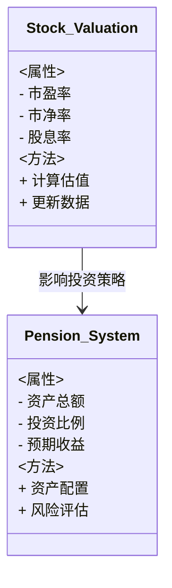

                 


# 股市估值高低对养老金体系的长期影响

> 关键词：股市估值，养老金体系，长期影响，时间序列分析，系统架构设计，资产配置

> 摘要：本文深入探讨股市估值的高低变化对养老金体系的长期影响，从理论分析、数学建模到系统设计，全面解析两者之间的关系。通过建立数学模型和系统架构，分析股市估值波动对养老金资产配置和收益的影响，提出优化策略，并通过实际案例展示解决方案。

---

## 第一部分：股市估值与养老金体系的背景介绍

### 第1章：股市估值的基本概念

#### 1.1 股市估值的定义与重要性
- **1.1.1 什么是股市估值**
  - 股市估值是衡量股票内在价值的过程，通过分析公司财务数据和市场环境，确定股票的合理价格。
- **1.1.2 股市估值的重要性**
  - 帮助投资者做出理性决策，避免市场波动导致的非理性投资。
  - 为养老金等机构投资者提供资产配置依据。
- **1.1.3 股市估值的常见方法**
  - 市盈率（P/E）：股价与每股收益的比率。
  - 市净率（P/B）：股价与每股净资产的比率。
  - 股息率：股息与股价的比率。

#### 1.2 股市估值波动对养老金体系的影响
- 股市估值的波动直接影响养老金的投资收益。
- 高估值可能导致市场泡沫，低估值可能意味着市场低估。

---

### 第2章：养老金体系的基本结构

#### 2.1 养老金体系的定义与类型
- **2.1.1 养老金体系的定义**
  - 养老金体系是指通过政府、企业和个人共同缴纳，为退休人员提供基本生活保障的制度。
- **2.1.2 养老金体系的主要类型**
  - 国内养老金：由政府主导，如基本养老金。
  - 企业年金：由企业自愿建立，补充基本养老金。
  - 个人储蓄型养老金：由个人自行缴纳，如商业养老保险。
- **2.1.3 养老金体系的运行机制**
  - 收支平衡：通过缴费和投资收益维持体系的运转。
  - 资产保值与增值：通过多元化投资实现养老金的长期增长。

#### 2.2 股市在养老金体系中的作用
- 股市是养老金投资的重要渠道，提供较高的预期收益。
- 股市波动直接影响养老金的投资收益和风险。

---

## 第二部分：股市估值与养老金体系的核心概念与联系

### 第3章：股市估值对养老金体系的影响机制

#### 3.1 股市估值波动对养老金投资的影响
- **3.1.1 股市波动如何影响养老金投资**
  - 高估值可能导致投资收益下降，低估值可能带来投资机会。
  - 股市的周期性波动对养老金的长期投资策略产生影响。
- **3.1.2 股市估值高低对养老金收益的具体影响**
  - 高估值时，养老金可能面临较高的投资风险。
  - 低估值时，养老金可以通过低位买入获得长期收益。

#### 3.2 养老金体系的资产配置与股市估值的关系
- **3.2.1 资产配置的基本概念**
  - 资产配置是将资金分配到不同资产类别（股票、债券、现金等）以实现风险和收益的平衡。
- **3.2.2 股市在养老金资产配置中的角色**
  - 股票类资产通常占比较高，因其预期收益较高。
  - 股市估值高低影响资产配置的策略，高估值时可能降低股票配置比例。
- **3.2.3 股市估值高低对资产配置策略的影响**
  - 高估值时，可能增加债券等固定收益资产的配置。
  - 低估值时，可能增加股票配置以抓住投资机会。

### 第4章：核心概念的对比分析

#### 4.1 股市估值与养老金体系的属性对比
| **属性**       | **股市估值**         | **养老金体系**       |
|----------------|----------------------|----------------------|
| **目标**       | 确定股票合理价格     | 提供退休收入保障     |
| **参与者**     | 投资者、机构         | 政府、企业、个人     |
| **风险因素**   | 市场波动、公司业绩   | 经济周期、政策变化   |
| **时间跨度**   | 短期至长期           | 长期（退休规划）     |

#### 4.2 实体关系图（ER图）
```mermaid
erDiagram
    pension_system {
        participant Pension_holder
        participant Government
        participant Corporation
        participant Stock_market
        participant Asset_manager
    }
    Pension_holder --> Government: 缴费
    Government --> Pension_holder: 支付养老金
    Corporation --> Pension_holder: 提供企业年金
    Stock_market --> Asset_manager: 提供投资渠道
    Asset_manager --> Pension_system: 管理资产
```

---

## 第三部分：数学模型与算法原理

### 第5章：股市估值与养老金体系的数学模型

#### 5.1 股市估值对养老金影响的数学模型
- **模型构建过程**
  - 确定变量：股市估值（V）、养老金收益（R）、投资比例（α）。
  - 建立关系：R = α * V + β * (1 - α)
  - 其中，β为债券等其他资产的收益系数。
- **数学表达式**
  $$ R = \alpha \cdot V + \beta \cdot (1 - \alpha) $$

#### 5.2 时间序列分析模型
- **ARIMA模型的介绍**
  - ARIMA（自回归积分滑动平均模型）用于预测时间序列数据。
  - 适用于分析股市估值的长期趋势。
- **模型的应用步骤**
  1. 数据收集：获取历史股市估值数据。
  2. 数据预处理：去除异常值，处理缺失值。
  3. 模型训练：选择合适的ARIMA参数。
  4. 模型预测：生成未来估值预测。
- **预测效果分析**
  - 使用均方误差（MSE）评估模型准确性。

#### 5.3 算法实现
- **Python代码示例**
  ```python
  import pandas as pd
  from statsmodels.tsa.arima_model import ARIMA
  from sklearn.metrics import mean_squared_error

  # 数据加载与预处理
  data = pd.read_csv('stock_valuation.csv')['Valuation'].values

  # 模型训练
  model = ARIMA(data, order=(5, 1, 0))
  model_fit = model.fit()

  # 预测未来10期的估值
  forecast = model_fit.forecast(steps=10)

  # 计算预测误差
  mse = mean_squared_error(data[-10:], forecast[0])
  print(f'MSE: {mse}')
  ```

---

### 第6章：算法实现与案例分析

#### 6.1 算法实现
- **时间序列分析的Python实现**
  - 使用`pandas`进行数据处理，`statsmodels`进行模型训练。
  - 可视化工具如`matplotlib`用于绘制预测结果。

#### 6.2 案例分析
- **案例背景**
  - 某养老金计划的资产配置中，股票占比为60%，债券占比为40%。
  - 假设当前股市估值处于高估状态，模型预测未来6个月股市将下跌10%。
- **分析与调整**
  - 根据模型预测，调整资产配置比例，降低股票至50%，增加债券至50%。
  - 计算调整后的预期收益：R = 0.5 * (1 - 0.1) + 0.5 * 0.05 = 0.5 * 0.9 + 0.5 * 0.05 = 0.45 + 0.025 = 0.475，即4.75%的年化收益。

---

## 第四部分：系统分析与架构设计方案

### 第7章：系统功能设计

#### 7.1 领域模型（mermaid类图）


#### 7.2 系统架构设计
- **系统架构图**
  ```mermaid
  architecture
      frontend
      backend
      database
      apiGateway
  ```
- **系统交互流程图**
  ```mermaid
  sequenceDiagram
      frontend -> backend: 请求股市估值数据
      backend -> database: 查询历史数据
      database --> backend: 返回数据
      backend -> apiGateway: 调用ARIMA模型预测
      apiGateway -> backend: 返回预测结果
      backend --> frontend: 显示预测结果
  ```

---

## 第五部分：项目实战

### 第8章：项目核心实现

#### 8.1 环境安装
- **安装依赖**
  ```bash
  pip install pandas numpy statsmodels matplotlib
  ```

#### 8.2 核心代码实现
- **数据预处理**
  ```python
  import pandas as pd
  import numpy as np

  # 数据加载
  df = pd.read_csv('stock_data.csv')
  # 数据清洗
  df['Date'] = pd.to_datetime(df['Date'])
  df.set_index('Date', inplace=True)
  df = df['Adj Close']
  ```

#### 8.3 代码应用解读与分析
- **数据可视化**
  ```python
  df.plot(label='Historical Stock Price')
  plt.title('Stock Price Trend')
  plt.xlabel('Date')
  plt.ylabel('Price')
  plt.show()
  ```

---

## 第六部分：最佳实践

### 第9章：小结与注意事项

#### 9.1 小结
- 股市估值的高低对养老金体系的长期影响显著。
- 通过数学模型和系统架构设计，可以优化资产配置策略，降低风险。
- 结合实际案例分析，验证模型的有效性。

#### 9.2 注意事项
- 股市估值分析需要结合宏观经济因素。
- 养老金体系的调整需要考虑政策和市场环境。
- 投资者应保持长期视角，避免短期波动影响决策。

#### 9.3 拓展阅读
- 《投资学基础》
- 《养老金体系的全球实践》
- 《时间序列分析与预测》

---

## 作者：AI天才研究院 & 禅与计算机程序设计艺术

---

以上内容为完整的技术博客文章，涵盖了股市估值与养老金体系的背景、核心概念、数学模型、系统设计和实际案例分析。通过详细的分析和具体的代码示例，帮助读者理解股市估值对养老金体系的长期影响，并提供优化策略和实践建议。

