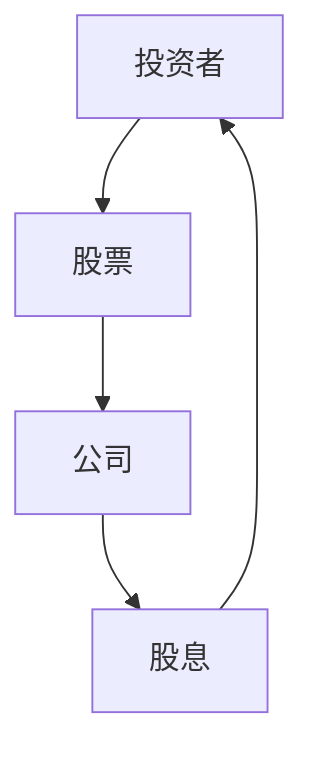
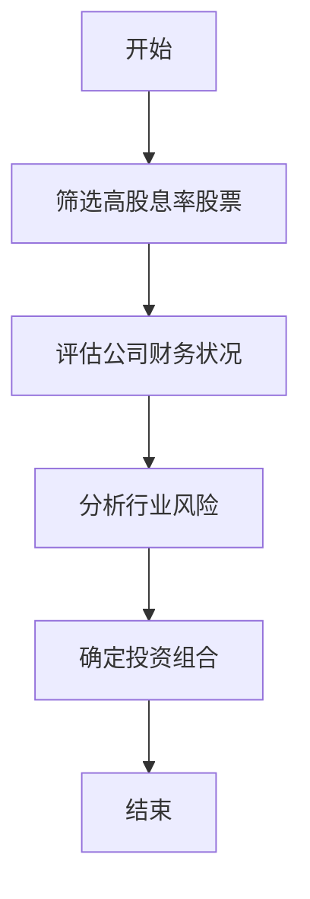
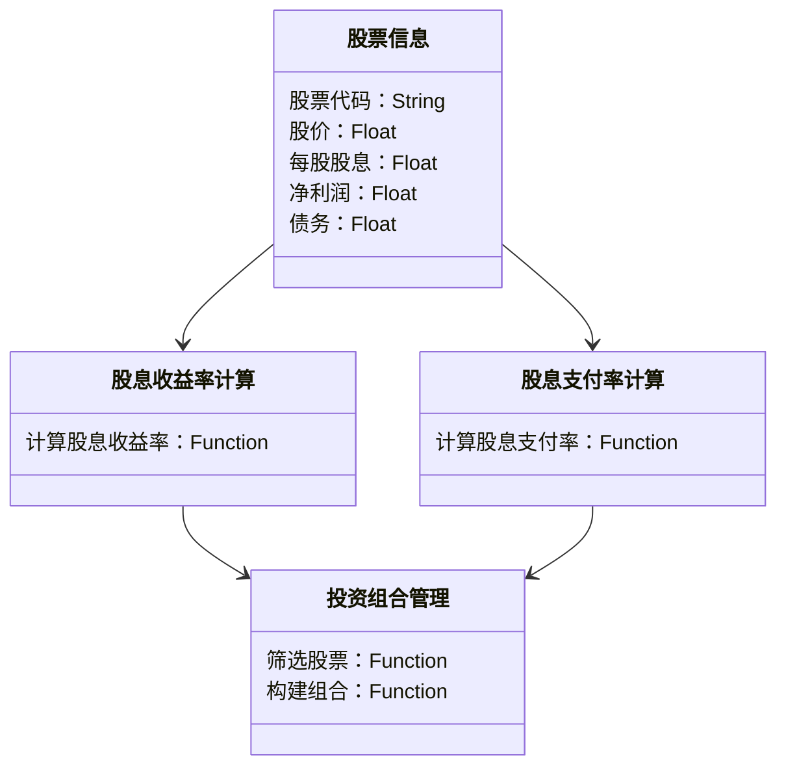
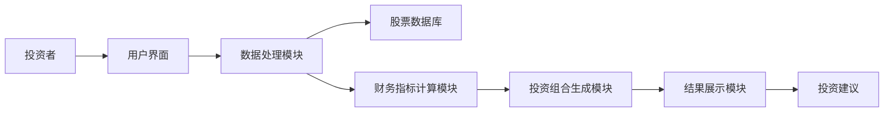

                 


# 股息投资策略：在动荡市场中获得稳定收入

## 关键词：股息投资，稳定收入，市场波动，风险管理，股息收益率，投资策略

## 摘要：股息投资是一种通过获取公司股息收入来实现稳定收益的投资策略。本文详细探讨了股息投资的核心概念、策略选择、风险管理方法，并通过实际案例分析了如何在动荡市场中构建高效的股息投资组合。文章还结合技术分析方法，为投资者提供了一套系统化的股息投资解决方案，帮助投资者在复杂多变的市场环境中实现稳健收益。

---

## 第一部分：股息投资策略的基础

### 第1章：股息投资策略概述

#### 1.1 股息投资的基本概念

##### 1.1.1 股息的定义与来源
股息是公司向股东分配的利润部分，通常以现金或股票形式发放。股息来源于公司的净利润，是股东投资回报的重要组成部分。股息的分配比例由董事会决定，通常以每股股息（Dividend per share, DPS）的形式呈现。

##### 1.1.2 股息投资的历史发展
股息投资的起源可以追溯到股份制企业的兴起。随着资本主义经济的发展，股息投资逐渐成为一种重要的投资方式。20世纪初，股息投资理论开始系统化，出现了基于股息增长模型的投资策略。近年来，随着金融市场的复杂化，股息投资策略进一步精细化，与风险管理、技术分析等结合，形成了多样化的投资方法。

##### 1.1.3 股息投资的核心要素
股息投资的核心要素包括：
1. **股息收益率（Dividend Yield）**：衡量股息收入与股价的比率。
2. **股息增长能力**：公司是否能够持续提高股息支付水平。
3. **公司财务健康状况**：包括盈利能力、现金流状况和债务水平等。
4. **行业风险**：不同行业股息支付能力的差异性。
5. **市场环境**：宏观经济环境和市场波动对股息投资的影响。

#### 1.2 股息投资的重要性

##### 1.2.1 股息作为稳定收入的来源
股息投资的主要目的是通过稳定的股息收入实现财富积累。与资本增值相比，股息收入具有较高的可预测性，尤其在经济衰退或市场波动时，股息收入仍能为投资者提供一定的安全感。

##### 1.2.2 股息在投资组合中的作用
股息投资可以帮助投资者在资产配置中分散风险，降低整体投资组合的波动性。股息收入还可以用于再投资，形成复利效应，从而提高长期回报率。

##### 1.2.3 股息与资产配置的关系
股息投资是资产配置的重要组成部分。通过合理配置股息收益资产，投资者可以在不同市场环境下保持投资组合的稳定性，同时抓住市场波动带来的投资机会。

---

### 第2章：股息投资的背景与环境

#### 2.1 当前市场环境对股息投资的影响

##### 2.1.1 经济周期与股息投资的关系
经济周期波动对股息投资的影响显著。在经济衰退期，企业盈利下降，股息支付能力减弱；而在经济复苏期，企业盈利回升，股息支付能力增强。因此，投资者需要根据经济周期调整股息投资策略。

##### 2.1.2 利率变化对股息收益率的影响
利率水平直接影响股息收益率。当市场利率上升时，固定收益类资产的吸引力增强，可能导致股票的股息收益率相对下降。反之，当市场利率下降时，股票的股息收益率相对上升。

##### 2.1.3 市场波动性与股息投资的稳定性
市场波动性越大，股息投资的稳定性越重要。在市场波动剧烈的情况下，股息收入能够为投资者提供一定的稳定性，减少投资组合的波动风险。

#### 2.2 股息投资的边界与外延

##### 2.2.1 股息投资的适用场景
股息投资适用于以下场景：
1. **追求稳定收入**：适合需要定期现金流的投资者。
2. **长期财富积累**：适合希望通过股息再投资实现复利效应的投资者。
3. **对冲市场波动**：适合希望通过股息收入降低投资组合波动风险的投资者。

##### 2.2.2 股息投资的限制条件
股息投资的限制包括：
1. **市场风险**：股票价格波动可能影响股息收益率。
2. **公司风险**：公司盈利能力和股息支付能力可能不稳定。
3. **流动性风险**：在市场流动性不足的情况下，变现可能困难。

##### 2.2.3 股息投资与其他投资策略的对比
股息投资与其他投资策略（如成长投资、价值投资）有显著差异。成长投资侧重于公司未来的增长潜力，价值投资侧重于低估值股票。股息投资则更注重当前的收益能力和稳定性。

---

### 第3章：股息投资的核心概念与联系

#### 3.1 核心概念原理

##### 3.1.1 股息收益率的计算公式
股息收益率的计算公式为：
$$
\text{股息收益率} = \frac{\text{每股股息（DPS）}}{\text{股票价格（P）}}
$$

其中，每股股息（DPS）是公司每股市盈率的股息分配金额，股票价格（P）是当前市场价格。

##### 3.1.2 股息增长模型
股息增长模型用于估计股票的内在价值。常见的股息增长模型包括：
1. **戈登增长模型**：假设股息以恒定增长率（\(g\)）增长，股票价值为：
$$
V = \frac{D_1}{r - g}
$$
其中，\(D_1\)是第一期股息，\(r\)是折现率，\(g\)是股息增长率。
2. **多元增长模型**：考虑股息增长率逐步下降的情况。

##### 3.1.3 股息稳定性分析
股息稳定性是股息投资的重要考量因素。稳定的股息支付能力通常意味着公司财务状况良好，盈利能力强。可以通过以下指标进行分析：
- **股息支付率（DPR）**：股息支付率 = （股息总额 / 净利润）× 100%。
- **自由现金流（FCF）**：公司是否有足够的现金流支持股息支付。

#### 3.2 核心概念对比表格

| 概念       | 描述                                                         |
|------------|--------------------------------------------------------------|
| 股息率     | 每股股息与股价的比率，衡量股息收入与股价的关系             |
| 股息增长   | 股息逐年增长的特性，通常与公司盈利能力的持续增长相关       |
| 股息稳定性 | 股息支付的持续性和稳定性，反映公司财务健康状况             |

#### 3.3 ER实体关系图


---

### 第4章：股息投资策略的算法原理

#### 4.1 股息筛选算法

##### 4.1.1 算法流程图


##### 4.1.2 算法实现步骤
1. **数据收集**：收集目标股票的股息数据、财务数据和市场数据。
2. **筛选高股息率股票**：根据股息收益率和股息支付率筛选出符合条件的股票。
3. **财务状况评估**：分析公司的盈利能力、现金流和债务水平。
4. **行业风险分析**：评估行业竞争状况和市场前景。
5. **构建投资组合**：根据风险偏好和收益目标，确定最终的投资组合。

##### 4.1.3 Python代码示例
```python
import pandas as pd

# 假设data是一个包含股票信息的DataFrame
# 包含列：'Ticker', 'Price', 'Dividend', 'EPS', 'Debt'

# 计算股息收益率
data['Dividend Yield'] = data['Dividend'] / data['Price']

# 筛选高股息率股票（例如，股息收益率 > 5%）
high_dividend_stocks = data[data['Dividend Yield'] > 0.05]

# 计算股息支付率
data['DPR'] = (data['Dividend'] / data['EPS']) * 100

# 筛选股息支付率低于70%的股票（财务健康）
healthy_stocks = high_dividend_stocks[high_dividend_stocks['DPR'] < 70]

print(healthy_stocks)
```

---

## 第二部分：股息投资策略的系统分析

### 第5章：股息投资的系统架构设计

#### 5.1 项目介绍
股息投资系统是一个基于股息收益率和财务指标的股票筛选工具。系统目标是帮助投资者快速找到符合条件的高股息率股票，并评估其财务健康状况。

#### 5.2 系统功能设计

##### 5.2.1 领域模型（Mermaid类图）


#### 5.3 系统架构设计（Mermaid架构图）


---

## 第三部分：股息投资策略的项目实战

### 第6章：股息投资模拟系统实现

#### 6.1 环境安装
需要安装以下工具和库：
- Python 3.8+
- Pandas、NumPy、Matplotlib
- 股票数据API（如Yahoo Finance）

#### 6.2 系统核心实现源代码

##### 6.2.1 数据获取
```python
import pandas as pd
import yfinance as yf

# 获取股票数据
tickers = ['AAPL', 'MSFT', 'PG']
data = pd.DataFrame()
for ticker in tickers:
    df = yf.download(ticker, period='5y')
    data[ticker] = df['Close']
```

##### 6.2.2 股息收益率计算
```python
# 计算股息收益率
dividend_data = data['Close'].apply(lambda x: yf.Ticker(x).info.get('dividendRate', 0))
data['Dividend Yield'] = dividend_data / data['Close']
```

##### 6.2.3 投资组合构建
```python
# 筛选股息收益率较高的股票
selected_stocks = data[data['Dividend Yield'] > 0.04]

# 确定投资比例
weights = [0.4, 0.3, 0.3]
selected_stocks['Weight'] = weights
```

#### 6.3 案例分析
假设我们选择三只股票：苹果（AAPL）、微软（MSFT）和宝洁（PG）。通过计算它们的股息收益率和股息支付率，构建一个简单的股息投资组合。

---

## 第四部分：股息投资策略的优化与风险管理

### 第7章：风险管理策略

#### 7.1 股息投资中的风险管理

##### 7.1.1 风险评估
股息投资的主要风险包括市场风险、公司风险和流动性风险。投资者需要通过 diversification 和 asset allocation 来降低风险。

##### 7.1.2 风险对冲
使用期权和其他金融工具对冲风险。例如，购买看跌期权来对冲股票价格下跌的风险。

#### 7.2 动荡市场中的风险管理

##### 7.2.1 动态调整策略
根据市场环境动态调整股息投资组合。在市场波动加剧时，增加防御性股票的比例。

##### 7.2.2 期权对冲策略
利用期权对冲价格波动风险。例如，卖出看涨期权获得额外收入，同时保护股息收入。

---

## 结论

股息投资是一种有效的投资策略，尤其适合在动荡市场中追求稳定收入的投资者。通过系统的策略分析、风险管理和技术支持，投资者可以更好地把握股息投资的机会，实现长期稳健的收益。

---

## 作者：AI天才研究院 & 禅与计算机程序设计艺术

---

本文通过系统的分析和详细的案例，为投资者提供了一套完整的股息投资策略框架。从基础概念到系统实现，从风险管理到实际操作，帮助投资者在复杂多变的市场环境中实现稳健的股息收入。

