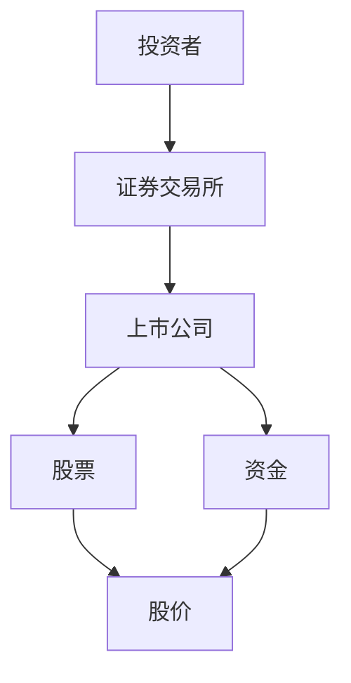
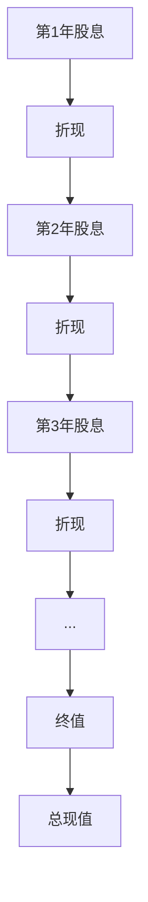
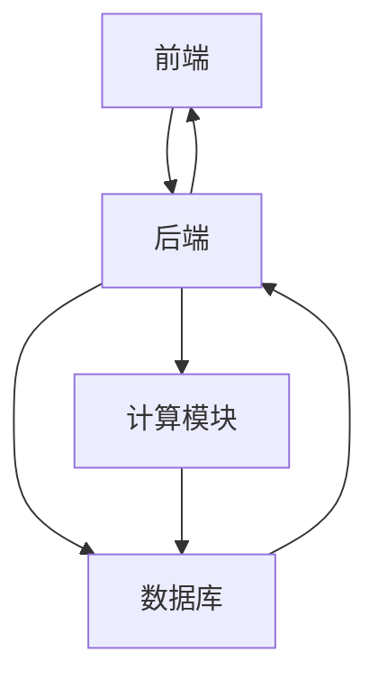

                 


# 股息贴现模型：估值的另一种思路

## 关键词：股息贴现模型，股票估值，股息增长模型，现金流折现，投资分析

## 摘要：股息贴现模型（Dividend Discount Model，DDM）是一种用于股票估值的重要方法，通过将未来股息的现值加总来计算股票的内在价值。本文详细介绍了股息贴现模型的背景、原理、数学模型、算法实现、应用案例以及系统设计，帮助读者全面理解这一估值方法，并通过实际案例分析展示了其在投资决策中的应用价值。

---

# 股息贴现模型：估值的另一种思路

## 第一部分: 股息贴现模型的基础

### 第1章: 股票与股息的基本概念

#### 1.1 股票的基本概念

股票是公司发行的股份凭证，代表持有者对公司的部分所有权。股票按类型可分为普通股和优先股，按市场可分为主板、创业板等。股票的收益主要来源于股息和资本增值。股票的交易在证券交易所进行，价格受市场供需关系、公司业绩、宏观经济环境等多种因素影响。

**图1-1：股票市场的基本结构**



#### 1.2 股息的基本概念

股息是公司分配给股东的利润部分，通常以现金形式支付，也可以是股票或其他资产。股息分为普通股息、优先股息和特殊股息。股息的分配与公司的盈利能力和股息政策密切相关。股息与股价的关系是：股息的增加通常会推高股价，但高股息率可能意味着公司缺乏再投资机会。

**表1-1：股息与股价的关系**

| 情况       | 股息增加 | 股价变化 |
|------------|----------|----------|
| 高增长公司 | 不可能   | 上涨     |
| 成熟公司   | 可能     | 上涨或稳定 |

#### 1.3 股票估值的基本方法

股票估值是确定股票内在价值的过程，常用的方法包括：

- **市盈率法（P/E）**：股价除以每股收益。
- **市净率法（P/B）**：股价除以每股净资产。
- **股息贴现模型（DDM）**：通过折现未来股息计算内在价值。

### 第2章: 股息贴现模型的背景与原理

#### 2.1 股息贴现模型的背景

传统估值方法如市盈率和市净率等，存在主观性强、难以量化的问题。股息贴现模型通过将股息折现，提供了一种更客观的估值方法，尤其适用于以股息为主要收益来源的股票。

#### 2.2 股息贴现模型的核心原理

股息贴现模型假设股票的内在价值等于未来股息的现值之和。其基本公式为：

$$
V = \sum_{t=1}^{\infty} \frac{D_t}{(1+r)^t}
$$

其中：
- \( V \)：股票的内在价值
- \( D_t \)：第 \( t \) 年的股息
- \( r \)：折现率

**图2-1：股息贴现模型的现金流折现过程**



#### 2.3 股息贴现模型与股息增长模型的区别

- **股息增长模型**假设股息以固定增长率 \( g \) 增长，适用于股息持续增长的公司。
- **股息贴现模型**是一个更通用的框架，可以结合不同的股息增长假设。

---

## 第二部分: 股息贴现模型的数学模型与算法

### 第3章: 股息贴现模型的数学公式

#### 3.1 股息贴现模型的基本公式

在股息贴现模型中，股票的内在价值可以通过以下公式计算：

$$
V = \frac{D_1}{r - g}
$$

其中：
- \( D_1 \)：第一年的预期股息
- \( r \)：折现率
- \( g \)：股息增长率

**图3-1：恒定股息增长模型的公式推导**

```mermaid
graph TD
    A[当前股息 D0] --> B[乘以 (1+g)]
    B --> C[得到 D1]
    C --> D[乘以 1/(r - g)]
    D --> E[得到 V]
```

#### 3.2 股息增长模型的数学公式

- **恒定增长模型（戈登模型）**：

$$
V = \frac{D_0 \times (1+g)}{r - g}
$$

- **两阶段增长模型**：

$$
V = \frac{D_1}{(1+r)^1} + \frac{D_2}{(1+r)^2} + \frac{D_3}{(1+r)^3} + \dots + \frac{D_n}{(1+r)^n} + \frac{V_n}{(1+r)^n}
$$

其中 \( V_n \) 是第 \( n \) 年末的终值。

#### 3.3 股息贴现模型的数学推导

以戈登模型为例，假设股息以恒定增长率 \( g \) 增长，股票的内在价值公式推导如下：

$$
V = \frac{D_0 \times (1+g)}{r - g}
$$

**图3-2：股息贴现模型的现金流折现**

```mermaid
graph TD
    A[当前股息 D0] --> B[乘以 (1+g)]
    B --> C[得到 D1]
    C --> D[乘以 1/(r - g)]
    D --> E[得到 V]
```

### 第4章: 股息贴现模型的算法实现

#### 4.1 股息贴现模型的算法步骤

1. 确定股息增长率 \( g \)。
2. 确定折现率 \( r \)。
3. 计算未来股息的现值。
4. 求和得到股票的内在价值。

#### 4.2 股息贴现模型的代码实现

```python
def dividend_discount_model(D0, g, r, n):
    """
    股息贴现模型计算股票内在价值
    参数:
        D0: 当前股息
        g: 股息增长率
        r: 折现率
        n: 预测年数
    返回:
        股票的内在价值
    """
    value = 0
    for t in range(1, n+1):
        Dt = D0 * (1 + g)**t
        present_value = Dt / (1 + r)**t
        value += present_value
    return value

# 示例计算
D0 = 1.0
g = 0.05
r = 0.10
n = 5
intrinsic_value = dividend_discount_model(D0, g, r, n)
print(f"股票的内在价值为：{intrinsic_value:.2f}")
```

---

## 第三部分: 股息贴现模型的应用与实践

### 第5章: 股息贴现模型的实证分析

#### 5.1 股息贴现模型的实证步骤

1. 数据收集：收集目标公司的历史股息、净利润、股价等数据。
2. 参数估计：估计股息增长率 \( g \) 和折现率 \( r \)。
3. 模型计算：使用股息贴现模型计算股票的内在价值。
4. 结果分析：将计算结果与实际股价进行对比，评估模型的准确性。

#### 5.2 股息贴现模型的实证案例

以某公司为例，假设：
- 当前股息 \( D0 = 1.0 \) 元
- 股息增长率 \( g = 5\% \)
- 折现率 \( r = 10\% \)
- 预测年数 \( n = 5 \) 年

计算结果为：
$$
V = \frac{1.0 \times (1+0.05)}{0.10 - 0.05} = 22 \text{元}
$$

### 第6章: 股息贴现模型的系统设计与实现

#### 6.1 系统设计概述

- **功能需求**：用户输入股息、增长率和折现率，系统输出股票的内在价值。
- **模块划分**：数据输入、参数估计、模型计算、结果展示。
- **架构设计**：采用MVC模式，前端用于数据输入，后端用于计算，数据库存储历史数据。

**图6-1：系统架构图**



---

## 总结与展望

股息贴现模型是一种简单有效的股票估值方法，通过折现未来股息计算股票的内在价值。本文详细介绍了股息贴现模型的背景、原理、数学模型和算法实现，并通过实际案例展示了其应用。未来的研究可以进一步探讨股息贴现模型在不同市场环境下的适用性，以及如何结合其他估值方法提高估值的准确性。

---

**作者：AI天才研究院 & 禅与计算机程序设计艺术**

