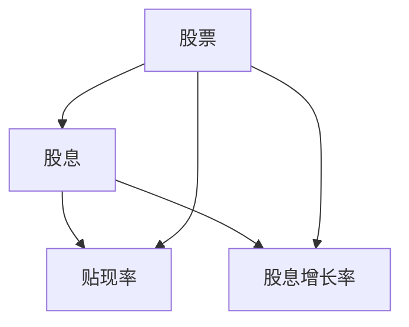
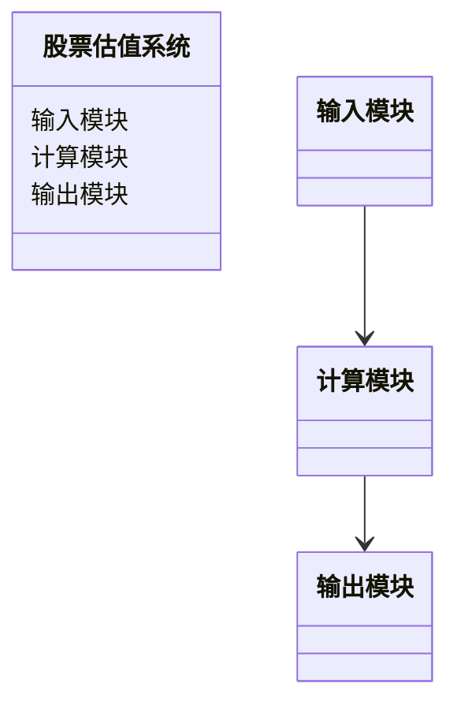

                 


# 股息贴现模型：基于未来现金流的股票估值

## 关键词：股息贴现模型、股票估值、现金流、贴现率、股息率、投资分析、股票投资

## 摘要：  
股息贴现模型（Dividend Discount Model, DDM）是一种用于评估股票内在价值的金融模型，主要通过预测未来股息的现值来确定股票的合理价格。本文将详细介绍股息贴现模型的背景、核心概念、算法原理、系统分析与架构设计、项目实战以及最佳实践，帮助读者全面理解并掌握如何利用股息贴现模型进行股票估值。

---

## 第一部分: 股息贴现模型的背景与核心概念

### 第1章: 股息贴现模型的背景介绍

#### 1.1 股息贴现模型的定义与特点
##### 1.1.1 股息贴现模型的定义
股息贴现模型（DDM）是一种用于评估股票内在价值的金融模型，其核心思想是将未来股息的现值作为股票的合理价格。通过预测公司未来派发的股息，并将其折现到现值，从而计算出股票的理论价值。

##### 1.1.2 股息贴现模型的核心特点
- **基于股息现金流**：DDM的核心在于将股息视为公司未来现金流的一部分，通过贴现计算其现值。
- **假设股息可预测**：模型假设公司未来股息可以被合理预测，通常基于历史股息增长率或预期增长率。
- **适用于稳定分红的公司**：DDM更适合那些股息稳定、具有持续盈利能力和分红能力的公司。

##### 1.1.3 股息贴现模型的应用范围
- 用于股票估值：帮助投资者确定股票的内在价值，判断其是否被市场低估或高估。
- 用于投资决策：通过比较股票的理论价值与市场价，指导投资者进行买入、持有或卖出的决策。
- 用于公司估值：在企业并购或股权评估中，DDM可以作为参考工具。

#### 1.2 股票估值的基本原理
##### 1.2.1 股票价值的决定因素
股票的价值主要取决于以下几个因素：
- 公司的盈利能力：包括净利润率、ROE（净资产收益率）等指标。
- 未来的现金流：包括股息、营业收入、净利润等。
- 行业地位：公司在行业中的竞争地位、市场占有率等。
- 财务健康状况：包括资产负债率、流动比率等财务指标。

##### 1.2.2 现金流在股票估值中的重要性
现金流是股票估值的核心，因为股票的本质是公司未来现金流的折现值。通过预测公司未来的现金流，可以评估其内在价值。

##### 1.2.3 股息在股票估值中的作用
股息是股东从公司获得的回报，也是衡量公司分红能力的重要指标。通过预测股息的未来现金流，可以计算出股票的理论价值。

#### 1.3 股息贴现模型的理论基础
##### 1.3.1 贴现模型的基本原理
贴现模型是将未来的现金流按一定的贴现率折现到当前价值的模型。其核心公式为：
$$
PV = \frac{CF}{(1 + r)^t}
$$
其中，$CF$为未来现金流，$r$为贴现率，$t$为时间。

##### 1.3.2 股息在贴现模型中的应用
股息作为未来现金流的一部分，可以通过贴现模型计算其现值。如果公司未来永远支付股息，并且股息增长率恒定，则可以使用永续年金的现值公式：
$$
P = \frac{D_1}{k - g}
$$
其中，$D_1$为第一期股息，$k$为贴现率，$g$为股息增长率。

##### 1.3.3 股息贴现模型的数学基础
股息贴现模型的数学基础包括现值计算、年金现值公式以及增长率模型（如股息增长率为常数或变数）。

#### 1.4 股息贴现模型的分类
##### 1.4.1 单阶段股息贴现模型
单阶段模型假设股息增长率在预测期内保持不变，适用于股息增长率稳定的公司。

##### 1.4.2 两阶段股息贴现模型
两阶段模型将股息增长率分为两个阶段：初始阶段和稳定阶段，适用于股息增长率在短期内较高，长期趋于稳定的情况。

##### 1.4.3 多阶段股息贴现模型
多阶段模型假设股息增长率在不同阶段有不同的变化，适用于股息增长率变化较大的公司。

#### 1.5 股息贴现模型的优缺点
##### 1.5.1 股息贴现模型的优点
- 简单易用：DDM模型计算公式简单，易于理解和应用。
- 强调股息：模型将股息作为核心因素，反映了股东的回报能力。
- 适用于长期投资：适合长期投资者评估股票的内在价值。

##### 1.5.2 股息贴现模型的缺点
- 假设过于理想化：模型假设股息增长率恒定，与实际市场情况可能存在偏差。
- 需要预测股息增长率：股息增长率的预测具有一定的不确定性，可能影响模型的准确性。
- 忽略了股价波动：模型仅考虑股息因素，忽略了市场的波动性和其他影响股价的因素。

##### 1.5.3 股息贴现模型的适用场景
- 适用于股息稳定且可预测的公司。
- 适用于长期价值投资分析。
- 适用于对公司基本面进行深入分析的投资者。

#### 1.6 本章小结
本章介绍了股息贴现模型的基本概念、特点、分类以及优缺点，帮助读者理解DDM模型的基本框架和适用场景。

---

## 第2章: 股息贴现模型的核心概念与联系

### 2.1 股息贴现模型的核心要素
#### 2.1.1 股息增长率
股息增长率是股息贴现模型中一个关键参数，通常假设股息增长率恒定或分为多个阶段。

#### 2.1.2 贴现率
贴现率是将未来股息折现到现值的折算比率，通常基于市场利率或投资者的期望回报率。

#### 2.1.3 永续年金现值公式
永续年金现值公式是股息贴现模型的核心公式之一，用于计算股息的现值。

### 2.2 股息贴现模型的数学模型
#### 2.2.1 单阶段股息贴现模型公式
$$
P = \frac{D_1}{k - g}
$$
其中，$D_1$为第一期股息，$k$为贴现率，$g$为股息增长率。

#### 2.2.2 两阶段股息贴现模型公式
$$
P = \frac{D_1}{k} + \frac{D_2}{k^2} + \frac{D_3}{k^3} + \cdots
$$
其中，$D_1, D_2, D_3$分别为前几期的股息，$k$为贴现率。

### 2.3 股息贴现模型的ER实体关系图


---

## 第三部分: 股息贴现模型的算法原理与系统架构

### 第3章: 股息贴现模型的算法原理

#### 3.1 股息贴现模型的计算步骤
1. **确定股息增长率**：根据历史股息增长率或预期增长率确定$g$。
2. **确定贴现率**：通常基于市场利率或投资者期望回报率确定$k$。
3. **计算股息的现值**：使用股息贴现模型公式计算股息的现值。
4. **计算股票的理论价值**：将股息现值与股票当前价格进行比较，判断是否低估或高估。

#### 3.2 股息贴现模型的数学推导
以单阶段模型为例：
$$
P = \frac{D_1}{k - g}
$$
其中，$D_1 = D_0 \times (1 + g)$，因此：
$$
P = \frac{D_0 \times (1 + g)}{k - g}
$$

#### 3.3 股息贴现模型的流程图
```mermaid
graph TD
    A[开始] --> B[确定股息增长率g]
    B --> C[确定贴现率k]
    C --> D[计算D1=D0*(1+g)]
    D --> E[P=D1/(k-g)]
    E --> F[结束]
```

---

## 第四部分: 股息贴现模型的系统分析与架构设计

### 第4章: 股息贴现模型的系统分析

#### 4.1 问题场景介绍
股息贴现模型的系统主要用于股票估值，帮助投资者确定股票的内在价值。

#### 4.2 系统功能设计
- **输入模块**：接收股票的基本信息，包括历史股息、股息增长率、贴现率等。
- **计算模块**：根据输入参数计算股息的现值，并得出股票的理论价值。
- **输出模块**：展示计算结果，包括理论价值与实际价格的比较。

#### 4.3 系统架构设计


---

## 第五部分: 股息贴现模型的项目实战

### 第5章: 股息贴现模型的项目实战

#### 5.1 环境安装
需要安装Python和相关库（如numpy、pandas）。

#### 5.2 系统核心实现源代码
```python
def dividend_discount_model(dividends, growth_rate, discount_rate):
    # 计算股息的现值
    present_value = dividends / (discount_rate - growth_rate)
    return present_value

# 示例：使用单阶段模型计算股票价值
D0 = 2  # 当前股息
g = 0.05  # 股息增长率
k = 0.10  # 贴现率

value = dividend_discount_model(D0 * (1 + g), g, k)
print("股票理论价值为：", value)
```

#### 5.3 案例分析
以某公司为例，假设当前股息为$2，股息增长率为5%，贴现率为10%。计算股票的理论价值：
$$
P = \frac{2 \times (1 + 0.05)}{0.10 - 0.05} = \frac{2.1}{0.05} = 42
$$
因此，股票的理论价值为$42。

---

## 第六部分: 股息贴现模型的最佳实践

### 第6章: 最佳实践与小结

#### 6.1 小结
股息贴现模型是一种简单有效的股票估值工具，但其准确性依赖于对股息增长率和贴现率的合理预测。

#### 6.2 注意事项
- 确保股息增长率的合理性。
- 考虑贴现率的变化对模型结果的影响。
- 结合其他估值方法进行综合判断。

#### 6.3 拓展阅读
- 《The Theory of Investment Value》
- 《Financial Statement Analysis and Security Valuation》

---

## 作者：AI天才研究院 & 禅与计算机程序设计艺术

---

通过以上目录结构，您可以开始撰写详细的博客文章，逐步展开每个部分的内容，结合理论与实践，深入浅出地讲解股息贴现模型的原理、应用和注意事项。

