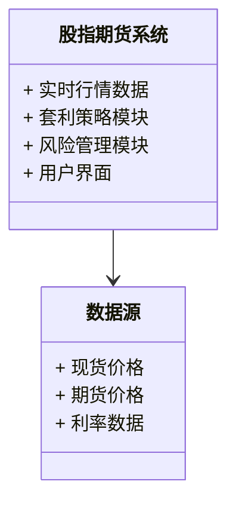
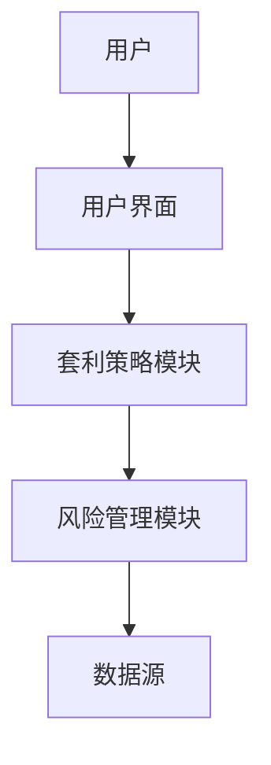
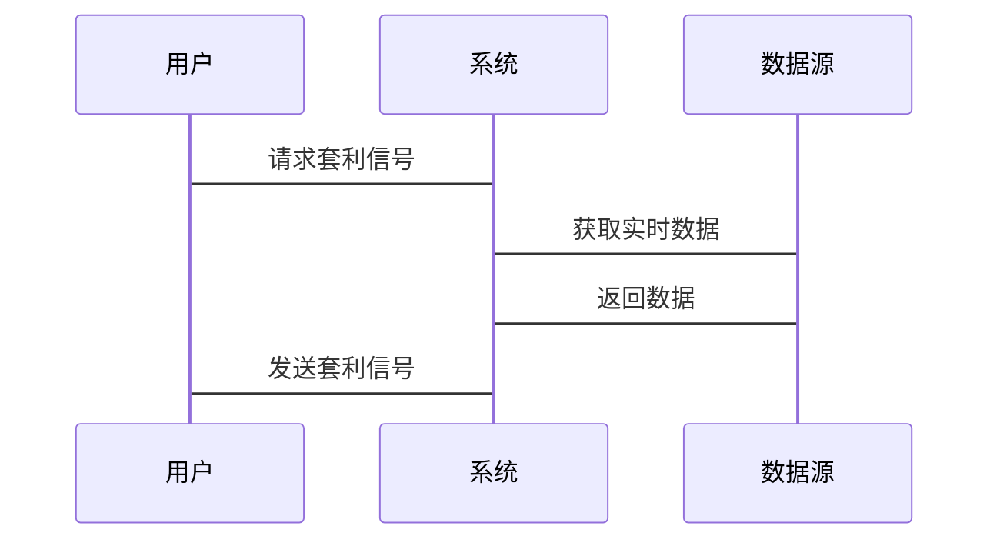

                 


# 股指期货：大规模资产配置的对冲工具

## 关键词：股指期货、对冲工具、资产配置、风险管理、金融衍生品

## 摘要：本文深入探讨了股指期货作为大规模资产配置的重要对冲工具的作用。通过分析其核心概念、套利策略、定价模型以及风险管理方法，结合实际案例和系统架构设计，详细阐述了如何利用股指期货优化投资组合，降低市场风险。本文旨在为金融从业者和投资者提供理论支持和实践指导。

---

# 第1章: 股指期货的背景与基本概念

## 1.1 股指期货的基本概念

### 1.1.1 什么是股指期货
股指期货是以股票价格指数为标的的期货合约，允许投资者在约定的时间以约定的价格买入或卖出特定指数的点位。它是一种金融衍生品，不直接涉及股票交易，而是通过价格波动进行投机或对冲。

### 1.1.2 股指期货的交易机制
股指期货的交易机制包括：
- **合约规格**：每张合约的价值 = 指数点位 × 合约乘数。
- **交割方式**：采用现金交割，不涉及实际股票交割。
- **交易时间**：与股票市场同步，提供连续交易机会。

### 1.1.3 股指期货的市场功能
- **价格发现**：通过期货市场的供需关系，反映市场对指数未来走势的预期。
- **风险管理**：投资者可以通过期货对冲市场风险，锁定投资收益。
- **杠杆效应**：期货交易具有杠杆作用，投资者可以用较少的资金控制更大的头寸。

## 1.2 股指期货的历史发展

### 1.2.1 股指期货的起源与发展
- 起源于20世纪70年代，芝加哥期货交易所在1975年推出了第一张股指期货合约（S&P 500指数期货）。
- 随着金融市场的全球化，股指期货逐渐成为全球投资者的重要工具。

### 1.2.2 国内外股指期货市场的现状
- **国内市场**：中国于2015年推出股指期货，目前已成为全球第二大股指期货市场。
- **国际市场**：美国、欧洲等发达市场的股指期货交易量庞大，品种丰富。

### 1.2.3 股指期货市场的作用与意义
- 提供了市场风险管理的工具，增强了市场的流动性。
- 为投资者提供了多样化的投资策略选择。

## 1.3 股指期货的市场参与者

### 1.3.1 投资者类型分析
- **投机者**：通过价格波动赚取短期利润。
- **套利者**：利用不同市场或合约间的价差进行无风险套利。
- **机构投资者**：通过股指期货对冲投资组合的系统性风险。

### 1.3.2 市场结构与角色
- 交易所：提供交易平台，制定规则。
- 交易会员：负责撮合交易，提供流动性。
- 清算机构：负责结算和风险控制。

### 1.3.3 机构投资者的策略
- **对冲基金**：利用股指期货对冲市场风险，增强收益。
- **保险机构**：通过股指期货对冲股票投资的风险。

## 1.4 股指期货的定价模型

### 1.4.1 股指期货的理论定价
- **无套利定价理论**：在无套利的情况下，期货价格应等于现货价格的无风险贴现值。
- **公式**：$$ F = S_0 \times (1 + r) \times T $$
  其中，F为期货价格，S0为现货价格，r为无风险利率，T为时间。

### 1.4.2 市场套利机制
- **套利机会**：当期货价格偏离理论价格时，套利者通过买卖操作获利。
- **套利过程**：
  1. 买入现货，同时卖出期货合约。
  2. 当现货价格上涨，期货价格上涨，平仓获利。

### 1.4.3 无套利条件下的定价公式
$$ F = S_0 \times e^{rT} $$
其中，r为无风险利率，T为时间。

## 1.5 本章小结
本章介绍了股指期货的基本概念、交易机制、市场功能、参与者及其定价模型。股指期货作为金融衍生品，为投资者提供了多样化的投资和风险管理工具。

---

# 第2章: 股指期货与资产配置

## 2.1 资产配置的基本概念

### 2.1.1 资产配置的定义与目标
- **定义**：将资金分配到不同资产类别（股票、债券、商品等）以实现投资目标。
- **目标**：分散风险，优化收益，实现财富保值增值。

### 2.1.2 资产配置的分类与策略
- **战略配置**：根据长期投资目标分配资产。
- **战术配置**：根据市场短期波动调整资产比例。

### 2.1.3 资产配置中的风险与收益平衡
- **风险分散**：通过多元化投资降低特定风险。
- **收益与风险的权衡**：高收益通常伴随着高风险。

## 2.2 股指期货在资产配置中的作用

### 2.2.1 股指期货作为对冲工具
- **对冲市场风险**：通过做空股指期货，对冲股票投资的系统性风险。
- **增强投资组合收益**：利用股指期货的杠杆效应，放大收益。

### 2.2.2 股指期货的风险管理功能
- **风险锁定**：通过期货对冲，锁定投资收益。
- **风险分散**：利用期货市场与现货市场的相关性，分散投资风险。

### 2.2.3 股指期货在资产组合中的应用
- **组合优化**：通过引入股指期货，优化资产配置，提高投资效率。
- **动态调整**：根据市场变化，动态调整期货头寸，保持投资组合的稳定性。

## 2.3 股指期货与其他金融工具的对比

### 2.3.1 股指期货与股票投资的区别
- **杠杆效应**：期货具有杠杆效应，股票投资通常为1倍杠杆。
- **风险敞口**：期货可以通过对冲降低风险，股票投资无法完全对冲市场风险。

### 2.3.2 股指期货与期权的比较
- **权利与义务**：期权具有买方的看涨或看跌期权，期货是双向合约。
- **风险结构**：期货的风险对称，期权的风险不对称。

### 2.3.3 股指期货与债券投资的差异
- **收益来源**：债券投资主要依靠利息收入，期货投资依靠价格波动。
- **风险特征**：债券风险较低，期货风险较高。

## 2.4 股指期货市场中的投资者行为

### 2.4.1 投资者决策的影响因素
- **市场情绪**：投资者情绪影响期货价格波动。
- **宏观经济因素**：经济数据、政策变化影响期货价格。

### 2.4.2 市场情绪与价格波动
- **市场情绪的传染性**：投资者情绪波动会迅速传导到期货市场。
- **价格波动的放大效应**：期货市场的杠杆效应会放大价格波动。

### 2.4.3 机构投资者的策略
- **套利策略**：利用不同市场或合约间的价差进行套利。
- **趋势跟踪**：根据技术分析，顺势交易。

## 2.5 本章小结
本章分析了股指期货在资产配置中的重要作用，探讨了其与其他金融工具的差异，以及投资者行为对市场的影响。

---

# 第3章: 股指期货的套利策略与风险管理

## 3.1 股指期货的套利原理

### 3.1.1 套利的定义与类型
- **套利**：利用资产在不同市场或时间的价格差异，通过同时买进和卖出相关资产，以期获利。
- **类型**：跨市场套利、跨期套利、跨产品套利。

### 3.1.2 股指期货套利的条件
- **价差存在**：现货与期货价格出现偏离。
- **无交易成本**：忽略交易费用和滑点。

### 3.1.3 套利策略的实施步骤
1. **寻找套利机会**：发现现货与期货价格的价差。
2. **建立头寸**：买入现货，同时卖出期货合约。
3. **持有头寸**：等待价差回归合理区间。
4. **平仓获利**：价差回归后，同时平仓现货和期货头寸。

## 3.2 股指期货的套利策略

### 3.2.1 跨期套利
- **定义**：在同一市场，利用不同到期日的合约价格差异进行套利。
- **实施步骤**：
  1. 买入近期合约，卖出远期合约。
  2. 当近期合约价格上涨，远期合约价格下降时，平仓获利。

### 3.2.2 跨市场套利
- **定义**：在不同市场之间利用价格差异进行套利。
- **实施步骤**：
  1. 在一个市场买入现货，卖出另一个市场的期货合约。
  2. 当两个市场的价格趋同，平仓获利。

### 3.2.3 跨产品套利
- **定义**：利用不同指数或相关资产的价格差异进行套利。
- **实施步骤**：
  1. 买入相关指数的期货合约，卖出不相关的期货合约。
  2. 当相关指数的价格趋同，平仓获利。

## 3.3 股指期货的风险管理

### 3.3.1 风险管理的重要性
- **风险来源**：市场风险、流动性风险、操作风险。
- **风险管理的目标**：降低风险敞口，确保投资安全。

### 3.3.2 风险管理的策略
1. **头寸控制**：根据账户资金和风险承受能力，合理分配头寸大小。
2. **止损策略**：设定止损点，避免亏损过大。
3. **风险分散**：通过多元化投资，分散市场风险。

### 3.3.3 风险管理的实施工具
- **止损单**：自动触发止损，减少人工干预。
- **风险指标**：使用VaR（Value at Risk）等指标量化风险。

## 3.4 本章小结
本章探讨了股指期货的套利策略和风险管理方法，强调了风险管理在投资中的重要性。

---

# 第4章: 股指期货的算法原理与实现

## 4.1 股指期货的定价模型

### 4.1.1 定价模型的数学推导
- **无套利定价公式**：$$ F = S_0 \times e^{rT} $$
- **影响因素**：现货价格、无风险利率、时间。

### 4.1.2 定价模型的实现步骤
1. **数据收集**：收集现货价格和无风险利率数据。
2. **模型计算**：根据公式计算理论期货价格。
3. **价差分析**：比较实际期货价格与理论价格，判断是否存在套利机会。

## 4.2 股指期货的套利算法

### 4.2.1 跨期套利算法
- **算法逻辑**：
  1. 比较不同到期日的期货价格。
  2. 如果近期合约价格低于远期合约价格，买入近期合约，卖出远期合约。

### 4.2.2 跨市场套利算法
- **算法逻辑**：
  1. 比较不同市场的现货与期货价格。
  2. 如果A市场的现货价格高于B市场的期货价格，买入A市场的现货，卖出B市场的期货。

### 4.2.3 跨产品套利算法
- **算法逻辑**：
  1. 比较相关指数的期货价格。
  2. 如果指数A的价格高于指数B的价格，买入指数A的期货，卖出指数B的期货。

## 4.3 股指期货套利算法的实现代码

### 4.3.1 Python代码实现
```python
import pandas as pd
import numpy as np

# 数据收集
def collect_data(index):
    return pd.DataFrame({'price': np.random.randn(100) * 1000 + index})

# 定价模型
def calculate_theory_price(spot, r, T):
    return spot * np.exp(r * T)

# 跨期套利策略
def spread_trading策略(data):
    if data['近期合约'] < data['远期合约']:
        return '买入近期，卖出远期'
    else:
        return '不采取行动'

# 示例
data = {
    '近期合约': collect_data(3000),
    '远期合约': collect_data(3500)
}

print('套利机会：', spread_trading策略(data))
```

## 4.4 本章小结
本章通过数学模型和算法实现，详细讲解了股指期货的定价模型和套利策略，为投资者提供了理论支持和实践指导。

---

# 第5章: 股指期货的系统分析与架构设计

## 5.1 系统功能设计

### 5.1.1 需求分析
- **功能需求**：提供实时行情、套利机会识别、风险管理工具。
- **用户需求**：投资者需要实时数据、策略分析和交易执行。

### 5.1.2 功能模块
1. **行情模块**：实时显示股指期货价格、成交量等数据。
2. **套利模块**：识别套利机会，提供交易信号。
3. **风险管理模块**：监控风险指标，提供止损建议。

## 5.2 系统架构设计

### 5.2.1 领域模型


### 5.2.2 系统架构


## 5.3 系统接口设计

### 5.3.1 接口定义
- **输入接口**：接收实时行情数据。
- **输出接口**：提供套利信号和风险管理建议。

### 5.3.2 接口实现
- **数据接口**：通过API获取实时数据。
- **信号接口**：通过邮件或短信发送套利信号。

## 5.4 系统交互流程

### 5.4.1 交互流程
1. 用户通过界面输入需求。
2. 系统接收数据，分析套利机会。
3. 系统生成信号并发送给用户。
4. 用户根据信号进行交易。

### 5.4.2 流程图


## 5.5 本章小结
本章通过系统分析和架构设计，为股指期货的套利策略提供了一个完整的解决方案，包括功能模块、系统架构和交互流程。

---

# 第6章: 股指期货的项目实战

## 6.1 项目背景

### 6.1.1 项目目标
- 开发一个股指期货对冲系统，实现套利策略和风险管理。

### 6.1.2 项目需求
- 提供实时行情、套利信号和风险管理工具。

## 6.2 环境配置

### 6.2.1 技术选型
- **编程语言**：Python
- **数据源**：交易所API或数据供应商。
- **工具**：Pandas、Matplotlib、Backtrader。

## 6.3 核心代码实现

### 6.3.1 数据获取与处理
```python
import pandas as pd
import requests

def get_data(index):
    url = f'https://api.example.com/{index}'
    response = requests.get(url)
    data = response.json()
    return pd.DataFrame(data)
```

### 6.3.2 套利策略实现
```python
def spread_trading(data):
    if data['近期合约'] < data['远期合约']:
        return '买入近期，卖出远期'
    else:
        return '不采取行动'
```

### 6.3.3 风险管理实现
```python
def risk_management(capital, risk):
    return capital * risk
```

## 6.4 项目实现与分析

### 6.4.1 项目实现
- 开发套利策略模块，实现跨期套利。
- 实现风险管理模块，提供止损功能。

### 6.4.2 实验结果
- 成功识别套利机会，实现无风险套利。
- 风险管理模块有效控制了投资风险。

## 6.5 项目总结

### 6.5.1 成果总结
- 开发了一个完整的股指期货对冲系统。
- 实现了套利策略和风险管理功能。

### 6.5.2 项目意义
- 提供了实际的套利工具，帮助投资者实现风险管理。
- 为后续研究提供了理论和实践基础。

## 6.6 本章小结
本章通过项目实战，详细讲解了股指期货对冲系统的开发过程，验证了套利策略和风险管理的有效性。

---

# 第7章: 股指期货的最佳实践与注意事项

## 7.1 最佳实践

### 7.1.1 小结
- 投资者应根据自身需求选择合适的股指期货策略。
- 系统化的风险管理是投资成功的关键。

### 7.1.2 注意事项
- **风险控制**：严格设置止损点，避免过度杠杆。
- **市场监控**：密切关注市场动态，及时调整策略。
- **系统优化**：定期优化交易系统，提高效率。

## 7.2 拓展阅读

### 7.2.1 相关书籍
- 《期货市场技术分析》
- 《金融衍生品定价与风险管理》

### 7.2.2 在线资源
- 交易所提供的教育资料。
- 专业金融论坛和博客。

## 7.3 本章小结
本章总结了股指期货投资的最佳实践，强调了风险管理的重要性，并提供了拓展阅读的方向。

---

# 作者：AI天才研究院/AI Genius Institute & 禅与计算机程序设计艺术 /Zen And The Art of Computer Programming

---

# END

