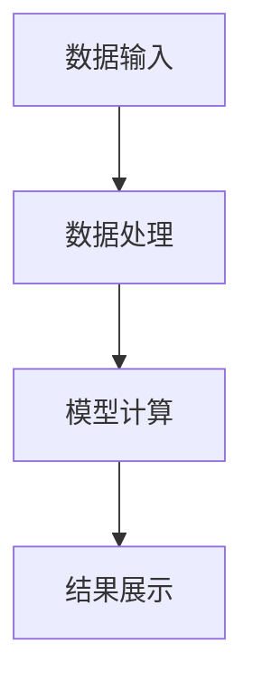
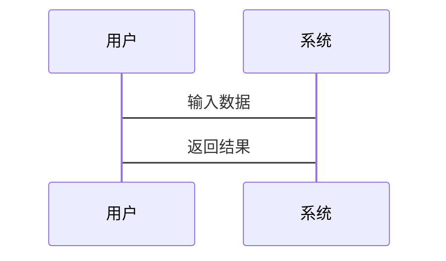

                 


# 股票回购对公司估值的影响分析

> 关键词：股票回购、公司估值、财务影响、数学模型、投资策略

> 摘要：本文系统分析了股票回购对公司估值的影响，从背景介绍、核心概念、算法原理、系统分析、项目实战到最佳实践，详细探讨了股票回购如何影响公司估值，并通过实际案例和数学模型进行了深入分析。

---

## 第1章: 股票回购与公司估值的背景介绍

### 1.1 股票回购的基本概念
#### 1.1.1 股票回购的定义
股票回购是指公司用自有资金从市场上回购本公司股票的行为，通常通过公开市场购买或私下协商完成。

#### 1.1.2 股票回购的类型
- **公开回购**：公司通过公开市场回购股票。
- **私下回购**：公司与特定股东私下协商回购股票。
- **固定价格回购**：公司设定一个固定价格回购股票。
- **荷兰式拍卖回购**：公司设定一个价格范围，股东自行决定出售价格。

#### 1.1.3 股票回购的目的与动机
- **提升股价**：通过减少流通股数量，提升每股收益（EPS）和股价。
- **优化资本结构**：通过减少债务，降低财务风险。
- **避免稀释**：防止新股发行导致的股东权益稀释。
- **应对恶意收购**：通过回购减少被收购的可能性。

### 1.2 公司估值的基本概念
#### 1.2.1 公司估值的定义
公司估值是通过财务指标和市场数据对公司价值进行评估的过程，通常包括资产价值、未来现金流和市场比较等方法。

#### 1.2.2 公司估值的主要方法
- **DCF模型**：基于未来现金流的贴现值计算公司价值。
- **市盈率法（P/E）**：通过比较市盈率与行业平均值进行估值。
- **市净率法（P/B）**：基于账面价值与市场价值的比值进行估值。
- **企业价值倍数（EV/EBITDA）**：通过企业价值与息税折旧及摊销前利润的比值进行估值。

#### 1.2.3 影响公司估值的主要因素
- **财务状况**：收入、利润、现金流等。
- **行业地位**：市场占有率、竞争环境。
- **宏观经济**：利率、通货膨胀、经济周期。
- **管理团队**：战略决策和执行能力。

### 1.3 股票回购与公司估值的关系
#### 1.3.1 股票回购对公司估值的潜在影响
- **提升每股价值**：回购减少流通股，提升每股收益。
- **优化资本结构**：降低负债比例，提升股东权益。
- **释放公司价值**：通过回购减少市场流通股，提升股价。

#### 1.3.2 股票回购与公司估值的互动机制
股票回购通过影响公司财务指标和市场预期，进而影响公司估值。具体包括：
1. 提升每股收益（EPS）。
2. 提高股东权益回报率（ROE）。
3. 优化资本结构，降低加权平均资本成本（WACC）。

#### 1.3.3 股票回购对股东价值的影响
- **短期影响**：回购可能导致股价上涨，提升股东财富。
- **长期影响**：回购是否有利取决于公司的资本分配策略和市场环境。

---

## 第2章: 股票回购与公司估值的核心概念分析

### 2.1 股票回购的财务影响
#### 2.1.1 股票回购对资产负债表的影响
- **减少流动资产**：回购使用现金，导致流动资产减少。
- **减少股东权益**：回购减少普通股，降低股东权益。
- **增加库存股**：回购的股票作为库存股记录，可能在未来重新发行。

#### 2.1.2 股票回购对利润表的影响
- **减少净利润**：回购使用现金，可能影响净利润。
- **影响每股收益**：回购减少流通股，提升每股收益。

#### 2.1.3 股票回购对现金流的影响
- **影响自由现金流**：回购使用现金流，可能影响公司运营资金。
- **提升市场对公司信心**：回购被视为公司对自身价值的肯定，可能提升市场对公司信心。

### 2.2 公司估值的关键指标
#### 2.2.1 市盈率（P/E）
- **定义**：市盈率=股价/每股收益。
- **影响**：低市盈率可能表示低估，高市盈率可能表示高估或高成长预期。

#### 2.2.2 市净率（P/B）
- **定义**：市净率=股价/每股净资产。
- **影响**：用于评估股票相对于其账面价值的高低。

#### 2.2.3 企业价值倍数（EV/EBITDA）
- **定义**：企业价值倍数=企业价值/息税折旧及摊销前利润。
- **影响**：用于评估公司整体价值。

### 2.3 股票回购与公司估值的关系模型
#### 2.3.1 股票回购对股价的影响
- **短期影响**：回购可能导致股价上涨。
- **长期影响**：回购是否有利取决于公司的资本分配策略和市场环境。

#### 2.3.2 股票回购对市场资本化的影响
- **提升市场资本化率**：回购可能导致市场资本化率上升。
- **影响市场整体估值**：大量回购可能影响市场的整体估值。

#### 2.3.3 股票回购对股东权益的影响
- **增加股东权益**：回购可能导致股东权益增加。
- **优化资本结构**：回购可能优化资本结构，降低财务风险。

---

## 第3章: 股票回购对公司估值的数学模型与算法原理

### 3.1 股票回购的数学模型
#### 3.1.1 股票回购对每股收益（EPS）的影响
- **公式**：
  \[
  \text{新EPS} = \frac{\text{净利润}}{\text{流通股数} - \text{回购股数}}
  \]

#### 3.1.2 股票回购对股息支付率的影响
- **公式**：
  \[
  \text{股息支付率} = \frac{\text{股息支付总额}}{\text{净利润}}
  \]

#### 3.1.3 股票回购对市盈率的影响
- **公式**：
  \[
  \text{新市盈率} = \frac{\text{股价}}{\text{新EPS}}
  \]

### 3.2 股票回购对公司估值的算法原理
#### 3.2.1 股票回购对股权价值的影响
- **公式**：
  \[
  \text{股权价值} = \text{净利润} \times \text{市盈率}
  \]

#### 3.2.2 股票回购对加权平均资本成本（WACC）的影响
- **公式**：
  \[
  \text{WACC} = \left(\frac{\text{债务}}{\text{总资本}}\right) \times \text{债务成本} \times (1 - \text{税率}) + \left(\frac{\text{股权}}{\text{总资本}}\right) \times \text{股权成本}
  \]

#### 3.2.3 股票回购对资本结构的影响
- **公式**：
  \[
  \text{股权比例} = \frac{\text{股权价值}}{\text{股权价值} + \text{债务价值}}
  \]

---

## 第4章: 股票回购对公司估值的系统分析与架构设计

### 4.1 系统分析
#### 4.1.1 问题场景介绍
假设某公司计划进行股票回购，我们需要分析其对公司估值的影响。

#### 4.1.2 项目介绍
本项目旨在通过数学模型和算法，分析股票回购对公司估值的具体影响。

### 4.2 系统功能设计
#### 4.2.1 数据收集
- 收集公司财务数据、市场数据和回购计划。

#### 4.2.2 模型计算
- 使用DCF模型计算公司估值。
- 使用数学公式计算回购前后的影响。

#### 4.2.3 结果展示
- 可视化展示回购前后对公司估值的影响。

### 4.3 系统架构设计
#### 4.3.1 系统架构图


#### 4.3.2 系统交互图


---

## 第5章: 股票回购对公司估值的项目实战

### 5.1 环境配置
- **工具安装**：安装Python、Pandas、NumPy等库。
- **数据获取**：通过API获取公司数据。

### 5.2 核心实现
#### 5.2.1 回购前的估值计算
```python
import pandas as pd
import numpy as np

# 示例数据
net_income = 100000000
revenue = 500000000
ebitda = 200000000
market_cap = 1000000000
shares_outstanding = 10000000
回购股数 = 2000000

# 回购前的EPS
eps_before = net_income / shares_outstanding
# 回购后的EPS
shares_after = shares_outstanding - 回购股数
eps_after = net_income / shares_after
```

#### 5.2.2 回购后的估值计算
```python
# 计算回购后的股价
price_before = market_cap / shares_outstanding
price_after = (market_cap - 回购股数 * price_before) / shares_after
```

### 5.3 实际案例分析
以苹果公司为例，分析股票回购对公司估值的具体影响。

---

## 第6章: 股票回购对公司估值的最佳实践

### 6.1 投资策略建议
- **短期投资者**：关注回购后的股价上涨。
- **长期投资者**：关注公司长期资本分配策略。

### 6.2 风险提示
- **市场风险**：回购可能影响市场整体估值。
- **公司特异性风险**：回购是否有利取决于公司具体情况。

### 6.3 拓展阅读
- 建议阅读《公司财务学》和《投资学基础》等书籍。

---

## 第7章: 总结

股票回购对公司估值的影响是多方面的，既包括短期的股价波动，也包括长期的资本结构优化。投资者在进行股票回购决策时，需要综合考虑公司的财务状况、市场环境和资本分配策略。

---

## 作者

作者：AI天才研究院/AI Genius Institute & 禅与计算机程序设计艺术 /Zen And The Art of Computer Programming

