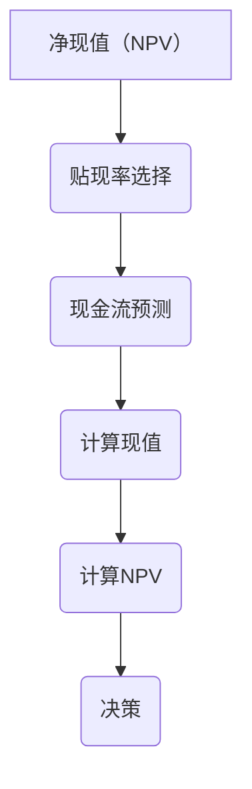
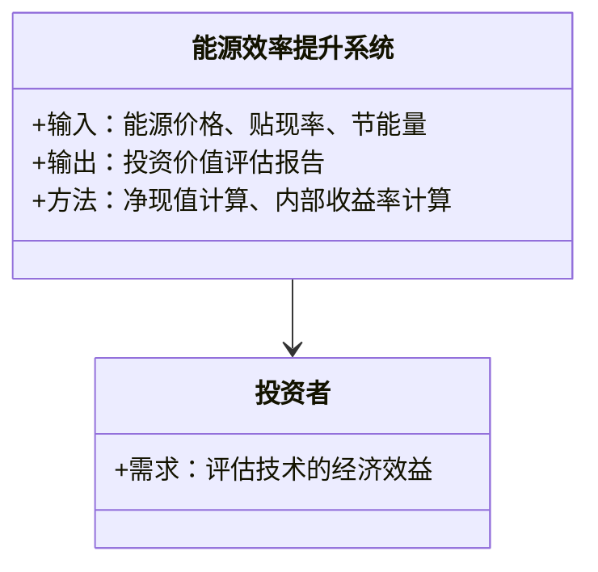
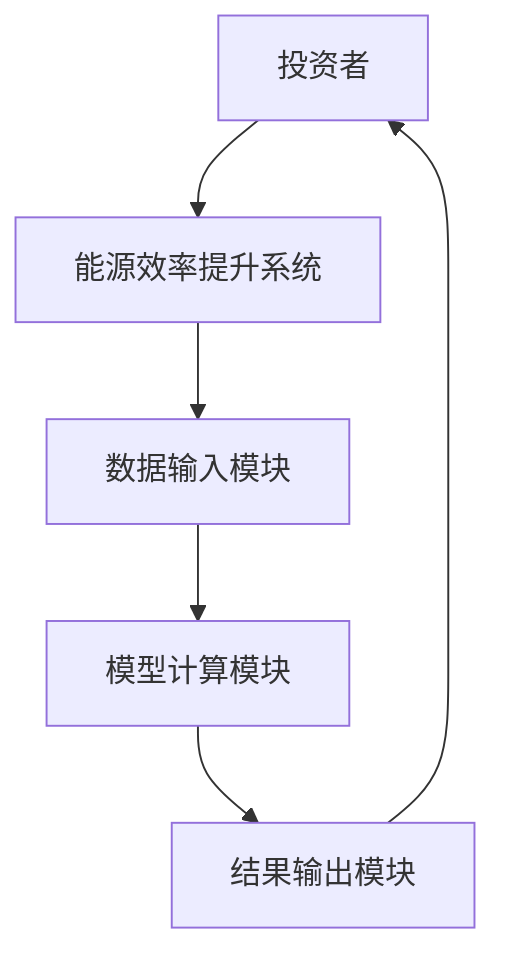

                 


# 能源效率提升技术的投资价值评估

> 关键词：能源效率，投资价值评估，技术优化，经济效益，可持续发展

> 摘要：本文深入探讨了能源效率提升技术的投资价值评估方法，从背景介绍、核心概念、算法原理、系统分析、项目实战到最佳实践，全面分析了如何通过技术优化实现经济效益的最大化。通过案例分析和数学模型的构建，本文为投资者和相关行业从业者提供了科学的决策依据。

---

## 第一部分: 能源效率提升技术的投资价值评估背景介绍

### 第1章: 能源效率提升技术概述

#### 1.1 能源效率提升的背景与意义

- 1.1.1 全球能源需求与环境问题的现状  
  当前，全球能源需求持续增长，但环境问题日益严重，特别是碳排放对气候变化的影响。能源效率提升是应对能源危机和环境保护的重要手段。

- 1.1.2 能源效率提升对可持续发展的贡献  
  能源效率提升不仅能够减少能源消耗，还能降低碳排放，推动可持续发展，符合全球绿色发展的趋势。

- 1.1.3 技术进步对能源效率的推动作用  
  技术进步是能源效率提升的核心驱动力。例如，智能电网、节能设备和可再生能源技术的进步显著提高了能源利用效率。

#### 1.2 能源效率提升技术的核心概念

- 1.2.1 能源效率的定义与衡量标准  
  能源效率是指在能源转换、传输和使用过程中，输出的有用能量与输入的总能量的比率。衡量标准包括设备效率、系统效率和综合能源利用效率。

- 1.2.2 能源效率提升的主要技术路径  
  主要技术路径包括：优化能源管理、采用高效设备、推广可再生能源、智能电网建设和需求侧管理。

- 1.2.3 能源效率与能源成本的关系  
  提升能源效率能够降低单位能源成本，减少能源浪费，从而降低整体能源支出。

---

## 第二部分: 能源效率提升技术的核心概念与联系

### 第2章: 投资价值评估的基本原理

#### 2.1 投资价值评估的核心概念

- 2.1.1 投资价值的定义  
  投资价值是指一项投资在未来能够产生的净收益，考虑了时间和风险因素后的价值。

- 2.1.2 评估方法的分类与选择  
  常见的评估方法包括净现值（NPV）、内部收益率（IRR）、投资回收期（Payback Period）等。

- 2.1.3 评估模型的构建逻辑  
  投资价值评估模型通常包括现金流预测、贴现率选择和价值计算三个主要步骤。

#### 2.2 能源效率提升技术的经济性分析

- 2.2.1 投资成本与收益的构成  
  投资成本包括设备购置、安装和维护费用；收益包括节能收益和环境效益。

- 2.2.2 节能效益的量化方法  
  节能效益=（项目实施后的能源消耗量 - 项目实施前的能源消耗量）×能源价格。

- 2.2.3 投资回收期与净现值的计算  
  投资回收期=初始投资 / 年节能量；净现值=Σ（现金流入的现值 - 现金流出的现值）。

---

## 第三部分: 能源效率提升技术的投资价值评估模型

### 第3章: 投资价值评估的算法

#### 3.1 投资价值评估的数学模型



公式：
$$
\text{NPV} = \sum_{t=1}^{n} \frac{\text{现金流入}_t - \text{现金流出}_t}{(1 + r)^t}
$$
其中，\( r \) 为贴现率，\( n \) 为项目周期。

#### 3.2 算法实现

```python
def calculate_npv(cash_flows, discount_rate):
    npv = 0
    for t, (inflow, outflow) in enumerate(cash_flows):
        npv += (inflow - outflow) / (1 + discount_rate) ** t
    return npv

# 示例数据
cash_flows = [
    (0, 100),  # 初始投资
    (1, 50),    # 第一年净流入
    (2, 50),    # 第二年净流入
    (3, 50),    # 第三年净流入
]
discount_rate = 0.1

npv = calculate_npv(cash_flows, discount_rate)
print(f"净现值（NPV）为：{npv}")
```

---

## 第四部分: 系统分析与架构设计

### 第4章: 系统架构设计

#### 4.1 问题场景介绍

- 系统目标：构建一个能源效率提升技术的投资价值评估系统。
- 项目介绍：通过系统化的方法，对能源效率提升技术进行经济性分析和投资价值评估。

#### 4.2 系统功能设计



#### 4.3 系统架构设计



---

## 第五部分: 项目实战

### 第5章: 项目实战

#### 5.1 环境安装

- 安装Python和相关库（如numpy、pandas、scipy）。

#### 5.2 系统核心实现

```python
import numpy as np

def calculate_irr(cash_flows):
    return np.irr(cash_flows)

cash_flows = [-100, 50, 50, 50]
irr = calculate_irr(cash_flows)
print(f"内部收益率（IRR）为：{irr}")
```

#### 5.3 案例分析与解读

- 案例：某企业实施节能改造，初始投资100万元，预计每年节能量为100吨标准煤，能源价格为500元/吨，贴现率为10%。
- 计算净现值和内部收益率，评估项目的投资价值。

---

## 第六部分: 最佳实践

### 第6章: 最佳实践

#### 6.1 小结

- 能源效率提升技术的投资价值评估需要结合技术特性和经济性分析。
- 通过数学模型和系统设计，能够为投资者提供科学的决策依据。

#### 6.2 注意事项

- 数据准确性是评估结果的关键。
- 需要考虑政策和技术的不确定性。

#### 6.3 拓展阅读

- 建议阅读《Energy Efficiency and Investment Analysis》和《Financial Modeling for Energy Projects》。

---

## 作者：AI天才研究院 & 禅与计算机程序设计艺术

