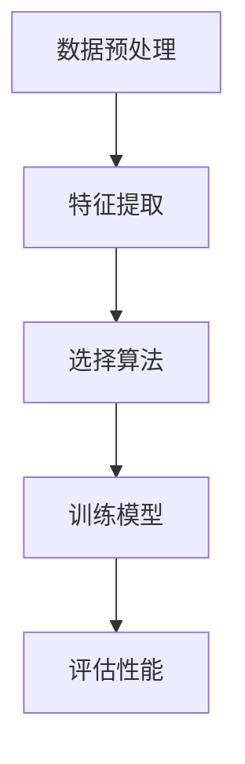

                 


# 脑科学研究进展对医疗和教育领域的影响

---

## 关键词：脑科学，医疗，教育，神经科学，认知科学，机器学习，人工智能

---

## 摘要：脑科学研究的进步正在深刻影响医疗和教育领域。通过分析神经科学和认知科学的核心原理，探讨机器学习在脑科学数据处理中的应用，结合实际案例，展示脑科学研究在医疗诊断和教育优化中的潜力与挑战。

---

# 第一部分：脑科学研究进展概述

## 第1章：脑科学研究的背景与现状

### 1.1 脑科学研究的基本概念

#### 1.1.1 脑科学的核心概念
脑科学（Brain Science）是研究大脑结构、功能及其与行为、认知关系的跨学科领域。核心概念包括神经元、神经网络、神经可塑性、认知过程和记忆机制。

#### 1.1.2 脑科学研究的目标与方法
- **目标**：揭示大脑如何处理信息、控制行为和影响决策。
- **方法**：结合实验心理学、神经影像学（fMRI, EEG）、计算神经科学和人工智能技术。

#### 1.1.3 脑科学研究的现状与发展趋势
近年来，脑科学研究在技术（如AI）、数据量和跨学科合作方面取得了显著进展，未来将更注重个体化和精准医疗。

### 1.2 脑科学研究对医疗和教育领域的影响

#### 1.2.1 医疗领域中的脑科学研究应用
- 精神疾病治疗：通过神经调控技术改善抑郁症和焦虑症。
- 神经康复：利用神经可塑性加速中风后的功能恢复。

#### 1.2.2 教育领域中的脑科学研究应用
- 个性化教学：基于学习者的认知特点优化教学策略。
- 注意力训练：通过脑电反馈技术提升学生的专注力。

#### 1.2.3 脑科学研究在医疗与教育中的交叉融合
脑科学研究为医疗和教育提供了共同的神经科学基础，推动了跨领域创新。

### 1.3 本章小结
脑科学研究在医疗和教育中的应用日益广泛，通过技术手段揭示大脑奥秘，为改善人类健康和教育方式提供了新思路。

---

## 第二部分：脑科学研究的核心概念与联系

## 第2章：神经科学与认知科学的核心概念

### 2.1 神经科学的核心原理

#### 2.1.1 神经元的基本结构与功能
- **神经元**：构成神经系统的基本单位，包括树突、轴突和胞体。
- **动作电位**：神经元的信息传递机制，通过电脉冲形式传导。

#### 2.1.2 神经网络的工作机制
- **层次结构**：从单个神经元到复杂网络的组织方式。
- **信息处理**：通过突触连接和权重调整实现信息传递和处理。

#### 2.1.3 神经可塑性与学习记忆
- **神经可塑性**：大脑结构和功能的可变性，支持学习和适应。
- **记忆机制**：短期记忆和长期记忆的神经基础。

### 2.2 认知科学的核心原理

#### 2.2.1 认知科学的定义与研究领域
- **认知科学**：研究人类认知过程的多学科领域，包括心理学、神经科学和计算机科学。
- **研究领域**：注意力、记忆、思维、语言和决策。

#### 2.2.2 注意力、记忆与思维的神经基础
- **注意力**：选择性关注特定信息的神经机制。
- **记忆**：编码、存储和检索过程的神经基础。
- **思维**：推理和问题解决的神经过程。

#### 2.2.3 认知科学与脑科学的交叉研究
- **交叉融合**：认知科学为脑科学研究提供理论框架，脑科学为认知科学提供实证数据。

### 2.3 神经科学与认知科学的对比分析

#### 2.3.1 研究对象与方法的对比
| 研究对象 | 神经科学 | 认知科学 |
|----------|----------|----------|
| 焦点     | 大脑结构和功能 | 认知过程和行为 |

#### 2.3.2 核心概念的异同
- **相同**：都关注大脑与认知的关系。
- **不同**：神经科学更偏向生理机制，认知科学更偏向心理过程。

#### 2.3.3 研究成果的互补性
- 神经科学提供生理基础，认知科学提供行为解释，两者结合推动综合理解。

### 2.4 本章小结
神经科学和认知科学在脑科学研究中各有侧重，通过交叉融合为医疗和教育提供更全面的支持。

---

## 第三部分：脑科学研究的算法原理与数学模型

## 第3章：脑科学数据处理的算法原理

### 3.1 脑科学数据的特征与处理流程

#### 3.1.1 脑科学数据的类型
- **fMRI数据**：反映大脑活动的区域。
- **EEG数据**：记录大脑电活动的时间序列。

#### 3.1.2 数据预处理的基本步骤
- **去噪**：去除噪音，提取有效信号。
- **标准化**：统一数据格式，便于分析。

#### 3.1.3 数据分析的常用方法
- **时频分析**：研究信号的时间和频率特性。
- **统计分析**：寻找显著差异的脑区活动。

### 3.2 基于机器学习的脑科学数据分析

#### 3.2.1 机器学习在脑科学中的应用
- **分类任务**：识别不同脑状态（如注意力集中与分散）。
- **聚类任务**：将相似的脑活动模式分组。

#### 3.2.2 常用算法
- **支持向量机（SVM）**：用于分类任务。
- **随机森林**：用于特征选择和分类。

#### 3.2.3 算法实现的流程图



#### 3.2.4 算法实现的Python代码示例

```python
import numpy as np
from sklearn import svm
from sklearn.metrics import accuracy_score

# 示例数据
X_train = np.random.rand(100, 10)  # 100样本，10特征
y_train = np.random.randint(2, size=100)  # 二分类标签
X_test = np.random.rand(30, 10)
y_test = np.random.randint(2, size=30)

# 训练SVM模型
model = svm.SVC()
model.fit(X_train, y_train)

# 预测
y_pred = model.predict(X_test)

# 计算准确率
accuracy = accuracy_score(y_test, y_pred)
print(f"准确率：{accuracy}")
```

### 3.3 脑科学数据的数学模型

#### 3.3.1 线性回归模型
用于预测脑活动与行为表现之间的关系。

$$ y = \beta_0 + \beta_1 x + \epsilon $$

#### 3.3.2 聚类分析模型
用于将相似的脑活动模式分组。

$$ \text{目标函数} = \sum_{i} \sum_{j} w_{ij} d_{ij} $$

#### 3.3.3 分类模型（如神经网络）
用于分类任务，如识别不同脑状态。

$$ f(x) = \sigma(w x + b) $$

其中，$\sigma$ 是sigmoid函数。

### 3.4 本章小结
机器学习和数学模型为脑科学数据分析提供了强大工具，帮助我们从复杂数据中提取有用信息。

---

## 第四部分：脑科学研究在医疗领域的应用

## 第4章：脑科学研究在医疗领域的应用

### 4.1 神经疾病的研究与治疗

#### 4.1.1 精神疾病（如抑郁症）
- **神经调控技术**：如深部脑刺激（DBS）用于治疗抑郁症。
- **药物研发**：基于脑科学机制开发新药。

#### 4.1.2 神经退行性疾病（如阿尔茨海默病）
- **早期诊断**：通过fMRI识别早期病变。
- **治疗进展**：研究神经可塑性促进康复。

#### 4.1.3 神经损伤与修复（如中风康复）
- **神经康复技术**：利用神经可塑性加速功能恢复。
- **康复训练**：结合虚拟现实技术提高康复效果。

### 4.2 医疗中的个体化治疗方案

#### 4.2.1 基因与脑科学
- **基因研究**：识别与神经疾病相关的基因。
- **个体化用药**：基于基因和脑网络特征制定治疗方案。

#### 4.2.2 脑网络分析
- **网络特征**：计算大脑网络的连通性和模块性。
- **疾病预测**：通过网络异常预测疾病进展。

#### 4.2.3 精准医疗
- **整合分析**：结合基因、蛋白质和脑网络数据，制定个性化治疗方案。

### 4.3 医疗系统的优化与创新

#### 4.3.1 系统设计
- **模块划分**：数据采集、处理、分析和反馈。
- **流程优化**：从数据采集到临床应用的高效流程。

#### 4.3.2 技术创新
- **AI辅助诊断**：利用机器学习算法提高诊断准确性。
- **可穿戴设备**：实时监测脑活动，提供即时反馈。

#### 4.3.3 应用案例
- **癫痫监测**：通过EEG实时监测，及时发现异常。

### 4.4 本章小结
脑科学研究为医疗领域带来了精准治疗和个体化医疗的新方向，推动了医疗系统的优化和创新。

---

## 第五部分：脑科学研究在教育领域的应用

## 第5章：脑科学研究在教育领域的应用

### 5.1 个性化教学策略

#### 5.1.1 学习者认知特点分析
- **认知风格**：视觉型、听觉型或动觉型学习者。
- **认知能力**：记忆、注意力和思维能力的评估。

#### 5.1.2 教学策略优化
- **差异化教学**：根据学生特点调整教学方法。
- **学习路径设计**：基于认知特点制定个性化学习计划。

### 5.2 注意力与学习效果

#### 5.2.1 注意力训练
- **脑电反馈技术**：通过实时反馈提升注意力集中度。
- **训练方法**：结合游戏化设计，提高训练效果。

#### 5.2.2 学习效果评估
- **注意力评估**：通过EEG数据量化注意力水平。
- **学习效果预测**：基于神经数据预测学习效果。

### 5.3 教育系统的优化与创新

#### 5.3.1 教学管理系统设计
- **系统架构**：模块化设计，支持个性化教学。
- **数据采集**：实时采集学生注意力和情绪数据。
- **数据处理**：分析数据，优化教学策略。

#### 5.3.2 教学工具创新
- **虚拟现实教学**：沉浸式学习体验。
- **人工智能辅助教学**：智能推荐学习资源，实时反馈学习进度。

#### 5.3.3 应用案例
- **注意力训练系统**：帮助学生提升专注力，提高学习效率。

### 5.4 本章小结
脑科学研究为教育领域提供了科学依据，推动了个性化教学和学习效果的提升。

---

## 第六部分：总结与展望

## 第6章：总结与展望

### 6.1 总结

脑科学研究在医疗和教育领域的应用展现出巨大潜力，通过技术手段揭示大脑奥秘，为改善人类健康和教育方式提供了新思路。

### 6.2 展望

随着技术进步，脑科学研究将更注重个体化和精准医疗，推动医疗和教育领域的创新。

### 6.3 小结

脑科学研究的重要性不容忽视，未来需要更多跨学科合作和技术创新，以充分发挥其潜力。

---

## 作者：AI天才研究院/AI Genius Institute & 禅与计算机程序设计艺术 /Zen And The Art of Computer Programming

---

**[完]**

