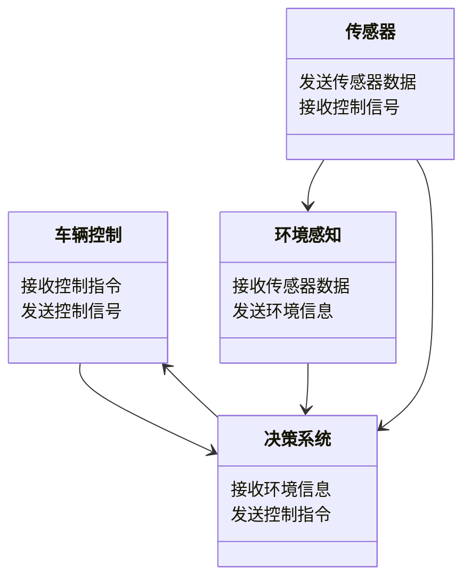
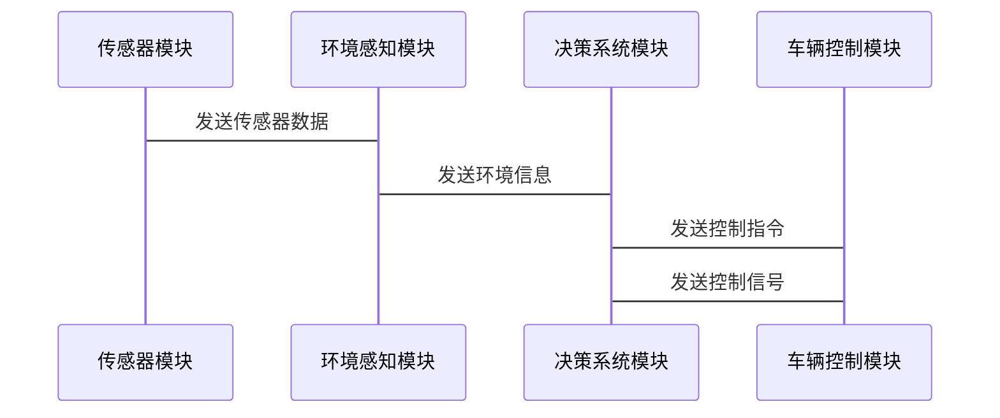

                 

# 自动驾驶技术发展与相关产业链投资

> 关键词：自动驾驶技术、产业链投资、感知系统、决策系统、控制系统、投资策略

> 摘要：本文深入分析了自动驾驶技术的发展历程、核心技术、产业链结构以及相关投资机会。通过系统架构设计和算法实现的详细解读，结合实际案例分析，为投资者提供了全面的自动驾驶技术投资指南。

---

## 第一部分：自动驾驶技术发展与相关产业链概述

### 第1章：自动驾驶技术的发展历程

#### 1.1 自动驾驶的起源与演进

##### 1.1.1 自动驾驶的定义与核心概念

自动驾驶（Autonomous Driving）是指车辆能够在不同程度上实现独立操作，无需人类驾驶员的干预。根据国际汽车工程师协会（SAE）的定义，自动驾驶技术分为L0到L5六个等级：

- **L0**：无自动驾驶功能，完全由人类驾驶。
- **L1**：辅助驾驶，如自适应巡航控制（ACC）。
- **L2**：部分自动驾驶，如车道保持辅助（LKA）和自适应巡航控制（ACC）的结合。
- **L3**：有条件自动驾驶，车辆在特定条件下可以独立完成驾驶任务，但需要人类驾驶员在必要时接管。
- **L4**：高度自动驾驶，车辆在大多数情况下可以独立完成驾驶任务，但在特定区域或条件下可能需要人类干预。
- **L5**：完全自动驾驶，车辆在所有条件下都可以独立完成驾驶任务。

##### 1.1.2 自动驾驶技术的历史发展

自动驾驶技术的起源可以追溯到20世纪初。1925年，第一辆带有自动驾驶功能的车辆出现，但当时的技术非常初级。20世纪80年代，随着计算机技术和传感器技术的进步，自动驾驶技术开始快速发展。进入21世纪，随着人工智能和深度学习技术的突破，自动驾驶技术进入商业化阶段。

##### 1.1.3 当前自动驾驶技术的主流路线

目前，主流的自动驾驶技术路线包括：

- **传感器融合**：通过激光雷达（LiDAR）、摄像头、雷达和超声波传感器等多种传感器的融合，实现对环境的全面感知。
- **深度学习算法**：利用卷积神经网络（CNN）和目标检测算法（如YOLO、Faster R-CNN）进行目标识别和语义分割。
- **实时路径规划**：基于地图数据和实时环境感知，通过A*算法、Dijkstra算法或RRT（Rapidly-exploring Random Tree）算法进行路径规划。

#### 1.2 自动驾驶的关键技术特点

##### 1.2.1 自动驾驶的核心技术要素

自动驾驶的核心技术包括：

- **感知系统**：通过传感器感知车辆周围的环境信息，如车道线、障碍物、交通标志等。
- **决策系统**：基于感知信息和地图数据，通过算法进行路径规划和行为决策。
- **控制系统**：通过执行机构（如转向、加速和制动）实现车辆的自动驾驶。

##### 1.2.2 自动驾驶与传统驾驶的区别

自动驾驶与传统驾驶的主要区别在于：

- **自动化程度**：自动驾驶车辆能够在不同程度上实现独立操作，而传统驾驶完全依赖人类驾驶员。
- **技术复杂性**：自动驾驶需要结合传感器、算法和执行机构等多方面的技术，而传统驾驶主要依赖驾驶员的反应能力和经验。
- **安全性**：自动驾驶通过传感器和算法实现更高的安全性，而传统驾驶存在人为错误的可能性。

##### 1.2.3 自动驾驶的分类与等级划分

根据SAE（国际汽车工程师协会）的定义，自动驾驶技术分为L0到L5六个等级：

- **L0**：无自动驾驶功能，完全由人类驾驶。
- **L1**：辅助驾驶，如自适应巡航控制（ACC）。
- **L2**：部分自动驾驶，如车道保持辅助（LKA）和自适应巡航控制（ACC）的结合。
- **L3**：有条件自动驾驶，车辆在特定条件下可以独立完成驾驶任务，但需要人类驾驶员在必要时接管。
- **L4**：高度自动驾驶，车辆在大多数情况下可以独立完成驾驶任务，但在特定区域或条件下可能需要人类干预。
- **L5**：完全自动驾驶，车辆在所有条件下都可以独立完成驾驶任务。

#### 1.3 自动驾驶产业链的构成

##### 1.3.1 产业链上游：硬件与软件供应商

自动驾驶产业链的上游包括硬件和软件供应商：

- **硬件供应商**：提供传感器（如激光雷达、摄像头、雷达）、计算平台（如AI芯片、GPU）、执行机构（如转向、加速、制动）等硬件设备。
- **软件供应商**：提供自动驾驶系统软件、算法库、地图服务等。

##### 1.3.2 产业链中游：系统集成与解决方案提供者

中游包括系统集成商和解决方案提供商：

- **系统集成商**：将上游提供的硬件和软件进行集成，形成完整的自动驾驶系统。
- **解决方案提供商**：提供自动驾驶技术的整体解决方案，如感知算法、路径规划、决策控制等。

##### 1.3.3 产业链下游：整车制造商与出行服务提供商

下游包括整车制造商和出行服务提供商：

- **整车制造商**：将自动驾驶系统集成到车辆中，生产具备自动驾驶功能的汽车。
- **出行服务提供商**：提供自动驾驶出租车、共享出行等服务，如滴滴、Uber等。

---

## 第二部分：自动驾驶技术的核心技术分析

### 第2章：自动驾驶技术的核心技术分析

#### 2.1 自动驾驶的感知系统

##### 2.1.1 传感器技术：激光雷达、摄像头、雷达

自动驾驶的感知系统主要包括以下几种传感器：

- **激光雷达（LiDAR）**：通过发射激光束并接收反射信号，生成车辆周围的三维点云图，用于障碍物检测和环境建模。
- **摄像头**：通过摄像头捕捉环境中的图像信息，利用图像处理技术（如深度学习）进行目标识别和语义分割。
- **雷达**：通过发射无线电波并接收反射信号，检测车辆周围的障碍物和道路信息。

##### 2.1.2 数据融合与处理算法

为了提高感知系统的准确性，通常需要将多种传感器的数据进行融合处理。常见的数据融合方法包括：

- **加权融合**：根据传感器的可靠性和精度，对传感器数据进行加权融合。
- **卡尔曼滤波**：一种基于状态估计的融合算法，常用于传感器数据的实时融合。
- **深度学习融合**：通过神经网络模型对多源传感器数据进行联合学习和融合。

##### 2.1.3 感知系统的优缺点对比

| 传感器类型 | 优点 | 缺点 |
|------------|------|------|
| 激光雷达（LiDAR） | 高精度、三维建模能力强 | 成本高、易受天气影响 |
| 摄像头 | 成本低、信息丰富 | 易受光照和天气影响 |
| 雷达 | 抗恶劣天气能力强 | 精度较低 |

#### 2.2 自动驾驶的决策系统

##### 2.2.1 路径规划算法

路径规划是自动驾驶决策系统的核心部分，常用的算法包括：

- **A*算法**：一种基于图搜索的路径规划算法，适用于静态环境。
- **Dijkstra算法**：一种基于图搜索的路径规划算法，适用于动态环境。
- **RRT（Rapidly-exploring Random Tree）算法**：一种基于采样的路径规划算法，适用于高维空间和复杂环境。

##### 2.2.2 行为决策模型

行为决策模型用于在复杂环境中做出决策，常见的模型包括：

- **基于规则的决策模型**：通过预设的规则（如交通法规）进行决策。
- **基于强化学习的决策模型**：通过强化学习算法（如Q-learning、Deep Q-Network）进行决策。
- **基于博弈论的决策模型**：通过博弈论方法模拟其他交通参与者的行为，进行决策。

##### 2.2.3 决策系统的复杂性分析

决策系统的复杂性主要体现在以下几个方面：

- **环境复杂性**：自动驾驶车辆需要在复杂的交通环境中做出决策，涉及多种交通参与者（如行人、车辆、自行车等）。
- **决策冲突**：在某些情况下，不同的决策可能产生冲突，需要进行权衡和优化。
- **实时性要求**：决策系统需要在短时间内做出决策，以保证车辆的安全性和流畅性。

#### 2.3 自动驾驶的控制系统

##### 2.3.1 执行机构：转向、加速、制动

自动驾驶的执行机构主要包括：

- **转向系统**：通过电动助力转向（EPS）实现车辆的自动转向。
- **加速系统**：通过电控油门（ETC）实现车辆的自动加速。
- **制动系统**：通过电子稳定性控制（ESC）实现车辆的自动制动。

##### 2.3.2 控制算法：PID控制与模型预测控制

常用的控制算法包括：

- **PID控制**：一种基于比例-积分-微分（PID）的控制算法，常用于位置控制和速度控制。
- **模型预测控制（MPC）**：一种基于系统模型的控制算法，常用于复杂系统的控制。

##### 2.3.3 控制系统的稳定性与响应速度

控制系统的稳定性与响应速度是衡量自动驾驶性能的重要指标：

- **稳定性**：控制系统在面对外界干扰时，能够保持系统的稳定运行。
- **响应速度**：控制系统对指令的响应速度，直接影响车辆的驾驶体验和安全性。

---

## 第三部分：自动驾驶产业链的投资机会

### 第3章：自动驾驶产业链的投资机会

#### 3.1 产业链上游的投资热点

##### 3.1.1 智能传感器：激光雷达、摄像头

传感器是自动驾驶的核心部件，投资传感器技术是当前的热点之一。例如，激光雷达（LiDAR）技术的突破将极大提升自动驾驶的感知能力。

##### 3.1.2 芯片与计算平台：AI芯片、高性能计算单元

随着自动驾驶技术的不断发展，对计算能力的需求也在不断增加。投资高性能计算平台（如AI芯片、GPU）是当前的一个重要方向。

##### 3.1.3 软件算法：自动驾驶系统开发

自动驾驶系统的开发需要大量的算法支持，包括感知算法、决策算法和控制算法。投资于自动驾驶算法的开发和优化也是当前的热点。

#### 3.2 产业链中游的投资机会

##### 3.2.1 系统集成与解决方案提供者

系统集成商需要将上游提供的硬件和软件进行集成，形成完整的自动驾驶系统。投资于系统集成商是当前的一个重要方向。

##### 3.2.2 数据服务：高精度地图、实时数据服务

自动驾驶需要依赖高精度地图和实时数据服务。投资于地图数据和实时数据服务的提供者也是当前的一个热点。

##### 3.2.3 测试与认证：自动驾驶测试场、认证机构

随着自动驾驶技术的不断发展，对测试和认证的需求也在不断增加。投资于自动驾驶测试场和认证机构也是当前的一个重要方向。

#### 3.3 产业链下游的投资机会

##### 3.3.1 整车制造商：传统车企的转型与创新

传统车企正在加速向自动驾驶方向转型。投资于具备创新能力的传统车企也是当前的一个重要方向。

##### 3.3.2 出行服务：自动驾驶出租车、共享出行

自动驾驶出租车和共享出行是自动驾驶技术的重要应用场景。投资于出行服务提供商也是当前的一个热点。

##### 3.3.3 用户需求：消费者对自动驾驶接受度的分析

随着技术的不断进步，消费者对自动驾驶的接受度也在逐步提高。投资于用户需求的研究和分析也是当前的一个重要方向。

---

## 第四部分：自动驾驶技术的系统架构与算法实现

### 第4章：自动驾驶系统的架构设计

#### 4.1 自动驾驶系统的架构设计

##### 4.1.1 系统功能设计（领域模型Mermaid类图）

##### 4.1.2 系统架构设计（Mermaid架构图）

##### 4.1.3 系统接口设计

- **环境感知模块接口**：接收传感器数据，发送环境信息。
- **决策系统模块接口**：接收环境信息，发送控制指令。
- **车辆控制模块接口**：接收控制指令，发送控制信号。

##### 4.1.4 系统交互设计（Mermaid序列图）

#### 4.2 自动驾驶系统的算法实现

##### 4.2.1 传感器数据融合算法

传感器数据融合算法的实现步骤如下：

1. 接收多种传感器的数据（如激光雷达、摄像头、雷达）。
2. 对传感器数据进行预处理（如去噪、校准）。
3. 使用卡尔曼滤波或深度学习模型对数据进行融合。
4. 输出融合后的环境信息。

##### 4.2.2 路径规划算法

路径规划算法的实现步骤如下：

1. 接收环境信息（如障碍物、道路、目标点）。
2. 构建地图或环境模型。
3. 选择合适的路径规划算法（如A*、Dijkstra、RRT）。
4. 输出规划路径。

##### 4.2.3 决策控制算法

决策控制算法的实现步骤如下：

1. 接收环境信息和路径规划结果。
2. 分析交通规则和场景。
3. 选择合适的决策策略。
4. 输出控制指令。

#### 4.3 自动驾驶系统的数学模型与公式

##### 4.3.1 感知系统中的目标检测

目标检测的数学模型可以表示为：

$$
y = f(x)
$$

其中，$x$ 是输入图像，$y$ 是输出结果（如目标的位置和类别）。

##### 4.3.2 决策系统中的路径规划

路径规划的数学模型可以表示为：

$$
\min_{x} \sum_{i=1}^{n} (x_i - x_{i-1})^2
$$

其中，$x$ 是路径上的点，$n$ 是路径的长度。

---

## 第五部分：自动驾驶技术的未来展望

### 第5章：自动驾驶技术的未来展望

#### 5.1 自动驾驶技术的发展趋势

随着人工智能和深度学习技术的不断进步，自动驾驶技术将朝着以下几个方向发展：

- **完全自动驾驶**：未来，L5级别的完全自动驾驶将逐步普及。
- **多场景应用**：自动驾驶技术将不仅仅局限于乘用车，还将扩展到商用车、特种车辆等领域。
- **智能化与网联化结合**：未来的自动驾驶技术将更加智能化和网联化，实现车车通信和车路协同。

#### 5.2 自动驾驶技术的政策影响

自动驾驶技术的发展离不开政策的支持和规范。未来，各国政府将出台更多的政策法规，规范自动驾驶技术的开发和应用。

#### 5.3 自动驾驶技术的投资机会

随着自动驾驶技术的不断发展，投资机会也将随之增加。投资者可以关注以下领域：

- **核心技术研发**：如感知算法、决策算法、控制系统等。
- **产业链整合**：如系统集成、数据服务、测试认证等。
- **新兴市场开拓**：如东南亚、拉丁美洲等新兴市场的自动驾驶技术应用。

---

## 作者：AI天才研究院/AI Genius Institute & 禅与计算机程序设计艺术 /Zen And The Art of Computer Programming

