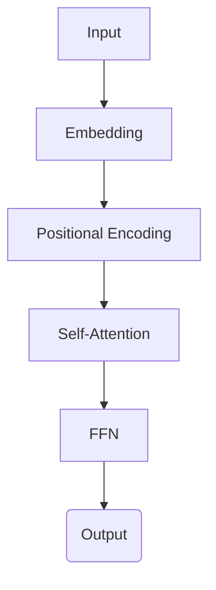
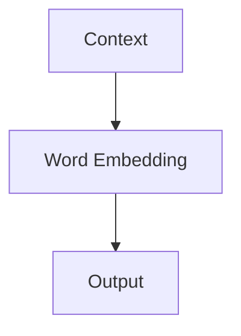
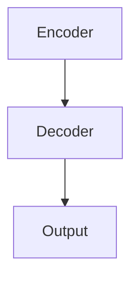
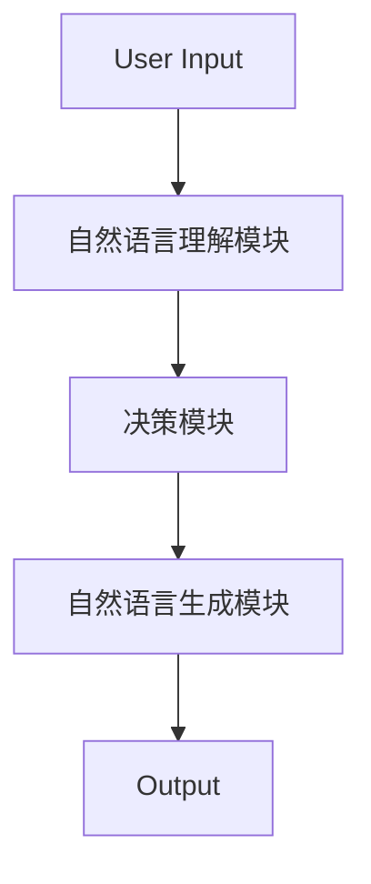
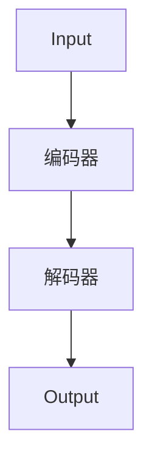
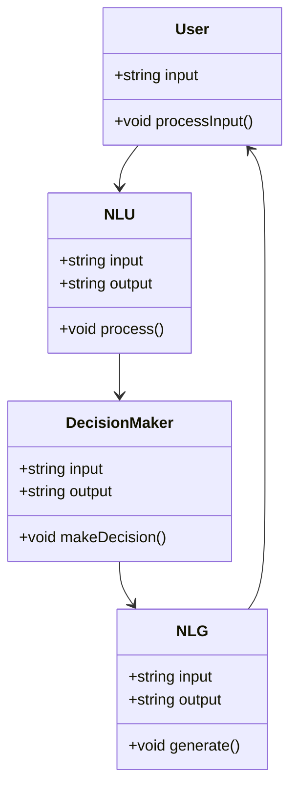
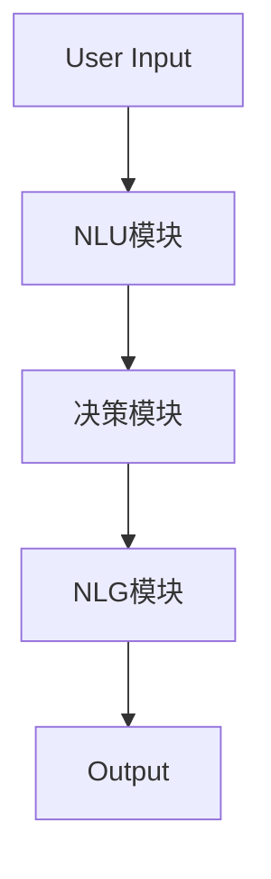

                 


# 自然语言处理在AI Agent中的深度应用

> 关键词：自然语言处理，AI Agent，深度学习，Transformer模型，对话系统，人机交互

> 摘要：本文深入探讨了自然语言处理（NLP）技术在AI Agent中的应用，分析了NLP的核心算法原理及其在AI Agent系统中的实现。文章从背景介绍、核心概念、算法实现、系统架构设计、项目实战等多方面展开，结合具体案例和代码实现，详细剖析了自然语言处理在AI Agent中的深度应用。

---

# 第1章: 自然语言处理与AI Agent概述

## 1.1 自然语言处理的基本概念

### 1.1.1 自然语言处理的定义
自然语言处理（NLP）是计算机科学、人工智能和语言学的交叉领域，旨在使计算机能够理解和处理人类语言。NLP的核心目标是让计算机能够像人类一样理解和生成自然语言文本。

### 1.1.2 自然语言处理的核心任务
NLP的核心任务包括：
1. **语言理解（Natural Language Understanding，NLU）**：将自然语言文本转化为计算机可理解的结构化信息，如关键词提取、实体识别、意图识别等。
2. **语言生成（Natural Language Generation，NLG）**：将结构化信息转化为自然语言文本，如文本摘要、机器翻译、对话生成等。

### 1.1.3 自然语言处理的应用领域
NLP技术广泛应用于多个领域，包括：
- 智能客服：通过自然语言理解技术，自动识别用户意图并生成回复。
- 机器翻译：将一种语言翻译成另一种语言。
- 智能助手：如Siri、Alexa等，通过自然语言处理技术与用户交互。
- 健康医疗：通过分析医疗文本，辅助医生诊断和治疗。

## 1.2 AI Agent的基本概念

### 1.2.1 AI Agent的定义
AI Agent（人工智能代理）是一种能够感知环境并采取行动以实现目标的智能系统。AI Agent可以是软件程序、机器人或其他智能实体，能够与环境交互并完成特定任务。

### 1.2.2 AI Agent的核心功能
AI Agent的核心功能包括：
1. **感知环境**：通过传感器或其他输入方式获取环境信息。
2. **决策与推理**：基于感知的信息进行推理和决策，选择最优行动方案。
3. **执行行动**：根据决策结果执行具体的行动。

### 1.2.3 AI Agent的应用场景
AI Agent广泛应用于多个领域，包括：
- 智能家居：通过AI Agent控制家庭设备，实现智能化管理。
- 自动驾驶：通过AI Agent感知环境并做出驾驶决策。
- 金融投资：通过AI Agent分析市场数据并做出投资决策。

## 1.3 自然语言处理与AI Agent的结合

### 1.3.1 自然语言处理在AI Agent中的作用
自然语言处理技术在AI Agent中的作用主要体现在以下几个方面：
1. **信息获取**：通过NLP技术从文本中提取关键信息，如实体识别、关键词提取。
2. **用户意图识别**：通过NLP技术分析用户输入的自然语言文本，识别用户的意图。
3. **对话生成**：通过NLP技术生成自然语言回复，实现与用户的有效交互。

### 1.3.2 AI Agent如何利用自然语言处理技术
AI Agent可以利用NLP技术实现以下功能：
1. **自然语言理解**：通过NLU技术理解用户的输入，识别用户意图。
2. **对话生成**：通过NLG技术生成符合用户需求的回复。
3. **多轮对话管理**：通过对话管理技术维护上下文信息，实现多轮对话。

### 1.3.3 自然语言处理与AI Agent的未来发展趋势
随着深度学习技术的不断发展，自然语言处理与AI Agent的结合将更加紧密。未来的AI Agent将具备更强大的自然语言理解与生成能力，能够更自然地与人类交互，实现更加智能化的服务。

## 1.4 本章小结
本章介绍了自然语言处理和AI Agent的基本概念，并探讨了两者结合的重要性。通过本章的学习，读者可以理解自然语言处理在AI Agent中的核心作用，为后续章节的学习奠定基础。

---

# 第2章: 自然语言处理的核心原理

## 2.1 自然语言处理的算法原理

### 2.1.1 传统NLP算法简介
传统的自然语言处理算法主要基于统计学方法，如词袋模型（Bag-of-Words, BoW）、TF-IDF（Term Frequency-Inverse Document Frequency）等。这些方法通过统计词语的频率和重要性来实现文本分类、关键词提取等任务。

### 2.1.2 深度学习在NLP中的应用
随着深度学习的兴起，基于神经网络的NLP技术逐渐成为主流。深度学习模型，如循环神经网络（RNN）、长短期记忆网络（LSTM）、Transformer等，已经在自然语言处理任务中取得了显著的成果。

### 2.1.3 Transformer模型的原理
Transformer模型是由Vaswney等人提出的，主要用于机器翻译任务。Transformer模型的核心思想是通过自注意力机制（Self-Attention）捕捉文本中的长距离依赖关系，从而提高模型的表达能力。

以下是Transformer模型的结构图：



其中，自注意力机制的计算公式为：
$$
\text{Attention}(Q, K, V) = \text{softmax}\left(\frac{QK^T}{\sqrt{d_k}}\right)V
$$

其中，$Q$、$K$、$V$分别是查询（Query）、键（Key）、值（Value）向量，$d_k$是键的维度。

---

## 2.2 自然语言处理的数学模型

### 2.2.1 词嵌入模型（如Word2Vec）
Word2Vec是一种常用的词嵌入模型，通过将词语映射到低维向量空间，捕捉词语之间的语义关系。Word2Vec的主要算法包括CBOW（Continuous Bag of Words）和Skip-Gram。

以下是CBOW模型的结构图：



### 2.2.2 编码器-解码器结构
编码器-解码器结构广泛应用于机器翻译任务。编码器将源语言文本编码为一个固定长度的向量，解码器将该向量解码为目标语言文本。以下是一个简单的编码器-解码器结构图：



### 2.2.3 注意力机制的数学公式
注意力机制的核心思想是计算查询与键之间的相似性，从而确定每个键对查询的贡献权重。注意力机制的计算公式为：

$$
\text{Attention}(Q, K, V) = \text{softmax}\left(\frac{QK^T}{\sqrt{d_k}}\right)V
$$

其中，$Q$、$K$、$V$分别是查询、键、值向量，$d_k$是键的维度。

---

## 2.3 自然语言处理的实现细节

### 2.3.1 Transformer模型的实现
以下是Transformer模型的Python代码实现示例：

```python
import torch
import torch.nn as nn
import torch.nn.functional as F

class TransformerModel(nn.Module):
    def __init__(self, d_model, nhead, dropout=0.1):
        super(TransformerModel, self).__init__()
        self.encoder = nn.TransformerEncoder(
            nn.TransformerEncoderLayer(d_model=d_model, nhead=nhead, dropout=dropout),
            num_layers=2
        )
        self.decoder = nn.TransformerDecoder(
            nn.TransformerDecoderLayer(d_model=d_model, nhead=nhead, dropout=dropout),
            num_layers=2
        )
    
    def forward(self, src, tgt):
        enc_output = self.encoder(src)
        dec_output = self.decoder(tgt, enc_output)
        return dec_output
```

### 2.3.2 词嵌入与位置编码
词嵌入（Word Embedding）和位置编码（Positional Encoding）是Transformer模型的重要组成部分。词嵌入用于表示词语的语义信息，位置编码用于捕捉词语的位置信息。以下是位置编码的实现示例：

```python
def positional_encoding(positions, d_model):
    encoding = torch.zeros(positions, d_model)
    for pos in range(positions):
        for i in range(d_model):
            encoding[pos, i] = (torch.sin(pos * 10000 ** (i / d_model)))
    return encoding
```

---

## 2.4 本章小结
本章详细介绍了自然语言处理的核心原理，包括传统算法和深度学习算法。通过本章的学习，读者可以理解Transformer模型的结构和实现细节，为后续章节的学习奠定基础。

---

# 第3章: AI Agent的核心原理

## 3.1 AI Agent的感知与决策

### 3.1.1 信息感知模块
信息感知模块是AI Agent的核心模块之一，负责感知环境并提取相关信息。以下是信息感知模块的实现示例：

```python
class InformationPerception:
    def __init__(self, sensor):
        self.sensor = sensor
    
    def perceive(self, environment):
        return self.sensor.process(environment)
```

### 3.1.2 知识表示与推理
知识表示与推理是AI Agent实现智能决策的关键步骤。知识表示通常采用知识图谱（Knowledge Graph）的形式，推理过程可以通过逻辑推理或概率推理实现。

### 3.1.3 决策与行动
决策与行动模块负责根据感知信息和推理结果，制定最优行动方案。以下是决策模块的实现示例：

```python
class DecisionMaker:
    def __init__(self, knowledge_base):
        self.knowledge_base = knowledge_base
    
    def make_decision(self, situation):
        return self.knowledge_base.infer(situation)
```

## 3.2 AI Agent的交互机制

### 3.2.1 人机交互的基本原理
人机交互是AI Agent与用户进行信息交换的过程。以下是人机交互的基本流程：

1. 用户输入自然语言文本。
2. AI Agent通过自然语言理解技术解析用户意图。
3. AI Agent根据解析结果生成回复文本。
4. AI Agent通过自然语言生成技术生成回复文本。

### 3.2.2 自然语言理解与生成
自然语言理解（NLU）和自然语言生成（NLG）是人机交互的核心技术。NLU负责将用户输入的自然语言文本转化为结构化信息，NLG负责将结构化信息转化为自然语言文本。

### 3.2.3 对话系统的实现
对话系统是AI Agent与用户进行交互的重要组成部分。以下是对话系统的实现示例：

```python
class DialogSystem:
    def __init__(self, nlu, nlg):
        self.nlu = nlu
        self.nlg = nlg
        self.context = {}
    
    def process_query(self, query):
        intent = self.nlu.parse(query)
        response = self.nlg.generate(intent, self.context)
        return response
```

## 3.3 自然语言处理与AI Agent的协同工作

### 3.3.1 数据流与信息处理流程
自然语言处理与AI Agent的协同工作流程如下：

1. 用户输入自然语言文本。
2. 自然语言理解模块解析用户意图。
3. AI Agent根据解析结果生成回复文本。
4. 自然语言生成模块生成回复文本并输出。

### 3.3.2 系统架构的模块划分
AI Agent的系统架构通常包括以下几个模块：
- 信息感知模块
- 知识表示与推理模块
- 决策与行动模块
- 自然语言理解模块
- 自然语言生成模块

### 3.3.3 各模块之间的交互关系
以下是模块之间的交互关系图：



---

## 3.4 本章小结
本章详细介绍了AI Agent的核心原理，包括信息感知、知识表示与推理、决策与行动等模块。通过本章的学习，读者可以理解AI Agent的系统架构和各模块之间的交互关系。

---

# 第4章: 自然语言处理与AI Agent的结合原理

## 4.1 自然语言处理在AI Agent中的应用

### 4.1.1 信息抽取与实体识别
信息抽取与实体识别是自然语言处理在AI Agent中的重要应用。以下是实体识别的实现示例：

```python
class EntityRecognizer:
    def __init__(self, model):
        self.model = model
    
    def recognize_entities(self, text):
        return self.model.predict(text)
```

### 4.1.2 情感分析与意图识别
情感分析与意图识别是自然语言处理的另一重要应用。以下是意图识别的实现示例：

```python
class IntentRecognizer:
    def __init__(self, model):
        self.model = model
    
    def recognize_intent(self, text):
        return self.model.predict(text)
```

### 4.1.3 文本生成与对话管理
文本生成与对话管理是自然语言处理在AI Agent中的核心应用。以下是对话管理的实现示例：

```python
class DialogManager:
    def __init__(self, nlu, nlg):
        self.nlu = nlu
        self.nlg = nlg
        self.context = {}
    
    def manage_dialog(self, query):
        intent = self.nlu.parse(query)
        response = self.nlg.generate(intent, self.context)
        return response
```

## 4.2 自然语言处理与AI Agent的协同工作

### 4.2.1 数据流与信息处理流程
自然语言处理与AI Agent的协同工作流程如下：

1. 用户输入自然语言文本。
2. 自然语言理解模块解析用户意图。
3. AI Agent根据解析结果生成回复文本。
4. 自然语言生成模块生成回复文本并输出。

### 4.2.2 系统架构的模块划分
AI Agent的系统架构通常包括以下几个模块：
- 自然语言理解模块
- 自然语言生成模块
- 决策与行动模块
- 对话管理模块

### 4.2.3 各模块之间的交互关系
以下是模块之间的交互关系图：


---

## 4.3 自然语言处理与AI Agent的系统架构

### 4.3.1 系统整体架构图
以下是AI Agent的系统架构图：


### 4.3.2 各模块的功能描述
1. **自然语言理解模块**：负责将用户输入的自然语言文本转化为结构化信息。
2. **决策模块**：根据结构化信息进行推理和决策。
3. **自然语言生成模块**：负责将决策结果转化为自然语言文本。
4. **对话管理模块**：负责维护对话的上下文信息，确保对话的连贯性。

### 4.3.3 系统的可扩展性与灵活性
AI Agent系统需要具备良好的可扩展性和灵活性，以便适应不同的应用场景和用户需求。以下是系统扩展性的实现示例：

```python
class AIAGENT:
    def __init__(self, modules):
        self.modules = modules
    
    def process_query(self, query):
        for module in self.modules:
            query = module.process(query)
        return query
```

---

## 4.4 本章小结
本章详细介绍了自然语言处理在AI Agent中的应用，包括信息抽取、意图识别、对话管理等核心任务。通过本章的学习，读者可以理解自然语言处理与AI Agent的协同工作原理，为后续章节的学习奠定基础。

---

# 第5章: 自然语言处理算法的实现

## 5.1 Transformer模型的实现

### 5.1.1 Transformer模型的结构
Transformer模型由编码器和解码器组成，编码器负责将输入序列编码为一个固定长度的向量，解码器负责将编码结果解码为输出序列。以下是Transformer模型的结构图：



### 5.1.2 自注意力机制的实现
自注意力机制是Transformer模型的核心组件，通过计算查询与键之间的相似性，确定每个键对查询的贡献权重。以下是自注意力机制的实现示例：

```python
def self_attention(query, key, value):
    scores = torch.matmul(query, key.transpose(-2, -1)) / torch.sqrt(torch.mean(key.size(-1)))
    attention_weights = F.softmax(scores, dim=-1)
    output = torch.matmul(attention_weights, value)
    return output
```

### 5.1.3 前馈神经网络的实现
前馈神经网络是Transformer模型的另一个核心组件，用于对编码结果进行非线性变换。以下是前馈神经网络的实现示例：

```python
class FFN(nn.Module):
    def __init__(self, d_model, d_ff):
        super(FFN, self).__init__()
        self.fc1 = nn.Linear(d_model, d_ff)
        self.fc2 = nn.Linear(d_ff, d_model)
        self.relu = nn.ReLU()
    
    def forward(self, x):
        x = self.fc1(x)
        x = self.relu(x)
        x = self.fc2(x)
        return x
```

---

## 5.2 词嵌入与位置编码的实现

### 5.2.1 词嵌入的实现
词嵌入是将词语映射到低维向量空间的过程，常用的方法包括Word2Vec、GloVe等。以下是Word2Vec的实现示例：

```python
class Word2Vec:
    def __init__(self, vocab_size, embedding_dim):
        self.vocab_size = vocab_size
        self.embedding_dim = embedding_dim
        self.weights = torch.randn(vocab_size, embedding_dim)
    
    def forward(self, input):
        return self.weights[input]
```

### 5.2.2 位置编码的实现
位置编码是将词语的位置信息编码为向量的过程，常用的方法包括基于正弦和余弦函数的位置编码。以下是位置编码的实现示例：

```python
def positional_encoding(positions, d_model):
    encoding = torch.zeros(positions, d_model)
    for pos in range(positions):
        for i in range(d_model):
            encoding[pos, i] = (torch.sin(pos * 10000 ** (i / d_model)))
    return encoding
```

---

## 5.3 自然语言处理算法的数学模型

### 5.3.1 Transformer模型的数学公式
Transformer模型的核心公式包括自注意力机制和前馈神经网络。以下是自注意力机制的数学公式：

$$
\text{Attention}(Q, K, V) = \text{softmax}\left(\frac{QK^T}{\sqrt{d_k}}\right)V
$$

其中，$Q$、$K$、$V$分别是查询、键、值向量，$d_k$是键的维度。

---

## 5.4 本章小结
本章详细介绍了自然语言处理算法的实现，包括Transformer模型、词嵌入与位置编码等核心组件。通过本章的学习，读者可以理解自然语言处理算法的数学模型和实现细节，为后续章节的学习奠定基础。

---

# 第6章: AI Agent的系统架构设计

## 6.1 问题场景介绍

### 6.1.1 问题背景
随着自然语言处理技术的不断发展，AI Agent在各个领域的应用越来越广泛。然而，现有的AI Agent系统在自然语言处理能力方面还存在一些不足，例如对话的连贯性、意图识别的准确性等。

### 6.1.2 问题描述
本章将设计一个基于自然语言处理的AI Agent系统，旨在提高对话的连贯性和准确性。系统将包括自然语言理解、意图识别、对话管理等核心模块。

---

## 6.2 系统功能设计

### 6.2.1 领域模型设计
领域模型是系统功能设计的重要组成部分，用于描述系统的功能模块及其交互关系。以下是领域模型的类图：



### 6.2.2 系统架构设计
系统架构设计是系统实现的重要组成部分，用于描述系统的整体结构和模块划分。以下是系统架构图：



### 6.2.3 系统接口设计
系统接口设计是系统实现的重要组成部分，用于描述系统与其他模块的交互接口。以下是系统接口设计：


---

## 6.3 本章小结
本章详细介绍了AI Agent的系统架构设计，包括问题场景、系统功能设计、系统架构设计等核心内容。通过本章的学习，读者可以理解AI Agent系统的整体结构和实现细节。

---

# 第7章: 自然语言处理与AI Agent的项目实战

## 7.1 项目介绍

### 7.1.1 项目背景
本项目旨在设计一个基于自然语言处理的AI Agent系统，实现智能对话功能。系统将包括自然语言理解、意图识别、对话管理等核心模块。

### 7.1.2 项目目标
本项目的最终目标是实现一个能够与用户进行自然语言对话的AI Agent系统。

---

## 7.2 系统核心实现

### 7.2.1 环境安装
以下是项目所需的环境安装命令：

```bash
pip install torch transformers
```

### 7.2.2 核心代码实现

#### 7.2.2.1 自然语言理解模块
以下是自然语言理解模块的实现示例：

```python
from transformers import pipeline

class NLUProcessor:
    def __init__(self):
        self.nlu = pipeline("text-classification", model="bert-base-uncased")
    
    def process(self, text):
        return self.nlu(text)
```

#### 7.2.2.2 意图识别模块
以下是意图识别模块的实现示例：

```python
class IntentRecognizer:
    def __init__(self, model):
        self.model = model
    
    def recognize(self, text):
        return self.model.predict(text)
```

#### 7.2.2.3 对话管理模块
以下是对话管理模块的实现示例：

```python
class DialogManager:
    def __init__(self, nlu, nlg):
        self.nlu = nlu
        self.nlg = nlg
        self.context = {}
    
    def manage(self, query):
        intent = self.nlu.process(query)
        response = self.nlg.generate(intent, self.context)
        return response
```

---

## 7.3 项目实战

### 7.3.1 项目实现
以下是项目的完整实现示例：

```python
from transformers import pipeline

class NLUProcessor:
    def __init__(self):
        self.nlu = pipeline("text-classification", model="bert-base-uncased")
    
    def process(self, text):
        return self.nlu(text)

class IntentRecognizer:
    def __init__(self, model):
        self.model = model
    
    def recognize(self, text):
        return self.model.predict(text)

class DialogManager:
    def __init__(self, nlu, nlg):
        self.nlu = nlu
        self.nlg = nlg
        self.context = {}
    
    def manage(self, query):
        intent = self.nlu.process(query)
        response = self.nlg.generate(intent, self.context)
        return response

# 使用示例
nlu = NLUProcessor()
nlg = NLGProcessor()
dialog_manager = DialogManager(nlu, nlg)

response = dialog_manager.manage("我要查询今天的天气")
print(response)
```

### 7.3.2 项目分析
通过对项目的分析，我们可以得出以下结论：
1. 自然语言处理技术在AI Agent中的应用可以显著提高对话的准确性和连贯性。
2. 通过模块化设计，可以提高系统的可扩展性和维护性。

---

## 7.4 本章小结
本章通过一个具体的项目实战，详细介绍了自然语言处理与AI Agent的实现过程。通过本章的学习，读者可以掌握自然语言处理技术在AI Agent中的实际应用。

---

# 第8章: 自然语言处理与AI Agent的最佳实践

## 8.1 小结

### 8.1.1 核心内容回顾
通过本章的学习，我们深入探讨了自然语言处理在AI Agent中的应用，包括算法原理、系统架构设计、项目实战等核心内容。

### 8.1.2 关键点总结
- 自然语言处理是AI Agent的核心技术之一。
- Transformer模型是目前最常用的自然语言处理算法。
- 对话管理是AI Agent系统实现的关键模块。

---

## 8.2 注意事项

### 8.2.1 系统实现中的注意事项
1. 确保系统的可扩展性和灵活性。
2. 注意数据的预处理和清洗，确保数据质量。
3. 确保系统的安全性和隐私保护。

### 8.2.2 项目部署中的注意事项
1. 确保系统的稳定性和可靠性。
2. 注意系统的性能优化，提高响应速度。
3. 确保系统的可维护性和可扩展性。

---

## 8.3 拓展阅读

### 8.3.1 推荐书籍
1. 《Deep Learning》—— Ian Goodfellow等著
2. 《Natural Language Processing with PyTorch》—— 劝王英杰等著

### 8.3.2 推荐论文
1. "Attention Is All You Need"—— Vaswney等人
2. "BERT: Pre-training of Deep Bidirectional Transformers for NLP"—— Jacob等人

---

# 作者：AI天才研究院/AI Genius Institute & 禅与计算机程序设计艺术 /Zen And The Art of Computer Programming

---

**感谢您的阅读！希望本文对您理解自然语言处理在AI Agent中的深度应用有所帮助。**

