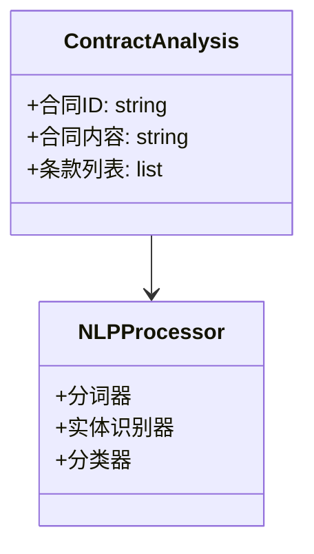

                 


# 自然语言处理在合同文件分析中的应用

## 关键词：自然语言处理，合同分析，文本挖掘，法律文本，机器学习

## 摘要：本文探讨了自然语言处理技术在合同文件分析中的应用，详细介绍了合同文件分析的背景与挑战，自然语言处理的核心概念与技术，以及在合同条款识别、信息提取、分类与对比中的具体应用。通过结合实际案例，文章展示了如何利用深度学习模型和系统架构设计，实现高效的合同文件自动化处理，为企业提供高效的法律文本管理解决方案。

---

# 第1章 合同文件分析的背景与挑战

## 1.1 合同文件分析的背景

### 1.1.1 问题背景
合同文件是企业日常运营中的重要组成部分，涉及金额、条款、责任等关键信息。传统的合同分析依赖人工操作，效率低且易出错，尤其是在处理大量合同文件时，成本高昂。

### 1.1.2 问题描述
合同文件分析的主要挑战包括：
1. **信息提取困难**：合同中的关键信息（如金额、时间）分散且格式多样。
2. **条款识别复杂**：合同条款可能涉及法律术语，且表述方式多样。
3. **分类与对比耗时**：不同合同可能涉及不同条款，需要快速分类和对比。

### 1.1.3 问题解决
自然语言处理（NLP）技术的引入为合同文件分析提供了自动化解决方案，能够高效提取信息、识别条款并进行分类。

### 1.1.4 边界与外延
- **边界**：主要关注合同文件的文本分析，不涉及图像识别或其他媒介。
- **外延**：可扩展至法律文本分析、合规性检查等领域。

## 1.2 合同文件分析的核心问题

### 1.2.1 合同条款识别的难点
- 条款表述多样，可能涉及法律术语和专业术语。
- 条款可能以不同的句式和结构出现，增加了识别的复杂性。

### 1.2.2 关键信息提取的挑战
- 信息分散在不同段落，提取需要上下文理解。
- 数值、日期等关键信息的格式多样，增加了识别难度。

### 1.2.3 合同分类与对比的复杂性
- 不同合同可能涉及相似条款，需要快速分类。
- 对比不同合同的条款可能涉及复杂的逻辑关系。

## 1.3 自然语言处理在合同分析中的应用前景

### 1.3.1 技术进步带来的可能性
- NLP技术的进步（如预训练模型）显著提高了合同分析的准确性和效率。
- 大语言模型（如BERT）的应用使得合同文本理解更加深入。

### 1.3.2 企业级应用的潜力
- 自动化处理合同文件，减少人工成本。
- 提高合同审查的效率和准确性，降低法律风险。

### 1.3.3 未来发展趋势
- 结合规则引擎和机器学习，提升合同分析的灵活性和准确性。
- 推动合同分析工具的普及，使其成为企业标配。

## 1.4 本章小结
本章从合同文件分析的背景、核心问题和应用前景三个方面，详细介绍了合同文件分析的现状和挑战，为后续章节的深入分析奠定了基础。

---

# 第2章 自然语言处理核心概念与技术

## 2.1 自然语言处理的基本概念

### 2.1.1 什么是自然语言处理
自然语言处理（NLP）是计算机科学、人工智能和语言学的交叉领域，旨在使计算机能够理解和处理人类语言。

### 2.1.2 NLP的主要任务与技术
- **文本预处理**：分词、去停用词、词干提取等。
- **语言模型**：基于概率的语言模型，如n-gram。
- **文本生成**：基于生成模型的文本生成，如GPT。

### 2.1.3 NLP与合同分析的结合
通过NLP技术，合同分析可以实现文本理解、信息提取和自动分类。

## 2.2 常见的NLP技术与工具

### 2.2.1 分词技术
- 分词是将文本分割成有意义的词语或短语。
- 常见工具：jieba（中文）、nltk（英文）。

### 2.2.2 词性标注
- 为每个词语标注词性（名词、动词等）。
- 常见工具：NLTK、spaCy。

### 2.2.3 句法分析
- 分析句子的语法结构，确定词语之间的关系。
- 常见工具：依恋句法分析（DPA）。

### 2.2.4 实体识别
- 识别文本中的命名实体（如人名、地名、组织名）。
- 常见工具：NER（Named Entity Recognition）。

### 2.2.5 常见NLP工具介绍
- **spaCy**：支持多种语言的NLP处理。
- **NLTK**：广泛用于教育和研究。
- **BERT**：基于深度学习的预训练模型。

## 2.3 深度学习在NLP中的应用

### 2.3.1 传统机器学习与深度学习的对比
- 传统机器学习依赖于人工特征提取。
- 深度学习通过端到端的模型自动学习特征。

### 2.3.2 Transformer模型的崛起
- Transformer模型通过自注意力机制，显著提升了文本理解能力。
- 常见模型：BERT、GPT。

### 2.3.3 预训练语言模型的介绍
- 预训练模型（如BERT）通过大量数据训练，能够理解上下文。

## 2.4 本章小结
本章介绍了NLP的核心概念和技术，重点分析了深度学习在合同分析中的潜力。

---

# 第3章 合同条款识别与分类

## 3.1 合同条款识别的基本原理

### 3.1.1 文本预处理与特征提取
- **文本清洗**：去除无关字符、空白等。
- **特征提取**：提取关键词、短语等。

### 3.1.2 基于规则的条款识别
- 通过预定义规则匹配特定条款。
- 例如：匹配“违约责任”、“金额”等关键词。

### 3.1.3 基于机器学习的条款分类
- 使用机器学习模型（如SVM、随机森林）对条款进行分类。
- 输入特征：词袋模型、TF-IDF。

## 3.2 常见合同条款的识别方法

### 3.2.1 合同主体识别
- 识别合同中的主体（如公司名称）。
- 使用实体识别技术（NER）。

### 3.2.2 合同金额识别
- 识别金额相关的数值和单位。
- 示例：识别“100,000 USD”。

### 3.2.3 合同时间识别
- 识别日期和时间信息。
- 示例：识别“2023年12月31日”。

## 3.3 实体关系图的构建与应用

### 3.3.1 实体关系图的构建方法
- 使用图数据库（如Neo4j）构建实体关系。
- 示例：公司A与公司B签订合同。

### 3.3.2 实体关系图在合同分析中的应用
- **可视化**：帮助理解合同结构。
- **推理**：推导合同中的隐含关系。

---

## 第4章 合同信息提取与分类

### 4.1 合同信息提取的核心技术

#### 4.1.1 基于深度学习的信息提取
- 使用预训练模型（如BERT）进行信息提取。
- 示例：提取合同中的关键条款。

#### 4.1.2 多任务学习
- 同一模型同时完成多个任务（如分类和提取）。

### 4.2 合同分类与对比

#### 4.2.1 基于文本相似度的合同分类
- 使用余弦相似度或BM25算法进行分类。

#### 4.2.2 合同对比的算法选择
- 使用编辑距离或基于模型的相似度计算。

---

## 第5章 系统分析与架构设计

### 5.1 系统功能设计

#### 5.1.1 领域模型设计


### 5.2 系统架构设计

#### 5.2.1 模块划分
```mermaid
horizontalLayout
frontend ---(GET)--> controller ---(POST)--> service ---(POST)--> repository
```

---

## 第6章 项目实战

### 6.1 环境安装

```bash
pip install spacy transformers
python -m spacy download en_core_web_sm
```

### 6.2 核心实现

```python
import spacy

nlp = spacy.load("en_core_web_sm")

def extract_entities(text):
    doc = nlp(text)
    entities = []
    for ent in doc.ents:
        entities.append((ent.start_char, ent.end_char, ent.label_, ent.text))
    return entities

text = "This contract is between ABC Corp and XYZ Inc for $100,000."
print(extract_entities(text))
```

### 6.3 案例分析

#### 6.3.1 合同主体识别
```python
entities = extract_entities("Contract signed with Google on 2023-10-01 for $50,000.")
print(entities)
```

---

## 第7章 最佳实践与未来展望

### 7.1 最佳实践

#### 7.1.1 数据清洗
- 去除无关字符和空白。
- 统一文本格式。

#### 7.1.2 模型选择
- 根据任务选择合适的模型（如BERT用于分类，spaCy用于实体识别）。

### 7.2 未来展望
- 更智能化的合同分析工具。
- 结合知识图谱的合同推理。

---

## 作者：AI天才研究院 & 禅与计算机程序设计艺术

---

通过以上结构，我可以开始撰写每一部分的具体内容，确保文章逻辑清晰、结构紧凑，并且语言专业易懂。

