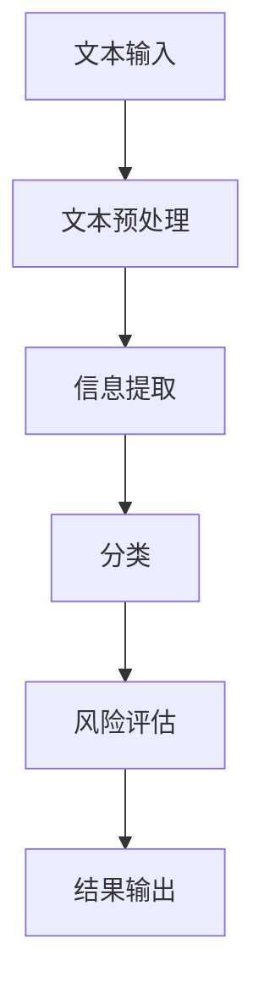

                 


# 自然语言处理在监管文件分析中的应用

> 关键词：自然语言处理，监管文件分析，文本挖掘，机器学习，深度学习

> 摘要：本文探讨了自然语言处理（NLP）技术在监管文件分析中的应用，重点介绍了监管文件分析的核心任务、NLP的关键算法及其在监管文件分析中的具体应用。通过详细讲解背景、核心概念、算法原理、系统架构设计和项目实战，本文为读者提供了一套完整的监管文件分析解决方案，展示了NLP在这一领域的巨大潜力和实际应用价值。

---

## 第一部分: 自然语言处理在监管文件分析中的应用概述

### 第1章: 自然语言处理基础

#### 1.1 自然语言处理的定义与核心概念

自然语言处理（NLP）是人工智能领域的一个重要分支，旨在让计算机能够理解、生成和处理人类语言。其核心目标是实现人机交互的自然语言理解和生成。NLP的核心技术包括：

- **词袋模型**：将文本表示为单词的集合，不考虑顺序。
- **词嵌入技术**（如Word2Vec、GloVe）：通过训练模型将单词映射为低维向量，捕捉单词的语义信息。
- **循环神经网络（RNN）**：适用于序列数据的处理，如文本生成和机器翻译。
- **变换器架构（Transformer）**：近年来在NLP领域取得了突破性进展，广泛应用于文本分类、翻译和摘要等任务。

#### 1.2 监管文件分析的背景与需求

监管文件通常包括法律法规、公司财报、合同协议等，这些文件内容复杂、术语专业，且需要快速提取关键信息。监管文件分析的主要需求包括：

- **文本分类**：将文件分为不同类别，如法律文件、财务报告等。
- **实体识别与链接**：识别文件中的关键实体（如公司名称、日期）并建立关联。
- **风险评估**：通过分析文本内容，识别潜在的法律风险或财务风险。

#### 1.3 自然语言处理与监管文件分析的结合

NLP在监管文件分析中的优势在于其能够自动提取和分析文本信息，提高效率和准确性。监管文件分析对NLP的需求主要体现在：

- **高精度信息提取**：需要准确识别专业术语和关键信息。
- **复杂语义理解**：监管文件中的语义通常较为复杂，需要深度理解能力。
- **自动化处理**：通过自动化技术减少人工审查的时间和成本。

---

### 第2章: 监管文件分析的核心技术

#### 2.1 自然语言处理中的关键算法

在监管文件分析中，常用的NLP算法包括：

1. **词袋模型**：将文本表示为单词的集合，常用于分类任务。
2. **词嵌入技术**：通过Word2Vec或GloVe将单词映射为向量，捕捉语义信息。
3. **循环神经网络（RNN）**：适用于序列数据的处理，如文本生成和机器翻译。
4. **变换器架构（Transformer）**：在文本分类和摘要任务中表现优异。

#### 2.2 监管文件分析中的核心任务

监管文件分析的核心任务包括：

1. **文本分类**：将文件分为不同的类别，如法律文件、财务报告等。
2. **实体识别与链接**：识别文件中的实体并建立关联。
3. **风险评估**：通过分析文本内容，识别潜在的法律或财务风险。
4. **文本摘要**：提取文件的核心内容，生成简洁的摘要。

#### 2.3 自然语言处理与监管文件分析的结合技术

结合技术包括：

1. **基于规则的文本分析**：利用预定义的规则进行文本匹配和分类。
2. **基于统计的文本分析**：通过统计方法提取文本特征，如TF-IDF。
3. **基于深度学习的文本分析**：利用神经网络模型进行复杂语义理解。

---

### 第3章: 监管文件分析的系统架构设计

#### 3.1 系统功能设计

系统功能模块包括：

1. **文本预处理模块**：负责文本清洗和分词。
2. **信息提取模块**：识别实体和关键词。
3. **分类模块**：对文件进行分类。
4. **风险评估模块**：评估潜在风险。

#### 3.2 系统架构设计

系统架构设计如下：



---

### 第4章: 项目实战

#### 4.1 环境安装

需要安装以下工具：

- Python 3.8+
- TensorFlow或PyTorch
- NLTK或spaCy

#### 4.2 核心代码实现

以下是一个简单的文本分类代码示例：

```python
import tensorflow as tf
from tensorflow.keras import layers

model = tf.keras.Sequential([
    layers.Embedding(input_dim=10000, output_dim=16),
    layers.SimpleRNN(units=16),
    layers.Dense(1, activation='sigmoid')
])

model.compile(optimizer='adam', loss='binary_crossentropy', metrics=['accuracy'])
model.fit(x_train, y_train, epochs=10, batch_size=32)
```

#### 4.3 案例分析

通过一个实际案例，分析如何利用NLP技术提取监管文件中的关键信息，并生成分类结果。

---

### 第5章: 总结与展望

#### 5.1 小结

本文详细介绍了自然语言处理在监管文件分析中的应用，包括核心任务、算法原理和系统设计。

#### 5.2 最佳实践

- 使用预训练模型（如BERT）提高准确率。
- 结合规则和深度学习方法，提高系统的健壮性。

#### 5.3 未来展望

随着NLP技术的不断进步，监管文件分析将更加智能化和自动化，应用场景也将更加广泛。

---

作者：AI天才研究院/AI Genius Institute & 禅与计算机程序设计艺术 /Zen And The Art of Computer Programming

---

本文通过系统地介绍自然语言处理在监管文件分析中的应用，为读者提供了一套完整的解决方案，展示了NLP技术在这一领域的巨大潜力和实际价值。希望本文能够为从事相关工作的读者提供有益的参考和启示。

