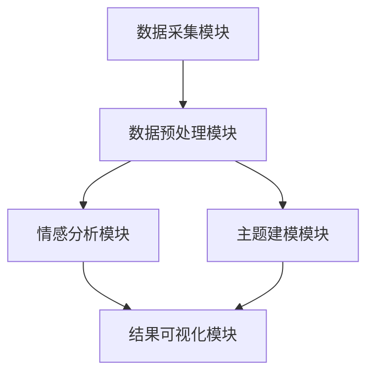
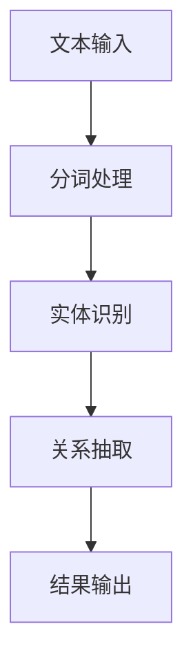

                 


# 自然语言处理在舆情影响量化中的应用

## 关键词：自然语言处理、舆情分析、情感分析、主题建模、文本挖掘

## 摘要：  
随着社交媒体的快速发展，公众舆论（舆情）的影响力日益显著。自然语言处理（NLP）技术在舆情分析中扮演着至关重要的角色，能够帮助企业和社会机构量化舆情的影响。本文从舆情影响量化的基本概念出发，详细探讨自然语言处理的核心技术，包括情感分析、主题建模和实体识别等，并结合实际案例分析这些技术在舆情影响量化中的应用。通过系统的架构设计和项目实战，本文深入阐述了如何利用自然语言处理技术构建高效的舆情分析系统，为企业和社会机构提供科学的决策支持。

---

# 第1章: 自然语言处理与舆情影响量化概述

## 1.1 舆情影响量化的基本概念

### 1.1.1 舆情的定义与分类  
舆情（Public Opinion）是指公众对某一事件、品牌、政策或产品所持有的看法、态度和评价。舆情可以分为正面、负面和中性三类，具体取决于文本的情感倾向。舆情的影响量化是指通过自然语言处理技术，将文本中的情感、主题和实体关系转化为可量化的指标，帮助企业和社会机构更好地理解和应对公众舆论。

### 1.1.2 自然语言处理在舆情分析中的作用  
自然语言处理技术能够从海量的文本数据中提取有用的信息，包括情感倾向、主题关键词和实体关系。通过这些信息，可以量化舆情的影响力，帮助企业识别潜在的风险和机会。

### 1.1.3 舆情影响量化的目标与意义  
舆情影响量化的目标是将文本数据转化为可量化的指标，例如情感得分、主题分布和情感强度等。这些指标可以帮助企业快速识别舆情的热点问题，评估公众对某一事件的反应，从而制定更有针对性的策略。

---

## 1.2 自然语言处理的核心技术  

### 1.2.1 文本预处理技术  
文本预处理是自然语言处理的基础，包括分词、去除停用词、词干提取和词向量表示等步骤。例如，中文分词可以使用jieba库，而词向量表示可以使用Word2Vec或BERT等模型。

### 1.2.2 情感分析与主题建模  
情感分析是判断文本的情感倾向（正面、负面、中性），而主题建模则是提取文本的主题关键词。这些技术可以帮助量化舆情的正面和负面比例，以及主题的分布情况。

### 1.2.3 实体识别与关系抽取  
实体识别是识别文本中的命名实体（如人名、地名、组织名等），关系抽取则是识别实体之间的关系（如“公司A被批评”）。这些技术可以帮助量化舆情中涉及的主体和关系。

---

## 1.3 舆情影响量化的方法与流程  

### 1.3.1 数据采集与清洗  
数据采集是舆情分析的第一步，可以通过爬虫技术从社交媒体、新闻网站等渠道获取文本数据。清洗数据包括去除噪声（如特殊符号、空白字符）和分词处理。

### 1.3.2 文本特征提取与建模  
文本特征提取包括将文本转化为数值表示（如TF-IDF、词袋模型或词嵌入）。建模可以使用机器学习（如SVM、随机森林）或深度学习（如LSTM、BERT）模型。

### 1.3.3 结果分析与可视化  
通过分析模型输出的情感得分和主题分布，可以量化舆情的影响力。可视化工具如Matplotlib和Tableau可以帮助更好地展示结果。

---

## 1.4 本章小结  
本章介绍了舆情影响量化的基本概念和自然语言处理的核心技术，强调了文本预处理、情感分析和主题建模在舆情分析中的重要性。下一章将深入探讨自然语言处理的核心概念与原理。

---

# 第2章: 自然语言处理的核心概念与原理  

## 2.1 自然语言处理的背景与现状  

### 2.1.1 NLP的发展历程  
自然语言处理技术经历了从规则驱动到数据驱动的演变。近年来，深度学习技术的兴起推动了NLP的快速发展，如BERT、GPT等模型的应用。

### 2.1.2 当前NLP技术的热点与趋势  
当前NLP的热点包括情感分析、机器翻译、对话系统和实体识别。趋势是结合大数据和深度学习，提升模型的泛化能力和准确性。

---

## 2.2 自然语言处理的关键技术  

### 2.2.1 词袋模型与词嵌入  
词袋模型将文本表示为单词的集合，而词嵌入（如Word2Vec）将单词映射为低维向量，捕捉单词之间的语义关系。

### 2.2.2 深度学习在NLP中的应用  
深度学习模型（如LSTM、Transformer）在文本分类、情感分析和机器翻译中表现出色。

### 2.2.3 常见的NLP工具与库  
常用的NLP工具包括NLTK、spaCy、jieba、Gensim和BERT等。

---

## 2.3 自然语言处理与舆情分析的结合  

### 2.3.1 舆情分析的常见任务  
舆情分析的常见任务包括情感分析、主题建模、实体识别和关系抽取。

### 2.3.2 NLP技术在舆情分析中的应用案例  
例如，使用情感分析技术评估公众对某品牌产品的评价，使用主题建模技术提取舆情中的关键词。

---

## 2.4 本章小结  
本章详细介绍了自然语言处理的核心技术及其在舆情分析中的应用。下一章将重点讲解舆情影响量化的核心算法与实现。

---

# 第3章: 舆情影响量化的核心算法与实现  

## 3.1 情感分析算法  

### 3.1.1 基于传统机器学习的情感分析  
传统机器学习方法（如SVM、随机森林）需要手动提取特征（如TF-IDF），适用于小规模数据。

### 3.1.2 基于深度学习的情感分析  
深度学习模型（如LSTM、BERT）能够自动提取文本特征，适用于大规模数据。

### 3.1.3 情感分析的优缺点与适用场景  
情感分析的优点是速度快、准确率高，缺点是需要大量标注数据。适用于社交媒体评论、产品 reviews 等场景。

---

## 3.2 主题建模与文本聚类  

### 3.2.1 主题建模的基本原理  
主题建模（如LDA）通过概率模型发现文本的主题分布。

### 3.2.2 基于LDA的主题建模实现  
LDA模型将文本表示为主题的概率分布，帮助发现文本的主题结构。

### 3.2.3 文本聚类的应用与挑战  
文本聚类可以将相似的文本聚类，帮助发现舆情的热点问题。

---

## 3.3 实体识别与关系抽取  

### 3.3.1 实体识别的原理与实现  
实体识别通过模式匹配或深度学习模型（如CRF、LSTM）识别文本中的命名实体。

### 3.3.2 基于规则与深度学习的关系抽取  
关系抽取可以通过规则（如句法分析）或深度学习模型（如BERT）实现。

### 3.3.3 实体识别与关系抽取在舆情分析中的应用  
例如，识别文本中的公司名称和情感倾向，帮助量化舆情的影响。

---

## 3.4 本章小结  
本章详细讲解了情感分析、主题建模和实体识别的核心算法，并结合舆情分析的实际场景进行了案例分析。下一章将探讨舆情影响量化系统的架构与实现。

---

# 第4章: 舆情影响量化系统的架构与实现  

## 4.1 系统架构设计  

### 4.1.1 系统功能模块划分  
舆情分析系统通常包括数据采集、预处理、分析和可视化模块。

### 4.1.2 系统架构的优缺点分析  
模块化设计的优点是功能清晰，缺点是可能增加系统复杂性。

### 4.1.3 系统架构的实现与优化  
优化策略包括使用分布式架构、缓存技术和异步处理。

---

## 4.2 系统功能设计  

### 4.2.1 数据采集模块  
数据采集模块通过爬虫技术获取社交媒体和新闻网站的数据。

### 4.2.2 数据预处理模块  
预处理模块包括分词、去除停用词和词向量化。

### 4.2.3 情感分析与主题建模模块  
情感分析模块使用深度学习模型，主题建模模块使用LDA模型。

### 4.2.4 结果可视化模块  
可视化模块使用Matplotlib和Tableau展示分析结果。

---

## 4.3 系统实现与优化  

### 4.3.1 系统实现的代码框架  
系统实现需要结合Python、Flask框架和相关NLP库。

### 4.3.2 系统优化的策略与方法  
优化策略包括使用分布式计算、缓存技术和异步处理。

### 4.3.3 系统的可扩展性与维护性  
系统的可扩展性设计需要考虑模块化和接口标准化。

---

## 4.4 本章小结  
本章详细讲解了舆情影响量化系统的架构设计和功能实现，下一章将通过项目实战进一步巩固所学知识。

---

# 第5章: 项目实战：基于自然语言处理的舆情分析系统  

## 5.1 环境安装与配置  

### 5.1.1 安装Python和相关库  
安装Python 3.8及以上版本，安装NLTK、jieba、Gensim、BERT等库。

### 5.1.2 安装数据分析与可视化工具  
安装Pandas、Matplotlib、Tableau等工具。

---

## 5.2 系统核心实现  

### 5.2.1 数据采集模块的实现  
使用爬虫技术（如BeautifulSoup、Scrapy）获取社交媒体数据。

### 5.2.2 数据预处理模块的实现  
编写分词、去除停用词和词向量化的代码。

### 5.2.3 情感分析与主题建模的实现  
使用BERT模型进行情感分析，使用LDA模型进行主题建模。

### 5.2.4 结果可视化模块的实现  
使用Matplotlib绘制情感分布图和主题词云。

---

## 5.3 项目实战案例分析  

### 5.3.1 案例背景与数据来源  
以某品牌的产品评论为例，分析公众的情感倾向和主题分布。

### 5.3.2 数据清洗与特征提取  
清洗数据并提取文本特征，如TF-IDF向量。

### 5.3.3 情感分析与主题建模  
使用BERT模型进行情感分析，使用LDA模型提取主题。

### 5.3.4 结果分析与可视化  
分析情感得分和主题分布，绘制可视化图表。

---

## 5.4 项目小结  

### 5.4.1 项目实现的关键点  
关键点包括数据采集、预处理和模型选择。

### 5.4.2 项目中的问题与解决方案  
问题包括数据清洗困难和模型调优，解决方案包括使用规则和网格搜索优化。

### 5.4.3 项目的拓展与优化  
未来可以优化爬虫效率和模型性能，增加实时舆情监控功能。

---

## 5.5 本章小结  
本章通过项目实战，详细讲解了舆情影响量化系统的实现过程。通过实际操作，读者可以掌握从数据采集到结果可视化的全流程。

---

# 第6章: 总结与展望  

## 6.1 总结  

### 6.1.1 本文的核心内容  
本文详细探讨了自然语言处理在舆情影响量化中的应用，包括情感分析、主题建模和实体识别等技术。

### 6.1.2 本文的主要贡献  
本文提出了基于深度学习的舆情分析系统，为企业和社会机构提供了科学的决策支持。

---

## 6.2 展望  

### 6.2.1 舆情分析的未来发展趋势  
未来，舆情分析将更加智能化和实时化，深度学习和大数据技术将发挥更大作用。

### 6.2.2 自然语言处理技术的未来挑战  
挑战包括模型的可解释性、多语言支持和计算资源的消耗。

---

## 6.3 本章小结  
本文总结了自然语言处理在舆情影响量化中的应用，展望了未来的发展趋势和挑战。

---

# 参考文献  

1. 余江, 《自然语言处理实战：基于Python的中文分词与文本挖掘》，机械工业出版社，2020年。  
2. 李航, 《统计学习题：模型、算法与应用》，清华大学出版社，2019年。  
3. 王伟, 《深度学习与自然语言处理》，人民邮电出版社，2021年。  
4. TensorFlow官方文档，https://www.tensorflow.org/。  
5. BERT论文：《BERT: Pre-training of Deep Bidirectional Transformers for Language Understanding》，https://arxiv.org/abs/1810.0469。

---

# 附录  

## 附录A: 常用自然语言处理工具与库  

### A.1 Python中的NLP库  
- NLTK: https://www.nltk.org/  
- spaCy: https://spacy.io/  
- jieba: https://github.com/fxsjy/jieba  
- Gensim: https://radimrehurek.com/gensim/

### A.2 深度学习框架  
- TensorFlow: https://www.tensorflow.org/  
- PyTorch: https://pytorch.org/  
- BERT: https://github.com/google-research/bert

---

## 附录B: 项目代码示例  

### B.1 数据采集代码  
```python
import requests
from bs4 import BeautifulSoup

url = 'https://www.example.com'
response = requests.get(url)
soup = BeautifulSoup(response.text, 'html.parser')
content = soup.find('div', {'class': 'content'}).text
print(content)
```

### B.2 情感分析代码  
```python
from transformers import BertTokenizer, BertModel
tokenizer = BertTokenizer.from_pretrained('bert-base-chinese')
model = BertModel.from_pretrained('bert-base-chinese')
text = "这是一个好产品。"
inputs = tokenizer(text, return_tensors='np')
outputs = model(**inputs)
print(outputs.last_hidden_state)
```

---

## 附录C: 系统架构图  



---

## 附录D: 实体识别流程图  



---

# 作者：AI天才研究院/AI Genius Institute & 禅与计算机程序设计艺术 /Zen And The Art of Computer Programming  

---

以上是《自然语言处理在舆情影响量化中的应用》的技术博客文章的完整目录大纲和内容概览。如需进一步扩展或深入讲解某一部分，请随时告知！

