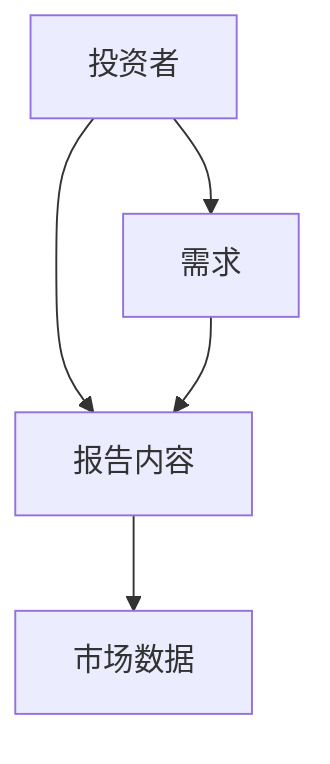
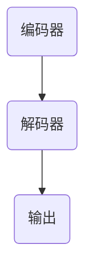
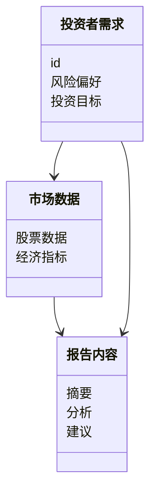
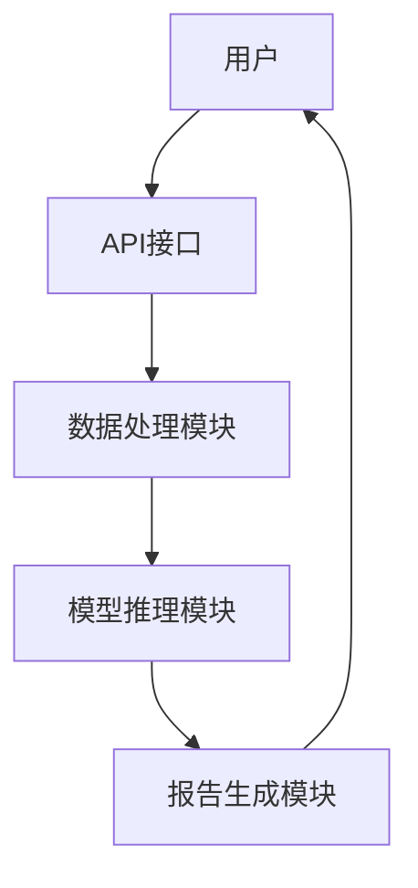

                 


# 自然语言生成在个性化投资报告中的应用

## 关键词
自然语言生成, 个性化投资报告, 生成式AI, 金融数据分析, 文本生成模型

## 摘要
自然语言生成（Natural Language Generation, NLG）作为人工智能领域的重要技术，正在逐步改变金融行业的运作方式。个性化投资报告通过对投资者需求的深度理解，结合实时市场数据，生成定制化的分析和建议，为投资者提供精准的决策支持。本文将深入探讨自然语言生成在个性化投资报告中的应用，分析其技术基础、算法原理、系统架构，并通过实际案例展示其在金融领域的实践价值。

---

## 第1章：背景介绍

### 1.1 自然语言生成的核心概念
自然语言生成是指将结构化数据转化为自然语言文本的过程，涉及多种技术手段如规则生成、统计模型和深度学习。其核心目标是提高文本生成的准确性和可读性。

### 1.2 个性化投资报告的定义与特点
个性化投资报告是根据投资者的具体需求和市场动态，生成定制化的分析报告。其特点包括数据驱动、实时更新和高度定制。

### 1.3 问题背景与应用价值
传统投资报告依赖人工撰写，耗时且难以满足个性化需求。自然语言生成技术的应用，使得投资报告的生成更加高效和精准，为投资者提供及时的决策支持。

---

## 第2章：核心概念与技术联系

### 2.1 自然语言生成的关键技术
| 技术 | 描述 |
|------|------|
| 变压器模型 | 基于自注意力机制的深度学习模型，能够捕捉长距离依赖关系。 |
| 梯度下降 | 优化模型参数的常用方法。 |
| 数据预处理 | 对数据进行清洗、标注和格式化处理。 |

### 2.2 实体关系图


---

## 第3章：算法原理与数学模型

### 3.1 变压器模型的工作流程


### 3.2 自注意力机制
自注意力机制通过计算查询（Q）、键（K）和值（V）之间的关系，生成权重矩阵：
$$ W_q = W_q \cdot Q $$
$$ W_k = W_k \cdot K $$
$$ W_v = W_v \cdot V $$
最终输出为加权和：
$$ O = \text{softmax}(\frac{QK^T}{\sqrt{d}})V $$

---

## 第4章：系统架构与设计

### 4.1 系统功能设计


### 4.2 系统架构设计


---

## 第5章：项目实战与实现

### 5.1 环境搭建
安装必要的库：
```bash
pip install numpy pandas tensorflow transformers
```

### 5.2 核心代码实现
```python
import tensorflow as tf
from tensorflow.keras import layers

# 定义编码器层
def encoder_layer():
    inputs = layers.Input(shape=(None, d_model))
    attention = layers.MultiHeadAttention(heads, d_model)(inputs, inputs)
    outputs = layers.Add()([inputs, attention])
    return Model(inputs=inputs, outputs=outputs)

# 定义解码器层
def decoder_layer():
    inputs = layers.Input(shape=(None, d_model))
    attention = layers.MultiHeadAttention(heads, d_model)(inputs, encoder_output)
    outputs = layers.Add()([inputs, attention])
    return Model(inputs=inputs, outputs=outputs)
```

### 5.3 实际案例分析
通过分析实际市场数据，展示如何生成个性化报告，并讨论模型的优缺点。

---

## 第6章：案例分析与优化

### 6.1 案例分析
分析一个实际案例，展示系统的应用效果和优化过程。

### 6.2 优化策略
总结优化策略，如数据增强、模型调参等。

---

## 第7章：总结与展望

### 7.1 全文总结
总结文章内容，强调自然语言生成在个性化投资报告中的重要性。

### 7.2 未来展望
探讨技术发展趋势，如多模态生成和实时数据处理。

---

## 作者
作者：AI天才研究院 & 禅与计算机程序设计艺术

---

这篇文章全面介绍了自然语言生成在个性化投资报告中的应用，从理论到实践，从算法到系统设计，为读者提供了深入的技术解析和实际案例。

