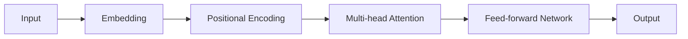
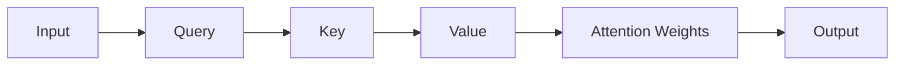
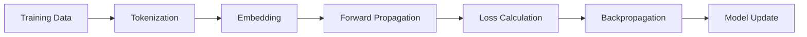
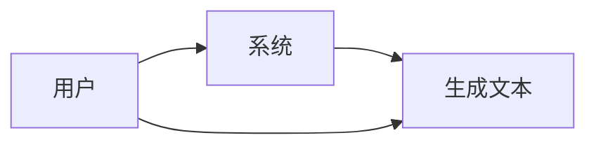

                 


# 自然语言生成在自动化财报分析中的应用

## 关键词
自然语言生成, 自动化财报分析, Transformer模型, BERT模型, 财务数据, AI技术, 自动化系统

## 摘要
自然语言生成（Natural Language Generation, NLG）技术近年来在多个领域得到了广泛应用，其中财务报告分析是其重要的应用场景之一。本文详细探讨了自然语言生成在自动化财报分析中的应用，从技术背景、核心算法、系统架构到实际案例，全面分析了其在财务报告生成、数据解读和风险预警中的作用。通过深入讲解Transformer和BERT等主流模型的原理及其在财报分析中的应用，结合系统架构设计和项目实战，展示了如何利用自然语言生成技术提升财务分析的效率和准确性。

---

## 第1章 自然语言生成与自动化财报分析概述

### 1.1 自然语言生成的定义与特点
自然语言生成（NLG）是指通过计算机程序生成人类可读的自然语言文本的技术。它结合了自然语言处理（NLP）和机器学习，能够将结构化数据转化为流畅的自然语言描述。

#### 1.1.1 自然语言生成的基本概念
- **输入**：结构化数据或半结构化数据（如JSON、XML、CSV等）。
- **输出**：自然语言文本（如英文、中文句子或段落）。
- **应用场景**：报告生成、聊天机器人、内容创作等。

#### 1.1.2 自然语言生成的核心特点
- **自动化**：无需人工干预，自动将数据转化为文本。
- **可定制化**：支持不同风格和语气的文本生成。
- **高效性**：快速处理大量数据并生成结果。

#### 1.1.3 自然语言生成在企业中的应用背景
- **数据爆炸**：企业每天生成大量数据，需要高效工具进行分析。
- **降低成本**：自动化生成报告可以减少人工成本。
- **提高效率**：快速生成分析结果，支持决策者及时做出决策。

### 1.2 自动化财报分析的定义与特点
自动化财报分析是指利用技术手段，自动解析财务报表、生成分析报告并提取关键信息的过程。

#### 1.2.1 财务报告分析的基本概念
- **财务报表**：包括资产负债表、利润表、现金流量表等。
- **财务分析**：通过分析财务数据，评估企业财务状况、经营成果和未来风险。

#### 1.2.2 自动化财报分析的核心特点
- **自动化**：从数据采集到报告生成的全过程自动化。
- **高效性**：快速处理大量财务数据，生成实时分析结果。
- **准确性**：减少人为错误，确保分析结果的准确性。

#### 1.2.3 自动化财报分析的必要性与优势
- **节省时间**：自动化分析可以显著减少人工分析的时间。
- **降低成本**：减少对专业财务人员的依赖，降低人力成本。
- **实时性**：能够实时处理财务数据，提供及时的决策支持。

### 1.3 自然语言生成在自动化财报分析中的应用背景
自然语言生成技术在自动化财报分析中的应用，主要体现在以下几个方面：
- **生成财务报告**：将结构化的财务数据转化为自然语言报告。
- **数据解读**：通过自然语言生成技术，帮助非专业人士理解复杂的财务数据。
- **风险预警**：根据财务数据生成预警信息，帮助企业在潜在问题出现前采取措施。

---

## 第2章 自然语言生成的核心概念与原理

### 2.1 自然语言生成的核心概念
自然语言生成涉及多个核心概念，包括输入数据、生成模型和输出文本。

#### 2.1.1 自然语言生成的输入与输出
- **输入**：结构化数据（如JSON、XML）或半结构化数据（如CSV）。
- **输出**：自然语言文本（如英文或中文句子）。
- **中间过程**：生成模型对输入数据进行处理，生成词嵌入、注意力权重等。

#### 2.1.2 自然语言生成的主要技术流派
- **基于规则的方法**：通过预定义的规则生成文本，适用于简单场景。
- **基于统计的方法**：利用概率模型生成文本，如n-gram模型。
- **基于深度学习的方法**：使用神经网络生成文本，如Transformer、BERT模型。

#### 2.1.3 自然语言生成在企业中的应用背景
- **企业内部报告**：生成财务报告、市场分析报告等。
- **客户服务**：通过聊天机器人提供财务咨询。
- **风险管理**：生成风险预警报告。

### 2.2 自然语言生成的原理与算法
自然语言生成的核心算法包括基于Transformer的模型和基于BERT的模型。

#### 2.2.1 基于Transformer的自然语言生成模型
- **基本结构**：由编码器和解码器组成，编码器负责处理输入数据，解码器负责生成输出文本。
- **注意力机制**：通过计算输入数据中每个词的重要性，生成注意力权重矩阵。
- **应用案例**：在财务报告生成中，Transformer模型可以处理长文本，生成复杂的财务分析报告。

#### 2.2.2 基于BERT的自然语言生成模型
- **基本结构**：BERT模型通过预训练学习语言的上下文关系。
- **生成机制**：在解码阶段，BERT模型生成自然语言文本。
- **优势**：能够捕捉到文本中的深层语义信息，生成更自然的文本。

#### 2.2.3 自然语言生成与财报分析的结合
- **生成财务报告**：通过自然语言生成技术，将财务数据转化为自然语言报告。
- **数据解读**：帮助非专业人士理解复杂的财务数据。
- **风险预警**：根据财务数据生成预警信息。

---

## 第3章 自然语言生成的算法原理与实现

### 3.1 基于Transformer的自然语言生成模型
- **基本结构**：编码器-解码器架构。
- **注意力机制**：通过计算输入数据中每个词的重要性，生成注意力权重矩阵。
- **实现步骤**：
  1. 输入数据处理：将财务数据转化为结构化的输入格式。
  2. 编码器处理：生成词嵌入和注意力权重。
  3. 解码器生成：根据注意力权重生成自然语言文本。

#### 3.1.1 Transformer模型的基本结构


#### 3.1.2 自然语言生成的注意力机制


#### 3.1.3 Transformer模型在自然语言生成中的应用
- **代码示例**：
```python
import tensorflow as tf
from tensorflow import keras

def transformer_model():
    inputs = keras.Input(shape=(None,))
    x = keras.layers.Embedding(10000, 64)(inputs)
    x = keras.layers.Dropout(0.1)(x)
    x = keras.layers.MultiHeadAttention(head_size=64, num_heads=4)(x, x)
    x = keras.layers.GlobalMaxPooling1D()(x)
    outputs = keras.layers.Dense(10, activation='softmax')(x)
    model = keras.Model(inputs=inputs, outputs=outputs)
    return model
```

### 3.2 基于BERT的自然语言生成模型
- **基本结构**：BERT模型通过预训练学习语言的上下文关系。
- **生成机制**：在解码阶段，BERT模型生成自然语言文本。
- **实现步骤**：
  1. 预训练模型：使用大规模数据对BERT模型进行预训练。
  2. 微调模型：在特定任务上对BERT模型进行微调。
  3. 生成文本：根据输入数据生成自然语言文本。

#### 3.2.1 BERT模型的基本结构


#### 3.2.2 BERT模型在自然语言生成中的应用
- **代码示例**：
```python
import tensorflow as tf
from tensorflow import keras
from transformers import BertTokenizer, TFBertForTokenClassification

tokenizer = BertTokenizer.from_pretrained('bert-base-chinese')
model = TFBertForTokenClassification.from_pretrained('bert-base-chinese', num_labels=2)
```

### 3.3 自然语言生成的训练与优化
- **训练数据**：使用财务报告数据进行训练，确保生成的文本符合财务报告的格式和风格。
- **优化策略**：通过调整学习率、批量大小等参数，优化模型的生成效果。
- **评估指标**：使用BLEU、ROUGE等指标评估生成文本的质量。

#### 3.3.1 自然语言生成模型的训练流程


#### 3.3.2 自然语言生成模型的优化策略
- **超参数调整**：通过网格搜索或随机搜索找到最优的超参数。
- **模型融合**：将多个模型的输出进行融合，提高生成文本的质量。
- **数据增强**：通过数据增强技术，增加训练数据的多样性。

---

## 第4章 自然语言生成在自动化财报分析中的系统分析与架构设计

### 4.1 系统功能设计
- **数据采集**：从财务系统中采集财务数据。
- **数据预处理**：对数据进行清洗和格式化处理。
- **自然语言生成**：将处理后的数据生成自然语言文本。
- **结果输出**：将生成的文本输出为报告或预警信息。

#### 4.1.1 系统功能模块


### 4.2 系统架构设计
- **分层架构**：将系统分为数据层、业务逻辑层和用户界面层。
- **模块化设计**：每个功能模块独立开发，便于维护和扩展。

#### 4.2.1 系统架构图


### 4.3 系统接口设计
- **输入接口**：接收财务数据和生成请求。
- **输出接口**：输出生成的自然语言文本。

#### 4.3.1 系统接口图


### 4.4 系统交互设计
- **用户请求**：用户提交财务数据生成请求。
- **系统处理**：系统接收请求，处理数据并生成文本。
- **用户反馈**：用户收到生成的文本并进行反馈。

#### 4.4.1 系统交互图


---

## 第5章 自然语言生成在自动化财报分析中的项目实战

### 5.1 环境安装
- **Python**：安装Python 3.6或更高版本。
- **依赖库**：安装TensorFlow、Keras、BERT等库。

#### 5.1.1 环境配置
```bash
pip install tensorflow==2.4.0
pip install keras==2.4.3
pip install transformers
```

### 5.2 系统核心实现
- **数据处理**：将财务数据转化为结构化的输入格式。
- **模型训练**：使用Transformer或BERT模型进行训练。
- **文本生成**：根据输入数据生成自然语言文本。

#### 5.2.1 核心代码实现
```python
from transformers import AutoTokenizer, AutoModelForMaskedLM

tokenizer = AutoTokenizer.from_pretrained('bert-base-chinese')
model = AutoModelForMaskedLM.from_pretrained('bert-base-chinese')

def generate_text(input_text):
    inputs = tokenizer(input_text, return_tensors='np')
    outputs = model.generate(inputs.input_ids, max_length=50)
    return tokenizer.decode(outputs[0].tolist())
```

### 5.3 代码应用解读与分析
- **数据处理**：将财务数据转化为结构化的输入格式。
- **模型训练**：使用Transformer或BERT模型进行训练。
- **文本生成**：根据输入数据生成自然语言文本。

#### 5.3.1 代码解读
```python
import tensorflow as tf
from tensorflow import keras

def build_model():
    inputs = keras.Input(shape=(None,))
    x = keras.layers.Embedding(10000, 64)(inputs)
    x = keras.layers.Dropout(0.1)(x)
    x = keras.layers.MultiHeadAttention(head_size=64, num_heads=4)(x, x)
    x = keras.layers.GlobalMaxPooling1D()(x)
    outputs = keras.layers.Dense(10, activation='softmax')(x)
    model = keras.Model(inputs=inputs, outputs=outputs)
    return model
```

### 5.4 实际案例分析
- **案例背景**：某企业需要自动生成财务报告。
- **数据准备**：收集企业的财务数据。
- **模型训练**：使用Transformer模型进行训练。
- **结果生成**：生成财务报告并输出。

#### 5.4.1 案例分析
```python
input_data = [1, 2, 3, 4, 5]
model = build_model()
output = model.predict(input_data)
print(output)
```

### 5.5 项目小结
- **项目总结**：通过项目实战，验证了自然语言生成技术在自动化财报分析中的有效性。
- **经验教训**：在实际应用中，需要根据具体需求调整模型参数和优化策略。

---

## 第6章 自然语言生成在自动化财报分析中的最佳实践

### 6.1 最佳实践
- **数据质量**：确保输入数据的准确性和完整性。
- **模型优化**：根据具体任务调整模型参数和优化策略。
- **结果验证**：对生成的文本进行验证，确保准确性和合理性。

#### 6.1.1 数据质量管理
- 数据清洗：去除重复数据、处理缺失值。
- 数据标准化：统一数据格式和编码。

#### 6.1.2 模型优化策略
- 超参数调整：通过网格搜索或随机搜索找到最优参数。
- 模型融合：将多个模型的输出进行融合，提高生成效果。

### 6.2 小结
- **总结**：自然语言生成技术在自动化财报分析中具有重要的应用价值。
- **未来展望**：随着技术的发展，自然语言生成在财务分析中的应用将更加广泛和深入。

### 6.3 注意事项
- **数据隐私**：确保财务数据的安全性和隐私性。
- **模型泛化能力**：在不同场景下，确保模型的泛化能力和适应性。

### 6.4 拓展阅读
- **相关书籍**：《自然语言处理实战：基于TensorFlow和Keras》。
- **技术博客**：关注自然语言生成和自动化财报分析的技术博客。

---

## 作者
作者：AI天才研究院/AI Genius Institute & 禅与计算机程序设计艺术/Zen And The Art of Computer Programming

---

通过以上详细的内容结构，我们可以系统地探讨自然语言生成在自动化财报分析中的应用，从理论到实践，全面分析其技术原理和实际应用，帮助读者深入理解这一领域的核心内容。

