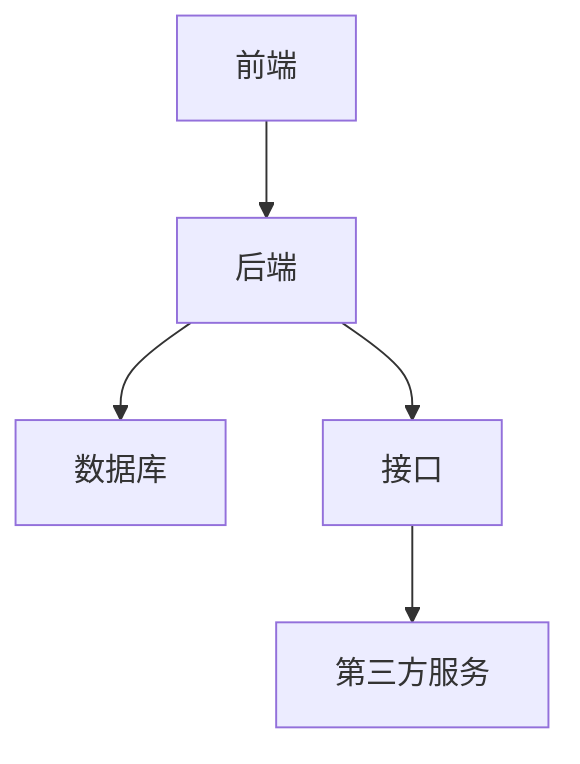
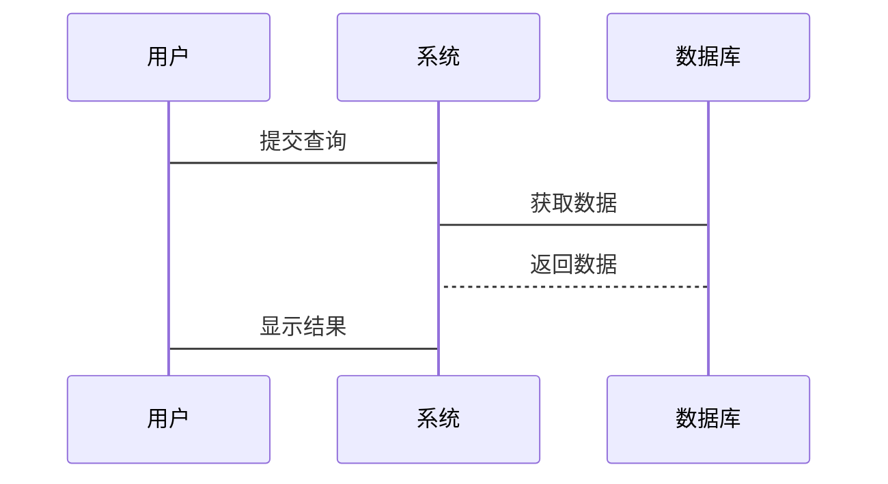

                 


# 艺术品投资：非传统资产类别的吸引力

---

## 关键词：
- 艺术品投资，非传统资产，市场分析，投资策略，风险管理，区块链，大数据

---

## 摘要：
艺术品投资作为一种非传统资产类别，近年来吸引了越来越多投资者的关注。本文将深入分析艺术品投资的背景、核心概念、投资策略、风险管理及技术应用，探讨其在现代投资组合中的潜力。通过系统分析和实际案例，本文旨在为投资者提供科学的决策支持。

---

## 第一部分：背景介绍

### 第1章：艺术品投资的定义与背景

#### 1.1 艺术品投资的定义
- 艺术品投资是指通过购买、持有和出售艺术品以获取收益的投资行为。
- 艺术品的分类：绘画、雕塑、摄影作品、限量版画、数字艺术（如NFT）等。

#### 1.2 艺术品投资的背景
- 全球艺术品市场的规模不断扩大，2023年全球艺术品市场交易额超过600亿美元。
- 数字化浪潮推动艺术品投资的创新，NFT（非同质化代币）成为新兴投资热点。

#### 1.3 艺术品投资的特点
- **非标准化**：每件艺术品都是独特的，难以进行统一的标准化评估。
- **低流动性**：相比股票和债券，艺术品的流动性较低，变现可能需要较长时间。
- **高波动性**：艺术品价格受市场情绪、流行趋势和经济环境的影响较大。

#### 1.4 艺术品投资与其他资产类别的对比
| 资产类别 | 流动性 | 风险 | 收益 |
|----------|--------|------|------|
| 股票     | 高     | 中   | 中   |
| 债券     | 中     | 低   | 低   |
| 房地产   | 低     | 高   | 高   |
| 艺术品   | 低     | 高   | 高   |

---

## 第2章：艺术品市场的核心概念

### 2.1 艺术品市场的特点
- **市场分割**：艺术品市场分为一级市场（画廊、拍卖行）和二级市场（私下交易、在线平台）。
- **价格波动性**：艺术品价格受市场情绪和稀缺性影响，波动较大。
- **信息不对称**：买家和卖家之间的信息不对称可能导致价格偏差。

### 2.2 影响艺术品价格的因素
- **艺术价值**：作品的艺术性、历史背景和文化价值。
- **艺术家声誉**：艺术家的知名度和影响力。
- **市场供需**：市场上艺术品的供给与需求关系。
- **经济环境**：宏观经济状况和投资者情绪。

### 2.3 艺术品市场的核心要素
- **艺术品真伪**：真迹与赝品的辨别是投资的关键。
- **交易成本**：艺术品交易涉及的佣金、税费等成本。
- **市场透明度**：信息的透明度影响价格发现和交易效率。

---

## 第二部分：艺术品投资的策略与分析

### 第3章：艺术品投资策略

#### 3.1 投资目标设定
- **长期增值**：通过收藏高质量艺术品，期望其价值随时间增长。
- **短期收益**：通过市场波动赚取差价。

#### 3.2 艺术品价值评估
- **市场比较法**：参考同类艺术品的交易价格进行估值。
- **成本法**：基于艺术品的创作成本和市场行情进行估值。
- **收益法**：预测未来现金流，折现后确定现值。

#### 3.3 投资组合配置
- **资产配置**：将艺术品投资与其他资产类别（如股票、债券、房地产）结合，分散风险。
- **艺术品选择**：关注艺术家的声誉、作品的稀缺性和市场需求。

#### 3.4 风险管理
- **市场风险**：通过多样化投资降低市场波动的影响。
- **流动性风险**：选择流动性较高的艺术品或建立长期投资策略。
- **法律风险**：确保艺术品的合法性，避免赝品风险。

---

## 第三部分：艺术品投资的技术应用

### 第4章：区块链与艺术品投资

#### 4.1 区块链在艺术品交易中的作用
- **去中心化交易**：通过智能合约实现透明的交易流程。
- **作品溯源**：记录艺术品的创作、所有权变更等信息，确保真伪。

#### 4.2 大数据分析在艺术品市场的应用
- **市场趋势预测**：通过分析历史交易数据预测未来趋势。
- **艺术家表现评估**：利用数据分析工具评估艺术家的市场表现。

#### 4.3 数学模型与艺术品估值
- **回归分析**：建立价格与影响因素的回归模型，预测艺术品价格。
- **聚类分析**：将艺术品按相似性分组，发现市场趋势。

---

## 第五部分：系统分析与架构设计

### 第5章：艺术品投资分析系统

#### 5.1 系统功能设计
- 数据采集：收集艺术品交易数据、艺术家信息等。
- 数据清洗：处理缺失值、异常值，确保数据质量。
- 特征工程：提取关键特征，如艺术家声誉、作品类型等。
- 模型构建：使用机器学习算法（如随机森林、神经网络）进行价格预测。
- 结果验证：通过回测验证模型的准确性和稳定性。

#### 5.2 系统架构设计


#### 5.3 系统交互流程


---

## 第六部分：项目实战

### 第6章：艺术品投资实战

#### 6.1 环境安装
- 安装Python、Pandas、Scikit-learn等工具。
- 数据来源：使用Kaggle等平台的艺术品交易数据集。

#### 6.2 核心代码实现
```python
import pandas as pd
from sklearn.ensemble import RandomForestRegressor
from sklearn.metrics import mean_absolute_error

# 数据加载
data = pd.read_csv('art_data.csv')

# 特征工程
features = data[['艺术家', '作品类型', '创作年份']]
target = data['价格']

# 模型训练
model = RandomForestRegressor()
model.fit(features, target)

# 模型预测
predicted_price = model.predict(features)
print(mean_absolute_error(target, predicted_price))
```

#### 6.3 案例分析
- 案例背景：购买一幅知名艺术家的作品，期望在未来三年内增值。
- 风险评估：分析市场的波动性和流动性风险。
- 投资决策：基于模型预测和市场分析，决定是否投资。

---

## 第七部分：结论与展望

### 第7章：结论与未来展望

#### 7.1 核心观点总结
- 艺术品投资具有较高的收益潜力，但也伴随着较高的风险。
- 技术手段（如区块链和大数据分析）可以有效降低投资风险。

#### 7.2 未来展望
- 更广泛的应用区块链技术实现艺术品的透明交易。
- 利用AI技术进一步优化艺术品价值评估和市场预测。

---

## 作者：AI天才研究院 & 禅与计算机程序设计艺术

---

**注**：本文为技术博客文章，旨在为艺术品投资者提供科学的投资策略和技术支持，帮助投资者在非传统资产类别中找到新的投资机会。

