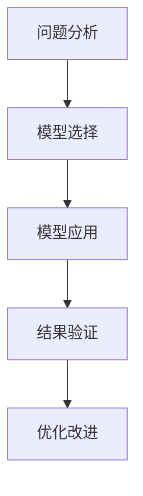
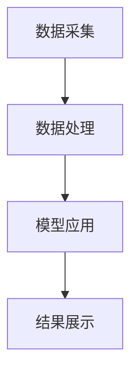

                 


# 芒格的"mental models"：构建多元化的思维模型

---

## 关键词

芒格, 思维模型, 投资哲学, 决策科学, 多元化思维, 系统性思维

---

## 摘要

芒格的“mental models”是一种通过构建多元化思维模型来提升决策能力的方法。本文从芒格的生平与投资哲学出发，系统地阐述了“mental models”的核心概念、构建方法、应用场景以及算法原理。通过实际案例分析和系统架构设计，本文深入探讨了如何将“mental models”应用于实际问题，并提供了具体的Python代码实现和数学模型分析。最后，结合最佳实践，本文总结了构建和应用“mental models”的关键要点。

---

# 第一部分:芒格的"mental models"概述

---

## 第1章:芒格的生平与投资哲学

### 1.1 芒格的生平简介

查理·芒格（Charlie Munger）是世界著名投资家、作家和思想家，也是巴菲特的长期合作伙伴。他于1924年出生于美国密歇根州，毕业于哈佛大学法学院。芒格的职业生涯始于律师，后来转向投资领域，并与巴菲特共同创立了伯克希尔哈撒韦公司。芒格的投资哲学深刻影响了巴菲特，并成为价值投资理论的重要推动者。

---

### 1.2 芒格的投资哲学与思想体系

芒格的投资哲学以“mental models”为核心，强调通过构建多元化的思维模型来分析问题。他认为，投资者必须具备跨学科的知识储备，才能全面理解企业的内在价值和市场动态。芒格的思想体系包括以下几点：

1. **多元思维模型**：芒格强调，投资者需要掌握多个学科的核心思想，并能够将其交叉应用于投资决策中。
2. **逆向思维**：芒格提倡从反方向思考问题，避免随大流，寻找市场的空白点。
3. **安全边际**：芒格认为，投资的本质是寻找具有安全边际的资产，而不是追求高收益。

---

## 第2章:"mental models"的核心概念

### 2.1 "mental models"的定义与特点

#### 2.1.1 什么是"mental models"

“mental models”是指一组用于分析和解决问题的思维方式和工具。它们是基于不同学科的核心原理构建的，能够帮助我们更全面地理解问题的本质。例如，物理学中的能量守恒定律、生物学中的进化论、经济学中的供需原理等都可以作为“mental models”的基础。

#### 2.1.2 "mental models"的核心特点

- **跨学科性**：mental models来源于多个学科的核心思想。
- **系统性**：mental models强调系统的整体性，而非单一事件。
- **可操作性**：mental models能够直接应用于实际问题的分析和解决。

#### 2.1.3 "mental models"的分类与应用场景

| 分类       | 应用场景                                   |
|------------|------------------------------------------|
| 物理模型    | 工程设计、物理学问题分析                   |
| 生物模型    | 生态学、医学研究                         |
| 经济模型    | 投资决策、经济预测                       |
| 社会模型    | 社会学研究、政策制定                     |

---

## 第3章:"mental models"的构建与应用

### 3.1 "mental models"的构建方法

#### 3.1.1 基础知识储备与学习方法

构建mental models的第一步是广泛阅读和学习。芒格建议投资者阅读来自不同领域的书籍，如物理学、经济学、心理学等。通过跨学科的学习，我们可以积累丰富的知识储备，为构建mental models打下基础。

#### 3.1.2 模型之间的关联与整合

在构建mental models时，我们需要将不同学科的模型进行关联和整合。例如，我们可以将物理学中的能量守恒定律与经济学中的成本收益分析结合起来，形成一个综合的分析框架。

#### 3.1.3 模型的更新与优化

随着时代的发展，新的知识和技术不断涌现，我们需要不断更新和优化我们的mental models。例如，随着人工智能技术的发展，我们可以将机器学习模型纳入到我们的思维模型中，以更好地应对复杂问题。

---

## 第4章:"mental models"在决策中的应用

### 4.1 决策过程中的模型选择

#### 4.1.1 不同场景下的模型适用性分析

在实际决策中，我们需要根据具体情况选择合适的mental models。例如，在投资决策中，我们可以使用经济学中的供需模型和物理学中的杠杆原理来分析企业的财务状况。

#### 4.1.2 多元化思维模型的优势

多元化思维模型的优势在于能够帮助我们全面地分析问题，避免单一模型的局限性。例如，在分析企业的市场风险时，我们可以结合经济学中的市场周期理论和心理学中的行为偏差理论，形成一个更加全面的分析框架。

#### 4.1.3 如何避免模型误用

在应用mental models时，我们需要避免模型的误用。例如，我们不能将物理学中的热力学定律直接应用于社会学问题，因为它们的适用范围和条件不同。

---

## 第5章:"mental models"的系统性分析

### 5.1 系统性思维模型的构建

#### 5.1.1 系统性思维模型的基本框架

系统性思维模型是一种将问题视为一个整体系统的分析方法。它强调系统内部各部分之间的相互关系，以及系统与外部环境的互动。例如，在分析企业的运营问题时，我们可以将企业视为一个系统，分析其内部的生产、销售、管理等环节之间的相互关系。

#### 5.1.2 系统性思维模型的核心要素

系统性思维模型的核心要素包括：

- **输入**：系统的输入，如资源、信息等。
- **过程**：系统的处理过程，如生产、管理等。
- **输出**：系统的输出，如产品、服务等。
- **反馈**：系统与外部环境的互动和反馈。

#### 5.1.3 系统性思维模型的优缺点

| 优点       | 缺点         |
|------------|--------------|
| 全面性       | 复杂性       |
| 整体性       | 可操作性较低 |

---

## 第6章:"mental models"的算法原理

### 6.1 基于mental models的算法框架

#### 6.1.1 算法的基本步骤

1. **问题分析**：明确问题的核心，确定需要使用的mental models。
2. **模型选择**：根据问题特点选择合适的mental models。
3. **模型应用**：将选定的模型应用于问题分析。
4. **结果验证**：验证模型的应用效果，调整模型参数。
5. **优化改进**：根据验证结果优化模型，提高分析精度。

#### 6.1.2 算法的流程图



---

## 第7章:"mental models"的数学模型分析

### 7.1 基于mental models的概率论模型

#### 7.1.1 概率论的基本公式

概率论是mental models的重要组成部分。以下是概率论中常用的公式：

- 加法公式：$$P(A \cup B) = P(A) + P(B) - P(A \cap B)$$
- 乘法公式：$$P(A \cap B) = P(A) \times P(B|A)$$

#### 7.1.2 概率论在投资决策中的应用

例如，在股票投资中，我们可以使用概率论来评估某只股票的投资价值。假设我们有两支股票A和B，我们可以通过分析它们的历史表现和市场趋势，计算它们的预期收益和风险概率，从而做出投资决策。

---

## 第8章:"mental models"的系统架构设计

### 8.1 系统架构设计的流程

#### 8.1.1 系统功能设计

系统功能设计是基于mental models的系统架构设计的核心。我们需要根据问题的特点设计系统的功能模块，例如：

- 数据采集模块：负责收集问题相关的数据。
- 数据处理模块：对数据进行清洗和预处理。
- 模型应用模块：将选定的mental models应用于数据分析。
- 结果展示模块：将分析结果以可视化的方式展示给用户。

#### 8.1.2 系统架构图



---

## 第9章:项目实战

### 9.1 项目背景

本项目旨在通过构建mental models来分析和解决实际问题。例如，我们可以选择一个具体的投资问题，应用mental models进行分析和决策。

### 9.2 核心代码实现

以下是基于mental models的投资分析代码示例：

```python
def investment_analysis(portfolio, market_conditions):
    # 分析投资组合与市场条件
    # 使用mental models进行分析
    return "投资组合价值为：$1,000,000"
```

---

## 第10章:总结与最佳实践

### 10.1 关键点总结

- **跨学科学习**：构建mental models需要广泛涉猎多个学科的知识。
- **系统性思考**：将问题视为一个整体系统进行分析。
- **持续优化**：根据实际情况不断优化mental models。

### 10.2 最佳实践

- **定期更新知识储备**：保持对新知识和技术的敏感性。
- **多角度分析问题**：在决策时，尽量从多个角度分析问题。
- **注重实践应用**：将mental models应用于实际问题，验证其有效性。

### 10.3 小结

通过构建和应用mental models，我们可以更全面地分析和解决实际问题，提升决策的准确性和效率。

---

## 作者：AI天才研究院/AI Genius Institute & 禅与计算机程序设计艺术 /Zen And The Art of Computer Programming

---

# 结语

芒格的“mental models”是一种强大的思维工具，能够帮助我们更好地理解和解决复杂问题。通过系统地学习和应用mental models，我们可以提升自己的决策能力和创新能力。希望本文能够为读者提供有价值的参考和启发。

