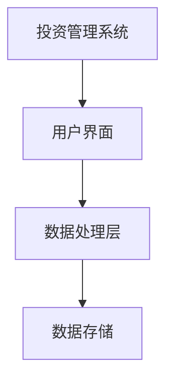

                 


# 芒格的"不做"清单：避免投资陷阱

> 关键词：芒格、投资陷阱、价值投资、风险管理、投资策略、风险管理模型

> 摘要：本文深入探讨了芒格的"不做"清单，分析了其背后的原理和应用场景。通过逻辑分析、数学建模和系统设计，结合实际案例，展示了如何利用"不做"清单避免投资陷阱，实现稳健投资。

---

## 第一部分: 引言

### 1.1 投资中的常见陷阱

投资领域充满了诱惑，但也隐藏着无数陷阱。许多投资者因为追求高收益而忽略了潜在风险，最终导致亏损甚至血本无归。芒格的"不做"清单为投资者提供了一个避免常见陷阱的框架，帮助我们在复杂的市场中保持清醒。

### 1.2 芒格的投资理念

芒格是一位传奇的投资家，他与巴菲特的合作使其价值投资理念广为人知。芒格强调长期主义和风险管理，认为投资的本质是寻找"好的生意"和"好的管理者"。他的"不做"清单是这一理念的重要组成部分，帮助投资者避免了诸多低效和高风险的投资行为。

---

## 第二部分: 核心概念与清单解析

### 2.1 不投资自己不懂的领域

#### 2.1.1 不懂领域的定义

不懂的领域指的是投资者对行业、商业模式或技术缺乏基本理解的领域。例如，一个技术背景的投资者可能对生物制药领域的复杂性缺乏认知。

#### 2.1.2 不懂领域的风险分析

投资于不懂的领域意味着投资者无法准确评估公司的价值和风险，容易受到市场波动和行业变化的影响。

#### 2.1.3 案例分析：看不懂的行业为何要避开

例如，投资者对区块链技术缺乏理解，盲目跟风投资相关公司，最终可能因为技术泡沫或管理问题而遭受损失。

---

### 2.2 不投资过度杠杆的企业

#### 2.2.1 杠杆的定义与作用

杠杆是指通过借债或其他方式放大投资收益或亏损。适度杠杆可以放大收益，但过度杠杆则会放大风险。

#### 2.2.2 过度杠杆的风险

过度杠杆可能导致企业在市场低迷时无法偿还债务，甚至破产。

#### 2.2.3 案例分析：杠杆过高导致的崩盘

例如，某些房地产公司通过过度杠杆扩张，最终在房地产市场调整时陷入债务危机。

---

### 2.3 不投资管理层不诚实的企业

#### 2.3.1 管理层诚信的重要性

管理层的诚信是企业长期发展的基石。不诚实的管理层可能通过虚假财务报表或内幕交易损害投资者利益。

#### 2.3.2 如何识别管理层不诚实的迹象

通过分析财务报表、公司治理结构和管理层的历史行为，可以识别潜在的不诚信行为。

#### 2.3.3 案例分析：管理层欺诈的后果

例如，某些公司通过财务造假虚增收入，最终被曝光后股价暴跌，投资者损失惨重。

---

### 2.4 不投资处于夕阳行业的企业

#### 2.4.1 夕阳行业的定义

夕阳行业是指市场需求逐渐萎缩、技术更新缓慢、竞争激烈的行业。

#### 2.4.2 夕阳行业投资的风险

夕阳行业企业的盈利能力逐渐下降，容易受到替代产品和技术的冲击。

#### 2.4.3 案例分析：行业衰退对企业的影响

例如，传统制造业在自动化和智能化技术冲击下，市场份额逐渐被新兴企业取代。

---

### 2.5 不投资估值过高的企业

#### 2.5.1 估值过高的定义

估值过高是指公司市值远超过其实体价值，可能由于市场炒作或投资者盲目追求高收益导致。

#### 2.5.2 高估值的风险

高估值意味着潜在的回调风险，市场情绪的变化可能导致股价大幅下跌。

#### 2.5.3 案例分析：泡沫破裂的教训

例如，某些科技公司因市场炒作导致估值远超实际价值，最终因业绩不达预期而股价暴跌。

---

## 第三部分: "不做"清单的数学模型与分析

### 3.1 投资决策的数学模型

#### 3.1.1 基于清单的排除法模型

通过逐一排除不符合清单原则的企业，筛选出潜在投资标的。

#### 3.1.2 风险评估的数学公式

$$ 风险系数 = \sum_{i=1}^{n} (1 - 符合清单原则的概率_i) $$

#### 3.1.3 模型的优缺点分析

优点：简单直观，易于实施；缺点：可能过于严格，错过一些潜在机会。

---

### 3.2 基于清单的决策树

#### 3.2.1 决策树的构建过程

1. 判断是否符合清单原则。
2. 对符合原则的企业进行进一步分析。
3. 对不符合原则的企业直接排除。

#### 3.2.2 决策树的分析与优化

通过优化决策树的结构，可以提高筛选效率和准确性。

#### 3.2.3 决策树的实际应用

例如，通过决策树筛选出符合清单原则的企业，再进一步分析其财务状况和市场前景。

---

## 第四部分: 系统分析与架构设计

### 4.1 投资管理系统的需求分析

#### 4.1.1 系统目标与范围

开发一个基于"不做"清单的投资管理系统，帮助投资者筛选和管理投资标的。

#### 4.1.2 用户需求分析

投资者需要一个简单易用的工具，能够快速筛选出符合清单原则的企业。

#### 4.1.3 功能需求列表

- 基于清单的筛选功能。
- 风险评估模块。
- 数据可视化功能。

---

### 4.2 投资管理系统架构设计

#### 4.2.1 系统架构图



#### 4.2.2 功能模块划分

- 用户界面：展示筛选结果和数据可视化。
- 数据处理层：执行清单筛选和风险评估。
- 数据存储：存储企业数据和投资策略。

#### 4.2.3 模块之间的交互流程

1. 用户在界面上输入筛选条件。
2. 数据处理层根据清单原则筛选企业。
3. 数据存储层更新数据。
4. 界面展示筛选结果。

---

## 第五部分: 项目实战

### 5.1 环境安装与配置

#### 5.1.1 Python环境的安装

安装Python 3.x版本，确保环境变量配置正确。

#### 5.1.2 第三方库的安装

安装必要的库，如`pandas`、`numpy`和`matplotlib`。

```bash
pip install pandas numpy matplotlib
```

---

### 5.2 系统核心实现源代码

#### 5.2.1 清单筛选模块

```python
import pandas as pd

def filter_companies(df, criteria):
    # 判断是否符合清单原则
    filtered = df.copy()
    for criterion in criteria:
        filtered = filtered[filtered[criterion]]
    return filtered

# 示例数据
data = {
    '公司名称': ['公司A', '公司B', '公司C'],
    '行业': ['科技', '金融', '科技'],
    '杠杆率': [0.5, 1.5, 0.8],
    '管理层诚信': ['高', '低', '中']
}
df = pd.DataFrame(data)

# 筛选条件
criteria = [
    '杠杆率 <= 1',
    '管理层诚信 == 高'
]

# 筛选结果
result = filter_companies(df, criteria)
print(result)
```

---

### 5.3 代码应用解读与分析

上述代码展示了如何通过清单原则筛选企业。首先，定义了筛选函数`filter_companies`，然后通过示例数据和筛选条件，最终得到符合条件的企业。

---

### 5.4 实际案例分析

以某科技公司为例，假设其杠杆率较高且管理层诚信度低，根据清单原则，该公司将被排除在潜在投资标的之外。

---

## 第六部分: 总结与展望

### 6.1 最佳实践 tips

- 定期更新投资清单，适应市场变化。
- 结合定量分析和定性分析，提高筛选效率。
- 保持长期投资视角，避免短期波动干扰。

### 6.2 小结

芒格的"不做"清单为投资者提供了一个系统化的风险管理框架，帮助我们在复杂多变的市场中避免常见陷阱。

### 6.3 注意事项

- 不要做过度简化，忽略清单中的某些原则。
- 不要忽视市场环境的变化，及时调整投资策略。

### 6.4 拓展阅读

- 巴菲特的长期投资策略
- 价值投资的数学模型
- 投资风险管理的现代方法

---

## 作者：AI天才研究院/AI Genius Institute & 禅与计算机程序设计艺术 /Zen And The Art of Computer Programming

---

**Note**: 以上文章结构和内容可根据具体需求进一步细化和扩展。

