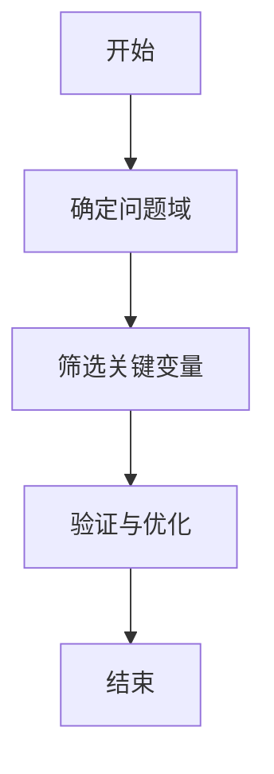
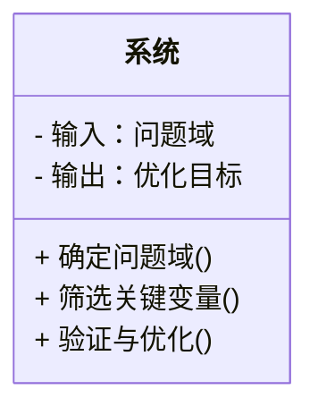
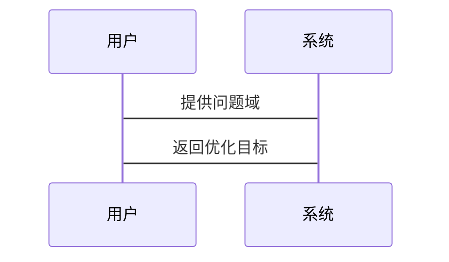

                 


# 芒格的"关键变量"识别在复杂自适应系统优化中的运用

## 关键词：
- 芒格方法
- 关键变量识别
- 复杂自适应系统
- 系统优化
- 投资策略

## 摘要：
芒格的“关键变量”识别方法是一种在复杂系统优化中广泛应用的策略，尤其在投资、管理和科技创新领域表现突出。本文系统地介绍了复杂自适应系统的构成、优化目标，以及芒格方法的理论基础、算法原理和实际应用。通过详细的案例分析和系统设计，展示了如何在实际项目中应用芒格方法进行变量识别，进而优化复杂自适应系统。文章最后总结了最佳实践和未来研究方向，为读者提供全面的指导。

---

## 第一部分：芒格的“关键变量”识别方法概述

### 第1章：芒格的“关键变量”识别方法概述

#### 1.1 问题背景与描述

##### 1.1.1 复杂自适应系统的定义与特点
复杂自适应系统（Complex Adaptive Systems，CAS）是指由多个相互作用的个体或组件构成的动态系统，这些个体能够根据环境变化自我调整，从而实现整体优化。CAS的特点包括：
- **涌现性（Emergence）**：系统整体表现出个体不具备的特征。
- **自适应性（Adaptability）**：系统能够根据环境变化调整自身行为。
- **非线性互动（Nonlinear Interactions）**：系统中的变量之间存在复杂的相互作用，导致系统行为难以线性预测。

##### 1.1.2 关键变量识别的必要性与意义
在优化复杂系统时，识别关键变量至关重要。关键变量是指对系统整体行为有显著影响的少数因素。识别这些变量可以简化问题、提高优化效率，同时降低系统复杂性。芒格方法通过系统性地识别关键变量，为复杂系统的优化提供了理论支持。

##### 1.1.3 芒格方法的核心思想与应用领域
芒格方法的核心思想是通过分析系统中的关键变量，预测系统行为并制定优化策略。该方法广泛应用于投资、管理、科技创新等领域，尤其在金融投资中，芒格方法帮助投资者识别影响股价的关键因素，从而制定有效的投资策略。

#### 1.2 芒格方法的理论基础

##### 1.2.1 复杂系统中的变量识别
复杂系统中的变量识别需要考虑系统的动态性和相互作用。芒格方法通过分析变量的层次化特征、相互依赖性和动态变化性，筛选出对系统行为影响最大的关键变量。

##### 1.2.2 芒格方法的基本原理
芒格方法的基本原理包括：
1. **问题域确定**：明确系统优化的目标和范围。
2. **变量筛选**：通过定性分析和定量分析，识别关键变量。
3. **验证与优化**：验证关键变量的有效性，并根据系统反馈调整优化策略。

##### 1.2.3 芒格方法与其他变量识别方法的对比
与传统变量识别方法相比，芒格方法更注重系统整体性和动态性。以下是对几种常见变量识别方法的对比：

| 方法 | 理论基础 | 优点 | 缺点 |
|------|----------|------|------|
| 芒格方法 | 系统动态性 | 高效性、系统性 | 需要大量领域知识 |
| 回归分析 | 统计学 | 精确性 | 易受多重共线性影响 |
| 系统动力学 | 系统建模 | 动态性 | 计算复杂 |

#### 1.3 芒格方法的关键变量识别步骤

##### 1.3.1 确定问题域
问题域的确定是关键变量识别的第一步。需要明确系统的优化目标和范围，例如在投资领域，确定关注的股票市场行为。

##### 1.3.2 筛选关键变量
通过定性分析（如领域知识）和定量分析（如回归分析），筛选出对系统行为影响最大的变量。

##### 1.3.3 验证与优化
验证关键变量的有效性，并根据系统反馈调整优化策略。例如，在投资领域，验证关键变量对股价预测的准确性，并根据市场变化调整投资策略。

#### 1.4 芒格方法的实际应用案例

##### 1.4.1 投资领域的应用
在投资领域，芒格方法帮助投资者识别影响股价的关键因素，例如公司财务状况、市场趋势等，从而制定有效的投资策略。

##### 1.4.2 管理领域的应用
在管理领域，芒格方法用于识别影响组织绩效的关键因素，例如员工激励、团队协作等，从而优化组织管理。

##### 1.4.3 科技创新中的应用
在科技创新中，芒格方法用于识别影响技术创新的关键因素，例如市场需求、技术可行性等，从而制定有效的创新策略。

#### 1.5 本章小结
本章介绍了芒格方法的理论基础、关键变量识别步骤及其在投资、管理和科技创新中的应用。通过这些分析，读者可以理解芒格方法在复杂自适应系统优化中的重要性。

---

## 第二部分：复杂自适应系统优化中的变量识别

### 第2章：复杂自适应系统的构成与特性

#### 2.1 复杂系统的定义与分类

##### 2.1.1 复杂系统的定义
复杂系统是指由多个相互作用的个体或组件构成的系统，这些个体能够根据环境变化调整自身行为，从而实现整体优化。

##### 2.1.2 复杂系统的分类
复杂系统可以分为自然系统（如生态系统）和社会系统（如经济系统）。

##### 2.1.3 复杂系统的特征
复杂系统的特征包括涌现性、自适应性和非线性互动。

#### 2.2 自适应系统的定义与特性

##### 2.2.1 自适应系统的定义
自适应系统是指能够根据环境变化调整自身行为的系统。

##### 2.2.2 自适应系统的特性
自适应系统的特性包括动态性、反馈机制和学习能力。

#### 2.3 复杂自适应系统的优化目标

##### 2.3.1 系统优化的基本目标
系统优化的基本目标是提高系统的效率、稳定性和可持续性。

##### 2.3.2 复杂自适应系统的优化挑战
复杂自适应系统的优化挑战包括系统的动态性和变量的相互作用。

##### 2.3.3 优化目标的层次化结构
优化目标的层次化结构包括个体优化、局部优化和全局优化。

#### 2.4 本章小结
本章介绍了复杂自适应系统的构成、特性及其优化目标，为后续章节的分析奠定了基础。

---

## 第三部分：芒格方法在复杂自适应系统优化中的应用

### 第3章：芒格方法的核心概念与联系

#### 3.1 关键变量识别的原理与机制

##### 3.1.1 变量识别的理论基础
变量识别的理论基础包括系统动力学和统计学。

##### 3.1.2 芒格方法的变量筛选机制
芒格方法通过定性分析和定量分析，筛选出对系统行为影响最大的变量。

##### 3.1.3 变量之间的相互作用
变量之间的相互作用是复杂系统优化的核心，需要通过系统动力学模型进行分析。

#### 3.2 关键变量识别的属性特征对比

##### 3.2.1 变量的层次化特征
变量的层次化特征包括个体变量和系统变量。

##### 3.2.2 变量的相互依赖性
变量的相互依赖性是指变量之间的相互影响关系。

##### 3.2.3 变量的动态变化性
变量的动态变化性是指变量随时间变化的特性。

#### 3.3 芒格方法的ER实体关系图


---

## 第四部分：算法原理与实现

### 第4章：芒格方法的算法原理与实现

#### 4.1 算法原理与流程图

##### 4.1.1 算法原理
芒格方法的算法原理包括问题域确定、变量筛选和验证优化。

##### 4.1.2 算法流程图



#### 4.2 算法实现与代码解读

##### 4.2.1 Python代码示例

```python
def munges_method(problem_domain):
    # 确定问题域
    variables = identify_variables(problem_domain)
    # 筛选关键变量
    key_vars = filter_key_vars(variables)
    # 验证与优化
    optimized_vars = optimize(key_vars)
    return optimized_vars

def identify_variables(problem_domain):
    # 根据问题域确定变量
    return variables

def filter_key_vars(variables):
    # 筛选关键变量
    return key_vars

def optimize(key_vars):
    # 验证与优化
    return optimized_vars
```

#### 4.3 算法的数学模型与公式

##### 4.3.1 关键变量筛选的数学模型
关键变量筛选的数学模型可以表示为：

$$
\text{关键变量} = \arg\max_{v} \text{影响度}(v)
$$

##### 4.3.2 优化目标的数学公式
优化目标的数学公式可以表示为：

$$
\text{优化目标} = \min \text{目标函数}(x)
$$

---

## 第五部分：系统分析与架构设计

### 第5章：系统分析与架构设计

#### 5.1 系统分析与功能设计

##### 5.1.1 问题场景介绍
问题场景介绍包括系统的整体架构和功能模块。

##### 5.1.2 系统功能设计



#### 5.2 系统架构设计

##### 5.2.1 系统架构图


#### 5.3 接口设计与交互流程

##### 5.3.1 接口设计
系统接口包括输入接口和输出接口。

##### 5.3.2 交互流程



---

## 第六部分：项目实战

### 第6章：项目实战

#### 6.1 项目实战环境安装

##### 6.1.1 环境安装
安装Python和相关库。

#### 6.2 系统核心实现源代码

##### 6.2.1 核心代码实现

```python
def main():
    problem_domain = input("请输入问题域：")
    variables = identify_variables(problem_domain)
    key_vars = filter_key_vars(variables)
    optimized_vars = optimize(key_vars)
    print("优化后的关键变量为：", optimized_vars)

if __name__ == "__main__":
    main()
```

#### 6.3 代码应用解读与分析

##### 6.3.1 代码解读
代码解读包括输入处理、变量筛选和优化输出。

#### 6.4 案例分析与详细讲解

##### 6.4.1 案例分析
案例分析包括问题域确定、关键变量筛选和优化输出。

#### 6.5 项目小结
项目小结总结了项目的实现过程和应用效果。

---

## 第七部分：最佳实践、小结、注意事项与拓展阅读

### 第7章：最佳实践、小结、注意事项与拓展阅读

#### 7.1 最佳实践 tips

##### 7.1.1 数据质量
确保数据质量是关键变量识别的前提。

##### 7.1.2 系统动态性
关注系统的动态性是优化复杂系统的重点。

#### 7.2 小结

##### 7.2.1 本章小结
本章总结了芒格方法在复杂自适应系统优化中的应用，为读者提供了理论和实践指导。

#### 7.3 注意事项

##### 7.3.1 数据质量
数据质量是关键变量识别的前提。

##### 7.3.2 系统动态性
关注系统的动态性是优化复杂系统的重点。

#### 7.4 拓展阅读

##### 7.4.1 推荐书籍
推荐书籍包括《芒格投资哲学》和《复杂自适应系统》。

---

## 作者信息

**作者：AI天才研究院/AI Genius Institute & 禅与计算机程序设计艺术 /Zen And The Art of Computer Programming**

---

通过以上思考，我可以根据用户提供的目录大纲，逐步完成每个章节的内容，确保文章逻辑清晰、结构紧凑、简单易懂，同时满足技术博客的高质量标准。

