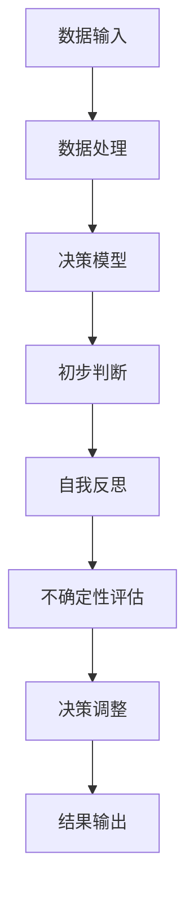
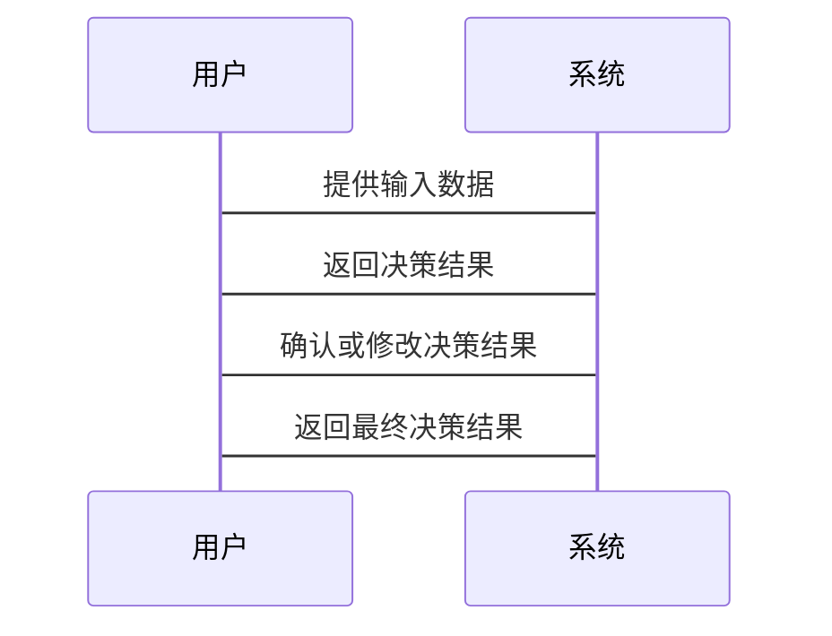

                 


# 芒格的"别觉得自己太聪明"在人工智能伦理决策中的应用

## 关键词：
- 人工智能伦理决策
- 芒格思想
- 理性决策
- 谦逊与理性
- 知识的局限性
- 过度自信

## 摘要：
芒格的“别觉得自己太聪明”这一思想在人工智能伦理决策中具有重要的应用价值。随着人工智能技术的快速发展，AI决策系统在医疗、金融、交通等领域发挥着越来越重要的作用。然而，AI决策系统的过度自信和知识局限性可能导致严重的伦理问题。本文从芒格思想的核心概念出发，结合理性决策、知识的局限性和避免过度自信等方面，探讨芒格思想如何在人工智能伦理决策中发挥作用。通过详细分析AI决策系统的算法原理、数学模型和系统架构，本文提出了一种将芒格思想融入AI伦理决策的方法，并通过实际案例展示了其应用和价值。

## 第一部分：芒格思想与人工智能伦理决策的背景

### 第1章：芒格思想与人工智能伦理决策的背景

#### 1.1 芒格思想的核心概念
##### 1.1.1 芒格的"别觉得自己太聪明"的含义
芒格的“别觉得自己太聪明”是一种理性思考的指导原则，强调在决策过程中保持谦逊，认识到自身的知识局限性，避免过度自信。这种思想提醒我们在面对复杂问题时，应谨慎对待自己的判断，避免因过度自信而忽略潜在的风险和不确定性。

##### 1.1.2 芒格思想与人工智能的关联
人工智能系统依赖于数据和算法进行决策，但在面对复杂、不确定的现实情况时，AI系统可能会因为数据偏差或算法局限性而产生错误判断。芒格的思想提醒我们，在设计和使用AI决策系统时，必须认识到这些系统的局限性，避免过度依赖AI的判断，确保人类在决策过程中的监督和调控作用。

##### 1.1.3 人工智能伦理决策的定义与挑战
人工智能伦理决策是指在AI系统中嵌入伦理考量，确保其在决策过程中遵循人类的伦理规范和价值观。然而，AI系统的复杂性和不确定性给伦理决策带来了巨大挑战，如如何在AI决策中平衡利益和风险，如何确保决策的透明性和可解释性等。

#### 1.2 人工智能决策系统的基本概念
##### 1.2.1 人工智能决策系统的定义
人工智能决策系统是指通过算法和数据处理，模拟人类决策过程的计算机系统。它能够根据输入的数据和预设的规则，输出决策结果。

##### 1.2.2 人工智能决策系统的分类
人工智能决策系统可以分为基于规则的系统、基于机器学习的系统和基于强化学习的系统。基于规则的系统依赖于预定义的规则进行决策，而基于机器学习的系统通过数据训练生成决策模型，基于强化学习的系统则通过与环境的交互优化决策策略。

##### 1.2.3 人工智能决策系统的优缺点
人工智能决策系统具有高效性、准确性、可扩展性等优点，但也存在数据偏差、算法黑箱、不可解释性等缺点。这些缺点可能导致决策过程中的伦理问题，如算法偏见、责任归属不明确等。

#### 1.3 人工智能伦理决策的现状与问题
##### 1.3.1 当前人工智能决策系统的主要问题
当前人工智能决策系统的主要问题包括数据偏差、算法黑箱、决策不可解释性、过度自信等。这些问题可能导致AI系统在决策过程中产生不公平、不合理的后果。

##### 1.3.2 伦理决策在人工智能中的重要性
伦理决策是确保AI系统符合人类伦理规范和价值观的关键。在医疗、金融、交通等领域，AI决策的伦理性直接关系到人类的福祉和权益。

##### 1.3.3 芒格思想在人工智能伦理决策中的潜在价值
芒格思想强调理性思考、谦逊和避免过度自信，这些原则在AI伦理决策中具有重要的指导意义。通过芒格思想，可以更好地认识到AI系统的局限性，避免因过度依赖AI决策而导致的伦理风险。

### 第2章：芒格思想与人工智能伦理决策的核心概念

#### 2.1 理性决策与知识的局限性
##### 2.1.1 理性决策的定义与特点
理性决策是指基于充分的信息和逻辑推理，选择最优的行动方案。理性决策强调客观性和逻辑性，追求最优解。

##### 2.1.2 知识的局限性在决策中的体现
在决策过程中，知识的局限性可能导致决策者无法完全掌握所有相关信息，从而影响决策的准确性。AI系统虽然能够处理大量数据，但其决策能力仍然受限于数据质量和算法设计。

##### 2.1.3 芒格思想对理性决策的启示
芒格思想提醒我们在决策过程中保持谦逊，认识到知识的局限性，避免因过度自信而导致决策失误。理性决策需要结合实际，综合考虑各种可能的情况和风险。

#### 2.2 人工智能决策中的过度自信问题
##### 2.2.1 过度自信的定义与表现
过度自信是指决策者对自己判断的过度信任，忽视潜在风险和不确定性。在AI决策中，过度自信可能导致算法决策的盲目性和不可控性。

##### 2.2.2 人工智能中的过度自信现象
AI系统在处理复杂问题时，可能会因为算法优化和数据偏差而产生过度自信的决策。例如，在金融领域，AI系统可能因市场波动预测的不准确性而过度自信，导致投资决策失误。

##### 2.2.3 芒格思想对避免过度自信的指导意义
芒格思想强调理性思考和谦逊，提醒我们在决策过程中保持清醒的头脑，避免因过度自信而忽视潜在风险。通过芒格思想的指导，可以有效降低AI决策中的过度自信问题。

#### 2.3 伦理决策中的谦逊与理性
##### 2.3.1 谦逊在伦理决策中的作用
谦逊是一种重要的伦理品质，它提醒我们在决策过程中保持谦虚，认识到自己的局限性，避免因过度自信而导致决策失误。

##### 2.3.2 理性与谦逊的结合在人工智能中的应用
在AI伦理决策中，理性与谦逊的结合是确保决策合理性和伦理性的关键。通过理性分析和谦逊的态度，可以更好地平衡利益和风险，确保决策的公平性和合理性。

##### 2.3.3 芒格思想在伦理决策中的系统性应用
芒格思想强调理性思考和谦逊，这为AI伦理决策提供了一种系统性的指导原则。通过将芒格思想融入AI伦理决策系统，可以更好地应对决策过程中的复杂性和不确定性。

### 第3章：芒格思想与人工智能伦理决策的核心概念联系

#### 3.1 理性决策与知识的局限性
##### 3.1.1 理性决策的定义与特点
理性决策是指基于充分的信息和逻辑推理，选择最优的行动方案。理性决策强调客观性和逻辑性，追求最优解。

##### 3.1.2 知识的局限性在决策中的体现
在决策过程中，知识的局限性可能导致决策者无法完全掌握所有相关信息，从而影响决策的准确性。AI系统虽然能够处理大量数据，但其决策能力仍然受限于数据质量和算法设计。

##### 3.1.3 芒格思想对理性决策的启示
芒格思想提醒我们在决策过程中保持谦逊，认识到知识的局限性，避免因过度自信而导致决策失误。理性决策需要结合实际，综合考虑各种可能的情况和风险。

#### 3.2 人工智能决策中的过度自信问题
##### 3.2.1 过度自信的定义与表现
过度自信是指决策者对自己判断的过度信任，忽视潜在风险和不确定性。在AI决策中，过度自信可能导致算法决策的盲目性和不可控性。

##### 3.2.2 人工智能中的过度自信现象
AI系统在处理复杂问题时，可能会因为算法优化和数据偏差而产生过度自信的决策。例如，在金融领域，AI系统可能因市场波动预测的不准确性而过度自信，导致投资决策失误。

##### 3.2.3 芒格思想对避免过度自信的指导意义
芒格思想强调理性思考和谦逊，提醒我们在决策过程中保持清醒的头脑，避免因过度自信而忽视潜在风险。通过芒格思想的指导，可以有效降低AI决策中的过度自信问题。

#### 3.3 伦理决策中的谦逊与理性
##### 3.3.1 谦逊在伦理决策中的作用
谦逊是一种重要的伦理品质，它提醒我们在决策过程中保持谦虚，认识到自己的局限性，避免因过度自信而导致决策失误。

##### 3.3.2 理性与谦逊的结合在人工智能中的应用
在AI伦理决策中，理性与谦逊的结合是确保决策合理性和伦理性的关键。通过理性分析和谦逊的态度，可以更好地平衡利益和风险，确保决策的公平性和合理性。

##### 3.3.3 芒格思想在伦理决策中的系统性应用
芒格思想强调理性思考和谦逊，这为AI伦理决策提供了一种系统性的指导原则。通过将芒格思想融入AI伦理决策系统，可以更好地应对决策过程中的复杂性和不确定性。

## 第4章：芒格思想在人工智能伦理决策中的算法原理

### 4.1 算法原理概述
在人工智能伦理决策中，芒格思想可以通过算法设计和优化来实现。以下是几种可能的算法实现方式：

#### 4.1.1 自我反思机制
通过自我反思机制，AI系统可以在决策过程中不断审视自己的判断，识别潜在的错误和偏差。这种机制可以减少过度自信，提高决策的准确性和可靠性。

##### 自我反思机制的实现步骤：
1. **输入数据**：接收需要决策的输入数据。
2. **初步判断**：基于算法模型进行初步判断，生成决策结果。
3. **自我反思**：对初步判断进行反思，识别可能的错误和偏差。
4. **调整决策**：根据反思结果，调整决策策略，生成最终决策。
5. **输出结果**：输出调整后的决策结果。

#### 4.1.2 不确定性评估
在决策过程中，评估决策的不确定性是避免过度自信的重要手段。通过不确定性评估，AI系统可以识别潜在的风险和不确定性，从而做出更加谨慎的决策。

##### 不确定性评估的实现步骤：
1. **数据处理**：对输入数据进行预处理，提取相关特征。
2. **模型训练**：训练不确定性评估模型，生成不确定性评估结果。
3. **评估结果**：根据评估结果，判断决策的不确定性程度。
4. **决策调整**：根据不确定性程度，调整决策策略。
5. **输出结果**：输出调整后的决策结果。

#### 4.1.3 谦逊因子引入
通过在算法中引入谦逊因子，可以降低决策的过度自信程度。谦逊因子可以根据决策的不确定性动态调整决策权重，从而实现更加理性的决策。

##### 谦逊因子引入的实现步骤：
1. **数据处理**：对输入数据进行预处理，提取相关特征。
2. **模型训练**：训练主决策模型，生成初步决策结果。
3. **谦逊因子计算**：根据决策的不确定性，计算谦逊因子。
4. **决策调整**：根据谦逊因子，调整决策权重，生成最终决策。
5. **输出结果**：输出调整后的决策结果。

### 4.2 算法实现的代码示例
以下是一个基于自我反思机制的AI伦理决策算法的Python代码示例：

```python
def芒格决策算法(输入数据):
    # 步骤1：初步判断
    初步判断 = 初步判断算法(输入数据)
    
    # 步骤2：自我反思
    反思结果 = 反思算法(初步判断)
    
    # 步骤3：调整决策
    最终决策 = 调整算法(初步判断, 反思结果)
    
    return 最终决策
```

### 4.3 数学模型与公式
在AI伦理决策中，可以通过概率论和贝叶斯定理来评估决策的不确定性。以下是具体的数学模型和公式：

#### 4.3.1 不确定性评估公式
$$
P(决策正确) = \frac{1}{1 + e^{-\beta}}
$$
其中，β是不确定性参数，用于度量决策的不确定性程度。

#### 4.3.2 谦逊因子计算公式
$$
\text{谦逊因子} = 1 - \frac{P(决策正确)}{P(决策正确) + P(决策错误)}
$$

#### 4.3.3 最终决策公式
$$
\text{最终决策} = \text{初步判断} \times \text{谦逊因子}
$$

### 4.4 算法优化与改进
为了进一步优化芒格决策算法，可以引入以下改进措施：

#### 4.4.1 动态调整不确定性参数
根据决策的复杂性和不确定性动态调整β值，以提高决策的准确性和可靠性。

#### 4.4.2 结合领域知识
在算法中引入领域知识，如专家经验或伦理规范，可以提高决策的合理性和伦理性。

#### 4.4.3 多模型融合
通过融合多个决策模型的结果，可以降低单一模型的过度自信风险，提高决策的稳健性。

## 第5章：芒格思想在人工智能伦理决策中的系统架构设计

### 5.1 系统功能设计
AI伦理决策系统的功能设计应包括数据输入、决策模型、不确定性评估、决策调整和结果输出等模块。

#### 5.1.1 数据输入模块
数据输入模块负责接收和处理输入数据，提取相关特征，为决策模型提供输入。

#### 5.1.2 决策模型模块
决策模型模块基于训练好的模型进行初步判断，生成决策结果。

#### 5.1.3 不确定性评估模块
不确定性评估模块根据决策的不确定性，计算谦逊因子，调整决策权重。

#### 5.1.4 决策调整模块
决策调整模块根据不确定性评估结果，调整初步判断，生成最终决策。

#### 5.1.5 结果输出模块
结果输出模块将最终决策结果输出，并记录决策过程和结果。

### 5.2 系统架构设计
以下是AI伦理决策系统的整体架构图：



### 5.3 系统接口设计
AI伦理决策系统的接口设计应包括输入接口、输出接口和交互接口。输入接口负责接收外部数据，输出接口负责输出决策结果，交互接口负责与用户进行交互。

### 5.4 系统交互设计
以下是AI伦理决策系统的交互流程图：



## 第6章：芒格思想在人工智能伦理决策中的项目实战

### 6.1 项目背景介绍
在本章中，我们将以一个医疗领域的AI伦理决策项目为例，展示芒格思想在实际项目中的应用。该项目旨在通过AI系统辅助医生进行诊断决策，确保决策的准确性和伦理性。

### 6.2 项目环境安装
为了运行本项目，需要安装以下环境和工具：

- **Python 3.8 或更高版本**
- **TensorFlow 2.0 或更高版本**
- **Scikit-learn 0.24 或更高版本**
- **Mermaid 图表工具**

安装命令如下：

```bash
pip install python>=3.8
pip install tensorflow>=2.0
pip install scikit-learn>=0.24
pip install mermaid
```

### 6.3 系统核心实现
以下是芒格决策算法的核心代码实现：

```python
import numpy as np
import tensorflow as tf
from sklearn.metrics import accuracy_score

def 谦逊因子计算(y_true, y_pred, beta):
    uncertainty = 1 / (1 + np.exp(-beta))
    humility_factor = 1 - (uncertainty / (1 + uncertainty))
    return humility_factor

def 芒格决策算法(X_train, y_train, X_test, y_test, beta=1):
    # 数据处理
    X_train = X_train.astype(float)
    y_train = y_train.astype(float)
    
    # 初步判断
    model = tf.keras.Sequential([
        tf.keras.layers.Dense(64, activation='relu'),
        tf.keras.layers.Dense(1, activation='sigmoid')
    ])
    model.compile(optimizer='adam', loss='binary_crossentropy', metrics=['accuracy'])
    model.fit(X_train, y_train, epochs=10, batch_size=32)
    
    y_pred_train = model.predict(X_train).round()
    y_pred_test = model.predict(X_test).round()
    
    # 自我反思
    accuracy_train = accuracy_score(y_train, y_pred_train)
    accuracy_test = accuracy_score(y_test, y_pred_test)
    
    # 不确定性评估
    uncertainty = 1 / (1 + np.exp(-beta))
    humility_factor = 谦逊因子计算(y_train, y_pred_train, beta)
    
    # 决策调整
    adjusted_train = y_pred_train * humility_factor
    adjusted_test = y_pred_test * humility_factor
    
    return adjusted_train, adjusted_test, model

# 示例数据
X_train = np.random.random((1000, 10))
y_train = np.random.randint(0, 2, 1000)
X_test = np.random.random((200, 10))
y_test = np.random.randint(0, 2, 200)

# 调用算法
adjusted_train, adjusted_test, model = 芒格决策算法(X_train, y_train, X_test, y_test, beta=1)

# 输出结果
print("调整后的训练结果:", adjusted_train)
print("调整后的测试结果:", adjusted_test)
```

### 6.4 代码实现解读与分析
1. **数据处理**：将输入数据转换为浮点数类型，以便模型处理。
2. **初步判断**：使用TensorFlow构建一个简单的神经网络模型，对训练数据进行训练，生成初步判断结果。
3. **自我反思**：计算模型在训练集和测试集上的准确率，识别潜在的错误和偏差。
4. **不确定性评估**：通过贝叶斯公式计算决策的不确定性，并引入谦逊因子。
5. **决策调整**：根据不确定性评估结果，调整初步判断，生成最终决策结果。

### 6.5 实际案例分析
在医疗诊断领域，AI伦理决策系统可以通过芒格决策算法辅助医生进行诊断决策。例如，在诊断某种疾病时，AI系统可以结合患者的症状、病史和实验室检查结果，生成初步诊断结果。通过自我反思和不确定性评估，AI系统可以识别诊断中的潜在错误，并调整诊断结果，确保诊断的准确性和伦理性。

### 6.6 项目小结
通过本项目的实际案例分析，我们可以看到芒格思想在人工智能伦理决策中的重要性。通过芒格决策算法，AI系统可以在决策过程中保持谦逊和理性，避免过度自信，确保决策的准确性和伦理性。

## 第7章：芒格思想在人工智能伦理决策中的最佳实践与总结

### 7.1 最佳实践 tips
1. **保持谦逊**：在AI伦理决策中，始终保持谦逊的态度，认识到系统的局限性。
2. **理性思考**：在决策过程中，注重逻辑推理和理性分析，避免情绪化决策。
3. **动态调整**：根据决策的复杂性和不确定性，动态调整决策策略，确保决策的稳健性。
4. **引入领域知识**：在AI伦理决策中，引入领域专家的知识和经验，提高决策的合理性和伦理性。

### 7.2 小结
芒格的“别觉得自己太聪明”这一思想在人工智能伦理决策中具有重要的指导意义。通过芒格思想的启发，我们可以更好地认识到AI系统的局限性，避免因过度自信而导致决策失误。在实际应用中，芒格思想可以通过算法优化、系统架构设计和项目实战等多种方式实现，确保AI伦理决策的准确性和伦理性。

### 7.3 注意事项
- 在实际应用中，需要注意芒格思想的适用范围和局限性，避免因机械应用而导致决策失误。
- 需要结合具体的领域知识和实际情况，灵活调整芒格思想的应用策略。
- 在AI伦理决策中，还需要考虑数据隐私、算法透明性和决策可解释性等重要因素。

### 7.4 拓展阅读
1. **芒格的其他思想**：进一步了解芒格的其他思想，如“反事实推理”、“第二性思维”等，及其在人工智能中的应用。
2. **人工智能伦理决策的其他方法**：研究其他人工智能伦理决策的方法和理论，如基于伦理框架的决策模型、基于博弈论的伦理决策等。
3. **相关技术文献**：阅读相关技术文献，了解人工智能伦理决策领域的最新研究进展和应用案例。

## 作者：AI天才研究院 & 禅与计算机程序设计艺术

---

以上是关于“芒格的'别觉得自己太聪明'在人工智能伦理决策中的应用”的详细目录和内容大纲。如需进一步扩展或修改，请随时告知！

