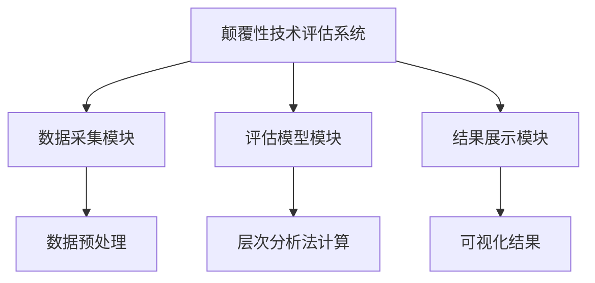

                 


# 芒格的"别觉得自己太聪明"在颠覆性技术评估中的应用

---

## 关键词：芒格，颠覆性技术，技术评估，思维模型，系统架构

---

## 摘要：本文探讨了芒格的“别觉得自己太聪明”思想在颠覆性技术评估中的应用。通过分析芒格的思维模型，结合数学算法和系统架构设计，提出了一种基于层次分析法的评估框架，并通过实际案例展示了该方法的应用。

---

## 目录

### 第一部分：芒格的"别觉得自己太聪明"思想概述

#### 第1章：芒格的"别觉得自己太聪明"思想的背景与核心概念

##### 1.1 芒格思想的起源与核心理念

- 1.1.1 芒格的哲学基础
- 1.1.2 "别觉得自己太聪明"的核心含义
- 1.1.3 芒格思想在决策中的应用

##### 1.2 颠覆性技术的定义与特征

- 1.2.1 颠覆性技术的定义
- 1.2.2 颠覆性技术的特征分析
- 1.2.3 颠覆性技术与传统技术的区别

##### 1.3 芒格思想与颠覆性技术评估的结合

- 1.3.1 芒格思想在技术评估中的作用
- 1.3.2 颠覆性技术评估的复杂性
- 1.3.3 芒格思想对技术评估的启示

---

### 第二部分：芒格思维模型在颠覆性技术评估中的应用

#### 第2章：芒格思维模型的核心要素

##### 2.1 颠覆性技术的潜在影响

- 2.1.1 技术的颠覆性潜力
- 2.1.2 技术对行业的影响

##### 2.2 技术评估中的认知偏差

- 2.2.1 认知偏差的类型
- 2.2.2 认知偏差对评估的影响

##### 2.3 芒格思维模型的系统性分析

- 2.3.1 系统性分析的步骤
- 2.3.2 系统性分析的优势

---

#### 第3章：颠覆性技术评估的框架构建

##### 3.1 芒格思维模型的应用步骤

- 3.1.1 明确评估目标
- 3.1.2 确定评估维度
- 3.1.3 设计评估指标

##### 3.2 评估框架的优缺点分析

- 3.2.1 评估框架的优点
- 3.2.2 评估框架的缺点

---

### 第三部分：系统分析与架构设计方案

#### 第4章：系统分析

##### 4.1 系统目标

- 4.1.1 系统目标的定义
- 4.1.2 系统目标的分解

##### 4.2 系统功能需求分析

- 4.2.1 系统功能需求
- 4.2.2 系统功能的优先级

##### 4.3 系统边界与外部接口

- 4.3.1 系统边界的设计
- 4.3.2 系统外部接口的定义

---

#### 第5章：系统架构设计

##### 5.1 模块化设计思路

- 5.1.1 模块划分的原则
- 5.1.2 模块化设计的优势

##### 5.2 系统架构的Mermaid图



##### 5.3 模块间的交互关系

- 5.3.1 模块间的依赖关系
- 5.3.2 模块间的通信机制

---

### 第四部分：项目实战

#### 第6章：项目背景与目标

##### 6.1 项目背景介绍

- 6.1.1 项目背景
- 6.1.2 项目目标

##### 6.2 项目范围界定

- 6.2.1 项目范围
- 6.2.2 项目约束

---

#### 第7章：核心代码实现

##### 7.1 环境安装与配置

- 7.1.1 环境要求
- 7.1.2 软件安装

##### 7.2 核心代码实现

```python
def compute_criterion_weights(criteria_scores):
    # 计算层次分析法中的准则权重
    # 输入：criteria_scores（各准则的得分）
    # 输出：准则权重
    total = sum(criteria_scores)
    weights = [score / total for score in criteria_scores]
    return weights

# 示例
criteria_scores = [0.2, 0.3, 0.5]
weights = compute_criterion_weights(criteria_scores)
print(weights)
```

---

#### 第8章：实际案例分析

##### 8.1 案例介绍

- 8.1.1 案例背景
- 8.1.2 案例目标

##### 8.2 案例分析与实现

- 8.2.1 数据采集
- 8.2.2 数据处理
- 8.2.3 结果分析

---

### 第五部分：总结与展望

#### 第9章：总结

##### 9.1 小结

- 9.1.1 芒格思想在颠覆性技术评估中的应用总结
- 9.1.2 本文的主要贡献

##### 9.2 注意事项

- 9.2.1 评估中的潜在风险
- 9.2.2 实际应用中的注意事项

---

#### 第10章：展望

##### 10.1 未来研究方向

- 10.1.1 新技术的评估方法
- 10.1.2 芒格思想的进一步应用

##### 10.2 拓展阅读

- 10.2.1 相关书籍推荐
- 10.2.2 相关论文推荐

---

## 作者：AI天才研究院/AI Genius Institute & 禅与计算机程序设计艺术 /Zen And The Art of Computer Programming

