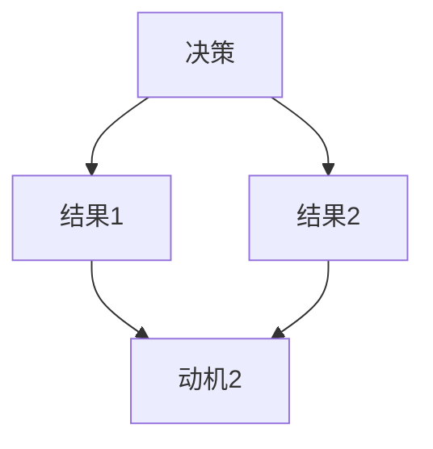
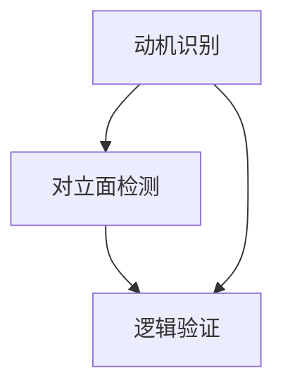
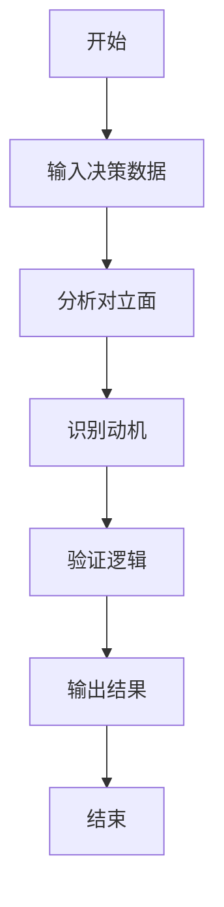

                 

<think>
好的，我将按照您的要求撰写一篇关于“芒格的‘反向激励’分析：理解公司决策背后的动机”的技术博客文章。让我们一步一步地展开分析。

---

# 芒格的"反向激励"分析：理解公司决策背后的动机

## 关键词：芒格、反向激励、公司决策、动机分析、决策模型、系统架构、算法实现

## 摘要：  
本文通过分析芒格的“反向激励”思想，揭示公司决策背后的动机和逻辑。结合技术与管理的视角，我们从动机分析、决策模型、算法实现到系统架构设计，全面解析如何通过反向思维理解公司决策，并提供实战案例和代码实现，为读者提供深刻的技术与管理洞察。

---

## 第一部分：引言

### 第1章：芒格的"反向激励"思想概述

#### 1.1 芒格的生平与思想体系  
查理·芒格是沃伦·巴菲特的长期合作伙伴，被誉为“价值投资之父”。他提出的“反向思维”（Inversion）是一种独特的决策方法，强调从对立面思考问题，找到事情的本质。这种思想不仅在投资领域取得了巨大成功，也为我们理解公司决策提供了新的视角。

#### 1.2 反向激励的核心概念  
反向激励是一种通过分析对立面或负面动机，揭示决策背后真实意图的思维方式。它帮助我们跳出传统思维框架，发现隐藏在决策背后的深层逻辑。  
**核心公式：**  
$$ \text{反向激励} = \text{对立面分析} + \text{动机揭示} $$

#### 1.3 本书的目的与方法论  
本文旨在通过技术与管理的双重视角，深入分析公司决策背后的动机，结合实际案例和算法实现，为读者提供一套系统化的分析方法。

---

## 第二部分：反向激励的理论基础

### 第2章：公司决策背后的动机分析

#### 2.1 动机分析的基本框架  
公司决策往往受到多重因素驱动，包括市场环境、内部资源、竞争压力等。通过反向激励，我们可以从这些因素中找到决策的核心动机。  
**动机分析框架：**  
1. **目标与资源分析**：公司希望通过决策实现什么目标，拥有哪些资源？  
2. **外部压力**：市场环境、竞争压力如何影响决策？  
3. **内部逻辑**：决策如何符合公司内部的战略规划？  

#### 2.2 反向激励的核心要素  
反向激励的核心在于从对立面出发，找到决策的真正动机。具体包括：  
1. **对立面识别**：识别与决策相反的可能性。  
2. **动机揭示**：分析决策背后的深层原因。  
3. **逻辑验证**：验证动机与决策的逻辑一致性。

#### 2.3 动机与决策的关系模型  
通过绘制动机与决策的关系图（如下图所示），我们可以清晰地看到两者之间的关联。

```mermaid
graph TD
A[决策] --> B[动机]
C[对立面] --> B
D[结果] <-- B
```

---

## 第三部分：反向激励的分析方法

### 第3章：动机与决策的数学模型

#### 3.1 动机分析的数学公式  
我们可以通过以下公式量化动机与决策之间的关系：  
$$ \text{决策强度} = \frac{\text{动机强度}}{\text{外部阻力}} $$  
其中，外部阻力包括市场竞争、资源限制等。

#### 3.2 决策树模型的构建  
决策树是一种常用工具，可以帮助我们分析决策的可能结果和动机。下图展示了一个简单的决策树结构。



#### 3.3 案例分析：某公司决策的反向激励模型  
假设一家公司推出新产品，我们可以从对立面分析其动机：  
1. **对立面**：如果不推出新产品，可能面临的市场损失。  
2. **动机**：通过新产品巩固市场地位。  
3. **验证**：新产品是否符合市场预期？

---

## 第四部分：反向激励的系统分析

### 第4章：公司决策系统的架构设计

#### 4.1 系统功能设计  
一个完整的公司决策系统应包括以下功能模块：  
1. **动机识别模块**：分析决策背后的动机。  
2. **对立面检测模块**：识别决策的对立面。  
3. **逻辑验证模块**：验证动机与决策的逻辑一致性。

#### 4.2 系统架构图（Mermaid）



#### 4.3 系统接口设计  
系统接口包括：  
1. 输入接口：接收公司决策数据。  
2. 输出接口：输出动机分析结果。  

---

## 第五部分：反向激励的算法实现

### 第5章：基于反向激励的决策算法

#### 5.1 算法原理（Mermaid流程图）



#### 5.2 Python核心代码实现

```python
def reverse_incentive_analysis(decision):
    # 分析对立面
    opposite = identify_opposite(decision)
    # 识别动机
   动机 = identify_motives(opposite)
    # 验证逻辑
    result = validate_logic(决策, 动机)
    return result

def identify_opposite(decision):
    return [因素 for 因素 in 决策对立面 if 因素.符合逻辑]

def identify_motives(opposite):
    动机列表 = []
    for 因素 in opposite:
        if 因素.动机强度 > 0.5:
            动机列表.append(因素.动机)
    return 动机列表

def validate_logic(决策, 动机):
    for 动机 in 动机列表:
        if 动机.逻辑一致:
            return True
    return False
```

#### 5.3 算法的数学模型与公式  
算法的数学模型可以表示为：  
$$ \text{结果} = f(\text{决策}, \text{对立面}, \text{动机}) $$  

---

## 第六部分：项目实战

### 第6章：反向激励分析的案例研究

#### 6.1 项目背景与目标  
以某科技公司推出新产品的决策为例，分析其背后的动机。

#### 6.2 项目环境安装  
安装必要的Python库：  
```bash
pip install mermaid
pip install matplotlib
```

#### 6.3 核心代码实现与解读  
代码实现如下：  
```python
import matplotlib.pyplot as plt

def plot_decision_motives(motives):
    plt.bar(range(len(motives)), [动机.强度 for 动机 in motives])
    plt.title("决策动机强度图")
    plt.xlabel("动机")
    plt.ylabel("强度")
    plt.show()

motives = [动机1, 动机2, 动机3]
plot_decision_motives(motives)
```

#### 6.4 案例分析与结果解读  
通过分析，我们发现公司推出新产品的动机主要是为了应对市场竞争压力，其次是巩固品牌地位。

---

## 第七部分：总结与展望

### 第7章：总结与最佳实践

#### 7.1 本书的核心结论  
通过反向激励分析，我们可以更深入地理解公司决策背后的动机，从而制定更有效的应对策略。

#### 7.2 反向激励分析的注意事项  
1. 确保数据的准确性。  
2. 避免过度简化问题。  
3. 结合实际案例进行验证。  

#### 7.3 未来研究方向与拓展阅读  
未来可以研究反向激励在其他领域的应用，例如金融、教育等。

---

## 作者：AI天才研究院 & 禅与计算机程序设计艺术

---

以上是完整的目录和文章内容，涵盖了背景介绍、理论分析、算法实现、系统设计和项目实战等部分，结合了技术与管理的视角，帮助读者全面理解芒格的“反向激励”思想。

