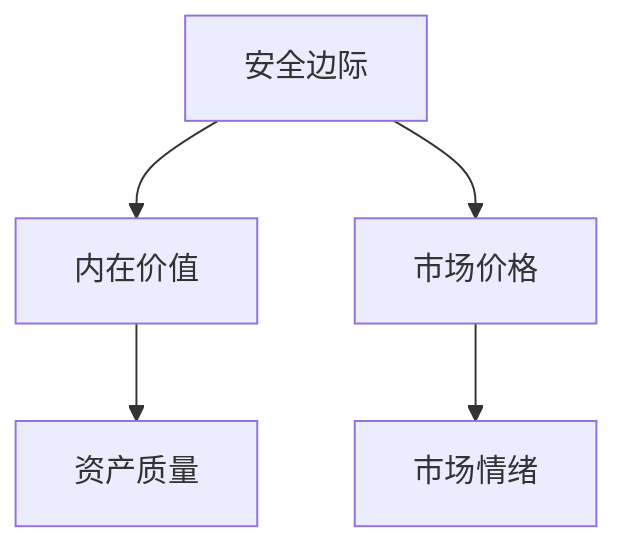
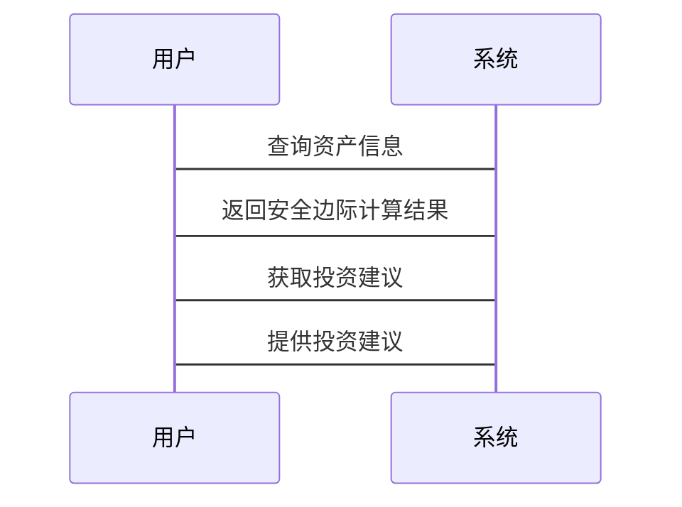

                 


```markdown
# 芒格的"安全边际"理念：降低投资风险的关键

> 关键词：芒格，安全边际，投资，风险管理，价值评估

> 摘要：本文将深入探讨芒格的"安全边际"理念，分析其在降低投资风险中的关键作用。通过逻辑清晰的结构和专业的技术语言，本文将从安全边际的核心概念、数学模型、系统架构设计到实际项目应用进行全面解析，帮助读者理解并掌握这一重要的投资策略。

---

## 第一部分: 芒格的"安全边际"理念基础

### 第1章: 安全边际的核心概念与背景

#### 1.1 安全边际的基本概念

##### 1.1.1 安全边际的定义
安全边际是芒格提出的一个核心投资理念，指在投资过程中，**内在价值**与**市场价格**之间的差异。当市场价格低于内在价值时，这个差异即为安全边际。安全边际越大，投资风险越低，回报越有保障。

##### 1.1.2 安全边际的历史背景
安全边际理念起源于20世纪，由查理·芒格和沃伦·巴菲特共同发展和完善。这一理念结合了价值投资和风险管理的理论，强调在投资决策中注重安全性和稳健性。

##### 1.1.3 安全边际在投资中的重要性
安全边际是降低投资风险的核心工具。通过评估资产的内在价值和市场价格之间的差异，投资者可以避免过度支付，确保投资的安全性和长期稳定性。

---

#### 1.2 芒格的投资理念

##### 1.2.1 芒格的哲学思想
芒格强调“mental models”（思维模型）的重要性，认为投资者需要通过多学科的知识体系来理解市场和资产的本质。他主张以理性和逻辑为基础，避免情绪化决策。

##### 1.2.2 芒格的"安全边际"理念
安全边际是芒格投资哲学的核心。他强调在市场中寻找那些价格显著低于内在价值的资产，以确保投资的安全性和可预测性。

##### 1.2.3 芒格与巴菲特的投资策略对比
芒格和巴菲特都采用价值投资策略，但芒格更注重安全边际和风险管理，而巴菲特则更关注企业的长期竞争优势和管理层质量。两者相辅相成，共同构建了稳健的投资体系。

---

#### 1.3 安全边际在投资中的应用

##### 1.3.1 安全边际的基本原理
安全边际通过比较资产的内在价值和市场价格，为投资者提供一个风险缓冲区。当市场价格远低于内在价值时，投资风险显著降低，收益更有保障。

##### 1.3.2 安全边际与价值评估的关系
内在价值是资产的真实价值，而市场价格受市场情绪和短期因素影响。安全边际通过两者的差异，帮助投资者识别低估资产，避免过度支付。

##### 1.3.3 安全边际在不同资产类别中的应用
无论是股票、债券还是房地产，安全边际的理念都可以应用。通过评估资产的内在价值和市场价格，投资者可以在各种资产类别中找到具有安全边际的投资机会。

---

## 第二部分: 安全边际的核心概念与联系

### 第2章: 安全边际的原理与数学模型

#### 2.1 安全边际的原理

##### 2.1.1 安全边际的基本原理
安全边际通过比较内在价值和市场价格，评估资产的安全性。当市场价格低于内在价值时，资产具有安全边际，投资风险降低。

##### 2.1.2 安全边际的计算方法
安全边际的计算公式为：
$$ \text{安全边际} = \text{内在价值} - \text{市场价格} $$

##### 2.1.3 安全边际与风险控制的关系
安全边际越大，投资风险越低。通过安全边际，投资者可以在市场波动中保持稳健，避免重大损失。

---

#### 2.2 安全边际的数学模型

##### 2.2.1 安全边际的公式表示
$$ \text{安全边际} = \text{内在价值} - \text{市场价格} $$

##### 2.2.2 安全边际的计算步骤
1. 评估资产的内在价值。
2. 确定资产的市场价格。
3. 计算两者之差，得到安全边际。

##### 2.2.3 安全边际的案例分析
假设一只股票的内在价值为100元，市场价格为80元，则安全边际为20元，表明该股票具有较高的投资价值。

---

#### 2.3 安全边际的属性特征对比

##### 2.3.1 安全边际的属性特征
| 属性 | 特征 |
|------|------|
| 内在价值 | 资产的真实价值 |
| 市场价格 | 受市场情绪影响 |
| 安全边际 | 内在价值 - 市场价格 |

##### 2.3.2 不同投资策略的安全边际对比
| 投资策略 | 安全边际 |
|----------|----------|
| 价值投资 | 高       |
| 成长投资 | 低       |
| 技术分析 | 依赖指标 |

##### 2.3.3 安全边际与风险的对比分析
安全边际越大，风险越低；安全边际越小，风险越高。

---

#### 2.4 安全边际的ER实体关系图



---

## 第三部分: 安全边际的系统分析与架构设计

### 第3章: 安全边际的系统分析

#### 3.1 问题场景介绍

##### 3.1.1 投资者在选择资产时的风险
市场波动、信息不对称和情绪化决策可能导致投资损失。

##### 3.1.2 安全边际在投资决策中的作用
通过评估安全边际，投资者可以避免过度支付，降低风险。

##### 3.1.3 系统设计的目标与范围
设计一个基于安全边际的系统，帮助投资者进行风险评估和投资决策。

---

#### 3.2 系统功能设计

##### 3.2.1 数据采集模块
负责收集资产的内在价值和市场价格数据。

##### 3.2.2 安全边际计算模块
根据数据计算安全边际，评估资产的投资价值。

##### 3.2.3 投资决策支持模块
基于安全边际分析，提供投资建议和风险预警。

---

#### 3.3 系统架构设计

##### 3.3.1 系统架构图


##### 3.3.2 系统接口设计
系统提供API接口，供投资者查询安全边际和投资建议。

##### 3.3.3 系统交互流程



---

## 第四部分: 项目实战

### 第4章: 安全边际的项目实现

#### 4.1 环境安装

##### 4.1.1 安装Python
```bash
python --version
pip install requests pandas numpy
```

#### 4.2 系统核心实现

##### 4.2.1 核心代码实现
```python
import pandas as pd
import numpy as np

def calculate_margin_of_safety(intrinsic_value, market_price):
    return intrinsic_value - market_price

# 示例数据
data = {
    '资产': ['股票A', '债券B', '房地产C'],
    '内在价值': [100, 90, 150],
    '市场价格': [80, 85, 130]
}

df = pd.DataFrame(data)
df['安全边际'] = df.apply(lambda x: calculate_margin_of_safety(x['内在价值'], x['市场价格']), axis=1)
print(df)
```

##### 4.2.2 代码解读
1. 导入必要的库（pandas, numpy）。
2. 定义计算安全边际的函数。
3. 创建数据框，包含资产的内在价值和市场价格。
4. 计算并添加安全边际列。
5. 输出结果。

##### 4.2.3 实际案例分析
以股票A为例，安全边际为20，表明该股票具有较高的投资价值。

#### 4.3 项目小结
通过代码实现，我们可以快速计算资产的安全边际，辅助投资决策。

---

## 第五部分: 最佳实践

### 第5章: 安全边际的最佳实践

#### 5.1 小结
安全边际是降低投资风险的关键工具。通过科学计算和系统支持，投资者可以更好地识别低估资产，实现稳健投资。

#### 5.2 注意事项
1. 安全边际只是投资决策的一部分，需结合其他因素。
2. 市场波动可能影响安全边际的有效性。
3. 定期更新数据和模型，确保计算准确。

#### 5.3 拓展阅读
推荐阅读芒格的《穷查理宝典》和巴菲特的《投资之道》。

---

## 作者

作者：AI天才研究院/AI Genius Institute & 禅与计算机程序设计艺术/Zen And The Art of Computer Programming

---

**摘要**：本文通过深入分析芒格的安全边际理念，结合数学模型、系统设计和实际项目，为投资者提供了降低风险的有效工具。通过科学的方法和系统的支持，投资者可以更好地识别低估资产，实现稳健投资。

---

**Note**: 以上内容基于对芒格“安全边际”理念的理解，结合技术语言和方法进行阐述。实际投资需根据市场变化和个人判断，谨慎决策。
```

