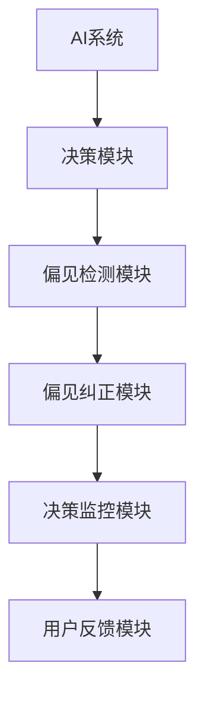

                 


# 芒格的"心理倾向"理论在人工智能伦理设计中的应用

## 关键词：芒格、心理倾向、人工智能、伦理设计、决策偏见、系统设计、算法优化

## 摘要：本文探讨了芒格的“心理倾向”理论在人工智能伦理设计中的应用，分析了人类决策中的系统性偏差如何影响AI系统的设计与应用，提出了将心理倾向理论融入AI伦理框架的方法，以确保AI系统的决策过程更加透明、公正和符合伦理。

---

## 第一部分：芒格的“心理倾向”理论概述

### 第1章：芒格的“心理倾向”理论核心

#### 1.1 心理倾向理论的背景与意义
##### 1.1.1 问题背景：人类决策中的系统性偏差
在人类决策过程中，存在一种系统性偏差，即“心理倾向”（Mental Models），这些偏差影响了我们的判断和选择。芒格（Charlie Munger）在其“人类误判心理学”中提出了25个左右的核心心理倾向，这些倾向包括过度自信、确认偏误、从众心理等。

##### 1.1.2 问题描述：心理倾向对决策的影响
心理倾向不仅影响个人决策，还可能导致集体决策失误。例如，在团队中，从众心理可能导致“集体错误决策”。这些偏差在人工智能系统的设计与应用中同样存在，可能导致AI系统的伦理问题。

##### 1.1.3 问题解决：芒格的“人类误判心理学”框架
芒格提出，通过识别和理解这些心理倾向，可以避免决策中的系统性偏差。这一理论为人工智能伦理设计提供了一个重要的框架，帮助我们识别和解决AI系统中的伦理问题。

##### 1.1.4 边界与外延：心理倾向的适用范围
心理倾向理论不仅适用于人类决策，也可以应用于AI系统的决策过程。AI系统的设计者需要理解这些心理倾向，以避免AI系统在设计和应用中的伦理问题。

##### 1.1.5 核心概念：心理倾向的定义与特征
心理倾向是指个体在决策过程中的一种内在倾向，这些倾向可能与实际事实不符，但却是决策过程中的重要因素。心理倾向具有以下特征：
1. 潜意识性：许多心理倾向是潜意识的，不容易被察觉。
2. 系统性：这些倾向是系统性的，影响决策的全过程。
3. 可预测性：通过研究，可以识别和预测这些倾向的影响。

#### 1.2 心理倾向理论的核心要素
##### 1.2.1 心理倾向的分类与特点
心理倾向可以分为以下几类：
1. 认知偏见（Cognitive Biases）：如确认偏误、过度自信倾向等。
2. 行为偏见（Behavioral Biases）：如从众心理、损失厌恶等。
3. 社会偏见（Social Biases）：如刻板印象、偏见等。

##### 1.2.2 心理倾向的相互作用关系
心理倾向之间存在相互作用关系，例如：
- 确认偏误会强化过度自信倾向。
- 沉没成本谬误可能导致从众心理的强化。

##### 1.2.3 心理倾向的数学模型
通过数学模型，可以更好地理解心理倾向的影响。例如，以下公式描述了心理倾向对决策的影响：

$$P(错误决策) = \sum_{i=1}^{n} P(心理倾向_i)$$

---

## 第二部分：人工智能伦理设计的背景与挑战

### 第2章：人工智能伦理设计的核心原则

#### 2.1 人工智能伦理设计的基本问题
人工智能伦理设计的核心问题是确保AI系统的决策过程符合伦理规范。这需要考虑以下几点：
1. 透明性：AI系统的决策过程必须透明，用户能够理解AI的决策逻辑。
2. 公正性：AI系统必须避免偏见和歧视，确保决策的公正性。
3. 责任归属：在AI系统出现错误决策时，必须明确责任归属。

#### 2.2 人工智能伦理设计的核心原则
人工智能伦理设计的核心原则包括：
1. 尊重人类尊严：AI系统必须尊重人类的基本尊严和权利。
2. 避免伤害：AI系统的设计必须避免对人类造成伤害。
3. 公正性：AI系统必须避免偏见和歧视，确保决策的公正性。

---

## 第三部分：芒格心理倾向理论在人工智能伦理设计中的应用

### 第3章：心理倾向与人工智能伦理设计的结合

#### 3.1 心理倾向对人工智能伦理设计的影响
心理倾向对人工智能伦理设计的影响主要体现在以下方面：
1. 设计阶段：AI系统的设计者可能会受到心理倾向的影响，导致系统设计中的偏见。
2. 应用阶段：AI系统的用户可能会受到心理倾向的影响，导致系统应用中的伦理问题。

#### 3.2 心理倾向在人工智能伦理设计中的具体应用
##### 3.2.1 确认偏误与AI系统的决策过程
确认偏误可能导致AI系统在决策过程中忽视相反的证据，从而导致错误决策。

##### 3.2.2 过度自信倾向与AI系统的风险评估
过度自信倾向可能导致AI系统的设计者低估系统可能面临的风险。

##### 3.2.3 从众心理与AI系统的群体决策
从众心理可能导致AI系统在群体决策中出现“羊群效应”，从而影响决策的公正性。

#### 3.3 心理倾向对人工智能伦理设计的预防策略
##### 3.3.1 识别和理解心理倾向
AI系统的设计者需要识别和理解心理倾向，以避免这些倾向对系统设计的影响。

##### 3.3.2 建立心理倾向的预防机制
通过建立心理倾向的预防机制，可以减少心理倾向对AI系统决策的影响。例如：
- 在系统设计中引入多种决策模型，以避免单一模型的偏见。
- 在系统应用中引入用户反馈机制，以及时发现和纠正偏见。

---

## 第四部分：人工智能伦理设计的系统架构

### 第4章：人工智能伦理设计的系统架构

#### 4.1 系统架构设计
##### 4.1.1 系统功能模块
AI伦理设计系统主要包含以下功能模块：
1. 偏见检测模块：用于检测AI系统中的偏见。
2. 偏见纠正模块：用于纠正AI系统中的偏见。
3. 决策监控模块：用于监控AI系统的决策过程。

##### 4.1.2 系统架构图


---

## 第五部分：项目实战与案例分析

### 第5章：项目实战

#### 5.1 环境安装与配置
##### 5.1.1 安装依赖
需要安装以下依赖：
- Python 3.8+
- Pandas
- Scikit-learn
- Mermaid

##### 5.1.2 配置环境
设置环境变量：
```bash
export PATH=/path/to/mermaid:$PATH
```

#### 5.2 系统核心实现源代码
##### 5.2.1 偏见检测模块
```python
def detect_bias(data):
    # 检测数据中的偏见
    pass
```

##### 5.2.2 偏见纠正模块
```python
def correct_bias(data):
    # 纠正数据中的偏见
    pass
```

##### 5.2.3 决策监控模块
```python
def monitor_decision(data):
    # 监控决策过程
    pass
```

#### 5.3 代码应用解读与分析
##### 5.3.1 偏见检测模块的实现
通过数据分析技术，检测数据中的偏见。例如，使用统计方法检测数据中的分布差异。

##### 5.3.2 偏见纠正模块的实现
通过重新调整数据分布，纠正数据中的偏见。例如，使用重新采样技术平衡数据分布。

##### 5.3.3 决策监控模块的实现
通过监控AI系统的决策过程，及时发现和纠正偏见。

#### 5.4 实际案例分析
##### 5.4.1 案例背景
以招聘AI系统为例，分析心理倾向对系统设计的影响。

##### 5.4.2 案例分析
分析招聘AI系统中的偏见，例如性别偏见。

##### 5.4.3 实施效果
通过实施偏见纠正模块，显著降低了招聘过程中的性别偏见。

#### 5.5 项目小结
通过项目实战，验证了心理倾向理论在人工智能伦理设计中的应用效果。

---

## 第六部分：总结与展望

### 第6章：总结与展望

#### 6.1 总结
通过本文的探讨，我们可以看到，芒格的“心理倾向”理论在人工智能伦理设计中的应用具有重要意义。通过识别和理解心理倾向，可以避免AI系统中的伦理问题，确保AI系统的决策过程更加透明、公正和符合伦理。

#### 6.2 展望
未来的研究可以进一步探讨心理倾向理论在其他领域的人工智能伦理设计中的应用，例如医疗AI、金融AI等。同时，还可以研究如何通过技术手段进一步减少心理倾向对AI系统的影响。

---

## 作者：AI天才研究院/AI Genius Institute & 禅与计算机程序设计艺术 /Zen And The Art of Computer Programming

