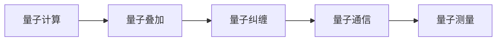
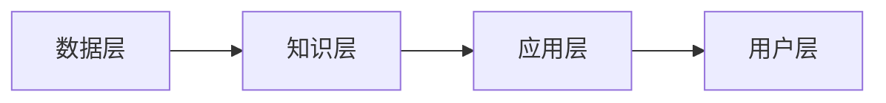

                 


```markdown
# 芒格的"智者圈"理论在量子科技智库构建中的新解读

> 关键词：芒格的"智者圈"理论、量子科技、智库构建、知识图谱、量子计算、算法原理

> 摘要：本文深入探讨了芒格的"智者圈"理论在量子科技智库构建中的新应用，通过分析其核心概念、算法原理和系统架构，结合实际案例，展示了如何利用该理论优化量子科技领域的知识管理和决策支持。文章内容涵盖了从理论背景到实际应用的全过程，为量子科技智库的构建提供了新的视角和方法。

---

## 第一章: 芒格的"智者圈"理论概述

### 1.1 "智者圈"理论的起源与核心思想

#### 1.1.1芒格的"智者圈"理论的提出背景
芒格的"智者圈"理论由投资大师查理·芒格提出，旨在通过构建多维度的知识网络，帮助决策者在复杂问题中做出明智判断。该理论强调知识的广泛性和交叉性，认为真正的智慧来源于对多个领域的深刻理解。

#### 1.1.2"智者圈"理论的核心思想与应用领域
"智者圈"理论的核心在于通过构建知识网络，将分散的知识点连接起来，形成一个有机的整体。这种思维方式不仅适用于投资领域，还可应用于科技、管理、教育等多个领域。

#### 1.1.3"智者圈"理论在现代管理学中的地位
在现代管理学中，"智者圈"理论被视为一种知识管理的重要方法，它强调知识的整合与共享，为组织决策提供了新的思路。

### 1.2 量子科技智库的定义与构建背景

#### 1.2.1量子科技智库的概念与目标
量子科技智库是以量子技术为核心，结合多学科知识，为政府、企业或科研机构提供战略咨询、技术创新和决策支持的智慧平台。

#### 1.2.2量子科技智库的构建背景与必要性
随着量子计算、量子通信等技术的快速发展，量子科技已成为推动社会进步的关键领域。构建量子科技智库，能够整合资源，加速技术转化，提升竞争力。

#### 1.2.3量子科技智库与传统智库的区别
量子科技智库不同于传统智库，它更注重技术驱动和数据支持，强调跨学科整合和技术创新。

### 1.3 "智者圈"理论与量子科技智库的结合

#### 1.3.1"智者圈"理论在智库构建中的潜在价值
"智者圈"理论通过构建知识网络，能够帮助量子科技智库整合分散的知识点，形成系统性的知识体系，提升决策的准确性和效率。

#### 1.3.2量子科技智库的独特需求与挑战
量子科技智库需要处理高度复杂的技术问题，数据量大且更新速度快，传统的知识管理方法难以满足需求。

#### 1.3.3"智者圈"理论在量子科技智库中的新应用方向
通过结合量子计算的技术特点，"智者圈"理论在知识网络构建、动态更新和多维度关联方面展现出新的应用潜力。

### 1.4 本章小结
本章介绍了芒格的"智者圈"理论及其在量子科技智库中的应用背景，为后续的理论分析和实践应用奠定了基础。

---

## 第二章: "智者圈"理论的核心概念与量子科技的结合

### 2.1 "智者圈"理论的核心要素分析

#### 2.1.1知识网络的构建与优化
知识网络是"智者圈"理论的核心，通过构建节点和边的关系，形成一个有机的知识体系。节点代表知识点，边代表关联性。



#### 2.1.2多维度知识关联的实现方式
"智者圈"理论强调多维度的知识关联，通过层次化的方式将不同领域的知识连接起来，形成一个立体的知识网络。

#### 2.1.3知识节点的权重分配与动态更新
每个知识点都有权重，权重根据其重要性动态调整。动态更新机制确保知识网络能够适应新信息的加入。

### 2.2 量子科技的特点与智库构建的需求

#### 2.2.1量子计算的核心原理与技术特点
量子计算基于量子叠加和纠缠原理，能够在某些情况下比经典计算快得多。其技术特点包括并行计算、状态叠加等。

#### 2.2.2量子通信的技术优势与应用场景
量子通信利用量子纠缠实现信息的安全传输，具有抗干扰和抗窃听的特性，适用于金融、军事等领域。

#### 2.2.3量子科技在智库构建中的特殊需求
量子科技智库需要处理海量数据，对计算能力和数据处理速度要求极高，同时需要实时更新和动态调整知识网络。

### 2.3 "智者圈"理论与量子科技的结合模型

#### 2.3.1知识网络的量子化表示方法
通过量子叠加和纠缠，将知识网络中的节点和边表示为量子态，形成量子化的知识表示模型。

#### 2.3.2量子叠加与纠缠在知识关联中的应用
利用量子叠加的特性，将多个知识点同时表示为多个可能的状态，通过纠缠实现知识点之间的关联。

#### 2.3.3量子态的知识表示与动态更新机制
通过量子态的动态变化，实时更新知识网络，确保知识表示能够反映最新的信息。

### 2.4 本章小结
本章分析了"智者圈"理论的核心要素，并探讨了其与量子科技的结合方式，为后续的算法设计奠定了基础。

---

## 第三章: "智者圈"理论驱动的量子科技智库构建算法

### 3.1 知识图谱构建算法

#### 3.1.1知识抽取与实体识别算法
通过自然语言处理技术，从文本中抽取实体和关系，构建基础的知识图谱。

#### 3.1.2关系抽取与属性提取算法
基于规则或机器学习模型，提取实体之间的关系和属性，丰富知识图谱的内容。

#### 3.1.3知识图谱的构建与优化算法
通过图嵌入、链接预测等算法，优化知识图谱的结构和质量。

### 3.2 基于"智者圈"的量子关联算法

#### 3.2.1量子叠加态下的知识关联算法
利用量子叠加原理，将多个知识点同时表示为多个可能的状态，形成多维度的知识关联。

#### 3.2.2量子纠缠态下的知识网络优化算法
通过量子纠缠的特性，优化知识网络的结构，增强知识点之间的关联性。

#### 3.2.3量子态的动态更新与权重调整算法
根据实时数据和反馈，动态调整量子态的权重，保持知识网络的准确性。

### 3.3 基于"智者圈"的智库知识检索算法

#### 3.3.1量子态的知识检索算法
通过量子搜索算法，快速检索知识网络中的相关信息。

#### 3.3.2基于知识网络的多路径检索算法
利用图遍历算法，探索知识网络中的多条路径，提高检索的全面性。

#### 3.3.3知识检索的量子加速算法
利用量子计算的加速能力，提高知识检索的效率和速度。

### 3.4 本章小结
本章详细介绍了基于"智者圈"理论的量子科技智库构建算法，包括知识图谱构建、量子关联和知识检索等方面。

---

## 第四章: 量子科技智库的系统架构与设计

### 4.1 系统功能模块设计

#### 4.1.1知识采集与处理模块
负责从多种数据源采集知识，并进行清洗、转换和存储。

#### 4.1.2知识关联与网络构建模块
通过算法构建知识图谱，并进行动态更新和优化。

#### 4.1.3知识检索与应用模块
提供用户友好的检索界面，支持多种检索方式，并提供结果展示和分析功能。

#### 4.1.4知识动态更新模块
实时监控数据源的变化，动态更新知识网络，保持信息的准确性。

### 4.2 系统架构设计

#### 4.2.1基于"智者圈"理论的分层架构设计
将系统分为数据层、知识层、应用层和用户层，各层之间通过接口进行交互。



#### 4.2.2量子计算与经典计算的混合架构设计
结合量子计算和经典计算的优势，设计混合架构，提高系统的计算能力和效率。

#### 4.2.3知识网络的分布式架构设计
通过分布式计算和存储，提高系统的扩展性和容错能力。

### 4.3 系统接口与交互设计

#### 4.3.1系统内部接口设计
定义系统各模块之间的接口，确保模块之间的协调工作。

#### 4.3.2用户交互
设计用户友好的界面，支持多种交互方式，如自然语言查询、可视化展示等。

### 4.4 本章小结
本章详细描述了量子科技智库的系统架构设计，包括功能模块、架构设计和接口设计等方面。

---

## 第五章: 项目实战与案例分析

### 5.1 环境安装与配置

#### 5.1.1量子计算环境的搭建
安装必要的量子计算软件和工具，配置量子计算环境。

#### 5.1.2知识图谱构建工具的安装
安装图数据库和知识图谱构建工具，如Neo4j、DGL等。

### 5.2 系统核心实现源代码

#### 5.2.1知识抽取与实体识别代码
```python
import spacy

nlp = spacy.load("en_core_web_sm")
doc = nlp("Quantum computing is a type of computing that uses quantum bits.")

for token in doc:
    print(token.text, token.pos_)
```

#### 5.2.2知识关联与网络构建代码
```python
from networkx import Graph

graph = Graph()
graph.add_edge("Quantum computing", "Quantum bits")
graph.add_edge("Quantum bits", "Quantum叠加")
```

#### 5.2.3知识检索与应用代码
```python
from neo4j import GraphDatabase

driver = GraphDatabase.driver("neo4j://localhost:7687", auth=("user", "password"))
session = driver.session()
result = session.run("MATCH (n) RETURN n")
```

### 5.3 案例分析与实际应用

#### 5.3.1量子计算领域的知识网络构建
以量子计算为例，构建知识图谱，展示量子计算与相关领域的关联。

#### 5.3.2量子通信领域的知识检索与应用
通过知识检索功能，快速获取量子通信相关的最新研究成果。

#### 5.3.3案例小结
通过具体案例展示"智者圈"理论在量子科技智库中的实际应用，验证其有效性和优势。

### 5.4 本章小结
本章通过项目实战，详细介绍了量子科技智库的构建过程，并通过案例分析展示了其实际应用价值。

---

## 第六章: 总结与展望

### 6.1 总结
本文深入探讨了芒格的"智者圈"理论在量子科技智库构建中的新应用，通过理论分析和实践验证，展示了其在知识管理和决策支持中的巨大潜力。

### 6.2 展望
随着量子计算和量子通信技术的不断发展，"智者圈"理论在量子科技智库中的应用将更加广泛和深入，未来的研究方向包括更高效的量子算法、更智能的知识网络构建方法等。

### 6.3 注意事项与最佳实践 tips
在实际应用中，需要注意数据质量、算法优化和系统安全等问题，建议结合具体需求进行定制化设计。

---

## 作者：AI天才研究院 & 禅与计算机程序设计艺术

---

通过本文的详细分析与实践，我们展示了芒格的"智者圈"理论在量子科技智库构建中的新解读，为量子科技的发展提供了新的思路和方法。
```

