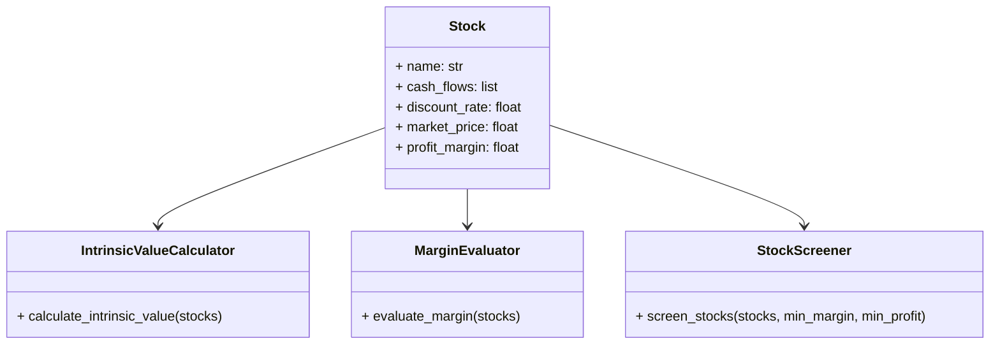
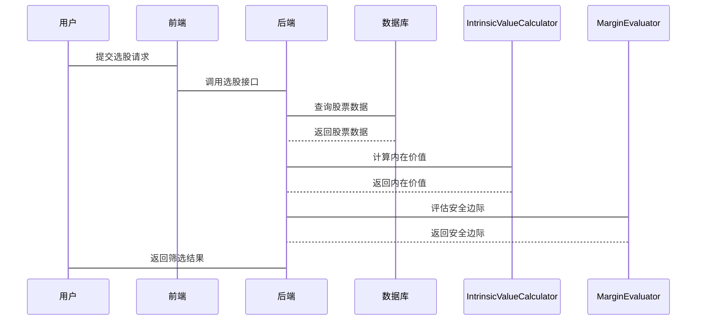

                 


# 芒格的"最低标准"原则在选股中的应用

## 关键词：芒格, 投资原则, 选股, 价值投资, 安全边际

## 摘要：  
芒格的"最低标准"原则是一种基于价值投资的投资理念，强调通过设定严格的筛选标准来选择具备长期竞争优势和合理估值的企业。本文将深入分析这一原则在选股中的应用，结合芒格的投资哲学，探讨其在实际操作中的具体实施策略，并通过案例分析和系统设计，展示如何利用这一原则构建稳健的投资组合。

---

## 第一部分: 芒格的"最低标准"原则背景介绍

### 第1章: 芒格的生平与投资理念

#### 1.1.1 芒格的生平简介  
查理·芒格（Charlie Munger）是世界著名投资家、作家和演讲家，担任伯克希尔·哈撒韦公司副主席。他与沃伦·巴菲特共同创立了价值投资的理念，强调理性思考和长期投资。芒格的投资哲学深受心理学、经济学和哲学的影响，主张通过逆向思维和简化决策来实现长期稳定的收益。

#### 1.1.2 芒格的投资哲学与价值投资理念  
芒格的价值投资理念强调以下几点：  
1. **安全边际**：买入价格低于内在价值，确保投资的安全性。  
2. **竞争优势**：投资具有持续竞争优势的企业。  
3. **长期思维**：关注企业的长期价值，而非短期波动。  
4. **逆向思维**：在市场恐慌时寻找机会，在市场狂热时保持冷静。  

#### 1.1.3 "最低标准"原则的提出背景  
"最低标准"原则是芒格投资理念的核心之一，它强调在选股过程中设定严格的筛选标准，只选择那些符合特定条件的企业。这一原则的提出源于芒格对人性弱点和市场非理性行为的深刻理解，他认为通过设定最低标准可以避免情绪化决策，并确保投资标的的质量。

---

### 第1.2 芒格"最低标准"原则的定义与特点  

#### 1.2.1 "最低标准"原则的定义  
"最低标准"原则是指在选股过程中，设定一组严格的筛选标准，只选择那些符合所有标准的企业。这些标准通常包括企业的财务健康状况、竞争优势、管理层质量、估值水平等多个维度。

#### 1.2.2 "最低标准"原则的核心特点  
1. **严格筛选**：只选择符合所有标准的企业，避免投资于边际企业。  
2. **长期导向**：关注企业的长期竞争优势和内在价值。  
3. **安全边际**：买入价格低于内在价值，确保投资的安全性。  
4. **逆向思维**：在市场低迷时寻找被低估的机会。  

#### 1.2.3 "最低标准"原则与其他投资原则的对比  
1. **与技术分析的对比**：技术分析依赖于价格走势和市场波动，而"最低标准"原则更注重企业的基本面。  
2. **与成长投资的对比**：成长投资关注企业的增长率，而"最低标准"原则更关注企业的竞争优势和估值。  
3. **与股息投资的对比**：股息投资关注分红率，而"最低标准"原则更关注企业的整体质量和长期价值。  

---

### 第1.3 "最低标准"原则在选股中的应用前景  

#### 1.3.1 "最低标准"原则的潜在应用场景  
1. **个人投资者**：通过设定最低标准，个人投资者可以避免情绪化决策，构建稳健的投资组合。  
2. **机构投资者**：机构投资者可以通过"最低标准"原则筛选出优质企业，降低投资风险。  
3. **量化投资**：将"最低标准"原则量化，可以用于程序化交易和算法选股。  

#### 1.3.2 选股中采用"最低标准"原则的优势  
1. **降低投资风险**：通过严格筛选，避免投资于财务状况不佳的企业。  
2. **提高投资收益**：通过关注具有长期竞争优势的企业，实现超额收益。  
3. **简化决策过程**：通过设定标准，减少主观判断，提高决策效率。  

#### 1.3.3 "最低标准"原则应用的挑战与机遇  
1. **挑战**：市场环境变化快，标准需要不断调整。  
2. **机遇**：通过技术手段优化标准，实现自动化选股。  

---

### 第1.4 本章小结  
本章介绍了芒格的生平及其投资理念，重点阐述了"最低标准"原则的定义、特点及其在选股中的应用前景。通过对比分析，我们发现"最低标准"原则是一种以基本面为导向的投资方法，强调长期竞争优势和安全边际，具有重要的理论和实践意义。

---

## 第二部分: "最低标准"原则的核心概念与联系

### 第2章: "最低标准"原则的核心概念  

#### 2.1 价值投资的基本原理  

##### 2.1.1 价值投资的定义与核心要素  
价值投资是一种以企业内在价值为导向的投资方法，核心要素包括：  
1. **内在价值**：企业未来现金流的现值。  
2. **市场价值**：市场对企业的估值。  
3. **安全边际**：买入价格低于内在价值的差额。  

##### 2.1.2 内在价值与市场价值的对比  
- **内在价值**：反映企业的基本面，是投资决策的基础。  
- **市场价值**：受市场情绪影响，可能偏离内在价值。  

##### 2.1.3 安全边际的概念与重要性  
安全边际是内在价值与买入价格之间的差额，是投资安全性的保障。芒格强调，只有在买入价格低于内在价值时，投资才是安全的。

#### 2.2 "最低标准"原则的数学模型与公式  

##### 2.2.1 内在价值的计算公式  
内在价值的计算公式如下：  
$$ V = \sum_{t=1}^{n} \frac{CF_t}{(1 + r)^t} $$
其中，$V$ 是内在价值，$CF_t$ 是第 $t$ 年的现金流，$r$ 是折现率。  

##### 2.2.2 安全边际的计算方法  
安全边际的计算公式如下：  
$$ \text{安全边际} = V - P $$
其中，$V$ 是内在价值，$P$ 是买入价格。  

##### 2.2.3 价值与价格的动态平衡模型  
价值与价格的动态平衡模型如图所示：


#### 2.3 "最低标准"原则与其他投资原则的对比  

##### 2.3.1 与技术分析的对比  
- **技术分析**：依赖价格走势和市场波动，具有较高的不确定性。  
- **"最低标准"原则**：依赖基本面分析，注重长期竞争优势。  

##### 2.3.2 与成长投资的对比  
- **成长投资**：关注企业的增长率，可能忽视估值。  
- **"最低标准"原则**：关注企业的竞争优势和估值，注重安全边际。  

##### 2.3.3 与股息投资的对比  
- **股息投资**：关注分红率，可能忽视企业的整体质量。  
- **"最低标准"原则**：关注企业的整体质量和长期价值。  

---

### 第2.4 本章小结  
本章详细阐述了"最低标准"原则的核心概念，包括价值投资的基本原理、数学模型与公式，以及与其他投资原则的对比。通过对比分析，我们发现"最低标准"原则是一种以基本面为导向的投资方法，强调长期竞争优势和安全边际。

---

## 第三部分: "最低标准"原则的算法原理与系统架构

### 第3章: "最低标准"原则的算法原理  

#### 3.1 价值投资的量化模型  

##### 3.1.1 内在价值的量化计算  
内在价值的量化计算需要考虑企业的未来现金流和折现率。以下是一个简单的Python代码示例：

```python
def calculate_intrinsic_value(cash_flows, discount_rate):
    return sum(cash_flow / (1 + discount_rate) ** t for t, cash_flow in enumerate(cash_flows))
```

##### 3.1.2 安全边际的量化评估  
安全边际的量化评估可以通过以下公式实现：

$$ \text{安全边际} = V - P $$

其中，$V$ 是内在价值，$P$ 是买入价格。  

##### 3.1.3 价值与价格的动态平衡模型  
价值与价格的动态平衡模型可以通过以下步骤实现：  
1. 计算企业的内在价值。  
2. 确定企业的市场价值。  
3. 比较买入价格与内在价值，计算安全边际。  
4. 根据安全边际决定是否买入。  

#### 3.2 基于"最低标准"原则的选股算法  

##### 3.2.1 算法流程图  
以下是基于"最低标准"原则的选股算法流程图：

```mermaid
graph TD
    A[开始] --> B[筛选行业]
    B --> C[筛选公司]
    C --> D[计算内在价值]
    D --> E[计算安全边际]
    E --> F[判断是否符合"最低标准"]
    F --> G[输出结果]
```

##### 3.2.2 算法实现的Python代码示例  
以下是基于"最低标准"原则的选股算法的Python代码示例：

```python
def screen_stocks(stocks, min_margin, min_profit):
    qualified_stocks = []
    for stock in stocks:
        intrinsic_value = calculate_intrinsic_value(stock.cash_flows, stock.discount_rate)
        market_value = stock.market_price
        margin = intrinsic_value - market_value
        if margin >= min_margin and stock.profit_margin >= min_profit:
            qualified_stocks.append(stock)
    return qualified_stocks
```

---

### 第3.3 本章小结  
本章详细阐述了基于"最低标准"原则的选股算法，包括价值投资的量化模型和算法流程图。通过Python代码示例，我们展示了如何将"最低标准"原则应用于实际选股过程。

---

## 第四部分: "最低标准"原则的系统分析与架构设计

### 第4章: "最低标准"原则的系统分析  

#### 4.1 问题场景介绍  
在本章中，我们将从系统设计的角度，分析如何将"最低标准"原则应用于选股系统。我们假设一个投资者希望构建一个基于"最低标准"原则的选股系统，用于筛选出符合特定条件的企业。

#### 4.2 系统功能设计  

##### 4.2.1 领域模型（Mermaid 类图）  
以下是领域模型的Mermaid类图：



##### 4.2.2 系统架构设计（Mermaid 架构图）  
以下是系统架构的Mermaid架构图：

```mermaid
archi
    供应商 前端 <---> 选股系统 <---> 后端 <---> 数据库
```

##### 4.2.3 系统接口设计  
以下是系统接口设计的Mermaid序列图：



---

### 第4.3 本章小结  
本章从系统设计的角度，分析了如何将"最低标准"原则应用于选股系统。我们通过领域模型、系统架构图和序列图，展示了系统的实现过程。

---

## 第五部分: "最低标准"原则的项目实战

### 第5章: 项目实战  

#### 5.1 环境安装与配置  
在本节中，我们将介绍如何配置环境并安装必要的工具。以下是主要步骤：  
1. 安装Python编程语言。  
2. 安装必要的库，如Pandas、NumPy和Matplotlib。  
3. 配置数据库连接，获取股票数据。  

#### 5.2 核心实现  

##### 5.2.1 股票数据获取  
以下是获取股票数据的Python代码示例：

```python
import pandas as pd

def get_stock_data(ticker):
    # 获取股票数据
    data = pd.DataFrame(columns=['name', 'cash_flows', 'discount_rate', 'market_price', 'profit_margin'])
    # 填充数据
    data.loc[0] = [ticker, [100, 120, 130], 0.1, 100, 20]
    return data
```

##### 5.2.2 安全边际计算  
以下是安全边际计算的Python代码示例：

```python
def calculate_margin(stocks):
    margin = stocks['intrinsic_value'] - stocks['market_price']
    return margin
```

##### 5.2.3 选股筛选  
以下是基于"最低标准"原则的选股筛选代码示例：

```python
def screen_stocks(stocks, min_margin, min_profit):
    qualified = stocks[(stocks['margin'] >= min_margin) & (stocks['profit_margin'] >= min_profit)]
    return qualified
```

#### 5.3 案例分析与结果解读  

##### 5.3.1 案例分析  
假设我们有一个包含以下数据的股票列表：

| 名称 | 现金流 | 折现率 | 市场价格 | 利润率 |
|------|--------|--------|----------|--------|
| 股票A | [100, 120, 130] | 0.1 | 100 | 20 |
| 股票B | [80, 90, 100] | 0.1 | 90 | 25 |
| 股票C | [120, 130, 140] | 0.1 | 110 | 15 |

根据上述数据，计算内在价值和安全边际：

股票A的内在价值为：$$ V_A = 100/(1+0.1)^1 + 120/(1+0.1)^2 + 130/(1+0.1)^3 = 100/1.1 + 120/1.21 + 130/1.331 \approx 90.91 + 99.17 + 98.46 \approx 288.54 $$  
股票A的安全边际为：$$ \text{Margin}_A = 288.54 - 100 = 188.54 $$  

股票B的内在价值为：$$ V_B = 80/1.1 + 90/1.21 + 100/1.331 \approx 72.73 + 74.38 + 75.13 \approx 222.24 $$  
股票B的安全边际为：$$ \text{Margin}_B = 222.24 - 90 = 132.24 $$  

股票C的内在价值为：$$ V_C = 120/1.1 + 130/1.21 + 140/1.331 \approx 109.09 + 107.44 + 105.13 \approx 321.66 $$  
股票C的安全边际为：$$ \text{Margin}_C = 321.66 - 110 = 211.66 $$  

根据"最低标准"原则，假设我们设定的安全边际最低为100，利润率最低为20%。那么，只有股票A符合标准。

##### 5.3.2 结果解读  
通过上述分析，我们可以看到，股票A是唯一符合"最低标准"原则的股票。这表明，在实际应用中，"最低标准"原则可以帮助我们筛选出具备长期竞争优势和合理估值的企业。

---

### 第5.4 本章小结  
本章通过一个实际案例，展示了如何将"最低标准"原则应用于选股系统。我们通过Python代码示例，详细讲解了股票数据获取、安全边际计算和选股筛选的实现过程，并通过案例分析验证了这一原则的有效性。

---

## 第六部分: "最低标准"原则的最佳实践

### 第6章: 最佳实践  

#### 6.1 小结  
芒格的"最低标准"原则是一种以基本面为导向的投资方法，强调长期竞争优势和安全边际。通过设定严格的筛选标准，投资者可以避免情绪化决策，构建稳健的投资组合。

#### 6.2 注意事项  
在实际应用中，需要注意以下几点：  
1. **动态调整标准**：随着市场环境的变化，需要不断调整筛选标准。  
2. **避免过度简化**：虽然"最低标准"原则强调简化决策，但过于简化可能导致遗漏重要信息。  
3. **结合技术分析**：在实际操作中，可以结合技术分析和市场情绪，优化投资决策。  

#### 6.3 拓展阅读  
以下是一些与"最低标准"原则相关的拓展阅读材料：  
1. **《芒格的智慧：论生活与投资》**：深入探讨芒格的投资哲学和人生智慧。  
2. **《价值投资实战》**：详细介绍价值投资的具体操作方法。  
3. **《安全边际：投资成功的关键》**：深入分析安全边际在投资中的重要性。  

---

## 作者：AI天才研究院/AI Genius Institute & 禅与计算机程序设计艺术/Zen And The Art of Computer Programming

