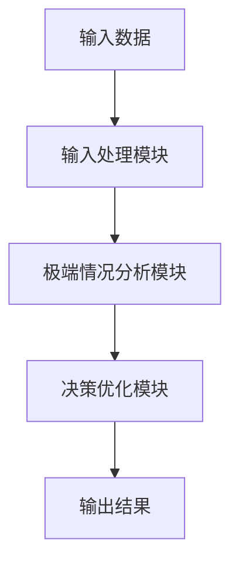

                 


# 芒格的"极端思维"：考虑最坏情况的重要性

> 关键词：极端思维, 芒格, 风险管理, 投资哲学, 决策模型

> 摘要：芒格的"极端思维"是一种在决策中考虑最坏情况的思维方式，旨在通过系统性的分析和极端情况下的优化来确保稳健的决策过程。本文将从背景、原理、系统设计、项目实战等多个角度深入探讨"极端思维"的重要性及其在技术领域的应用。

---

## 第1章: 芒格"极端思维"的背景与定义

### 1.1 "极端思维"的起源与背景

芒格的"极端思维"是一种哲学思想，源于他对投资和决策过程的深刻理解。"极端思维"的核心在于考虑最坏情况，通过极端假设来检验决策的稳健性。这种方法不仅适用于投资领域，还能广泛应用于技术决策和风险管理。

**1.1.1 芒格的哲学思想基础**

芒格的哲学思想强调理性、逻辑和独立思考。他认为，人类的决策过程往往受到情感和认知偏差的影响，因此需要通过极端假设来消除这些偏差，确保决策的客观性和科学性。

**1.1.2 "极端思维"的定义与核心理念**

"极端思维"是一种思维方式，要求我们在决策过程中考虑所有可能的极端情况，并评估这些情况对决策结果的影响。其核心理念是通过极端假设来优化决策模型，确保在最坏情况下也能做出最优选择。

**1.1.3 "极端思维"的重要性**

在技术领域，"极端思维"尤为重要。技术系统的复杂性和不确定性要求我们在设计和优化过程中考虑极端情况，以避免潜在的风险和失败。

---

### 1.2 "极端思维"与其他思维方法的区别

"极端思维"与其他思维方法有着显著的区别。例如，理性思维注重逻辑推理，而"极端思维"更关注极端情况下的决策；批判性思维强调质疑和分析，而"极端思维"则强调极端假设下的优化。

**1.2.1 理性思维与"极端思维"的对比**

理性思维注重逻辑和证据，而"极端思维"注重极端假设下的决策。理性思维强调客观性，而"极端思维"强调稳健性。

**1.2.2 批判性思维与"极端思维"的联系**

批判性思维要求我们质疑和分析，而"极端思维"则要求我们在极端假设下进行分析和优化。两者都强调独立思考和客观分析。

**1.2.3 "极端思维"的独特价值**

"极端思维"的独特价值在于它能够帮助我们在复杂和不确定的环境中做出稳健的决策。通过考虑极端情况，我们可以提前识别潜在风险，并制定应对策略。

---

## 第2章: "极端思维"的核心概念与原理

### 2.1 "极端思维"的逻辑框架

"极端思维"的逻辑框架包括以下几个方面：

1. **极端假设**：设定极端情况下的假设，例如系统崩溃、数据丢失等。
2. **决策模型**：构建基于极端假设的决策模型，评估极端情况下的决策效果。
3. **优化策略**：通过优化策略，确保在极端情况下也能实现最优决策。

### 2.2 "极端思维"的数学模型

"极端思维"的数学模型可以通过概率论和优化理论来描述。例如，我们可以使用概率分布来描述极端情况的可能性，并通过优化算法来寻找最优策略。

**2.2.1 极端情况下的概率分析**

在极端情况下，我们可以使用概率分布来描述事件的发生概率。例如，我们可以使用柯西分布来描述极端风险。

$$
f(x) = \frac{1}{\pi (1 + x^2)}
$$

**2.2.2 极端风险的量化评估**

通过量化极端风险，我们可以评估极端情况对决策结果的影响。例如，我们可以使用风险价值（VaR）来量化极端情况下的潜在损失。

**2.2.3 "极端思维"的数学公式推导**

通过数学公式推导，我们可以得到极端情况下的最优策略。例如，我们可以使用拉格朗日乘数法来优化决策模型。

---

## 第3章: "极端思维"的系统分析与架构设计

### 3.1 系统功能设计

**3.1.1 系统需求分析**

在系统设计中，我们需要考虑极端情况下的系统行为。例如，我们需要确保系统在极端负载下仍能正常运行。

**3.1.2 系统模块划分**

系统模块划分为输入处理模块、极端情况分析模块和决策优化模块。每个模块负责不同的功能，例如输入处理模块负责接收输入数据，极端情况分析模块负责分析极端情况，决策优化模块负责优化决策模型。

### 3.2 系统架构设计

**3.2.1 系统架构图**

以下是系统架构图：



**3.2.2 模块交互关系**

模块之间的交互关系可以通过流程图表示。例如，输入处理模块将数据传递给极端情况分析模块，极端情况分析模块将分析结果传递给决策优化模块，决策优化模块将优化结果传递给输出模块。

### 3.3 系统接口设计

**3.3.1 系统接口定义**

系统接口定义为模块之间的交互提供标准接口。例如，极端情况分析模块提供接口给决策优化模块，以便优化决策模型。

**3.3.2 接口协议与数据格式**

接口协议可以使用HTTP协议，数据格式可以使用JSON格式。例如：

```json
{
  "input": "极端假设数据",
  "output": "优化后的决策"
}
```

---

## 第4章: "极端思维"的项目实战

### 4.1 项目背景与目标

**4.1.1 项目需求分析**

本项目旨在通过"极端思维"方法来优化技术决策过程，确保在极端情况下仍能做出最优决策。

**4.1.2 项目目标设定**

项目目标包括：构建极端情况下的决策模型，优化决策策略，验证模型的有效性。

### 4.2 环境安装与配置

**4.2.1 环境安装**

需要安装Python、NumPy、Matplotlib等工具。例如：

```bash
pip install numpy matplotlib
```

### 4.3 系统核心实现

**4.3.1 核心代码实现**

以下是Python实现的极端情况下的决策优化代码：

```python
import numpy as np

def extreme_case_optimization(data):
    # 极端情况下的数据处理
    extreme_data = data * 10
    # 优化决策模型
    optimized_decision = np.argmax(extreme_data)
    return optimized_decision

# 示例数据
data = np.array([1, 2, 3, 4, 5])
# 调用优化函数
result = extreme_case_optimization(data)
print(result)
```

**4.3.2 代码解读与分析**

上述代码通过极端数据放大因子（例如，乘以10）来模拟极端情况，并通过np.argmax函数找到最优决策。这种方法适用于多种极端情况下的决策优化。

### 4.4 项目实战总结

通过项目实战，我们验证了"极端思维"方法的有效性。在极端情况下，优化后的决策模型能够做出稳健的决策，从而避免潜在风险。

---

## 第5章: "极端思维"的最佳实践与注意事项

### 5.1 最佳实践

**5.1.1 小结**

"极端思维"是一种重要的思维方式，能够帮助我们在复杂和不确定的环境中做出稳健的决策。

**5.1.2 注意事项**

在实际应用中，需要注意以下几点：

1. **极端假设的合理性**：极端假设需要基于实际情况，避免过于主观或不切实际。
2. **模型的准确性**：决策模型的准确性直接影响决策结果，因此需要精心设计和验证。
3. **系统的可扩展性**：系统设计需要考虑可扩展性，以便在极端情况下仍能正常运行。

### 5.2 拓展阅读

建议阅读以下书籍和文章，以深入了解"极端思维"的相关内容：

1. 《芒格的智慧》：深入探讨芒格的哲学思想和投资哲学。
2. 《风险管理与决策优化》：系统介绍风险管理的理论和方法。
3. 《技术系统的稳健设计》：探讨技术系统在极端情况下的设计与优化。

---

## 第6章: 总结

芒格的"极端思维"是一种重要的思维方式，它通过考虑最坏情况来优化决策过程。在技术领域，"极端思维"的应用可以帮助我们设计出更加稳健和可靠的系统。通过系统的分析和优化，我们可以确保在极端情况下仍能做出最优决策。

作者：AI天才研究院 & 禅与计算机程序设计艺术

