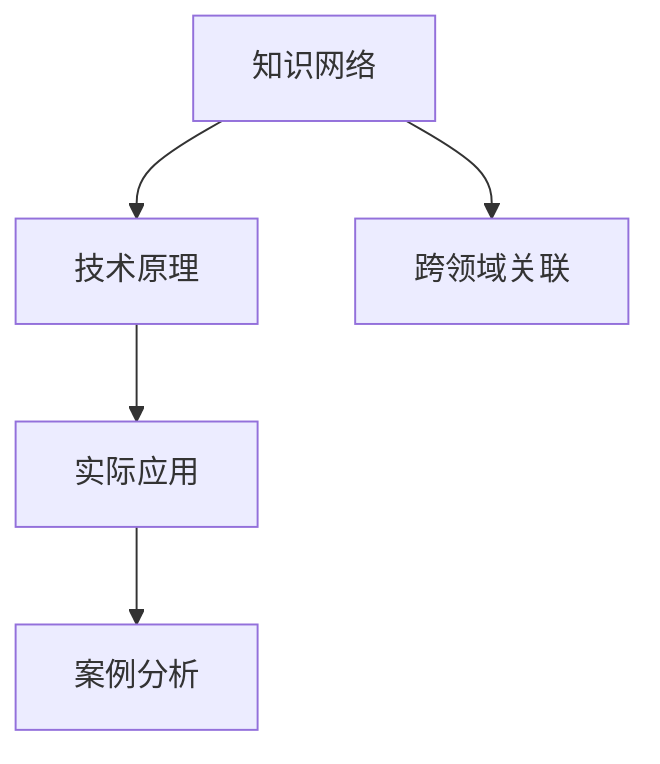
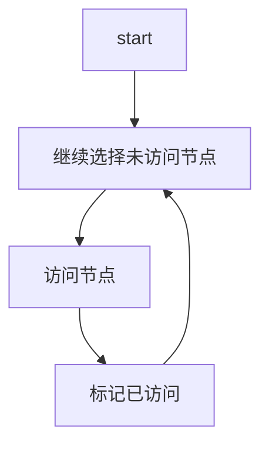
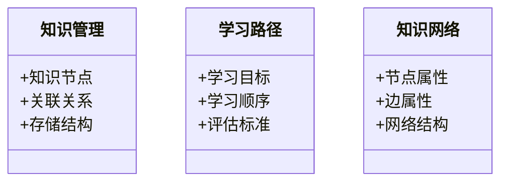

                 


# 芒格的"深度优先"学习在快速迭代技术环境中的重要性

## 关键词
- 深度优先学习
- 芒格思维模型
- 技术快速迭代
- 系统性学习
- 算法原理

## 摘要
在当前技术快速迭代的环境下，传统的浅层学习方法已难以应对复杂的技术挑战。芒格的深度优先学习方法强调系统性思维和深入理解，结合多元思维模型，为技术学习者提供了新的视角。本文从深度优先学习的核心概念、算法原理、系统架构到实际应用案例，全面探讨其在快速迭代技术环境中的重要性，为技术学习者提供实践指导。

---

## 引言

在技术快速迭代的时代，掌握一门技术往往需要不断更新和学习。然而，传统的学习方法常常以浅层理解为主，难以应对技术环境的快速变化。芒格的深度优先学习方法，结合其多元思维模型，为我们提供了一种系统性更强的学习方式。本文将深入探讨深度优先学习的原理、算法、系统架构以及实际应用，帮助读者在快速迭代的技术环境中高效学习。

---

## 正文

### 第1章: 深度优先学习的背景与重要性

#### 1.1 深度优先学习的定义与优势
深度优先学习是一种以系统性思维为核心的学习方法，强调对知识的深入理解和跨领域关联。其优势在于通过建立知识网络，帮助学习者在复杂的技术环境中快速找到解决方案。

#### 1.2 快速迭代环境中的学习挑战
技术的快速迭代使得学习者需要不断更新知识储备。传统的学习方法往往停留在表面理解，缺乏系统性，导致学习效率低下。深度优先学习通过构建知识网络，有效应对这些挑战。

#### 1.3 芒格思维模型与深度优先学习的结合
芒格的多元思维模型强调跨领域知识的整合。深度优先学习将这种思维模型应用于技术学习中，帮助学习者建立全面的知识体系。

---

### 第2章: 深度优先学习的核心概念与系统思维

#### 2.1 深度优先学习的系统性思维
系统性思维是深度优先学习的核心，强调从整体出发，分析各部分的关联。通过构建知识网络，学习者能够更好地理解技术的本质。

#### 2.2 深度优先学习与其他学习方法的对比
| 学习方法 | 特点 | 优缺点 |
|----------|------|--------|
| 浅层学习 | 侧重记忆 | 易遗忘，缺乏深度 |
| 深度优先学习 | 强调理解与关联 | 时间投入大，但效果持久 |

#### 2.3 系统架构图


---

### 第3章: 深度优先学习的算法原理

#### 3.1 深度优先搜索的算法流程
深度优先搜索是一种典型的算法，用于解决图的遍历问题。其流程如下：



#### 3.2 深度优先学习的数学模型
深度优先学习的数学模型可以用图论中的树结构表示，公式如下：
$$
\text{深度优先搜索的时间复杂度} = O(V + E)
$$
其中，$V$ 是节点数，$E$ 是边数。

---

### 第4章: 系统分析与架构设计

#### 4.1 系统功能设计
系统功能包括知识管理、学习路径规划和知识网络构建。类图如下：


#### 4.2 系统架构图


---

### 第5章: 项目实战与应用案例

#### 5.1 环境安装与配置
安装Python环境，确保版本为3.8以上。

#### 5.2 核心代码实现
```python
def depth_first_search(graph, start, visited=None):
    if visited is None:
        visited = set()
    visited.add(start)
    for neighbor in graph[start]:
        if neighbor not in visited:
            depth_first_search(graph, neighbor, visited)
    return visited

# 示例图结构
graph = {
    'A': ['B', 'C'],
    'B': ['D', 'E'],
    'C': ['F']
}
```

#### 5.3 案例分析与解读
以技术学习为例，深度优先学习帮助学习者从基础原理出发，逐步构建知识网络，确保对技术的全面理解。

---

### 第6章: 最佳实践与总结

#### 6.1 小结
深度优先学习通过系统性思维和深入理解，帮助学习者在快速迭代的技术环境中保持竞争力。

#### 6.2 注意事项
- 学习过程中需注重知识的关联性
- 定期更新知识网络
- 避免过于追求深度而忽略广度

#### 6.3 拓展阅读
建议阅读《芒格的多元思维模型》和《算法导论》等书籍，进一步深入学习。

---

## 结论

芒格的深度优先学习方法在快速迭代的技术环境中具有重要意义。通过系统性思维和深入理解，学习者能够更好地应对技术挑战。本文从理论到实践，全面探讨了深度优先学习的应用，为技术学习者提供了宝贵的指导。

---

## 作者信息
作者：AI天才研究院 & 禅与计算机程序设计艺术

---

通过本文，读者可以系统地理解深度优先学习的核心理念、算法原理和实际应用，为在技术快速迭代的环境中高效学习提供有力支持。

