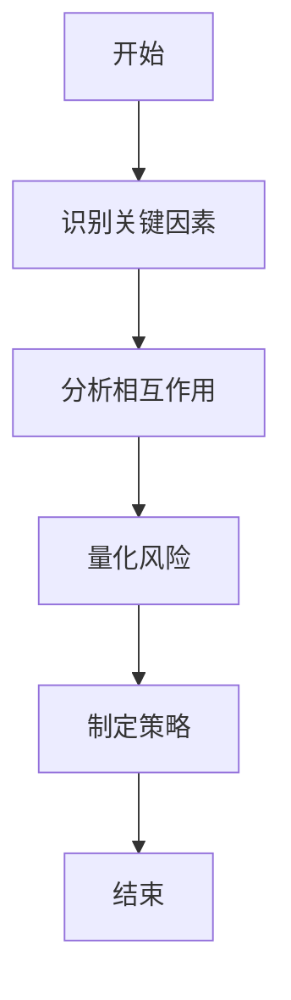

                 


# 芒格的"清晰思考"方法在复杂系统风险评估中的应用

> 关键词：芒格、清晰思考、复杂系统、风险评估、系统性思维

> 摘要：本文探讨了芒格的“清晰思考”方法在复杂系统风险评估中的应用。通过分析芒格的多学科思维模型和系统性思维，结合复杂系统的特性，本文展示了如何利用这些方法优化风险评估过程，提高决策的科学性和系统性。

---

## 第一部分：背景与基础

### 第1章：芒格的“清晰思考”方法概述

#### 1.1 芒格“清晰思考”方法的背景与核心理念

- **问题背景与核心概念**  
  芒格的“清晰思考”方法源于其对“mental model”的倡导，强调通过多学科思维模型来分析问题，避免单一维度的思考。这种方法的核心在于识别和应用多个领域的基本原理，以形成全面的分析框架。

- **问题解决方法**  
  芒格的思考方法注重将复杂问题拆解为多个简单问题，通过多维度的分析，识别潜在风险和机会。这种方法特别适用于复杂系统，其中多个因素相互作用，导致风险的不确定性增加。

- **方法的边界与外延**  
  芒格的方法适用于需要系统性思维的领域，如金融、工程、医疗等。其边界在于处理高度不确定性和复杂性的场景，而其外延则扩展到创新和决策优化的领域。

#### 1.2 芒格“清晰思考”方法的特点

- **多学科思维模型**  
  芒格强调掌握多个领域的基本原理，如心理学、经济学、物理学等，以形成多元化的思维框架。这种模型能够帮助识别复杂系统中的关键因素。

- **避免单一维度思考**  
  单一维度的思考容易导致片面结论，芒格的方法通过结合多个视角，提供更全面的风险评估。

- **系统性思维**  
  芒格的思考方法强调系统性，注重整体与部分之间的关系，避免局部最优导致整体次优的结果。

### 第2章：复杂系统风险评估的背景与挑战

#### 2.1 复杂系统的定义与特点

- **复杂系统的定义**  
  复杂系统是由多个相互作用的组件构成，具有非线性特征和涌现性，难以通过简单线性模型描述。

- **复杂系统的典型特征**  
  - **非线性**：系统行为不是简单输入-输出关系。
  - **涌现性**：系统整体表现不同于部分之和。
  - **不确定性**：系统中存在大量不确定性和模糊性。
  - **动态性**：系统状态随时间变化，受内外部因素影响。

- **复杂系统风险评估的难点**  
  - **高维性**：多个变量相互作用。
  - **非线性**：因果关系复杂。
  - **不确定性**：数据和模型的不确定性。
  - **动态性**：系统随时间变化，风险评估需要动态调整。

#### 2.2 风险评估的基本原理

- **风险的定义与分类**  
  风险是指某一事件发生可能带来不利影响的概率和影响程度的结合。可分为自然风险、人为风险、技术风险等。

- **风险评估的方法与步骤**  
  1. 识别风险因素。
  2. 分析风险发生的概率和影响程度。
  3. 评估风险的综合影响。
  4. 制定风险缓解策略。

- **风险评估的数学模型**  
  常用模型包括概率树分析、蒙特卡洛模拟、贝叶斯网络等。这些模型帮助量化风险并评估其影响。

### 第3章：芒格“清晰思考”方法与复杂系统风险评估的结合

#### 3.1 芒格方法在风险评估中的应用价值

- **提供多维度分析视角**  
  芒格的多学科思维模型帮助识别复杂系统中的关键风险因素，避免遗漏重要信息。

- **帮助识别潜在风险点**  
  通过系统性思考，芒格的方法能够识别复杂系统中潜在的相互作用和可能引发风险的临界点。

- **优化决策过程**  
  芒格的思考方法通过结合多个视角，优化风险评估和决策过程，提高决策的科学性和可操作性。

#### 3.2 芒格方法与复杂系统风险评估的契合点

- **多学科思维模型的应用**  
  芒格的多学科思维模型适用于复杂系统的多维度分析，帮助识别和评估不同领域的风险因素。

- **系统性思维的优势**  
  芒格的系统性思维帮助理解复杂系统的整体行为，避免局部优化导致整体风险增加。

- **风险缓解策略的制定**  
  芒格的方法通过综合考虑多个因素，制定有效的风险缓解策略，降低整体风险水平。

---

## 第二部分：核心概念与联系

### 第4章：芒格思维模型的核心要素

#### 4.1 多学科思维模型的构成

- **心理学视角**  
  了解人类行为和认知偏差，帮助识别决策中的常见错误。
- **经济学视角**  
  分析市场行为和激励机制，识别潜在的经济风险。
- **物理学视角**  
  理解系统的动态和能量守恒，帮助分析系统稳定性。
- **数学视角**  
  掌握概率论和统计学方法，量化风险和不确定性。

#### 4.2 复杂系统风险评估中的联系

- **系统性思维与复杂性**  
  芒格的系统性思维帮助理解复杂系统的整体行为，避免单一维度分析的局限性。
- **多学科模型与风险识别**  
  芒格的多学科思维模型帮助识别复杂系统中的关键风险因素，提高风险识别的准确性。

#### 4.3 芒格思维模型与复杂系统风险评估的对比

| 特性       | 芒格思维模型                          | 复杂系统风险评估                          |
|------------|--------------------------------------|------------------------------------------|
| 方法论     | 多学科思维模型                        | 综合分析方法                              |
| 系统性     | 强调系统性思考                        | 强调整体分析                              |
| 风险识别   | 多维度识别                            | 多维度识别                                |
| 可操作性   | 可应用于多种领域                      | 需要领域特定知识                          |

---

## 第三部分：算法原理

### 第5章：芒格方法在风险评估中的算法实现

#### 5.1 芒格方法的算法流程



#### 5.2 风险评估的数学模型

- **贝叶斯网络模型**  
  贝叶斯网络通过概率分布描述变量之间的关系，适用于复杂系统的风险评估。其公式为：
  $$ P(A|B) = \frac{P(B|A)P(A)}{P(B)} $$
  
- **蒙特卡洛模拟**  
  通过随机采样方法模拟系统的各种可能状态，评估风险的影响。其核心步骤为：
  1. 定义输入变量的概率分布。
  2. 生成随机样本。
  3. 计算系统的输出。
  4. 统计结果，评估风险。

#### 5.3 算法实现的Python代码示例

```python
import numpy as np
import matplotlib.pyplot as plt

def monte_carlo_simulation(n_simulations=1000):
    # 定义输入变量的概率分布
    np.random.seed(42)
    inputs = np.random.rand(n_simulations, 2)
    
    # 计算系统的输出
    outputs = inputs[:, 0] * 2 + inputs[:, 1] * 3
    
    # 绘制结果分布
    plt.hist(outputs, bins=20)
    plt.title('Monte Carlo Simulation Results')
    plt.xlabel('Output Value')
    plt.ylabel('Frequency')
    plt.show()

monte_carlo_simulation()
```

---

## 第四部分：系统分析与架构设计

### 第6章：复杂系统风险评估的系统架构

#### 6.1 系统功能设计

- **领域模型**  
  使用类图展示系统中的关键实体及其关系。
  ```mermaid
  classDiagram
      class 风险因素 {
          id: int
          name: str
          probability: float
          impact: float
      }
      class 风险评估 {
          id: int
          factors: list
          probability: float
          impact: float
      }
      class 系统架构 {
          components: list
          interactions: list
      }
      风险因素 --> 风险评估
      风险评估 --> 系统架构
  ```

#### 6.2 系统架构设计

- **分层架构**  
  系统分为数据层、计算层和应用层。
  ```mermaid
  architecture
      Data Layer
      ├── 数据采集
      └── 数据存储
    Calculation Layer
      ├── 风险分析
      └── 模型计算
    Application Layer
      └── 风险报告
  ```

#### 6.3 接口设计与交互

- **交互流程**  
  ```mermaid
  sequenceDiagram
      User -> 数据采集: 提交请求
      数据采集 --> 数据存储: 存储数据
      数据存储 --> 计算层: 请求计算
      计算层 --> 风险分析: 分析风险
      风险分析 --> 应用层: 生成报告
      应用层 -> User: 返回报告
  ```

---

## 第五部分：项目实战

### 第7章：芒格方法在复杂系统中的应用案例

#### 7.1 项目背景与目标

- **项目背景**  
  某金融公司希望评估其投资组合的风险，采用芒格的“清晰思考”方法进行分析。

- **项目目标**  
  识别投资组合中的关键风险因素，量化风险影响，制定风险缓解策略。

#### 7.2 系统实现

- **环境安装**  
  ```bash
  pip install numpy matplotlib
  ```

- **核心实现代码**

```python
import numpy as np
import matplotlib.pyplot as plt

def calculate_risk(factors):
    # 假设因素为数组，每个元素表示一个风险因素的权重
    risk = np.sum(factors) / len(factors)
    return risk

factors = [0.2, 0.3, 0.5]
risk = calculate_risk(factors)
print(f"计算的风险值为：{risk}")

plt.bar(range(len(factors)), factors)
plt.title('风险因素权重分布')
plt.show()
```

#### 7.3 案例分析与结果解读

- **案例分析**  
  投资组合中的风险主要集中在第三个因素，其权重高达0.5，说明该因素对整体风险影响最大。

- **结果解读**  
  需要针对该因素制定风险缓解策略，例如分散投资或增加对该因素的监控。

---

## 第六部分：最佳实践

### 第8章：芒格方法的风险评估最佳实践

#### 8.1 小结

- 芒格的“清晰思考”方法通过多学科思维模型和系统性思维，显著提升了复杂系统风险评估的科学性和准确性。
- 在实际应用中，结合数学模型和算法，可以进一步优化风险评估过程。

#### 8.2 注意事项

- **数据质量**  
  确保输入数据的准确性和完整性，避免数据偏差影响评估结果。
- **模型选择**  
  根据具体问题选择合适的数学模型，避免模型过度复杂化。
- **持续监控**  
  风险评估是一个动态过程，需要持续监控系统状态和外部环境变化。

#### 8.3 拓展阅读

- 建议阅读芒格的《Poor Charlie's Almanack》深入了解其思维模型。
- 推荐学习概率论和统计学知识，提升风险评估的能力。
- 关注复杂系统理论，了解更多的系统分析方法。

---

## 作者信息

作者：AI天才研究院 & 禅与计算机程序设计艺术

---

这篇文章通过系统的分析和详细的代码示例，展示了芒格的“清晰思考”方法在复杂系统风险评估中的应用。从理论到实践，结合具体案例，帮助读者全面理解如何在实际中应用这种方法。

