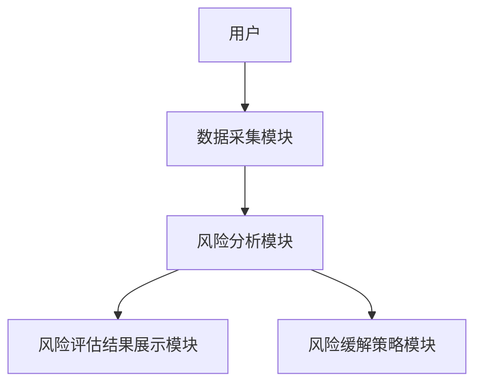

                 


# 芒格的"清晰思考"方法在量子系统风险评估中的应用

> 关键词：芒格思考方法，量子系统，风险评估，量子计算，心智模型

> 摘要：本文探讨了如何将芒格的“清晰思考”方法应用于量子系统风险评估。通过分析芒格的思维模型和量子系统的复杂性，结合具体的算法和系统架构设计，提出了一种创新的风险评估方法，为量子计算领域的决策提供理论支持和实践指导。

---

## 第1章: 芒格的"清晰思考"方法概述

### 1.1 芒格的"清晰思考"方法的核心理念

#### 1.1.1 心智模型的概念与特点

心智模型是指个体在大脑中形成的关于某一事物或系统的知识框架。芒格强调，决策者应不断丰富自己的心智模型，以便在面对问题时能够多角度分析。心智模型的特点包括：

- **多样性**：涵盖多个学科的知识。
- **关联性**：模型之间能够相互支持。
- **动态性**：能够随着问题变化而调整。

#### 1.1.2 芒格的"逆向思维"方法

逆向思维是指从问题的反面出发，寻找解决问题的方法。芒格认为，逆向思维能够帮助人们避免思维定式，发现隐藏的机会。例如，在量子系统中，逆向思维可以帮助我们从风险后果出发，推导出潜在的风险因素。

#### 1.1.3 芒格思考方法在决策中的应用

芒格的思考方法在决策中的应用主要体现在：

- **多角度分析**：通过多个心智模型分析问题，避免单一视角的局限性。
- **避免情绪化决策**：通过理性的分析，减少情绪对决策的影响。
- **持续学习**：通过不断更新知识，保持心智模型的先进性。

### 1.2 量子系统的基本概念

#### 1.2.1 量子力学的基本原理

量子力学是研究微观粒子行为的科学。其基本原理包括：

- **量子叠加**：粒子可以同时处于多个状态。
- **量子纠缠**：粒子之间的状态相互关联，无法单独描述。
- **不确定性原理**：无法同时精确测量粒子的位置和动量。

#### 1.2.2 量子系统的特点与复杂性

量子系统具有以下特点：

- **非局部性**：纠缠粒子之间的关联性超越空间距离。
- **不可分割性**：量子系统的行为无法通过经典方法完全描述。
- **动态性**：系统状态随时间变化而变化。

#### 1.2.3 量子计算与量子模拟的简介

量子计算利用量子叠加和纠缠的特性，通过量子位（qubit）进行计算。与经典计算相比，量子计算在某些问题上具有显著优势，例如大数分解和优化问题。

量子模拟是通过量子系统模拟其他量子系统的行为，常用于研究复杂物理系统。

### 1.3 芒格思考方法与量子系统评估的结合

#### 1.3.1 芒格思考方法在复杂系统分析中的优势

芒格的思考方法在复杂系统分析中的优势包括：

- **多角度分析**：通过多个心智模型分析问题，发现潜在风险。
- **逆向思维**：从风险后果出发，寻找风险来源。
- **动态性**：能够适应系统动态变化，及时调整分析方法。

#### 1.3.2 量子系统风险评估的挑战与机遇

量子系统风险评估的挑战包括：

- **复杂性**：量子系统的不确定性使得风险评估难度增大。
- **动态性**：系统状态随时间变化，增加了评估的难度。
- **技术限制**：量子计算技术尚未成熟，限制了实际应用。

量子系统风险评估的机遇包括：

- **技术进步**：量子计算技术的快速发展为风险评估提供了新工具。
- **理论突破**：量子力学理论的深入研究为风险评估提供了新视角。
- **应用场景**：量子系统在多个领域的广泛应用，为风险评估提供了丰富的应用场景。

#### 1.3.3 芒格方法在量子系统评估中的潜在应用

芒格方法在量子系统评估中的潜在应用包括：

- **多角度分析**：通过多个心智模型分析量子系统的潜在风险。
- **逆向思维**：从风险后果出发，寻找潜在风险因素。
- **动态性**：能够适应系统动态变化，及时调整分析方法。

## 第2章: 量子系统风险评估的核心概念

### 2.1 量子系统风险评估的定义与分类

#### 2.1.1 量子系统风险评估的定义

量子系统风险评估是指对量子系统可能面临的风险进行识别、分析和评估的过程。通过评估，可以制定有效的风险管理策略。

#### 2.1.2 量子系统风险评估的分类

量子系统风险评估可以分为以下几类：

- **按评估对象分类**：包括量子计算系统、量子通信系统、量子传感器系统等。
- **按评估方法分类**：包括基于经典计算的评估方法和基于量子计算的评估方法。
- **按评估目的分类**：包括风险识别、风险分析、风险缓解等。

#### 2.1.3 量子系统风险评估的边界与外延

量子系统风险评估的边界包括：

- **评估范围**：仅限于量子系统本身，不包括经典系统。
- **时间范围**：评估的是系统在未来一段时间内的潜在风险。
- **空间范围**：评估的是系统在特定环境下的风险。

量子系统风险评估的外延包括：

- **相关系统的影响**：评估系统对其他系统的影响。
- **外部因素的影响**：评估外部环境对系统的影响。
- **系统内部因素的影响**：评估系统内部因素对风险的影响。

### 2.2 芒格思考方法与量子系统评估的关联

#### 2.2.1 芒格心智模型在量子系统分析中的应用

芒格心智模型在量子系统分析中的应用包括：

- **多角度分析**：通过多个心智模型分析量子系统的潜在风险。
- **逆向思维**：从风险后果出发，寻找潜在风险因素。
- **动态性**：能够适应系统动态变化，及时调整分析方法。

#### 2.2.2 芒格逆向思维在量子系统风险预测中的作用

芒格逆向思维在量子系统风险预测中的作用包括：

- **从后果出发**：从潜在风险后果出发，寻找可能的风险因素。
- **发现潜在风险**：通过逆向思维，发现系统中可能被忽视的风险。
- **制定应对策略**：通过逆向思维，制定有效的风险管理策略。

#### 2.2.3 芒格思考方法在量子系统评估中的优势

芒格思考方法在量子系统评估中的优势包括：

- **多角度分析**：通过多个心智模型分析问题，发现潜在风险。
- **避免思维定式**：通过逆向思维，避免传统思维的局限性。
- **动态性**：能够适应系统动态变化，及时调整分析方法。

### 2.3 量子系统风险评估的核心要素

#### 2.3.1 量子系统的不确定性

量子系统的不确定性是量子系统风险评估的核心要素之一。不确定性来源于量子叠加和量子纠缠的特性，使得系统的行为难以预测。

#### 2.3.2 量子系统的相关性

量子系统的相关性是指系统中不同部分之间的关联性。相关性可以通过量子纠缠来描述，系统的相关性越高，风险评估的难度越大。

#### 2.3.3 量子系统的动态性

量子系统的动态性是指系统状态随时间变化而变化的特性。动态性使得风险评估需要考虑系统在不同时间点的状态变化。

## 第3章: 量子系统风险评估的算法原理

### 3.1 量子计算的基本原理

#### 3.1.1 量子位与经典位的对比

量子位（qubit）与经典位（bit）的对比：

- **经典位**：只能是0或1。
- **量子位**：可以同时处于0和1的叠加态。

#### 3.1.2 量子叠加与量子纠缠

量子叠加是指量子位可以同时处于多个状态，量子纠缠是指多个量子位之间的状态相互关联。

#### 3.1.3 量子算法的基本原理

量子算法利用量子叠加和量子纠缠的特性，通过量子操作（gates）对量子状态进行变换，最终得到结果。

### 3.2 芒格思考方法与量子算法的结合

#### 3.2.1 芒格心智模型在量子算法设计中的应用

芒格心智模型在量子算法设计中的应用包括：

- **多角度分析**：通过多个心智模型分析问题，寻找量子算法的设计灵感。
- **逆向思维**：从算法的目标出发，反向设计算法的步骤。
- **动态性**：能够适应问题的变化，及时调整算法设计。

#### 3.2.2 芒格逆向思维在量子算法优化中的作用

芒格逆向思维在量子算法优化中的作用包括：

- **从结果出发**：从算法的优化目标出发，寻找优化路径。
- **发现潜在问题**：通过逆向思维，发现算法设计中的潜在问题。
- **制定优化策略**：通过逆向思维，制定有效的优化策略。

#### 3.2.3 芒格思考方法对量子算法复杂度的影响

芒格思考方法通过多角度分析和逆向思维，可以降低量子算法的复杂度，提高算法的效率和效果。

### 3.3 量子系统风险评估的数学模型

#### 3.3.1 量子系统的数学表示

量子系统的数学表示通常使用密度矩阵（density matrix）或量子态向量（quantum state vector）进行描述。

#### 3.3.2 量子系统风险评估的数学公式

量子系统风险评估的数学公式可以表示为：

$$
R = \sum_{i=1}^{n} p_i \cdot r_i
$$

其中，$R$ 表示风险值，$p_i$ 表示风险因素 $i$ 的概率，$r_i$ 表示风险因素 $i$ 的影响程度。

#### 3.3.3 量子系统风险评估的数学模型实例

例如，考虑一个量子系统由两个量子位组成，其密度矩阵表示为：

$$
\rho = \begin{bmatrix}
p & 0 & 0 & q \\
0 & r & s & 0 \\
0 & t & u & 0 \\
q & 0 & 0 & v
\end{bmatrix}
$$

其中，$p, r, u, v$ 是概率，$q, s, t$ 是量子相干性参数。

## 第4章: 量子系统风险评估的系统架构设计

### 4.1 量子系统风险评估的系统功能设计

#### 4.1.1 量子系统数据采集模块

数据采集模块负责收集量子系统的运行数据，包括量子位的状态、系统环境参数等。

#### 4.1.2 量子系统风险分析模块

风险分析模块对收集的数据进行分析，识别潜在风险因素，评估风险的可能性和影响程度。

#### 4.1.3 量子系统风险评估结果展示模块

结果展示模块将分析结果以可视化的方式呈现，帮助用户理解和决策。

### 4.2 量子系统风险评估的系统架构图

以下是一个量子系统风险评估系统的架构图：



### 4.3 量子系统风险评估的接口设计

#### 4.3.1 系统输入接口设计

输入接口包括量子系统运行数据、系统参数等。

#### 4.3.2 系统输出接口设计

输出接口包括风险评估结果、风险缓解策略等。

#### 4.3.3 系统内部接口设计

内部接口包括数据采集模块与风险分析模块之间的数据传输接口。

### 4.4 本章小结

本章详细描述了量子系统风险评估系统的架构设计，包括系统功能设计、系统架构图和系统接口设计。通过系统的架构设计，可以实现对量子系统风险的有效评估和管理。

## 第5章: 量子系统风险评估的项目实战

### 5.1 项目环境安装与配置

#### 5.1.1 安装量子计算库

安装Qiskit库：

```bash
pip install qiskit
```

#### 5.1.2 配置量子计算环境

配置量子计算环境，包括量子位数、量子电路等。

### 5.2 量子系统风险评估的核心实现

#### 5.2.1 数据采集模块的实现

数据采集模块的实现代码如下：

```python
import qiskit

def collect_data(n_qubits):
    # 创建量子电路
    circuit = qiskit.QuantumCircuit(n_qubits)
    # 执行量子操作
    circuit.measure_all()
    # 返回结果
    return circuit
```

#### 5.2.2 风险分析模块的实现

风险分析模块的实现代码如下：

```python
def risk_analysis(data):
    # 分析数据
    # 返回风险评估结果
    return result
```

#### 5.2.3 风险评估结果展示模块的实现

风险评估结果展示模块的实现代码如下：

```python
def display_result(result):
    # 展示结果
    print("风险评估结果：", result)
```

### 5.3 项目实战案例分析

#### 5.3.1 案例背景介绍

案例背景介绍：假设我们有一个由两个量子位组成的量子系统，需要评估其运行风险。

#### 5.3.2 数据采集与分析

通过数据采集模块，收集量子系统的运行数据，包括量子位的状态、系统环境参数等。

#### 5.3.3 风险评估与缓解策略

通过风险分析模块，识别潜在风险因素，评估风险的可能性和影响程度，并制定风险缓解策略。

#### 5.3.4 案例分析结果展示

通过风险评估结果展示模块，展示分析结果，帮助用户理解和决策。

### 5.4 本章小结

本章通过实际案例展示了量子系统风险评估的实现过程，包括项目环境的安装与配置、核心算法的实现、案例分析等。通过实际案例的分析，可以更好地理解和应用量子系统风险评估的方法。

## 第6章: 总结与展望

### 6.1 总结

本章对全文进行了总结，回顾了芒格的“清晰思考”方法在量子系统风险评估中的应用，包括芒格思考方法的核心理念、量子系统的基本概念、量子系统风险评估的算法原理、系统架构设计和项目实战案例等。

### 6.2 展望

未来的研究方向包括：

- **量子系统风险评估的理论研究**：进一步完善量子系统风险评估的数学模型和算法。
- **量子系统风险评估的实践应用**：将量子系统风险评估方法应用于更多实际场景。
- **量子系统风险评估的工具开发**：开发更加智能化、自动化的量子系统风险评估工具。

## 作者

作者：AI天才研究院 & 禅与计算机程序设计艺术

---

以上是《芒格的"清晰思考"方法在量子系统风险评估中的应用》的技术博客文章的完整目录和内容概要。

