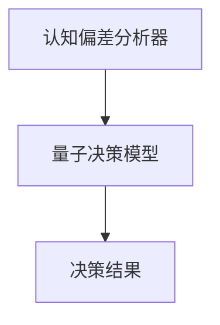
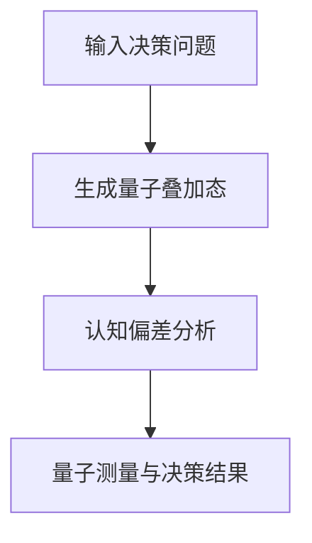
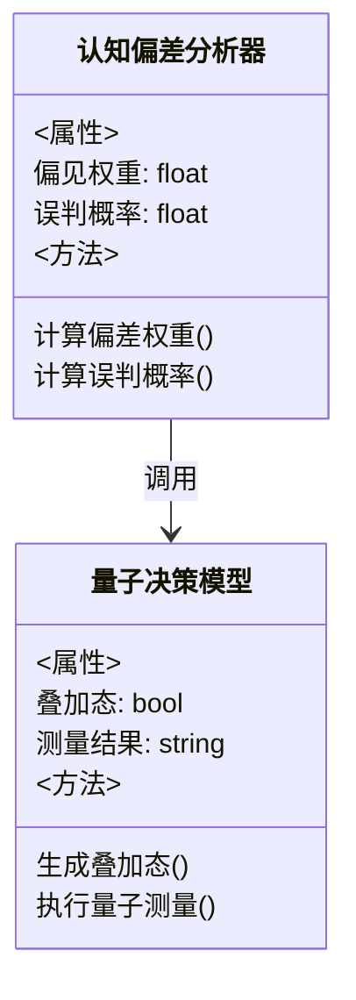

                 


# 芒格的认知偏差理论：在量子决策系统中的实践

> 关键词：认知偏差，量子决策，芒格理论，决策系统，人工智能

> 摘要：本文探讨了芒格的认知偏差理论在量子决策系统中的应用，结合量子力学和认知科学的原理，提出了一种新的决策框架。通过分析认知偏差的数学模型、量子决策系统的算法流程以及系统架构设计，本文为实现更高效、更准确的决策系统提供了理论和实践指导。

---

## 第一部分：背景介绍

### 第1章：芒格的认知偏差理论概述

#### 1.1 认知偏差的基本概念

认知偏差是人类在信息处理和决策过程中常见的心理偏差，它源于大脑对信息的简化处理和有限理性。认知偏差可以分为两类：基于概率的偏差（如确认偏差、概率偏差）和基于认知的偏差（如代表性偏差、可得性偏差）。这些偏差会影响决策的准确性和合理性。

芒格的认知偏差理论强调了认知偏差在决策过程中的系统性影响，认为这些偏差并非随机出现，而是人类认知结构和心理机制的必然产物。芒格通过分析不同类型的认知偏差，提出了如何识别和克服这些偏差的方法，从而帮助决策者做出更理性的选择。

#### 1.2 量子决策系统的背景

量子决策系统是一种结合量子力学原理和决策科学的新一代决策模型。与经典决策模型不同，量子决策系统通过量子叠加态和量子测量的特性，能够更好地描述和解决复杂的决策问题。量子决策系统的理论基础来源于量子力学，其核心在于利用量子叠加态的并行处理能力和量子测量的不可逆性，来提高决策的效率和准确性。

芒格的认知偏差理论与量子决策系统的结合，旨在利用量子系统的独特性质，克服认知偏差对决策的影响。通过将认知偏差映射到量子系统的状态空间，量子决策系统能够更精确地分析和纠正这些偏差，从而实现更优的决策。

---

### 第2章：认知偏差的核心概念与联系

#### 2.1 认知偏差的核心原理

认知偏差的核心原理在于人类认知的有限性和信息处理的简化性。芒格将认知偏差分为两类：基于概率的偏差和基于认知的偏差。基于概率的偏差包括确认偏差、概率偏差等，这些偏差源于人们对概率信息的误判。基于认知的偏差包括代表性偏差和可得性偏差，这些偏差源于人们对信息的简化处理和记忆的不准确性。

认知偏差对决策的影响是多方面的。首先，认知偏差会导致决策者对信息的误判，从而做出错误的决策。其次，认知偏差会影响决策者的风险偏好，使其在面对不确定性时做出非理性的选择。最后，认知偏差还会导致决策者之间的沟通障碍和协作困难。

#### 2.2 量子决策系统的实体关系图

为了更好地理解认知偏差与量子决策系统的联系，我们需要构建一个实体关系图。该图展示了认知偏差分析器、量子决策模型和决策结果之间的关系。



认知偏差分析器负责识别和分析决策过程中的认知偏差，并将其转化为量子决策模型的输入。量子决策模型利用量子力学的特性，对认知偏差进行建模和分析，从而生成更优的决策结果。

---

## 第二部分：认知偏差的数学模型与算法原理

### 第3章：认知偏差的数学模型

#### 3.1 偏见权重函数

为了量化认知偏差的影响，我们引入了偏见权重函数：

$$ W(b) = \frac{b}{1 + b} $$

其中，\( b \) 表示认知偏差的强度，\( W(b) \) 表示偏见权重。该函数将认知偏差的影响转化为一个权重值，范围在0到1之间。

#### 3.2 误判概率计算

误判概率可以通过以下公式计算：

$$ P(e) = \sum_{i=1}^{n} p_i \cdot W(b_i) $$

其中，\( p_i \) 表示第 \( i \) 个决策选项的概率，\( W(b_i) \) 表示第 \( i \) 个决策选项的认知偏差权重，\( P(e) \) 表示误判概率。

---

### 第4章：量子决策系统的算法流程

#### 4.1 量子叠加态的生成

量子决策模型的核心在于生成量子叠加态。通过量子叠加态，决策系统可以在同一时刻考虑多个决策选项，从而提高决策的效率和准确性。

生成量子叠加态的过程如下：

1. 将决策问题转化为量子状态。
2. 对量子状态进行叠加操作。
3. 对叠加态进行测量，得到最终的决策结果。



---

## 第三部分：系统分析与架构设计方案

### 第5章：系统功能设计

#### 5.1 领域模型类图

为了更好地理解系统的功能设计，我们绘制了领域模型类图：



认知偏差分析器负责计算偏见权重和误判概率，量子决策模型负责生成叠加态并执行量子测量。

---

## 第四部分：项目实战

### 第6章：环境安装与配置

#### 6.1 安装必要的开发工具

为了实现量子决策系统，我们需要安装以下工具：

1. Python开发环境（如Anaconda）
2. 量子计算库（如Qiskit）
3. 认知偏差分析库（如NumPy、Scipy）

---

### 第7章：核心代码实现

#### 7.1 认知偏差分析器的实现

```python
class CognitiveBiasAnalyzer:
    def __init__(self):
        self.bias_weights = []
        self.misjudgment_prob = 0.0

    def calculate_bias_weight(self, b):
        return b / (1 + b)

    def calculate_misjudgment_probability(self):
        self.misjudgment_prob = sum(p * w for p, w in zip(self.probabilities, self.bias_weights))
        return self.misjudgment_prob
```

---

## 第五部分：最佳实践与总结

### 第8章：最佳实践

在实际应用中，我们需要注意以下几点：

1. 数据质量：确保输入数据的准确性和完整性。
2. 模型选择：根据具体问题选择合适的量子决策模型。
3. 实验验证：通过实验验证模型的性能和效果。

---

## 第六部分：总结与展望

### 第9章：总结

通过本文的探讨，我们了解了芒格的认知偏差理论在量子决策系统中的应用。结合认知偏差的数学模型和量子决策系统的算法原理，我们提出了一种新的决策框架。该框架能够更准确地识别和纠正认知偏差，从而提高决策的效率和准确性。

### 第10章：展望

未来的研究方向包括：

1. 探索更高效的量子决策算法。
2. 研究认知偏差的动态变化对决策系统的影响。
3. 开发更智能化的认知偏差分析工具。

---

## 作者

作者：AI天才研究院/AI Genius Institute & 禅与计算机程序设计艺术 /Zen And The Art of Computer Programming

---

**全文完**

