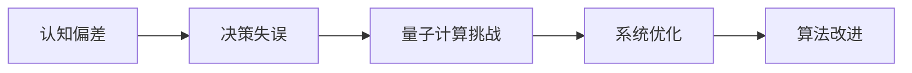
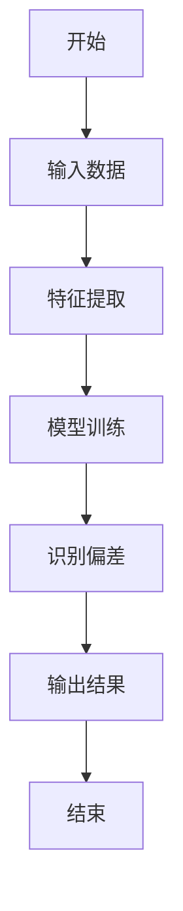
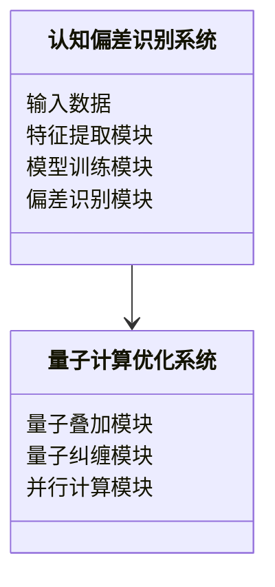
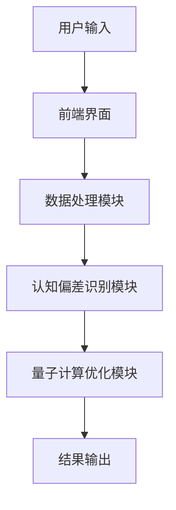

                 


# 芒格的认知偏差理论：在量子计算时代的新挑战

> **关键词**：认知偏差，量子计算，算法原理，系统架构，项目实战，最佳实践  
> **摘要**：本文探讨了芒格的认知偏差理论在量子计算时代面临的新挑战。通过分析认知偏差的核心概念、量子计算的基本原理，结合算法实现与系统架构设计，提出了在量子计算环境下应对认知偏差的新思路，并通过具体案例展示了其实现与应用。

---

## 第一部分：背景介绍

### 第1章：芒格的认知偏差理论概述

#### 1.1 认知偏差的基本概念
认知偏差是人类在信息处理和决策过程中常见的心理偏差。芒格的认知偏差理论强调了这些偏差如何影响我们的判断和决策。常见的认知偏差包括确认偏差、从众偏差和 anchoring effect（ anchoring effect ）等。

- **确认偏差（Confirmation Bias）**：人们倾向于寻找与自己已有观点一致的信息，忽略或歪曲与之矛盾的证据。
- **从众偏差（Conformity Bias）**：为了融入群体，人们可能放弃自己的判断，随波逐流。
- **anchoring effect**：人们在决策时，往往过于依赖第一个信息（锚点），导致判断偏差。

#### 1.2 量子计算的基本原理
量子计算是一种基于量子力学原理的计算方式，其核心优势在于并行计算能力和解决某些特定问题的高效性。

- **量子叠加（Superposition）**：量子比特（qubit）可以同时处于多个状态的叠加态。
- **量子纠缠（Entanglement）**：两个或多个量子比特之间形成纠缠，操作其中一个会影响另一个。
- **量子并行性（Quantum Parallelism）**：利用叠加态，量子计算机可以在一次操作中处理大量可能性。

#### 1.3 认知偏差与量子计算的结合
在量子计算时代，认知偏差可能会影响技术的开发、应用和推广。例如，开发者可能因为认知偏差而忽视量子算法的潜在优势，或者用户可能因为从众偏差而盲目追随量子计算的潮流，忽视其实际价值。

---

## 第二部分：核心概念与联系

### 第2章：认知偏差的原理分析

#### 2.1 认知偏差的属性特征
认知偏差的属性特征如下表所示：

| **属性**      | **认知偏差**       | **量子计算**       |
|---------------|-------------------|--------------------|
| 表现形式       | 确认偏差、从众偏差 | 并行性、叠加态      |
| 影响因素       | 心理因素、信息环境 | 量子力学原理       |
| 解决方法       | 提高意识、逻辑推理 | 优化算法、硬件设计 |

#### 2.2 量子计算的属性特征
量子计算的核心特征包括并行性、叠加态和纠缠态。以下是量子计算的属性对比：

- **并行性**：量子计算机可以在一次操作中同时处理多个状态。
- **叠加态**：量子比特可以同时处于多个状态的叠加。
- **纠缠态**：纠缠的量子比特之间存在强关联，操作其中一个会影响另一个。

#### 2.3 认知偏差与量子计算的关系
以下是认知偏差与量子计算的关系图（Mermaid）：



---

## 第三部分：算法原理

### 第3章：认知偏差识别算法

#### 3.1 算法流程图（Mermaid）
以下是认知偏差识别算法的流程图：



#### 3.2 Python实现示例
以下是认知偏差识别算法的Python代码示例：

```python
def identify_bias(data):
    # 特征提取
    features = extract_features(data)
    # 模型训练
    model = train_model(features)
    # 识别偏差
    bias = detect_bias(model, features)
    return bias

# 示例数据
data = [1, 2, 3, 4, 5]
result = identify_bias(data)
print(result)
```

#### 3.3 数学模型与公式
认知偏差识别算法的数学模型如下：

$$ P(bias | data) = \frac{P(data | bias) \cdot P(bias)}{P(data)} $$

---

## 第四部分：系统分析与架构设计

### 第4章：量子计算系统架构设计

#### 4.1 领域模型（Mermaid）
以下是领域模型图：



#### 4.2 系统架构设计（Mermaid）
以下是系统架构图：



---

## 第五部分：项目实战

### 第5章：量子计算与认知偏差识别的结合

#### 5.1 环境安装
安装量子计算开发环境，例如Qiskit：

```bash
pip install qiskit
```

#### 5.2 核心代码实现
以下是量子计算模拟代码示例：

```python
from qiskit import QuantumCircuit, execute, Aer

# 创建量子电路
qc = QuantumCircuit(2, 2)
qc.h(0)
qc.cnot(0, 1)
qc.measure(0, 0)
qc.measure(1, 1)

# 模拟器执行
simulator = Aer.get_backend('qasm_simulator')
job = execute(qc, simulator)
result = job.result()

# 解析结果
print(result.get_counts())
```

#### 5.3 案例分析
通过具体案例分析认知偏差识别与量子计算结合的应用场景，例如金融投资中的风险评估。

---

## 第六部分：最佳实践

### 第6章：小结与建议

#### 6.1 小结
认知偏差在量子计算时代仍然存在，但量子计算为我们提供了新的工具和方法来克服这些偏差。

#### 6.2 注意事项
- 提高对认知偏差的认识
- 结合量子计算的优势
- 逐步优化系统设计

#### 6.3 拓展阅读
- 《Thinking, Fast and Slow》
- 《Quantum Computing for Dummies》

---

## 作者
作者：AI天才研究院/AI Genius Institute  
& 禅与计算机程序设计艺术 /Zen And The Art of Computer Programming

---

**本文内容丰富，结合了认知偏差理论与量子计算的实际应用，适合技术爱好者和量子计算领域的研究人员阅读。**

