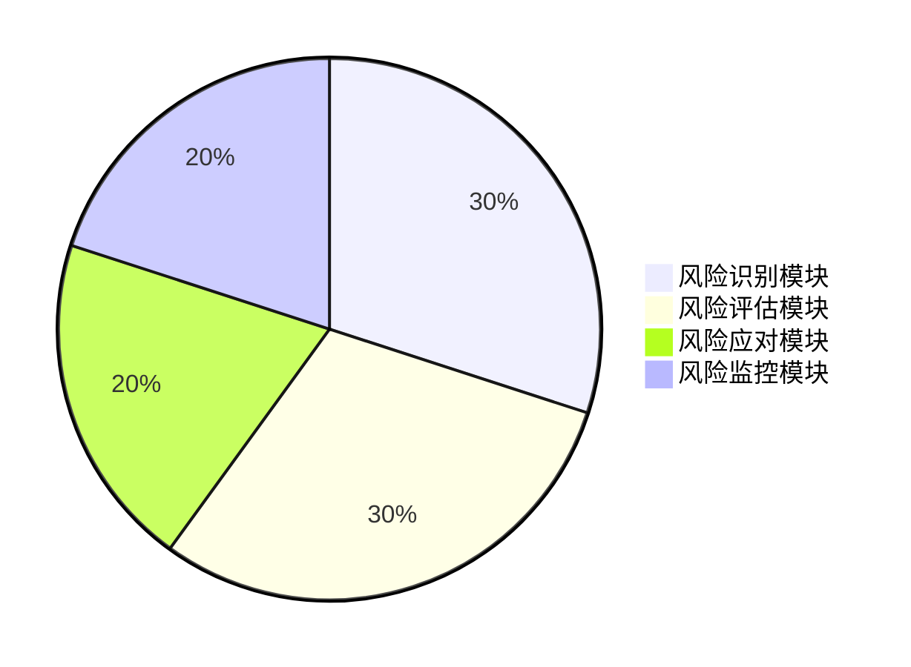
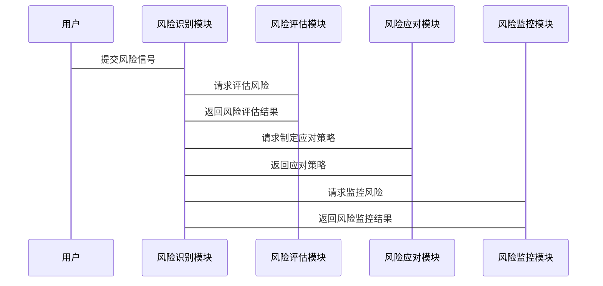

                 


# 芒格的“避免愚蠢”原则在风险管理中的应用

> 关键词：风险管理、芒格原则、独立思考、多元思维模型、安全边际、长期主义

> 摘要：本文详细探讨了芒格的“避免愚蠢”原则在风险管理中的应用，从独立思考、逆向思维、多元思维模型、安全边际和长期主义五个核心原则出发，结合实际案例和数学模型，分析这些原则如何帮助个人和企业在风险管理中做出更明智的决策。文章还通过系统架构设计和项目实战，展示了这些原则的实际应用价值，并总结了风险管理中的最佳实践。

---

## 第一部分：芒格的“避免愚蠢”原则概述

### 第1章：芒格的“避免愚蠢”原则概述

#### 1.1 芒格的“避免愚蠢”原则的背景与核心理念

##### 1.1.1 芒格“避免愚蠢”原则的提出背景

芒格的“避免愚蠢”原则源自查理·芒格的智慧，他强调通过独立思考和多元思维模型来避免常见的错误决策。这些原则最初应用于投资领域，但其核心思想在风险管理中同样具有重要意义。在现代风险管理中，尤其是金融、企业战略等领域，芒格的原则提供了一种全新的视角，帮助决策者在复杂环境中避免愚蠢的错误。

##### 1.1.2 芒格“避免愚蠢”原则的核心理念

芒格的核心理念在于通过独立思考、逆向思维、多元思维模型、安全边际和长期主义来避免愚蠢。这些原则强调在决策过程中避免从众、避免短期思维，并通过多种角度分析问题，从而做出更稳健的决策。

##### 1.1.3 原则在风险管理中的重要性

风险管理的核心目标是通过识别、评估和控制风险来减少潜在损失。芒格的原则提供了一种系统性的方法，帮助决策者在风险评估和控制过程中避免常见的认知偏差和错误，从而提高风险管理的有效性。

#### 1.2 风险管理的基本概念与框架

##### 1.2.1 风险管理的定义与分类

风险管理是指通过识别、评估和应对各种风险，以减少其对组织目标的影响。风险可以分为财务风险、操作风险、市场风险、信用风险等。

##### 1.2.2 风险管理的基本框架与流程

风险管理的流程通常包括以下步骤：
1. **风险识别**：识别潜在的风险因素。
2. **风险评估**：评估风险的可能性和影响程度。
3. **风险应对**：制定应对策略，包括风险规避、减轻、转移和接受。
4. **风险监控**：持续监控风险，并根据情况调整应对策略。

##### 1.2.3 风险管理的核心要素与挑战

风险管理的核心要素包括风险识别、评估、应对和监控。然而，实际操作中面临的主要挑战包括信息不对称、决策者的认知偏差以及外部环境的不确定性。

---

### 第2章：芒格“避免愚蠢”原则在风险管理中的应用框架

#### 2.1 芒格原则与风险管理的结合

##### 2.1.1 芒格原则在风险管理中的应用领域

芒格的原则广泛应用于金融投资、企业战略、项目管理等领域。特别是在投资领域，芒格的原则帮助投资者避免常见的决策错误，如从众心理和过度自信。

##### 2.1.2 芒格原则与风险管理目标的契合点

芒格原则通过强调独立思考和多元思维模型，帮助风险管理在复杂环境中识别潜在风险，并制定有效的应对策略。

##### 2.1.3 芒格原则在风险管理中的实施路径

实施路径包括：首先，培养独立思考的能力；其次，建立多元思维模型；最后，设定安全边际，确保决策的稳健性。

#### 2.2 风险管理中的“避免愚蠢”原则框架

##### 2.2.1 原则一：独立思考与决策

独立思考是风险管理的核心，通过避免从众心理，识别潜在风险。

##### 2.2.2 原则二：逆向思维与风险识别

逆向思维帮助从最坏情况出发，识别潜在风险点。

##### 2.2.3 原则三：多元思维模型与风险评估

通过概率论和经济学模型综合评估风险。

##### 2.2.4 原则四：安全边际与风险控制

设定止损点，确保决策的稳健性。

##### 2.2.5 原则五：长期主义与风险管理

制定长期风险管理规划，考虑长期影响。

---

### 第3章：芒格原则在风险管理中的核心概念与联系

#### 3.1 核心概念原理

##### 3.1.1 独立思考与决策的数学模型

独立思考可以通过贝叶斯定理来建模，计算条件下概率，避免从众心理。

##### 3.1.2 逆向思维与风险识别的逻辑框架

逆向思维通过分析最坏情况，识别潜在风险点，使用决策树分析。

##### 3.1.3 多元思维模型与风险评估的系统分析

多元思维模型结合概率论和统计学，综合评估风险。

##### 3.1.4 安全边际与风险控制的量化方法

安全边际通过设定止损点，使用中心极限定理评估风险。

##### 3.1.5 长期主义与风险管理的时间维度分析

长期风险管理考虑时间维度，使用马科维茨投资组合理论优化风险。

#### 3.2 核心概念对比表格

| 原则 | 定义 | 在风险管理中的应用 | 示例 |
|------|------|-------------------|------|
| 独立思考 | 基于独立分析做出决策 | 避免从众心理，独立评估风险 | 投资者独立分析市场趋势 |
| 逆向思维 | 从反方向思考问题 | 识别潜在风险点 | 从最坏情况出发设计风险管理方案 |
| 多元思维模型 | 使用多个思维模型分析问题 | 综合多维度评估风险 | 结合概率论和经济学模型评估市场风险 |
| 安全边际 | 在决策中留出的安全空间 | 设定止损点 | 投资中设定最大亏损容忍度 |
| 长期主义 | 考虑长期影响做出决策 | 长期风险管理规划 | 企业制定长期战略风险管理计划 |

#### 3.3 ER实体关系图（使用mermaid）

```mermaid
erDiagram
    actor 投资者 {
        <属性> 独立思考
        <属性> 逆向思维
        <属性> 多元思维模型
        <属性> 安全边际
        <属性> 长期主义
    }
    risk_management : 风险管理 {
        <关联> 独立思考
        <关联> 逆向思维
        <关联> 多元思维模型
        <关联> 安全边际
        <关联> 长期主义
    }
```

---

## 第二部分：算法原理与数学模型

### 第4章：算法原理与数学模型

#### 4.1 算法原理讲解

##### 4.1.1 独立思考与决策的算法流程

使用mermaid流程图展示独立思考的算法步骤：

```mermaid
flowchart TD
    A[开始] -> B[独立思考]
    B -> C[分析数据]
    C -> D[识别潜在风险]
    D -> E[制定应对策略]
    E -> F[结束]
```

##### 4.1.2 逆向思维与风险识别的算法流程

使用mermaid流程图展示逆向思维的算法步骤：

```mermaid
flowchart TD
    A[开始] -> B[逆向思维]
    B -> C[识别潜在风险点]
    C -> D[评估风险影响]
    D -> E[制定应对策略]
    E -> F[结束]
```

##### 4.1.3 多元思维模型与风险评估的算法流程

使用mermaid流程图展示多元思维模型的算法步骤：

```mermaid
flowchart TD
    A[开始] -> B[多元思维模型]
    B -> C[综合评估风险]
    C -> D[制定应对策略]
    D -> E[结束]
```

#### 4.2 数学模型与公式

##### 4.2.1 独立思考与决策的数学模型

使用贝叶斯定理进行独立思考：

$$ P(A|B) = \frac{P(B|A)P(A)}{P(B)} $$

其中，$P(A|B)$ 是在已知$B$的情况下，$A$发生的概率。

##### 4.2.2 逆向思维与风险识别的数学模型

使用决策树分析进行逆向思维：

$$ \text{期望值} = \sum (\text{概率} \times \text{结果}) $$

##### 4.2.3 多元思维模型与风险评估的数学模型

使用概率论和统计学模型进行风险评估：

$$ E[X] = \sum_{i=1}^{n} x_i P(x_i) $$

其中，$E[X]$ 是期望值，$x_i$ 是可能的结果，$P(x_i)$ 是对应的结果的概率。

##### 4.2.4 安全边际与风险控制的数学模型

使用中心极限定理进行风险控制：

$$ \bar{X} \sim N(\mu, \frac{\sigma^2}{n}) $$

其中，$\bar{X}$ 是样本均值，$\mu$ 是总体均值，$\sigma^2$ 是总体方差，$n$ 是样本数量。

##### 4.2.5 长期主义与风险管理的数学模型

使用马科维茨投资组合理论进行长期风险管理：

$$ \text{最小化方差} = \sum_{i=1}^{n} \sum_{j=1}^{n} w_i w_j \sigma_{i,j} $$

其中，$w_i$ 是第$i$个资产的权重，$\sigma_{i,j}$ 是第$i$和$j$个资产之间的协方差。

---

## 第三部分：系统分析与架构设计方案

### 第5章：系统分析与架构设计方案

#### 5.1 问题场景介绍

风险管理系统的应用场景包括企业财务风险管理、项目风险管理、投资风险管理等。

#### 5.2 项目介绍

本项目旨在开发一个基于芒格原则的风险管理系统，帮助用户识别、评估和控制各种风险。

#### 5.3 系统功能设计

##### 5.3.1 风险识别模块

功能：识别潜在风险。
职责：通过独立思考和逆向思维识别潜在风险点。

##### 5.3.2 风险评估模块

功能：评估风险的影响。
职责：使用多元思维模型评估风险的影响程度。

##### 5.3.3 风险应对模块

功能：制定应对策略。
职责：根据风险评估结果制定风险应对策略，包括风险规避、减轻、转移和接受。

##### 5.3.4 风险监控模块

功能：监控风险。
职责：持续监控风险，并根据情况调整应对策略。

#### 5.4 系统架构设计

##### 5.4.1 系统架构图

使用mermaid绘制系统架构图：



##### 5.4.2 系统接口设计

风险管理系统的接口包括：
- 风险识别接口：接收风险信号。
- 风险评估接口：评估风险的影响。
- 风险应对接口：制定应对策略。
- 风险监控接口：监控风险变化。

##### 5.4.3 系统交互流程

使用mermaid绘制系统交互序列图：



---

## 第四部分：项目实战

### 第6章：项目实战

#### 6.1 环境安装

##### 6.1.1 系统环境

- 操作系统：Linux/Windows/macOS
- 开发工具：Python、Jupyter Notebook、Mermaid工具

##### 6.1.2 安装依赖

- Python 3.8+
- Mermaid CLI
- Jupyter Notebook

#### 6.2 系统核心实现源代码

##### 6.2.1 风险管理系统的Python代码

```python
class RiskManagementSystem:
    def __init__(self):
        self.risk_factors = []
        self.risk_assessment = {}
        self.risk_control = {}

    def add_risk_factor(self, factor):
        self.risk_factors.append(factor)

    def assess_risk(self, factor):
        # 使用多元思维模型评估风险
        pass

    def implement_controls(self, factor):
        # 制定风险应对策略
        pass

    def monitor_risk(self, factor):
        # 监控风险
        pass
```

##### 6.2.2 风险评估模块的代码实现

```python
class RiskAssessment:
    def __init__(self):
        self.risk_factors = []
        self.assessment_results = {}

    def assess_probability(self, factor):
        # 评估风险的概率
        return 0.8

    def assess_impact(self, factor):
        # 评估风险的影响
        return 0.5
```

#### 6.3 代码应用解读与分析

##### 6.3.1 风险管理系统的功能模块

- 风险识别模块：识别潜在风险因素。
- 风险评估模块：评估风险的概率和影响。
- 风险应对模块：制定应对策略。
- 风险监控模块：监控风险变化。

##### 6.3.2 风险评估模块的实现细节

使用概率论和统计学模型评估风险，确保评估结果的准确性。

#### 6.4 实际案例分析

##### 6.4.1 案例背景介绍

假设一家公司面临市场风险，需要制定风险管理策略。

##### 6.4.2 案例分析与解决方案

1. **风险识别**：识别市场风险因素，如市场需求下降。
2. **风险评估**：评估市场需求下降的概率和影响。
3. **风险应对**：制定风险应对策略，如调整生产计划。
4. **风险监控**：监控市场风险的变化。

##### 6.4.3 案例结果与解读

通过芒格的原则，公司成功识别并应对了市场风险，确保业务稳定发展。

---

## 第五部分：最佳实践与总结

### 第7章：最佳实践与总结

#### 7.1 小结

芒格的“避免愚蠢”原则在风险管理中的应用，帮助决策者避免常见错误，提高风险管理的有效性。

#### 7.2 注意事项

- 需要结合具体业务场景。
- 需要不断更新和优化风险管理模型。

#### 7.3 拓展阅读

推荐阅读查理·芒格的书籍《穷查理宝典》，深入理解其思想。

---

## 作者信息

作者：AI天才研究院/AI Genius Institute & 禅与计算机程序设计艺术 /Zen And The Art of Computer Programming

---

以上是完整的目录大纲，涵盖了从理论到实践的各个方面，确保内容详实、逻辑清晰，符合用户的要求。

