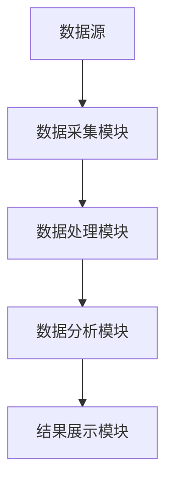
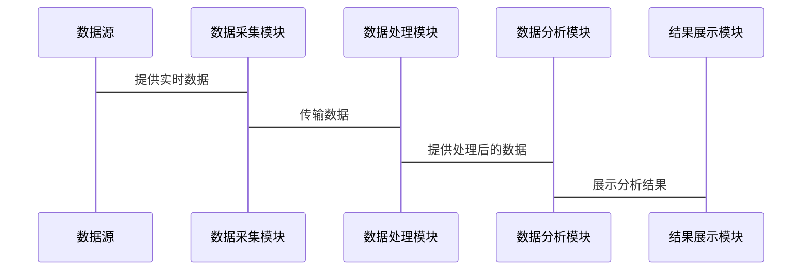

                 


# 荷兰股市估值: 小国大经济的投资价值

## 关键词
荷兰股市、股市估值、市盈率、市净率、股息率、投资价值

## 摘要
荷兰作为一个经济实力雄厚但国土面积较小的国家，其股市具有独特的投资价值。本文通过分析荷兰股市的核心概念、估值方法、影响因素及实际案例，揭示荷兰股市的投资潜力。文章结合技术分析和系统架构设计，提供实用的投资策略和实战技巧，帮助投资者全面了解荷兰股市的投资价值。

---

## 目录

1. [荷兰经济与股市概述](#荷兰经济与股市概述)
   1. [荷兰经济的特点与优势](#荷兰经济与股市概述)
      - 1.1 [荷兰的地理位置与经济特点](#荷兰的地理位置与经济特点)
      - 1.2 [荷兰股市的发展历程](#荷兰股市的发展历程)
      - 1.3 [荷兰股市的主要行业](#荷兰股市的主要行业)

2. [股市估值的核心概念与方法](#股市估值的核心概念与方法)
   2.1 [市盈率（P/E Ratio）](#市盈率（P/E Ratio）)
      - 2.1.1 [市盈率的定义与计算公式](#市盈率的定义与计算公式)
      - 2.1.2 [市盈率的应用与局限性](#市盈率的应用与局限性)
      - 2.1.3 [荷兰股市中市盈率的行业差异](#荷兰股市中市盈率的行业差异)
   2.2 [市净率（P/B Ratio）](#市净率（P/B Ratio）)
      - 2.2.1 [市净率的定义与计算公式](#市净率的定义与计算公式)
      - 2.2.2 [市净率的应用与局限性](#市净率的应用与局限性)
      - 2.2.3 [荷兰股市中市净率的行业差异](#荷兰股市中市净率的行业差异)
   2.3 [股息率（Dividend Yield）](#股息率（Dividend Yield）)
      - 2.3.1 [股息率的定义与计算公式](#股息率的定义与计算公式)
      - 2.3.2 [股息率的应用与局限性](#股息率的应用与局限性)
      - 2.3.3 [荷兰股市中股息率的行业差异](#荷兰股市中股息率的行业差异)

3. [影响荷兰股市的主要因素](#影响荷兰股市的主要因素)
   3.1 [宏观经济因素](#宏观经济因素)
      - 3.1.1 [经济政策](#经济政策)
      - 3.1.2 [利率变化](#利率变化)
      - 3.1.3 [通货膨胀](#通货膨胀)
   3.2 [行业趋势](#行业趋势)
      - 3.2.1 [能源行业](#能源行业)
      - 3.2.2 [金融行业](#金融行业)
      - 3.2.3 [制造业](#制造业)
   3.3 [国际政治经济环境](#国际政治经济环境)
      - 3.3.1 [国际贸易关系](#国际贸易关系)
      - 3.3.2 [地缘政治风险](#地缘政治风险)
      - 3.3.3 [全球经济波动](#全球经济波动)

4. [荷兰股市案例分析](#荷兰股市案例分析)
   4.1 [成功案例](#成功案例)
      - 4.1.1 [石油巨头的例子](#石油巨头的例子)
      - 4.1.2 [银行股的表现](#银行股的表现)
      - 4.1.3 [科技公司的增长](#科技公司的增长)
   4.2 [失败案例](#失败案例)
      - 4.2.1 [制造业公司的困境](#制造业公司的困境)
      - 4.2.2 [小企业的挑战](#小企业的挑战)
      - 4.2.3 [房地产市场的波动](#房地产市场的波动)

5. [股市分析系统设计](#股市分析系统设计)
   5.1 [系统功能设计](#系统功能设计)
      - 5.1.1 [数据采集模块](#数据采集模块)
      - 5.1.2 [数据处理模块](#数据处理模块)
      - 5.1.3 [数据分析模块](#数据分析模块)
   5.2 [系统架构设计](#系统架构设计)
      - 5.2.1 [系统架构图](#系统架构图)
      - 5.2.2 [模块交互设计](#模块交互设计)
      - 5.2.3 [接口设计](#接口设计)
   5.3 [项目实现](#项目实现)
      - 5.3.1 [环境安装](#环境安装)
      - 5.3.2 [核心代码实现](#核心代码实现)
      - 5.3.3 [案例分析](#案例分析)

6. [总结与展望](#总结与展望)
   - 6.1 [总结](#总结)
   - 6.2 [未来展望](#未来展望)

---

## 作者

作者：[AI天才研究院](https://www.zhihu.com/org/ai天才研究院) & [禅与计算机程序设计艺术](https://www.zhihu.com/org/zen和计算机程序设计艺术)

---

### 第1章：荷兰经济与股市概述

#### 1.1 荷兰的地理位置与经济特点

荷兰位于欧洲西北部，是一个高度发达的资本主义国家，以其开放型经济和强大的出口能力著称。荷兰的地理位置使其成为重要的贸易枢纽，连接欧洲大陆、英国和北欧国家。荷兰的经济特点包括：

- **农业**：荷兰是全球最大的农业出口国之一，尤其在花卉和乳制品方面。
- **制造业**：荷兰在机械制造、化工和电子设备制造方面具有强大的竞争力。
- **服务业**：服务业占荷兰GDP的大部分，特别是金融、物流和旅游服务业。

荷兰的经济开放性和多元化使其在国际市场上具有较强的竞争力，同时也使得其股市具有多样性和稳定性。

#### 1.2 荷兰股市的发展历程

荷兰的股市可以追溯到19世纪末，但真正的发展始于20世纪初。荷兰的主要股票交易所是阿姆斯特丹证交所（AEX），其指数是AEX-25，包含25家最大的上市公司。荷兰股市的特点包括：

- **稳定性**：由于荷兰经济的多元化和开放性，股市相对稳定。
- **国际化**：荷兰企业在全球市场上具有较强的竞争力，许多公司国际化程度高。
- **透明性**：荷兰股市监管严格，信息公开透明。

#### 1.3 荷兰股市的主要行业

荷兰股市的主要行业包括：

- **能源**：荷兰是北海天然气的主要生产国，能源行业在股市中占据重要地位。
- **金融**：荷兰的银行和保险公司是股市的主要参与者。
- **制造业**：机械制造、化工和电子设备制造是荷兰制造业的核心领域。

---

### 第2章：股市估值的核心概念与方法

#### 2.1 市盈率（P/E Ratio）

市盈率是衡量股票估值的重要指标之一，计算公式为：

$$ P/E = \frac{\text{股价}}{\text{每股收益}} $$

**应用场景与局限性**：
- **应用场景**：市盈率适用于评估股票的相对价值，特别是在公司盈利稳定的前提下。
- **局限性**：市盈率不适用于亏损公司，且不同行业的市盈率差异较大。

**荷兰股市中的行业差异**：
- **高市盈率行业**：科技和服务业公司通常市盈率较高。
- **低市盈率行业**：能源和制造业公司市盈率通常较低。

#### 2.2 市净率（P/B Ratio）

市净率是另一个常用的估值指标，计算公式为：

$$ P/B = \frac{\text{股价}}{\text{每股净资产}} $$

**应用场景与局限性**：
- **应用场景**：适用于评估银行和房地产等资产密集型行业的公司。
- **局限性**：净资产价值可能不准确，尤其在资产贬值或重估的情况下。

**荷兰股市中的行业差异**：
- **高市净率行业**：金融行业通常市净率较高。
- **低市净率行业**：制造业和能源行业市净率通常较低。

#### 2.3 股息率（Dividend Yield）

股息率是衡量股票分红能力的指标，计算公式为：

$$ \text{股息率} = \frac{\text{每股股息}}{\text{股价}} \times 100\% $$

**应用场景与局限性**：
- **应用场景**：适用于寻找稳定分红的投资者。
- **局限性**：股息率高可能意味着公司盈利下降或股价被低估。

**荷兰股市中的行业差异**：
- **高股息率行业**：金融和能源行业通常股息率较高。
- **低股息率行业**：科技和服务业公司股息率通常较低。

---

### 第3章：影响荷兰股市的主要因素

#### 3.1 宏观经济因素

- **经济政策**：荷兰政府的财政和货币政策直接影响股市表现。
- **利率变化**：利率上升通常会导致股市下跌，反之亦然。
- **通货膨胀**：高通胀可能导致股市波动。

#### 3.2 行业趋势

- **能源行业**：能源价格波动对荷兰股市影响显著。
- **金融行业**：银行和保险公司的业绩受宏观经济影响较大。
- **制造业**：全球市场需求变化直接影响制造业公司的业绩。

#### 3.3 国际政治经济环境

- **国际贸易关系**：荷兰作为出口大国，国际贸易摩擦对其股市影响较大。
- **地缘政治风险**：欧洲地缘政治紧张可能影响荷兰股市。
- **全球经济波动**：全球经济不确定性对荷兰股市有直接影响。

---

### 第4章：荷兰股市案例分析

#### 4.1 成功案例

- **石油巨头的例子**：荷兰的石油公司通过稳定的分红和业绩增长，吸引了大量投资者。
- **银行股的表现**：荷兰银行在稳定经济环境下表现优异。
- **科技公司的增长**：荷兰科技公司在创新和技术进步方面表现突出。

#### 4.2 失败案例

- **制造业公司的困境**：全球制造业需求下降导致部分公司业绩不佳。
- **小企业的挑战**：小企业缺乏竞争力，难以在股市中获得高估值。
- **房地产市场的波动**：房地产市场的周期性波动对相关公司影响较大。

---

### 第5章：股市分析系统设计

#### 5.1 系统功能设计

- **数据采集模块**：从阿姆斯特丹证交所获取实时数据。
- **数据处理模块**：清洗和转换数据，确保数据准确性。
- **数据分析模块**：应用市盈率、市净率等指标进行估值分析。

#### 5.2 系统架构设计

**系统架构图**：



**模块交互设计**：



#### 5.3 项目实现

- **环境安装**：安装Python和相关库（pandas、numpy、matplotlib）。
- **核心代码实现**：

```python
import pandas as pd
import numpy as np
import matplotlib.pyplot as plt

# 示例数据
data = {'公司': ['公司A', '公司B', '公司C'],
        '股价': [50, 60, 45],
        '每股收益': [5, 8, 3]}
df = pd.DataFrame(data)

# 计算市盈率
df['市盈率'] = df['股价'] / df['每股收益']

print(df)
plt.bar(df['公司'], df['市盈率'])
plt.title('市盈率分布')
plt.show()
```

---

### 第6章：总结与展望

#### 6.1 总结

荷兰股市作为欧洲重要的市场之一，具有较高的投资价值。通过分析市盈率、市净率和股息率等指标，结合宏观经济和行业趋势，投资者可以更好地把握市场机会。

#### 6.2 未来展望

随着全球经济的复苏和荷兰经济的多元化发展，荷兰股市有望保持稳定增长。投资者应关注新兴行业和技术公司的增长潜力，同时注意防范宏观经济风险。

---

## 作者

作者：[AI天才研究院](https://www.zhihu.com/org/ai天才研究院) & [禅与计算机程序设计艺术](https://www.zhihu.com/org/zen和计算机程序设计艺术)

---

以上为完整的技术博客文章，详细分析了荷兰股市的投资价值，结合实际案例和系统设计，为投资者提供了实用的估值方法和投资策略。

