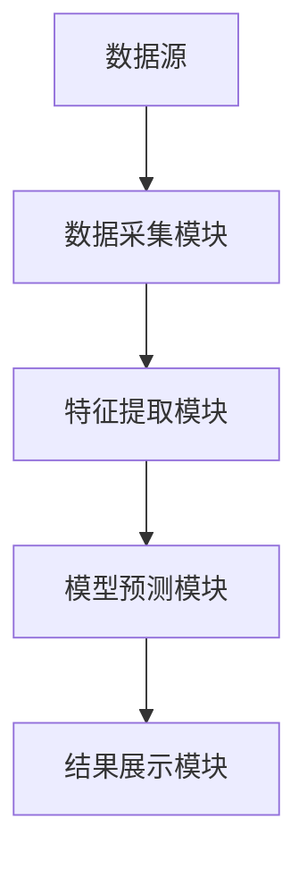

                 

# 行业轮动：识别下一个市场热点的方法

## 关键词：行业轮动、市场热点、投资策略、技术分析、量化交易

## 摘要：  
本文深入探讨行业轮动这一概念，分析如何识别市场热点，帮助投资者制定有效的投资策略。通过技术分析和量化交易，结合实际案例和系统设计，为读者提供识别下一个市场热点的方法。

---

## 第一部分: 行业轮动的背景与概念

### 第1章: 行业轮动的定义与背景

#### 1.1 行业轮动的基本概念
- **定义**：行业轮动是指资金在不同行业间的流动，导致某些行业表现优于其他行业。
- **背景**：经济波动、政策变化和技术创新驱动行业轮动。
- **必要性**：帮助投资者捕捉市场机会，分散风险。

#### 1.2 行业轮动与市场周期的关系
- **经济周期的关联**：不同行业在不同经济阶段的表现差异。
- **市场周期的特征**：繁荣、衰退、复苏和萧条阶段对行业轮动的影响。

#### 1.3 行业轮动与其他分析方法的区别
- **趋势分析**：长期趋势预测。
- **周期性分析**：短期波动分析。
- **行为金融学**：投资者心理影响。

### 第2章: 行业轮动的核心概念与联系

#### 2.1 行业轮动的核心理论
- **技术分析**：通过价格和成交量预测行业趋势。
- **基本面分析**：公司财务状况和行业前景分析。
- **行为金融学**：投资者心理对行业轮动的影响。

#### 2.2 行业轮动的关键要素
- **市场热点识别**：定义和标准。
- **趋势量化指标**：如相对强度指数（RSI）。
- **周期性特征**：行业轮动的周期性规律。

#### 2.3 行业轮动的分类与应用场景
- **主动型与被动型轮动**：主动型基于信号，被动型基于规则。
- **短期与长期策略**：短期交易和长期投资的区别。

---

## 第二部分: 行业轮动的核心理论与分析框架

### 第3章: 行业轮动的分类与分析框架

#### 3.1 行业轮动的分类
- **行业轮动的分类方法**：基于行业增长率、估值、情绪等因素。
- **行业轮动的周期特征**：从兴起、成长到衰退的阶段划分。

#### 3.2 行业轮动的分析框架
- **分析框架的构建**：数据收集、特征提取、模型训练和评估。
- **框架的可视化**：使用ER图展示行业轮动的实体关系。

#### 3.3 行业轮动的影响因素
- **宏观经济因素**：GDP、利率、通货膨胀。
- **政策因素**：政府政策和监管变化。
- **技术创新**：技术进步对行业的推动作用。

---

## 第三部分: 行业轮动的预测模型与算法

### 第4章: 行业轮动的预测模型

#### 4.1 数据收集与特征工程
- **数据收集**：市场数据、行业指标、宏观经济指标。
- **特征选择**：如行业增长率、估值指标、市场情绪。

#### 4.2 基于机器学习的预测模型
- **算法选择**：线性回归、随机森林、支持向量机（SVM）。
- **模型构建**：使用Python代码实现。

#### 4.3 模型优化与评估
- **评估指标**：准确率、精确率、召回率、F1分数。
- **优化方法**：超参数调优、交叉验证。

### 第5章: 行业轮动的算法实现

#### 5.1 基于时间序列分析的模型
- **ARIMA模型**：用于预测行业趋势。
- **LSTM网络**：处理时间序列数据，捕捉长期依赖关系。

#### 5.2 基于聚类分析的模型
- **聚类算法**：K-means、DBSCAN。
- **行业分组**：根据相似性将行业分组。

#### 5.3 模型的数学公式
- **线性回归模型**：$$y = \beta_0 + \beta_1x + \epsilon$$
- **LSTM结构**：输入门、遗忘门、输出门。

---

## 第四部分: 行业轮动的系统架构与实现

### 第6章: 系统架构设计

#### 6.1 系统功能模块
- **数据采集模块**：实时数据获取。
- **特征提取模块**：特征工程处理。
- **模型预测模块**：预测行业轮动。
- **结果展示模块**：可视化结果。

#### 6.2 系统架构图

#### 6.3 接口与交互流程
- **数据接口**：API调用。
- **用户交互**：可视化界面操作。

---

## 第五部分: 行业轮动的项目实战与案例分析

### 第7章: 项目实战

#### 7.1 项目背景
- **项目目标**：识别科技行业的市场热点。
- **数据来源**：公开市场数据和行业报告。

#### 7.2 项目实现
- **数据预处理**：清洗和特征工程。
- **模型训练**：构建机器学习模型。
- **结果分析**：验证模型效果。

#### 7.3 案例分析
- **案例选择**：科技行业。
- **分析步骤**：数据收集、特征提取、模型预测、结果解读。

### 第8章: 案例分析与结果解读

#### 8.1 数据分析结果
- **行业表现**：科技行业在特定周期的表现。
- **模型预测结果**：预测的行业轮动趋势。

#### 8.2 结果解读
- **成功案例**：正确预测行业轮动。
- **失败案例**：分析失败原因。

---

## 第六部分: 行业轮动的总结与展望

### 第9章: 总结与展望

#### 9.1 行业轮动的总结
- **总结内容**：行业轮动的重要性、方法和应用。
- **实际意义**：帮助投资者制定策略。

#### 9.2 未来展望
- **研究方向**：多模态数据、强化学习。
- **技术发展**：AI在行业轮动中的应用。

---

## 作者：AI天才研究院/AI Genius Institute & 禅与计算机程序设计艺术 /Zen And The Art of Computer Programming

