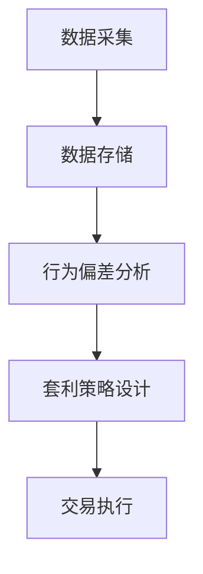
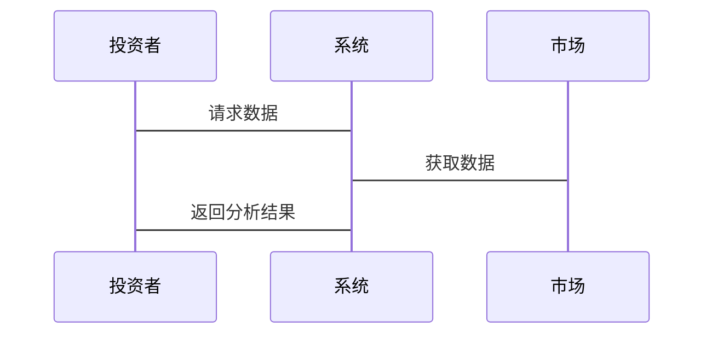

                 


# 行为偏差套利：利用市场非理性行为获取收益

## 关键词
- 行为偏差套利, 非理性市场行为, 套利策略, 行为金融学, 市场波动分析

## 摘要
行为偏差套利是一种利用市场参与者非理性行为进行投资策略的方法。本文从行为金融学的角度，详细探讨了行为偏差套利的核心概念、算法原理、系统架构以及实际应用。通过分析投资者的行为偏差，如锚定效应和损失厌恶，本文提出了基于这些偏差的套利策略，并结合数学模型和算法实现，展示了如何在实际市场中应用这些策略。最后，本文还提供了系统架构设计和项目实战案例，帮助读者更好地理解和实施行为偏差套利。

---

## 第一部分：行为偏差套利的背景与概念

### 第1章：行为偏差套利的背景与概念

#### 1.1 行为偏差的定义与分类
##### 1.1.1 行为偏差的基本概念
行为偏差（Behavioral Bias）是指投资者在决策过程中由于心理因素、认知错误或情绪影响而产生的非理性行为。这些偏差可能导致投资者做出与市场基本面不符的投资决策。

##### 1.1.2 常见的行为偏差类型
行为偏差可以分为认知性偏差和情绪性偏差两大类：
- **认知性偏差**：包括确认偏差、锚定效应、可得性偏差等。
- **情绪性偏差**：包括损失厌恶、从众心理、过度自信等。

##### 1.1.3 行为偏差的特征与表现
行为偏差通常表现为投资者在市场波动时的过度反应或反应不足，例如在市场下跌时恐慌性抛售，或在市场上涨时盲目追涨。

#### 1.2 套利的基本概念与分类
##### 1.2.1 套利的定义
套利是指利用不同市场或资产之间的价格差异，通过同时买进和卖出相关资产来获取无风险或低风险利润的交易策略。

##### 1.2.2 常见的套利类型
- 跨市场套利
- 跨期套利
- 股权套利
- 资产分离套利

#### 1.3 行为偏差套利的定义与特点
##### 1.3.1 行为偏差套利的定义
行为偏差套利是利用市场参与者的行为偏差，通过分析和捕捉这些偏差带来的价格扭曲，从而进行套利交易的策略。

##### 1.3.2 行为偏差套利的核心特点
- 基于投资者行为分析
- 利用非理性价格波动
- 低风险或无风险套利机会

#### 1.4 行为偏差套利的理论基础
##### 1.4.1 行为金融学的起源与发展
行为金融学（Behavioral Finance）起源于20世纪80年代，研究投资者心理和行为对市场定价的影响。

##### 1.4.2 行为偏差与市场效率的关系
行为偏差可能导致市场失灵，为套利者提供机会。

##### 1.4.3 行为偏差套利的理论框架
行为偏差套利的理论框架包括投资者行为分析、市场波动模型和套利策略优化。

---

### 第2章：行为偏差套利的市场背景与应用

#### 2.1 市场中的行为偏差现象
##### 2.1.1 投资者的行为偏差表现
投资者的行为偏差可能导致过度交易、追涨杀跌等现象。

##### 2.1.2 市场中的行为偏差案例
例如，2008年金融危机中，投资者的恐慌性抛售加剧了市场的下跌。

##### 2.1.3 行为偏差对市场的影响
行为偏差可能导致市场波动加剧，影响资产定价效率。

#### 2.2 行为偏差套利的应用场景
##### 2.2.1 股票市场的行为偏差套利
例如，利用投资者的锚定效应进行价差套利。

##### 2.2.2 债券市场的行为偏差套利
例如，利用债券市场的流动性溢价进行套利。

##### 2.2.3 其他金融市场的行为偏差套利
例如，外汇市场和商品市场的行为偏差套利。

#### 2.3 行为偏差套利的策略框架
##### 2.3.1 行为偏差套利的策略分类
- 基于认知偏差的套利策略
- 基于情绪偏差的套利策略

##### 2.3.2 行为偏差套利的实施步骤
1. 分析市场参与者的行为偏差
2. 寻找价格扭曲的机会
3. 设计套利策略
4. 执行交易

##### 2.3.3 行为偏差套利的风险管理
- 风险控制
- 盈利保护

---

### 第3章：行为偏差套利的核心概念与联系

#### 3.1 行为偏差的原理与机制
##### 3.1.1 行为偏差的形成原因
投资者的心理特征和认知偏差是行为偏差的形成原因。

##### 3.1.2 行为偏差的传播机制
行为偏差可能通过从众心理和羊群效应在市场中传播。

##### 3.1.3 行为偏差的市场影响
行为偏差可能导致市场过度波动和价格扭曲。

#### 3.2 行为偏差与套利策略的关系
##### 3.2.1 行为偏差对套利机会的影响
行为偏差为套利者提供了价格差异。

##### 3.2.2 套利策略对行为偏差的反馈作用
套利者的行为可能加剧或缓解市场中的行为偏差。

##### 3.2.3 行为偏差套利的系统性分析
行为偏差套利需要从系统性角度分析市场结构和参与者行为。

#### 3.3 行为偏差套利的核心要素
##### 3.3.1 市场参与者的心理特征
投资者的心理特征影响行为偏差的表现。

##### 3.3.2 市场信息的不对称性
信息不对称可能导致行为偏差。

##### 3.3.3 市场波动的非理性特征
非理性波动为套利者提供了机会。

---

### 第4章：行为偏差套利的数学模型与算法

#### 4.1 行为偏差的量化模型
##### 4.1.1 行为偏差的量化指标
例如，投资者情绪指数（PSR）。

##### 4.1.2 行为偏差的传播模型
例如，基于网络的传播模型。

#### 4.2 套利策略的优化模型
##### 4.2.1 套利策略的数学模型
$$ \text{收益} = \text{卖出价格} - \text{买入价格} $$

##### 4.2.2 套利策略的优化算法
例如，基于遗传算法的套利策略优化。

#### 4.3 行为偏差套利的算法实现
##### 4.3.1 算法步骤
1. 数据采集
2. 行为偏差分析
3. 套利策略设计
4. 交易执行

##### 4.3.2 算法实现代码
```python
def calculate_profit(buy_price, sell_price):
    return sell_price - buy_price
```

---

## 第二部分：行为偏差套利的系统架构与实现

### 第5章：行为偏差套利的系统架构设计

#### 5.1 系统功能设计
##### 5.1.1 数据采集模块
- 数据源：股票价格、交易量等。
- 数据处理：清洗和转换。

##### 5.1.2 行为偏差分析模块
- 情绪分析：使用NLP技术分析投资者情绪。
- 偏差检测：识别行为偏差。

##### 5.1.3 套利策略执行模块
- 策略设计：基于行为偏差的套利策略。
- 交易执行：自动下单。

#### 5.2 系统架构设计
##### 5.2.1 系统架构图


#### 5.3 系统接口设计
##### 5.3.1 数据接口
- 输入：市场数据。
- 输出：行为偏差信号。

##### 5.3.2 交易接口
- 输入：套利策略。
- 输出：交易指令。

#### 5.4 系统交互设计
##### 5.4.1 交互流程图


---

## 第三部分：行为偏差套利的项目实战

### 第6章：行为偏差套利的项目实战

#### 6.1 项目环境安装
- 工具：Python、数据采集库（如pandas）、交易接口（如TradingAPI）。

#### 6.2 系统核心实现
##### 6.2.1 数据采集与预处理
```python
import pandas as pd

def load_data(path):
    return pd.read_csv(path)
```

##### 6.2.2 行为偏差分析
```python
def analyze_bias(data):
    # 示例分析：计算投资者情绪指数
    return data['情绪指数'].mean()
```

##### 6.2.3 套利策略实现
```python
def execute_strategy(data, bias):
    # 示例策略：当情绪指数超过阈值时买入
    if data['情绪指数'] > threshold:
        return '买入'
    else:
        return '卖出'
```

#### 6.3 实际案例分析
##### 6.3.1 案例背景
2020年新冠疫情导致的市场恐慌。

##### 6.3.2 数据分析
分析投资者情绪指数和市场波动的关系。

##### 6.3.3 策略实现
在恐慌期间进行套利。

##### 6.3.4 结果分析
评估套利策略的收益和风险。

#### 6.4 项目小结
- 成功实现行为偏差套利系统。
- 提供了实际案例分析。

---

## 第四部分：行为偏差套利的最佳实践

### 第7章：行为偏差套利的最佳实践

#### 7.1 最佳实践
##### 7.1.1 风险提示
- 市场风险
- 操作风险

##### 7.1.2 注意事项
- 确保数据质量
- 合规性检查

##### 7.1.3 拓展阅读
- 推荐书籍：《行为金融学》
- 推荐论文：相关研究论文

#### 7.2 小结
行为偏差套利是一种有效的投资策略，但需要谨慎实施。

---

## 作者：AI天才研究院 & 禅与计算机程序设计艺术

---

以上内容基于行为偏差套利的理论与实践，结合实际案例和系统设计，为读者提供了全面的指导。

