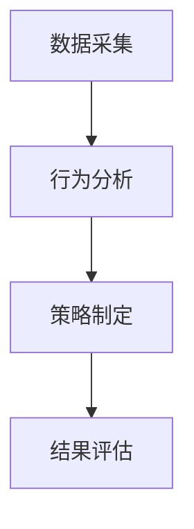

                 


# 行为金融学：理解并利用市场参与者的非理性行为

**关键词：** 行为金融学、非理性行为、市场参与、投资策略、情绪影响

**摘要：** 本文深入探讨了行为金融学的核心概念和理论，分析了市场参与者在决策中的非理性行为，并通过实际案例展示了如何利用这些行为制定有效的投资策略。文章从行为金融学的背景和基础入手，详细介绍了常见行为偏差的分类与影响，构建了行为偏差的数学模型，并设计了一个基于行为金融学的投资系统架构。最后，通过项目实战分析了行为金融学在实际投资中的应用，总结了其在现代金融学中的重要性及未来研究方向。

---

## 第一部分: 行为金融学的背景与基础

### 第1章: 行为金融学概述

#### 1.1 行为金融学的基本概念
##### 1.1.1 什么是行为金融学
行为金融学（Behavioral Finance）是研究金融市场参与者在决策过程中，由于认知偏差、情绪波动和社会心理等因素导致的非理性行为，及其对市场定价、交易行为和资产配置的影响的学科。与传统金融学不同，行为金融学强调人类行为的复杂性和不可预测性，试图通过心理学和经济学的结合，解释市场中的异常现象。

##### 1.1.2 行为金融学与传统金融学的区别
传统的金融学假设市场参与者是理性的，且能够根据信息做出最优决策。然而，现实中投资者往往受到情绪、认知偏差和社会环境的影响，导致决策偏离理性。行为金融学则试图通过分析这些非理性行为，揭示市场的运作规律。

##### 1.1.3 行为金融学的研究意义
行为金融学的研究不仅有助于解释市场的波动性和异常现象，还能帮助投资者制定更有效的投资策略。通过理解市场参与者的非理性行为，投资者可以更好地预测市场走势，并在市场波动中获利。

#### 1.2 市场参与者的非理性行为
##### 1.2.1 什么是非理性行为
非理性行为是指市场参与者在决策过程中，由于情绪、认知偏差和社会压力等因素，导致决策偏离理性预期的行为。

##### 1.2.2 非理性行为的表现形式
非理性行为在市场中表现多样，常见的包括过度自信、从众心理、损失厌恶和羊群效应等。

##### 1.2.3 非理性行为对市场的影响
非理性行为会导致市场定价偏离 fundamentals（基本面），引发市场波动和泡沫破裂。例如，投资者的过度乐观可能导致资产价格虚高，而过度悲观则可能导致市场恐慌性抛售。

---

### 第2章: 行为金融学的核心理论

#### 2.1 基础理论
##### 2.1.1 心理学基础
行为金融学的理论基础之一是心理学，特别是认知心理学和行为心理学。认知偏差（cognitive bias）是指人们在信息处理和决策过程中，由于认知限制和心理机制导致的系统性错误。

##### 2.1.2 行为经济学基础
行为经济学（Behavioral Economics）研究人们在决策过程中的实际行为，发现人们往往偏离理性假设。行为金融学继承了这一研究传统，并将其应用于金融市场。

##### 2.1.3 传统金融学的不足
传统金融学假设市场参与者是理性的，但现实中投资者的非理性行为经常导致市场的异常现象，如市场的过度波动和无效定价。

#### 2.2 行为偏差的分类
##### 2.2.1 认知偏差
认知偏差是指人们在信息处理过程中，由于认知限制和心理机制导致的系统性错误。常见的认知偏差包括确认偏差（confirmation bias）、可用性偏差（availability bias）和代表性偏差（representativeness bias）。

##### 2.2.2 情感偏差
情感偏差是指投资者由于情绪波动导致的决策错误。例如，贪婪和恐惧情绪可能导致投资者在市场顶部追高或在市场底部恐慌性抛售。

##### 2.2.3 社会偏差
社会偏差是指投资者由于社会压力和群体影响导致的决策偏差。例如，从众心理（herd behavior）可能导致投资者盲目跟随市场趋势，忽视独立分析。

---

### 第3章: 行为金融学的数学模型

#### 3.1 基本概念
##### 3.1.1 期望效用理论
期望效用理论（Expected Utility Theory）是传统金融学中的一个基本假设，认为投资者在决策时会根据期望效用最大化的原则做出理性选择。

##### 3.1.2 现金流贴现模型
现金流贴现模型（Cash Flow Discounting Models）是传统金融学中用于评估资产价值的主要工具，假设市场参与者能够根据未来现金流的现值做出理性决策。

##### 3.1.3 风险中性化
风险中性化（Risk Neutrality）是指投资者对风险的敏感程度，假设投资者在决策时能够根据风险溢价调整其投资行为。

#### 3.2 行为偏差的数学建模
##### 3.2.1 过度自信模型
过度自信模型（Overconfidence Model）假设投资者对自己掌握的信息过于自信，导致其对市场走势的预测过于乐观。

##### 3.2.2 从众心理模型
从众心理模型（Herd Behavior Model）假设投资者由于从众心理，倾向于跟随市场趋势，而不是根据独立分析做出决策。

##### 3.2.3 损失厌恶模型
损失厌恶模型（Loss Aversion Model）假设投资者对损失的厌恶程度高于对收益的偏好，导致其在决策时倾向于避免损失，而不是追求收益。

---

### 第4章: 行为金融学的系统架构

#### 4.1 系统设计
##### 4.1.1 系统目标
系统的目标是通过分析市场参与者的非理性行为，预测市场走势并制定有效的投资策略。

##### 4.1.2 系统功能模块
系统功能模块包括数据采集、行为分析、策略制定和结果评估。

##### 4.1.3 系统架构图
以下是系统架构图：



---

## 第二部分: 行为偏差的分析与建模

### 第5章: 行为偏差的分类与分析

#### 5.1 常见行为偏差
##### 5.1.1 过度自信
过度自信是指投资者对自己掌握的信息过于自信，导致其对市场走势的预测过于乐观。

##### 5.1.2 从众心理
从众心理是指投资者倾向于跟随市场趋势，而不是根据独立分析做出决策。

##### 5.1.3 损失厌恶
损失厌恶是指投资者对损失的厌恶程度高于对收益的偏好，导致其在决策时倾向于避免损失，而不是追求收益。

#### 5.2 行为偏差的影响
##### 5.2.1 对市场定价的影响
行为偏差可能导致市场定价偏离 fundamentals（基本面），引发市场波动和泡沫破裂。

##### 5.2.2 对投资者决策的影响
行为偏差可能导致投资者在市场顶部追高或在市场底部恐慌性抛售。

---

### 第6章: 行为偏差的数学建模

#### 6.1 过度自信模型
过度自信模型假设投资者对自己掌握的信息过于自信，导致其对市场走势的预测过于乐观。以下是一个简单的数学模型：

$$
\text{预期收益} = \text{实际收益} \times \text{过度自信系数}
$$

其中，过度自信系数是一个大于1的数，表示投资者对实际收益的高估。

#### 6.2 从众心理模型
从众心理模型假设投资者倾向于跟随市场趋势，而不是根据独立分析做出决策。以下是一个简单的数学模型：

$$
\text{投资决策} = \text{市场趋势} \times \text{从众心理系数}
$$

其中，从众心理系数是一个大于1的数，表示投资者对市场趋势的跟随程度。

#### 6.3 损失厌恶模型
损失厌恶模型假设投资者对损失的厌恶程度高于对收益的偏好。以下是一个简单的数学模型：

$$
\text{风险偏好} = \text{收益} - \text{损失}
$$

---

### 第7章: 行为金融学的系统架构

#### 7.1 系统目标
系统的目标是通过分析市场参与者的非理性行为，预测市场走势并制定有效的投资策略。

#### 7.2 系统功能模块
系统功能模块包括数据采集、行为分析、策略制定和结果评估。

#### 7.3 系统架构图
以下是系统架构图：


---

## 第三部分: 项目实战

### 第8章: 项目实战

#### 8.1 环境配置
项目实战需要以下环境配置：
- Python编程语言
- 数据分析库（如Pandas、NumPy）
- 可视化工具（如Matplotlib、Seaborn）
- 数据来源：股票价格数据、市场情绪数据等。

#### 8.2 数据收集与预处理
数据收集与预处理是项目实战的关键步骤。以下是数据预处理的代码示例：

```python
import pandas as pd
import numpy as np

# 加载数据
data = pd.read_csv('stock_price.csv')

# 数据清洗
data = data.dropna()

# 数据标准化
data['price'] = (data['price'] - data['price'].mean()) / data['price'].std()
```

#### 8.3 模型实现
以下是基于行为金融学的模型实现：

```python
def behavioral_model(data):
    # 计算行为偏差
    behavioral_bias = data['price'] * 0.5  # 示例：简化的行为偏差计算

    # 计算预期收益
    expected_return = data['price'] + behavioral_bias

    return expected_return

# 调用模型
result = behavioral_model(data)
```

#### 8.4 结果分析
以下是结果分析的代码示例：

```python
import matplotlib.pyplot as plt

plt.plot(result)
plt.title('Expected Return Based on Behavioral Model')
plt.xlabel('Time')
plt.ylabel('Expected Return')
plt.show()
```

---

## 第四部分: 总结与展望

### 第9章: 总结与展望

#### 9.1 总结
行为金融学通过分析市场参与者的非理性行为，揭示了市场的运作规律，并为投资者制定有效的投资策略提供了理论支持。

#### 9.2 展望
未来的研究可以进一步结合人工智能和大数据技术，开发更复杂的模型来分析市场参与者的非理性行为，并制定更精准的投资策略。

---

## 作者信息

作者：AI天才研究院/AI Genius Institute & 禅与计算机程序设计艺术 /Zen And The Art of Computer Programming

---

以上是《行为金融学：理解并利用市场参与者的非理性行为》的完整目录和内容框架。

