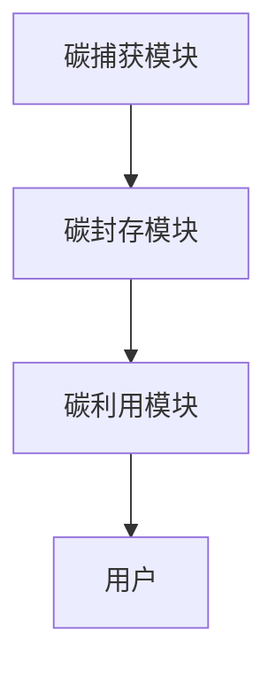
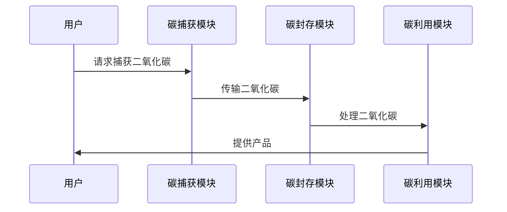

                 

# 负碳技术的发展前景与投资风险分析

## 关键词：负碳技术, 碳中和, 投资风险, 可再生能源, 碳捕获, 生物能源, 碳利用

## 摘要：  
负碳技术是实现全球碳中和目标的关键技术之一，它能够通过吸收和储存二氧化碳，有效减少大气中的温室气体浓度。本文从负碳技术的核心概念、技术原理、系统架构、投资风险分析、实际案例和最佳实践等多个方面进行深入探讨。通过分析碳捕获与封存（CCS）、生物能源与碳利用（BECCS）等技术的特点及其经济性，结合实际案例和系统设计，为投资者和相关从业者提供科学的决策参考。

---

## 第一部分: 负碳技术的背景与概念

### 第1章: 负碳技术的定义与发展背景

#### 1.1 负碳技术的定义与内涵
负碳技术是指能够从大气中去除二氧化碳并长期储存的技术，其核心目标是实现碳中和。通过碳捕获、碳封存、碳利用等方式，负碳技术能够有效减少温室气体排放，是应对气候变化的重要手段。

#### 1.2 全球碳中和目标与负碳技术的重要性
全球气候变化的加剧迫使各国将碳中和目标提上日程。负碳技术在实现碳中和过程中扮演着关键角色，尤其是在难以减排的行业，负碳技术能够帮助实现净零排放。

#### 1.3 负碳技术的分类与应用领域
负碳技术主要包括碳捕获与封存（CCS）、生物能源与碳利用（BECCS）、生态固碳等。这些技术在能源、工业、农业等领域有广泛应用。

---

## 第二部分: 负碳技术的核心概念与原理

### 第2章: 碳捕获与封存技术（CCS）

#### 2.1 碳捕获与封存技术的原理
碳捕获技术通过化学反应或物理方法捕获二氧化碳，随后通过管道输送至封存地点（如地质构造）进行长期储存。以下是碳捕获的化学反应过程：

$$ CO_2 + 2OH^- \rightarrow CO_3^{2-} + H_2O $$

#### 2.2 CCS技术的特点与经济性
- **技术优势**：能够大规模减少工业排放。
- **技术局限性**：捕获和封存成本较高。
- **经济性分析**：随着技术进步，成本有望逐步下降。

#### 2.3 CCS技术的典型案例分析
- **欧洲案例**：挪威的北海碳封存项目。
- **北美案例**：美国的蒙大拿州CCS项目。

### 第3章: 生物能源与碳利用（BECCS）

#### 3.1 生物能源与碳利用技术的原理
BECCS技术利用生物质能产生能量，同时捕获产生的二氧化碳并将其转化为有用的产品或储存起来。以下是生物能转换的化学反应：

$$ C_{x}H_{y}O_{z} + O_2 \rightarrow CO_2 + H_2O $$

#### 3.2 BECCS技术的特点与经济性
- **技术优势**：实现能源生产和碳封存的双重目标。
- **技术局限性**：对生物质的需求量较大。
- **经济性分析**：投资成本较高，但具有较高的环境效益。

#### 3.3 BECCS技术的典型案例分析
- **美国案例**：爱达荷州的BECCS项目。
- **欧洲案例**：瑞典的生物能源碳捕获项目。

---

## 第三部分: 负碳技术的系统分析与架构设计

### 第4章: 负碳技术的系统架构设计

#### 4.1 系统功能设计
- **碳捕获模块**：负责捕获二氧化碳。
- **碳封存模块**：负责储存二氧化碳。
- **碳利用模块**：将二氧化碳转化为有用的产品。

#### 4.2 系统架构图

#### 4.3 系统交互设计

---

## 第四部分: 负碳技术的投资风险分析与最佳实践

### 第5章: 投资风险分析

#### 5.1 技术风险
- **技术不确定性**：负碳技术尚处于发展阶段，存在技术瓶颈。
- **成本高昂**：初期投资成本较高。

#### 5.2 市场风险
- **市场需求**：负碳技术的市场需求尚不明确。
- **政策变化**：政策支持可能影响投资回报。

#### 5.3 经济性分析
- **长期成本下降**：随着技术进步，成本有望逐步下降。
- **政府补贴**：政府补贴是降低投资风险的重要因素。

### 第6章: 最佳实践与总结

#### 6.1 投资策略
- **多元化投资**：分散投资于不同负碳技术，降低风险。
- **技术创新**：加大对负碳技术研发的投入。

#### 6.2 风险应对措施
- **政策跟踪**：密切关注政策变化，及时调整投资策略。
- **技术合作**：与科研机构合作，降低技术风险。

#### 6.3 小结
负碳技术是实现碳中和的重要手段，但投资需谨慎评估技术风险和市场环境。

---

## 作者：AI天才研究院 & 禅与计算机程序设计艺术

---

以上是《负碳技术的发展前景与投资风险分析》的技术博客文章的完整内容，按照逻辑清晰、结构紧凑、简单易懂的原则撰写，涵盖了负碳技术的核心概念、技术原理、系统架构、投资风险分析和最佳实践等多个方面。

