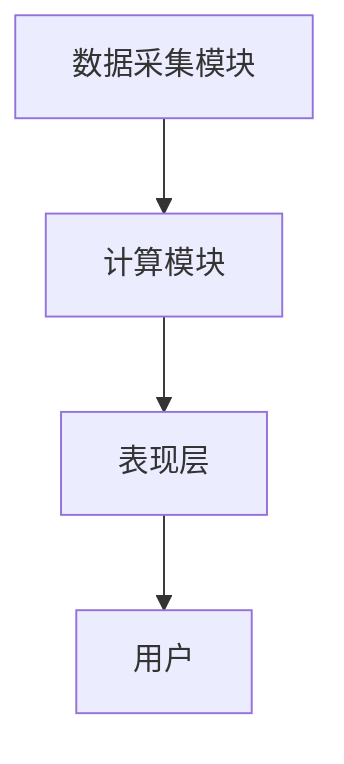

                 


# 货币市场工具：短期资金管理的安全港

## 关键词：货币市场工具、短期资金管理、安全港、金融市场、风险管理

## 摘要：货币市场工具是短期资金管理的重要组成部分，提供了资金流动性、安全性和收益性的平衡。本文从货币市场工具的基本概念、市场运作机制、定价模型、系统架构设计、项目实战等方面进行深入分析，探讨如何在短期资金管理中构建安全、高效的资金管理体系。

---

## 第一部分: 货币市场工具概述

### 第1章: 货币市场工具的定义与特点

#### 1.1 货币市场工具的定义
- **1.1.1 货币市场的基本概念**
  货币市场是金融市场的重要组成部分，主要交易短期金融工具，用于调节市场流动性。货币市场工具是指在货币市场中流通的、期限较短、流动性较高的金融资产。

- **1.1.2 货币市场工具的定义与分类**
  货币市场工具可以分为以下几类：
  - 短期国债（国库券）
  - 商业票据
  - 银行承兑汇票
  - 同业拆借
  - 大额存单

- **1.1.3 货币市场工具的市场参与者**
  包括中央银行、商业银行、非银行金融机构、企业和个人投资者等。

#### 1.2 货币市场工具的特点
- **1.2.1 短期性与流动性**
  货币市场工具的期限通常在1年至5年之间，具有较高的流动性，投资者可以随时买卖。

- **1.2.2 安全性与风险性**
  货币市场工具的风险较低，但并非完全没有风险。信用风险、利率风险和流动性风险是主要风险来源。

- **1.2.3 收益性与波动性**
  货币市场工具的收益率相对较低，但波动性较小，适合保守型投资者。

### 第2章: 货币市场工具的历史与发展

#### 2.1 货币市场工具的历史演变
- **2.1.1 早期货币市场的形成**
  货币市场起源于古代的商品交换，随着商品经济的发展逐渐形成货币兑换和短期信贷市场。

- **2.1.2 现代货币市场的兴起**
  20世纪初，随着资本主义经济的发展，货币市场逐渐从传统的地方性市场转变为全球性的金融市场。

- **2.1.3 全球化背景下的货币市场发展**
  20世纪70年代布雷顿森林体系崩溃后，货币市场进一步国际化，金融工具和交易方式不断创新。

#### 2.2 货币市场工具的全球化趋势
- **2.2.1 国际货币市场的形成**
  20世纪80年代，国际货币市场逐渐形成，各国央行和大型金融机构成为主要参与者。

- **2.2.2 跨境金融工具的出现**
  随着全球化的深入，跨境金融工具如欧洲美元票据和国际商业票据逐渐兴起。

- **2.2.3 数字化货币工具的兴起**
  21世纪以来，数字货币和区块链技术的应用为货币市场工具的创新提供了新的方向。

### 第3章: 货币市场工具的市场结构与运作机制

#### 3.1 货币市场的主要参与者
- **3.1.1 中央银行**
  中央银行是货币市场的核心，负责调节市场流动性，维护金融稳定。

- **3.1.2 商业银行**
  商业银行是货币市场的主要参与者，通过存贷款业务和短期资金拆借参与市场运作。

- **3.1.3 非银行金融机构**
  包括保险公司、证券公司、共同基金等，通过购买短期债券和票据参与货币市场。

- **3.1.4 企业与个人投资者**
  企业和个人投资者通过购买国库券、商业票据等工具参与货币市场。

#### 3.2 货币市场的交易机制
- **3.2.1 现货交易**
  现货交易是指当日成交、当日交割的交易方式，主要适用于短期资金需求。

- **3.2.2 远期交易**
  远期交易是指约定在未来某一时间以约定价格买卖金融工具的交易方式，用于锁定未来利率。

- **3.2.3 期权与期货交易**
  通过期权和期货合约，投资者可以对冲货币市场工具的价格波动风险。

---

## 第二部分: 货币市场工具的核心概念与联系

### 第4章: 货币市场工具的核心概念

#### 4.1 货币市场工具的属性与特征
- **4.1.1 期限短**
  货币市场工具的期限通常在1年至5年之间，具有较高的流动性。

- **4.1.2 流动性高**
  货币市场工具可以在短时间内变现，适合需要短期资金的企业和个人。

- **4.1.3 风险较低**
  货币市场工具的风险主要来自于利率波动和信用风险，但总体风险较低。

#### 4.2 货币市场工具的类型与对比
- **4.2.1 国库券**
  - 定义：由政府发行的短期债券，期限通常在3个月到1年之间。
  - 特点：信用风险低，流动性高。

- **4.2.2 商业票据**
  - 定义：由企业发行的短期票据，期限通常在1个月到6个月之间。
  - 特点：信用风险较高，收益率较高。

- **4.2.3 银行承兑汇票**
  - 定义：由银行承兑的汇票，期限通常在1个月到6个月之间。
  - 特点：信用风险低，适合中小型企业。

- **4.2.4 同业拆借**
  - 定义：金融机构之间的短期资金拆借。
  - 特点：利率低，风险较低。

- **4.2.5 短期债券**
  - 定义：期限在1年至5年之间的债券。
  - 特点：收益率较高，风险适中。

#### 4.3 货币市场工具的市场关系与ER图

```mermaid
erDiagram
    actor 投资者
    actor 金融机构
    actor 企业
    actor 中央银行
    class 货币市场工具
    class 交易
    class 市场
    投资者 --> 货币市场工具 : 交易
    金融机构 --> 货币市场工具 : 发行
    企业 --> 货币市场工具 : 发行
    中央银行 --> 货币市场工具 : 调节
    货币市场工具 --> 交易 : 包含
    交易 --> 市场 : 发生在
```

---

## 第三部分: 货币市场工具的定价模型与算法原理

### 第5章: 货币市场工具的定价模型

#### 5.1 贴现模型
- **5.1.1 贴现公式**
  $$\text{现值} = \frac{\text{面值}}{1 + r \cdot t}$$
  其中，\( r \) 是年化贴现率，\( t \) 是剩余期限（年）。

- **5.1.2 期限与收益率的关系**
  利率 \( r \) 随着期限 \( t \) 的增加而增加，但增速逐渐放缓。

#### 5.2 到期收益率模型
- **5.2.1 到期收益率的计算**
  $$\text{到期收益率} = \left( \frac{\text{面值} - \text{购买价格}}{\text{购买价格}} \right) \times \frac{360}{\text{期限}}$$

#### 5.3 利率风险与久期分析
- **5.3.1 久期公式**
  $$\text{价格变化} \approx -D \cdot r \cdot \text{价格}$$
  其中，\( D \) 是久期，\( r \) 是利率变化。

#### 5.4 算法实现
- **5.4.1 Python代码示例**

```python
def calculate_discount_price(face_value, rate, time):
    return face_value / (1 + rate * time)

# 示例计算
face_value = 100
rate = 0.05
time = 0.5  # 半年
discount_price = calculate_discount_price(face_value, rate, time)
print(f"贴现价格: {discount_price}")
```

---

## 第四部分: 货币市场工具的系统架构设计

### 第6章: 系统架构设计

#### 6.1 系统功能设计
- **6.1.1 用户需求**
  - 投资者需要实时查看货币市场工具的价格和收益率。
  - 金融机构需要管理发行和交易记录。

- **6.1.2 系统功能模块**
  - 数据采集模块：收集市场利率、工具价格等数据。
  - 计算模块：计算工具的现值、到期收益率等。
  - 展示模块：以图表形式展示数据。

#### 6.2 系统架构设计
- **6.2.1 体系结构**
  使用分层架构，包括数据层、业务逻辑层和表现层。

- **6.2.2 模块交互**
  - 数据采集模块向计算模块提供数据。
  - 计算模块向表现层传递结果。
  - 用户通过表现层进行操作。



#### 6.3 接口设计
- **6.3.1 API接口**
  - GET /market_data：获取市场数据。
  - POST /calculate：计算工具价格。

---

## 第五部分: 货币市场工具的项目实战

### 第7章: 项目实战

#### 7.1 环境安装
- **7.1.1 安装Python**
  下载并安装Python 3.x版本，并安装必要的库如Pandas和Matplotlib。

#### 7.2 核心实现
- **7.2.1 数据获取**
  使用API获取货币市场工具的价格和利率数据。

- **7.2.2 数据分析**
  计算工具的现值和到期收益率，生成可视化图表。

#### 7.3 代码实现

```python
import requests
import pandas as pd
import matplotlib.pyplot as plt

# 获取数据
data = requests.get('http://api.markets.com/market_tools').json()

# 数据处理
df = pd.DataFrame(data)

# 绘制图表
plt.plot(df['time'], df['price'], label='价格走势')
plt.xlabel('时间')
plt.ylabel('价格')
plt.legend()
plt.show()
```

#### 7.4 案例分析
- **7.4.1 案例背景**
  某企业需要融资1000万元，选择发行商业票据。

- **7.4.2 实施步骤**
  - 确定票据面值和期限。
  - 计算贴现率和发行价格。
  - 管理票据的交易和到期兑付。

---

## 第六部分: 货币市场工具的风险管理与最佳实践

### 第8章: 风险管理

#### 8.1 风险类型
- **信用风险**
  - 解决方案：选择高信用评级的工具。
- **利率风险**
  - 解决方案：使用久期分析和风险对冲工具。
- **流动性风险**
  - 解决方案：保持足够的流动资产。

#### 8.2 最佳实践
- **分散投资**
  - 投资者应分散投资不同类型的货币市场工具，降低风险。
- **定期评估**
  - 定期评估投资组合的风险和收益，及时调整策略。

### 第9章: 小结与展望

#### 9.1 小结
- 货币市场工具是短期资金管理的重要手段，具有流动性高、风险低、收益稳定的特点。
- 通过合理的定价模型和系统架构设计，可以有效管理货币市场工具的风险和收益。

#### 9.2 展望
- 随着金融科技的发展，货币市场工具的创新将继续推动市场的发展。
- 区块链和人工智能技术的应用将为货币市场工具的交易和管理带来更多可能性。

---

## 作者：AI天才研究院/AI Genius Institute & 禅与计算机程序设计艺术 /Zen And The Art of Computer Programming

